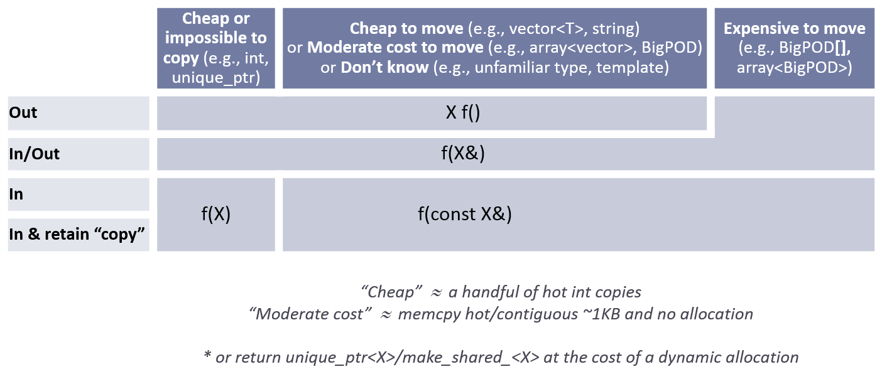
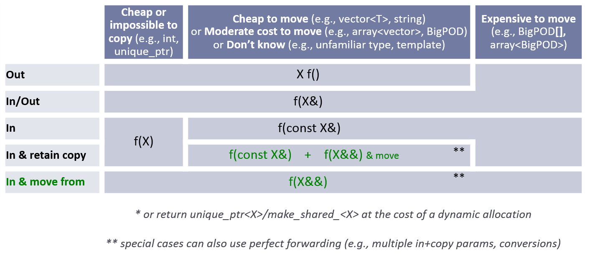

# C++ Core Guidelines

December 8, 2019

Editors:

* [Bjarne Stroustrup](http://www.stroustrup.com)
* [Herb Sutter](http://herbsutter.com/)

This is a living document under continuous improvement.
Had it been an open-source (code) project, this would have been release 0.8.
Copying, use, modification, and creation of derivative works from this project is licensed under an MIT-style license.
Contributing to this project requires agreeing to a Contributor License. See the accompanying [LICENSE](LICENSE) file for details.
We make this project available to "friendly users" to use, copy, modify, and derive from, hoping for constructive input.

Comments and suggestions for improvements are most welcome.
We plan to modify and extend this document as our understanding improves and the language and the set of available libraries improve.
When commenting, please note [the introduction](#S-introduction) that outlines our aims and general approach.
The list of contributors is [here](#SS-ack).

Problems:

* The sets of rules have not been completely checked for completeness, consistency, or enforceability.
* Triple question marks (???) mark known missing information
* Update reference sections; many pre-C++11 sources are too old.
* For a more-or-less up-to-date to-do list see: [To-do: Unclassified proto-rules](#S-unclassified)

You can [read an explanation of the scope and structure of this Guide](#S-abstract) or just jump straight in:

* [In: Introduction](#S-introduction)
* [P: Philosophy](#S-philosophy)
* [I: Interfaces](#S-interfaces)
* [F: Functions](#S-functions)
* [C: Classes and class hierarchies](#S-class)
* [Enum: Enumerations](#S-enum)
* [R: Resource management](#S-resource)
* [ES: Expressions and statements](#S-expr)
* [Per: Performance](#S-performance)
* [CP: Concurrency and parallelism](#S-concurrency)
* [E: Error handling](#S-errors)
* [Con: Constants and immutability](#S-const)
* [T: Templates and generic programming](#S-templates)
* [CPL: C-style programming](#S-cpl)
* [SF: Source files](#S-source)
* [SL: The Standard Library](#S-stdlib)

Supporting sections:

* [A: Architectural ideas](#S-A)
* [NR: Non-Rules and myths](#S-not)
* [RF: References](#S-references)
* [Pro: Profiles](#S-profile)
* [GSL: Guidelines support library](#S-gsl)
* [NL: Naming and layout rules](#S-naming)
* [FAQ: Answers to frequently asked questions](#S-faq)
* [Appendix A: Libraries](#S-libraries)
* [Appendix B: Modernizing code](#S-modernizing)
* [Appendix C: Discussion](#S-discussion)
* [Appendix D: Supporting tools](#S-tools)
* [Glossary](#S-glossary)
* [To-do: Unclassified proto-rules](#S-unclassified)

You can sample rules for specific language features:

* assignment:
[regular types](#Rc-regular) --
[prefer initialization](#Rc-initialize) --
[copy](#Rc-copy-semantic) --
[move](#Rc-move-semantic) --
[other operations](#Rc-matched) --
[default](#Rc-eqdefault)
* `class`:
[data](#Rc-org) --
[invariant](#Rc-struct) --
[members](#Rc-member) --
[helpers](#Rc-helper) --
[concrete types](#SS-concrete) --
[ctors, =, and dtors](#S-ctor) --
[hierarchy](#SS-hier) --
[operators](#SS-overload)
* `concept`:
[rules](#SS-concepts) --
[in generic programming](#Rt-raise) --
[template arguments](#Rt-concepts) --
[semantics](#Rt-low)
* constructor:
[invariant](#Rc-struct) --
[establish invariant](#Rc-ctor) --
[`throw`](#Rc-throw) --
[default](#Rc-default0) --
[not needed](#Rc-default) --
[`explicit`](#Rc-explicit) --
[delegating](#Rc-delegating) --
[`virtual`](#Rc-ctor-virtual)
* derived `class`:
[when to use](#Rh-domain) --
[as interface](#Rh-abstract) --
[destructors](#Rh-dtor) --
[copy](#Rh-copy) --
[getters and setters](#Rh-get) --
[multiple inheritance](#Rh-mi-interface) --
[overloading](#Rh-using) --
[slicing](#Rc-copy-virtual) --
[`dynamic_cast`](#Rh-dynamic_cast)
* destructor:
[and constructors](#Rc-matched) --
[when needed?](#Rc-dtor) --
[may not fail](#Rc-dtor-fail)
* exception:
[errors](#S-errors) --
[`throw`](#Re-throw) --
[for errors only](#Re-errors) --
[`noexcept`](#Re-noexcept) --
[minimize `try`](#Re-catch) --
[what if no exceptions?](#Re-no-throw-codes)
* `for`:
[range-for and for](#Res-for-range) --
[for and while](#Res-for-while) --
[for-initializer](#Res-for-init) --
[empty body](#Res-empty) --
[loop variable](#Res-loop-counter) --
[loop variable type ???](#Res-???)
* function:
[naming](#Rf-package) --
[single operation](#Rf-logical) --
[no throw](#Rf-noexcept) --
[arguments](#Rf-smart) --
[argument passing](#Rf-conventional) --
[multiple return values](#Rf-out-multi) --
[pointers](#Rf-return-ptr) --
[lambdas](#Rf-capture-vs-overload)
* `inline`:
[small functions](#Rf-inline) --
[in headers](#Rs-inline)
* initialization:
[always](#Res-always) --
[prefer `{}`](#Res-list) --
[lambdas](#Res-lambda-init) --
[in-class initializers](#Rc-in-class-initializer) --
[class members](#Rc-initialize) --
[factory functions](#Rc-factory)
* lambda expression:
[when to use](#SS-lambdas)
* operator:
[conventional](#Ro-conventional) --
[avoid conversion operators](#Ro-conversion) --
[and lambdas](#Ro-lambda)
* `public`, `private`, and `protected`:
[information hiding](#Rc-private) --
[consistency](#Rh-public) --
[`protected`](#Rh-protected)
* `static_assert`:
[compile-time checking](#Rp-compile-time) --
[and concepts](#Rt-check-class)
* `struct`:
[for organizing data](#Rc-org) --
[use if no invariant](#Rc-struct) --
[no private members](#Rc-class)
* `template`:
[abstraction](#Rt-raise) --
[containers](#Rt-cont) --
[concepts](#Rt-concepts)
* `unsigned`:
[and signed](#Res-mix) --
[bit manipulation](#Res-unsigned)
* `virtual`:
[interfaces](#Ri-abstract) --
[not `virtual`](#Rc-concrete) --
[destructor](#Rc-dtor-virtual) --
[never fail](#Rc-dtor-fail)

You can look at design concepts used to express the rules:

* assertion: ???
* error: ???
* exception: exception guarantee (???)
* failure: ???
* invariant: ???
* leak: ???
* library: ???
* precondition: ???
* postcondition: ???
* resource: ???

# Abstract

This document is a set of guidelines for using C++ well.
The aim of this document is to help people to use modern C++ effectively.
By "modern C++" we mean effective use of the ISO C++ standard (currently C++17, but almost all of our recommendations also apply to C++14 and C++11).
In other words, what would you like your code to look like in 5 years' time, given that you can start now? In 10 years' time?

The guidelines are focused on relatively high-level issues, such as interfaces, resource management, memory management, and concurrency.
Such rules affect application architecture and library design.
Following the rules will lead to code that is statically type safe, has no resource leaks, and catches many more programming logic errors than is common in code today.
And it will run fast -- you can afford to do things right.

We are less concerned with low-level issues, such as naming conventions and indentation style.
However, no topic that can help a programmer is out of bounds.

Our initial set of rules emphasizes safety (of various forms) and simplicity.
They may very well be too strict.
We expect to have to introduce more exceptions to better accommodate real-world needs.
We also need more rules.

You will find some of the rules contrary to your expectations or even contrary to your experience.
If we haven't suggested you change your coding style in any way, we have failed!
Please try to verify or disprove rules!
In particular, we'd really like to have some of our rules backed up with measurements or better examples.

You will find some of the rules obvious or even trivial.
Please remember that one purpose of a guideline is to help someone who is less experienced or coming from a different background or language to get up to speed.

Many of the rules are designed to be supported by an analysis tool.
Violations of rules will be flagged with references (or links) to the relevant rule.
We do not expect you to memorize all the rules before trying to write code.
One way of thinking about these guidelines is as a specification for tools that happens to be readable by humans.

The rules are meant for gradual introduction into a code base.
We plan to build tools for that and hope others will too.

Comments and suggestions for improvements are most welcome.
We plan to modify and extend this document as our understanding improves and the language and the set of available libraries improve.

# In: Introduction

This is a set of core guidelines for modern C++ (currently C++17) taking likely future enhancements and ISO Technical Specifications (TSs) into account.
The aim is to help C++ programmers to write simpler, more efficient, more maintainable code.

Introduction summary:

* [In.target: Target readership](#SS-readers)
* [In.aims: Aims](#SS-aims)
* [In.not: Non-aims](#SS-non)
* [In.force: Enforcement](#SS-force)
* [In.struct: The structure of this document](#SS-struct)
* [In.sec: Major sections](#SS-sec)

## In.target: Target readership

All C++ programmers. This includes [programmers who might consider C](#S-cpl).

## In.aims: Aims

The purpose of this document is to help developers to adopt modern C++ (currently C++17) and to achieve a more uniform style across code bases.

We do not suffer the delusion that every one of these rules can be effectively applied to every code base. Upgrading old systems is hard. However, we do believe that a program that uses a rule is less error-prone and more maintainable than one that does not. Often, rules also lead to faster/easier initial development.
As far as we can tell, these rules lead to code that performs as well or better than older, more conventional techniques; they are meant to follow the zero-overhead principle ("what you don't use, you don't pay for" or "when you use an abstraction mechanism appropriately, you get at least as good performance as if you had handcoded using lower-level language constructs").
Consider these rules ideals for new code, opportunities to exploit when working on older code, and try to approximate these ideals as closely as feasible.
Remember:

### In.0: Don't panic!

Take the time to understand the implications of a guideline rule on your program.

These guidelines are designed according to the "subset of superset" principle ([Stroustrup05](#Stroustrup05)).
They do not simply define a subset of C++ to be used (for reliability, safety, performance, or whatever).
Instead, they strongly recommend the use of a few simple "extensions" ([library components](#S-gsl))
that make the use of the most error-prone features of C++ redundant, so that they can be banned (in our set of rules).

The rules emphasize static type safety and resource safety.
For that reason, they emphasize possibilities for range checking, for avoiding dereferencing `nullptr`, for avoiding dangling pointers, and the systematic use of exceptions (via RAII).
Partly to achieve that and partly to minimize obscure code as a source of errors, the rules also emphasize simplicity and the hiding of necessary complexity behind well-specified interfaces.

Many of the rules are prescriptive.
We are uncomfortable with rules that simply state "don't do that!" without offering an alternative.
One consequence of that is that some rules can be supported only by heuristics, rather than precise and mechanically verifiable checks.
Other rules articulate general principles. For these more general rules, more detailed and specific rules provide partial checking.

These guidelines address the core of C++ and its use.
We expect that most large organizations, specific application areas, and even large projects will need further rules, possibly further restrictions, and further library support.
For example, hard-real-time programmers typically can't use free store (dynamic memory) freely and will be restricted in their choice of libraries.
We encourage the development of such more specific rules as addenda to these core guidelines.
Build your ideal small foundation library and use that, rather than lowering your level of programming to glorified assembly code.

The rules are designed to allow [gradual adoption](#S-modernizing).

Some rules aim to increase various forms of safety while others aim to reduce the likelihood of accidents, many do both.
The guidelines aimed at preventing accidents often ban perfectly legal C++.
However, when there are two ways of expressing an idea and one has shown itself a common source of errors and the other has not, we try to guide programmers towards the latter.

## In.not: Non-aims

The rules are not intended to be minimal or orthogonal.
In particular, general rules can be simple, but unenforceable.
Also, it is often hard to understand the implications of a general rule.
More specialized rules are often easier to understand and to enforce, but without general rules, they would just be a long list of special cases.
We provide rules aimed at helping novices as well as rules supporting expert use.
Some rules can be completely enforced, but others are based on heuristics.

These rules are not meant to be read serially, like a book.
You can browse through them using the links.
However, their main intended use is to be targets for tools.
That is, a tool looks for violations and the tool returns links to violated rules.
The rules then provide reasons, examples of potential consequences of the violation, and suggested remedies.

These guidelines are not intended to be a substitute for a tutorial treatment of C++.
If you need a tutorial for some given level of experience, see [the references](#S-references).

This is not a guide on how to convert old C++ code to more modern code.
It is meant to articulate ideas for new code in a concrete fashion.
However, see [the modernization section](#S-modernizing) for some possible approaches to modernizing/rejuvenating/upgrading.
Importantly, the rules support gradual adoption: It is typically infeasible to completely convert a large code base all at once.

These guidelines are not meant to be complete or exact in every language-technical detail.
For the final word on language definition issues, including every exception to general rules and every feature, see the ISO C++ standard.

The rules are not intended to force you to write in an impoverished subset of C++.
They are *emphatically* not meant to define a, say, Java-like subset of C++.
They are not meant to define a single "one true C++" language.
We value expressiveness and uncompromised performance.

The rules are not value-neutral.
They are meant to make code simpler and more correct/safer than most existing C++ code, without loss of performance.
They are meant to inhibit perfectly valid C++ code that correlates with errors, spurious complexity, and poor performance.

The rules are not precise to the point where a person (or machine) can follow them blindly.
The enforcement parts try to be that, but we would rather leave a rule or a definition a bit vague
and open to interpretation than specify something precisely and wrong.
Sometimes, precision comes only with time and experience.
Design is not (yet) a form of Math.

The rules are not perfect.
A rule can do harm by prohibiting something that is useful in a given situation.
A rule can do harm by failing to prohibit something that enables a serious error in a given situation.
A rule can do a lot of harm by being vague, ambiguous, unenforceable, or by enabling every solution to a problem.
It is impossible to completely meet the "do no harm" criteria.
Instead, our aim is the less ambitious: "Do the most good for most programmers";
if you cannot live with a rule, object to it, ignore it, but don't water it down until it becomes meaningless.
Also, suggest an improvement.

## In.force: Enforcement

Rules with no enforcement are unmanageable for large code bases.
Enforcement of all rules is possible only for a small weak set of rules or for a specific user community.

* But we want lots of rules, and we want rules that everybody can use.
* But different people have different needs.
* But people don't like to read lots of rules.
* But people can't remember many rules.

So, we need subsetting to meet a variety of needs.

* But arbitrary subsetting leads to chaos.

We want guidelines that help a lot of people, make code more uniform, and strongly encourage people to modernize their code.
We want to encourage best practices, rather than leave all to individual choices and management pressures.
The ideal is to use all rules; that gives the greatest benefits.

This adds up to quite a few dilemmas.
We try to resolve those using tools.
Each rule has an **Enforcement** section listing ideas for enforcement.
Enforcement might be done by code review, by static analysis, by compiler, or by run-time checks.
Wherever possible, we prefer "mechanical" checking (humans are slow, inaccurate, and bore easily) and static checking.
Run-time checks are suggested only rarely where no alternative exists; we do not want to introduce "distributed fat".
Where appropriate, we label a rule (in the **Enforcement** sections) with the name of groups of related rules (called "profiles").
A rule can be part of several profiles, or none.
For a start, we have a few profiles corresponding to common needs (desires, ideals):

* **type**: No type violations (reinterpreting a `T` as a `U` through casts, unions, or varargs)
* **bounds**: No bounds violations (accessing beyond the range of an array)
* **lifetime**: No leaks (failing to `delete` or multiple `delete`) and no access to invalid objects (dereferencing `nullptr`, using a dangling reference).

The profiles are intended to be used by tools, but also serve as an aid to the human reader.
We do not limit our comment in the **Enforcement** sections to things we know how to enforce; some comments are mere wishes that might inspire some tool builder.

Tools that implement these rules shall respect the following syntax to explicitly suppress a rule:

    [[gsl::suppress(tag)]]

where "tag" is the anchor name of the item where the Enforcement rule appears (e.g., for [C.134](#Rh-public) it is "Rh-public"), the
name of a profile group-of-rules ("type", "bounds", or "lifetime"),
or a specific rule in a profile ([type.4](#Pro-type-cstylecast), or [bounds.2](#Pro-bounds-arrayindex)).

## In.struct: The structure of this document

Each rule (guideline, suggestion) can have several parts:

* The rule itself -- e.g., **no naked `new`**
* A rule reference number -- e.g., **C.7** (the 7th rule related to classes).
  Since the major sections are not inherently ordered, we use letters as the first part of a rule reference "number".
  We leave gaps in the numbering to minimize "disruption" when we add or remove rules.
* **Reason**s (rationales) -- because programmers find it hard to follow rules they don't understand
* **Example**s -- because rules are hard to understand in the abstract; can be positive or negative
* **Alternative**s -- for "don't do this" rules
* **Exception**s -- we prefer simple general rules. However, many rules apply widely, but not universally, so exceptions must be listed
* **Enforcement** -- ideas about how the rule might be checked "mechanically"
* **See also**s -- references to related rules and/or further discussion (in this document or elsewhere)
* **Note**s (comments) -- something that needs saying that doesn't fit the other classifications
* **Discussion** -- references to more extensive rationale and/or examples placed outside the main lists of rules

Some rules are hard to check mechanically, but they all meet the minimal criteria that an expert programmer can spot many violations without too much trouble.
We hope that "mechanical" tools will improve with time to approximate what such an expert programmer notices.
Also, we assume that the rules will be refined over time to make them more precise and checkable.

A rule is aimed at being simple, rather than carefully phrased to mention every alternative and special case.
Such information is found in the **Alternative** paragraphs and the [Discussion](#S-discussion) sections.
If you don't understand a rule or disagree with it, please visit its **Discussion**.
If you feel that a discussion is missing or incomplete, enter an [Issue](https://github.com/isocpp/CppCoreGuidelines/issues)
explaining your concerns and possibly a corresponding PR.

Examples are written to illustrate rules.

* Examples are not intended to be production quality or to cover all tutorial dimensions.
For example, many examples are language-technical and use names like `f`, `base`, and `x`.
* We try to ensure that "good" examples follow the Core Guidelines.
* Comments are often illustrating rules where they would be unnecessary and/or distracting in "real code."
* We assume knowledge of the standard library. For example, we use plain `vector` rather than `std::vector`.

This is not a language manual.
It is meant to be helpful, rather than complete, fully accurate on technical details, or a guide to existing code.
Recommended information sources can be found in [the references](#S-references).

## In.sec: Major sections

* [In: Introduction](#S-introduction)
* [P: Philosophy](#S-philosophy)
* [I: Interfaces](#S-interfaces)
* [F: Functions](#S-functions)
* [C: Classes and class hierarchies](#S-class)
* [Enum: Enumerations](#S-enum)
* [R: Resource management](#S-resource)
* [ES: Expressions and statements](#S-expr)
* [Per: Performance](#S-performance)
* [CP: Concurrency and parallelism](#S-concurrency)
* [E: Error handling](#S-errors)
* [Con: Constants and immutability](#S-const)
* [T: Templates and generic programming](#S-templates)
* [CPL: C-style programming](#S-cpl)
* [SF: Source files](#S-source)
* [SL: The Standard Library](#S-stdlib)

Supporting sections:

* [A: Architectural ideas](#S-A)
* [NR: Non-Rules and myths](#S-not)
* [RF: References](#S-references)
* [Pro: Profiles](#S-profile)
* [GSL: Guidelines support library](#S-gsl)
* [NL: Naming and layout rules](#S-naming)
* [FAQ: Answers to frequently asked questions](#S-faq)
* [Appendix A: Libraries](#S-libraries)
* [Appendix B: Modernizing code](#S-modernizing)
* [Appendix C: Discussion](#S-discussion)
* [Appendix D: Supporting tools](#S-tools)
* [Glossary](#S-glossary)
* [To-do: Unclassified proto-rules](#S-unclassified)

These sections are not orthogonal.

Each section (e.g., "P" for "Philosophy") and each subsection (e.g., "C.hier" for "Class Hierarchies (OOP)") have an abbreviation for ease of searching and reference.
The main section abbreviations are also used in rule numbers (e.g., "C.11" for "Make concrete types regular").

# P: Philosophy

The rules in this section are very general.

Philosophy rules summary:

* [P.1: Express ideas directly in code](#Rp-direct)
* [P.2: Write in ISO Standard C++](#Rp-Cplusplus)
* [P.3: Express intent](#Rp-what)
* [P.4: Ideally, a program should be statically type safe](#Rp-typesafe)
* [P.5: Prefer compile-time checking to run-time checking](#Rp-compile-time)
* [P.6: What cannot be checked at compile time should be checkable at run time](#Rp-run-time)
* [P.7: Catch run-time errors early](#Rp-early)
* [P.8: Don't leak any resources](#Rp-leak)
* [P.9: Don't waste time or space](#Rp-waste)
* [P.10: Prefer immutable data to mutable data](#Rp-mutable)
* [P.11: Encapsulate messy constructs, rather than spreading through the code](#Rp-library)
* [P.12: Use supporting tools as appropriate](#Rp-tools)
* [P.13: Use support libraries as appropriate](#Rp-lib)

Philosophical rules are generally not mechanically checkable.
However, individual rules reflecting these philosophical themes are.
Without a philosophical basis, the more concrete/specific/checkable rules lack rationale.

### P.1: Express ideas directly in code

##### Reason

Compilers don't read comments (or design documents) and neither do many programmers (consistently).
What is expressed in code has defined semantics and can (in principle) be checked by compilers and other tools.

##### Example

    class Date {
    public:
        Month month() const;  // do
        int month();          // don't
        // ...
    };

The first declaration of `month` is explicit about returning a `Month` and about not modifying the state of the `Date` object.
The second version leaves the reader guessing and opens more possibilities for uncaught bugs.

##### Example, bad

This loop is a restricted form of `std::find`:

    void f(vector<string>& v)
    {
        string val;
        cin >> val;
        // ...
        int index = -1;                    // bad, plus should use gsl::index
        for (int i = 0; i < v.size(); ++i) {
            if (v[i] == val) {
                index = i;
                break;
            }
        }
        // ...
    }

##### Example, good

A much clearer expression of intent would be:

    void f(vector<string>& v)
    {
        string val;
        cin >> val;
        // ...
        auto p = find(begin(v), end(v), val);  // better
        // ...
    }

A well-designed library expresses intent (what is to be done, rather than just how something is being done) far better than direct use of language features.

A C++ programmer should know the basics of the standard library, and use it where appropriate.
Any programmer should know the basics of the foundation libraries of the project being worked on, and use them appropriately.
Any programmer using these guidelines should know the [guidelines support library](#S-gsl), and use it appropriately.

##### Example

    change_speed(double s);   // bad: what does s signify?
    // ...
    change_speed(2.3);

A better approach is to be explicit about the meaning of the double (new speed or delta on old speed?) and the unit used:

    change_speed(Speed s);    // better: the meaning of s is specified
    // ...
    change_speed(2.3);        // error: no unit
    change_speed(23m / 10s);  // meters per second

We could have accepted a plain (unit-less) `double` as a delta, but that would have been error-prone.
If we wanted both absolute speed and deltas, we would have defined a `Delta` type.

##### Enforcement

Very hard in general.

* use `const` consistently (check if member functions modify their object; check if functions modify arguments passed by pointer or reference)
* flag uses of casts (casts neuter the type system)
* detect code that mimics the standard library (hard)

### P.2: Write in ISO Standard C++

##### Reason

This is a set of guidelines for writing ISO Standard C++.

##### Note

There are environments where extensions are necessary, e.g., to access system resources.
In such cases, localize the use of necessary extensions and control their use with non-core Coding Guidelines.  If possible, build interfaces that encapsulate the extensions so they can be turned off or compiled away on systems that do not support those extensions.

Extensions often do not have rigorously defined semantics.  Even extensions that
are common and implemented by multiple compilers may have slightly different
behaviors and edge case behavior as a direct result of *not* having a rigorous
standard definition.  With sufficient use of any such extension, expected
portability will be impacted.

##### Note

Using valid ISO C++ does not guarantee portability (let alone correctness).
Avoid dependence on undefined behavior (e.g., [undefined order of evaluation](#Res-order))
and be aware of constructs with implementation defined meaning (e.g., `sizeof(int)`).

##### Note

There are environments where restrictions on use of standard C++ language or library features are necessary, e.g., to avoid dynamic memory allocation as required by aircraft control software standards.
In such cases, control their (dis)use with an extension of these Coding Guidelines customized to the specific environment.

##### Enforcement

Use an up-to-date C++ compiler (currently C++17, C++14, or C++11) with a set of options that do not accept extensions.

### P.3: Express intent

##### Reason

Unless the intent of some code is stated (e.g., in names or comments), it is impossible to tell whether the code does what it is supposed to do.

##### Example

    gsl::index i = 0;
    while (i < v.size()) {
        // ... do something with v[i] ...
    }

The intent of "just" looping over the elements of `v` is not expressed here. The implementation detail of an index is exposed (so that it might be misused), and `i` outlives the scope of the loop, which may or may not be intended. The reader cannot know from just this section of code.

Better:

    for (const auto& x : v) { /* do something with the value of x */ }

Now, there is no explicit mention of the iteration mechanism, and the loop operates on a reference to `const` elements so that accidental modification cannot happen. If modification is desired, say so:

    for (auto& x : v) { /* modify x */ }

For more details about for-statements, see [ES.71](#Res-for-range).
Sometimes better still, use a named algorithm. This example uses the `for_each` from the Ranges TS because it directly expresses the intent:

    for_each(v,  { /* do something with the value of x */ });
    for_each(par, v,  { /* do something with the value of x */ });

The last variant makes it clear that we are not interested in the order in which the elements of `v` are handled.

A programmer should be familiar with

* [The guidelines support library](#S-gsl)
* [The ISO C++ Standard Library](#S-stdlib)
* Whatever foundation libraries are used for the current project(s)

##### Note

Alternative formulation: Say what should be done, rather than just how it should be done.

##### Note

Some language constructs express intent better than others.

##### Example

If two `int`s are meant to be the coordinates of a 2D point, say so:

    draw_line(int, int, int, int);  // obscure
    draw_line(Point, Point);        // clearer

##### Enforcement

Look for common patterns for which there are better alternatives

* simple `for` loops vs. range-`for` loops
* `f(T*, int)` interfaces vs. `f(span<T>)` interfaces
* loop variables in too large a scope
* naked `new` and `delete`
* functions with many parameters of built-in types

There is a huge scope for cleverness and semi-automated program transformation.

### P.4: Ideally, a program should be statically type safe

##### Reason

Ideally, a program would be completely statically (compile-time) type safe.
Unfortunately, that is not possible. Problem areas:

* unions
* casts
* array decay
* range errors
* narrowing conversions

##### Note

These areas are sources of serious problems (e.g., crashes and security violations).
We try to provide alternative techniques.

##### Enforcement

We can ban, restrain, or detect the individual problem categories separately, as required and feasible for individual programs.
Always suggest an alternative.
For example:

* unions -- use `variant` (in C++17)
* casts -- minimize their use; templates can help
* array decay -- use `span` (from the GSL)
* range errors -- use `span`
* narrowing conversions -- minimize their use and use `narrow` or `narrow_cast` (from the GSL) where they are necessary

### P.5: Prefer compile-time checking to run-time checking

##### Reason

Code clarity and performance.
You don't need to write error handlers for errors caught at compile time.

##### Example

    // Int is an alias used for integers
    int bits = 0;         // don't: avoidable code
    for (Int i = 1; i; i <<= 1)
        ++bits;
    if (bits < 32)
        cerr << "Int too small\n";

This example fails to achieve what it is trying to achieve (because overflow is undefined) and should be replaced with a simple `static_assert`:

    // Int is an alias used for integers
    static_assert(sizeof(Int) >= 4);    // do: compile-time check

Or better still just use the type system and replace `Int` with `int32_t`.

##### Example

    void read(int* p, int n);   // read max n integers into *p

    int a[100];
    read(a, 1000);    // bad, off the end

better

    void read(span<int> r); // read into the range of integers r

    int a[100];
    read(a);        // better: let the compiler figure out the number of elements

**Alternative formulation**: Don't postpone to run time what can be done well at compile time.

##### Enforcement

* Look for pointer arguments.
* Look for run-time checks for range violations.

### P.6: What cannot be checked at compile time should be checkable at run time

##### Reason

Leaving hard-to-detect errors in a program is asking for crashes and bad results.

##### Note

Ideally, we catch all errors (that are not errors in the programmer's logic) at either compile time or run time. It is impossible to catch all errors at compile time and often not affordable to catch all remaining errors at run time. However, we should endeavor to write programs that in principle can be checked, given sufficient resources (analysis programs, run-time checks, machine resources, time).

##### Example, bad

    // separately compiled, possibly dynamically loaded
    extern void f(int* p);

    void g(int n)
    {
        // bad: the number of elements is not passed to f()
        f(new int[n]);
    }

Here, a crucial bit of information (the number of elements) has been so thoroughly "obscured" that static analysis is probably rendered infeasible and dynamic checking can be very difficult when `f()` is part of an ABI so that we cannot "instrument" that pointer. We could embed helpful information into the free store, but that requires global changes to a system and maybe to the compiler. What we have here is a design that makes error detection very hard.

##### Example, bad

We can of course pass the number of elements along with the pointer:

    // separately compiled, possibly dynamically loaded
    extern void f2(int* p, int n);

    void g2(int n)
    {
        f2(new int[n], m);  // bad: a wrong number of elements can be passed to f()
    }

Passing the number of elements as an argument is better (and far more common) than just passing the pointer and relying on some (unstated) convention for knowing or discovering the number of elements. However (as shown), a simple typo can introduce a serious error. The connection between the two arguments of `f2()` is conventional, rather than explicit.

Also, it is implicit that `f2()` is supposed to `delete` its argument (or did the caller make a second mistake?).

##### Example, bad

The standard library resource management pointers fail to pass the size when they point to an object:

    // separately compiled, possibly dynamically loaded
    // NB: this assumes the calling code is ABI-compatible, using a
    // compatible C++ compiler and the same stdlib implementation
    extern void f3(unique_ptr<int[]>, int n);

    void g3(int n)
    {
        f3(make_unique<int[]>(n), m);    // bad: pass ownership and size separately
    }

##### Example

We need to pass the pointer and the number of elements as an integral object:

    extern void f4(vector<int>&);   // separately compiled, possibly dynamically loaded
    extern void f4(span<int>);      // separately compiled, possibly dynamically loaded
                                    // NB: this assumes the calling code is ABI-compatible, using a
                                    // compatible C++ compiler and the same stdlib implementation

    void g3(int n)
    {
        vector<int> v(n);
        f4(v);                     // pass a reference, retain ownership
        f4(span<int>{v});          // pass a view, retain ownership
    }

This design carries the number of elements along as an integral part of an object, so that errors are unlikely and dynamic (run-time) checking is always feasible, if not always affordable.

##### Example

How do we transfer both ownership and all information needed for validating use?

    vector<int> f5(int n)    // OK: move
    {
        vector<int> v(n);
        // ... initialize v ...
        return v;
    }

    unique_ptr<int[]> f6(int n)    // bad: loses n
    {
        auto p = make_unique<int[]>(n);
        // ... initialize *p ...
        return p;
    }

    owner<int*> f7(int n)    // bad: loses n and we might forget to delete
    {
        owner<int*> p = new int[n];
        // ... initialize *p ...
        return p;
    }

##### Example

* ???
* show how possible checks are avoided by interfaces that pass polymorphic base classes around, when they actually know what they need?
  Or strings as "free-style" options

##### Enforcement

* Flag (pointer, count)-style interfaces (this will flag a lot of examples that can't be fixed for compatibility reasons)
* ???

### P.7: Catch run-time errors early

##### Reason

Avoid "mysterious" crashes.
Avoid errors leading to (possibly unrecognized) wrong results.

##### Example

    void increment1(int* p, int n)    // bad: error-prone
    {
        for (int i = 0; i < n; ++i) ++p[i];
    }

    void use1(int m)
    {
        const int n = 10;
        int a[n] = {};
        // ...
        increment1(a, m);   // maybe typo, maybe m <= n is supposed
                            // but assume that m == 20
        // ...
    }

Here we made a small error in `use1` that will lead to corrupted data or a crash.
The (pointer, count)-style interface leaves `increment1()` with no realistic way of defending itself against out-of-range errors.
If we could check subscripts for out of range access, then the error would not be discovered until `p[10]` was accessed.
We could check earlier and improve the code:

    void increment2(span<int> p)
    {
        for (int& x : p) ++x;
    }

    void use2(int m)
    {
        const int n = 10;
        int a[n] = {};
        // ...
        increment2({a, m});    // maybe typo, maybe m <= n is supposed
        // ...
    }

Now, `m <= n` can be checked at the point of call (early) rather than later.
If all we had was a typo so that we meant to use `n` as the bound, the code could be further simplified (eliminating the possibility of an error):

    void use3(int m)
    {
        const int n = 10;
        int a[n] = {};
        // ...
        increment2(a);   // the number of elements of a need not be repeated
        // ...
    }

##### Example, bad

Don't repeatedly check the same value. Don't pass structured data as strings:

    Date read_date(istream& is);    // read date from istream

    Date extract_date(const string& s);    // extract date from string

    void user1(const string& date)    // manipulate date
    {
        auto d = extract_date(date);
        // ...
    }

    void user2()
    {
        Date d = read_date(cin);
        // ...
        user1(d.to_string());
        // ...
    }

The date is validated twice (by the `Date` constructor) and passed as a character string (unstructured data).

##### Example

Excess checking can be costly.
There are cases where checking early is inefficient because you may never need the value, or may only need part of the value that is more easily checked than the whole.  Similarly, don't add validity checks that change the asymptotic behavior of your interface (e.g., don't add a `O(n)` check to an interface with an average complexity of `O(1)`).

    class Jet {    // Physics says: e * e < x * x + y * y + z * z
        float x;
        float y;
        float z;
        float e;
    public:
        Jet(float x, float y, float z, float e)
            :x(x), y(y), z(z), e(e)
        {
            // Should I check here that the values are physically meaningful?
        }

        float m() const
        {
            // Should I handle the degenerate case here?
            return sqrt(x * x + y * y + z * z - e * e);
        }

        ???
    };

The physical law for a jet (`e * e < x * x + y * y + z * z`) is not an invariant because of the possibility for measurement errors.

???

##### Enforcement

* Look at pointers and arrays: Do range-checking early and not repeatedly
* Look at conversions: Eliminate or mark narrowing conversions
* Look for unchecked values coming from input
* Look for structured data (objects of classes with invariants) being converted into strings
* ???

### P.8: Don't leak any resources

##### Reason

Even a slow growth in resources will, over time, exhaust the availability of those resources.
This is particularly important for long-running programs, but is an essential piece of responsible programming behavior.

##### Example, bad

    void f(char* name)
    {
        FILE* input = fopen(name, "r");
        // ...
        if (something) return;   // bad: if something == true, a file handle is leaked
        // ...
        fclose(input);
    }

Prefer [RAII](#Rr-raii):

    void f(char* name)
    {
        ifstream input {name};
        // ...
        if (something) return;   // OK: no leak
        // ...
    }

**See also**: [The resource management section](#S-resource)

##### Note

A leak is colloquially "anything that isn't cleaned up."
The more important classification is "anything that can no longer be cleaned up."
For example, allocating an object on the heap and then losing the last pointer that points to that allocation.
This rule should not be taken as requiring that allocations within long-lived objects must be returned during program shutdown.
For example, relying on system guaranteed cleanup such as file closing and memory deallocation upon process shutdown can simplify code.
However, relying on abstractions that implicitly clean up can be as simple, and often safer.

##### Note

Enforcing [the lifetime safety profile](#SS-lifetime) eliminates leaks.
When combined with resource safety provided by [RAII](#Rr-raii), it eliminates the need for "garbage collection" (by generating no garbage).
Combine this with enforcement of [the type and bounds profiles](#SS-force) and you get complete type- and resource-safety, guaranteed by tools.

##### Enforcement

* Look at pointers: Classify them into non-owners (the default) and owners.
  Where feasible, replace owners with standard-library resource handles (as in the example above).
  Alternatively, mark an owner as such using `owner` from [the GSL](#S-gsl).
* Look for naked `new` and `delete`
* Look for known resource allocating functions returning raw pointers (such as `fopen`, `malloc`, and `strdup`)

### P.9: Don't waste time or space

##### Reason

This is C++.

##### Note

Time and space that you spend well to achieve a goal (e.g., speed of development, resource safety, or simplification of testing) is not wasted.
"Another benefit of striving for efficiency is that the process forces you to understand the problem in more depth." - Alex Stepanov

##### Example, bad

    struct X {
        char ch;
        int i;
        string s;
        char ch2;

        X& operator=(const X& a);
        X(const X&);
    };

    X waste(const char* p)
    {
        if (!p) throw Nullptr_error{};
        int n = strlen(p);
        auto buf = new char[n];
        if (!buf) throw Allocation_error{};
        for (int i = 0; i < n; ++i) buf[i] = p[i];
        // ... manipulate buffer ...
        X x;
        x.ch = 'a';
        x.s = string(n);    // give x.s space for *p
        for (gsl::index i = 0; i < x.s.size(); ++i) x.s[i] = buf[i];  // copy buf into x.s
        delete[] buf;
        return x;
    }

    void driver()
    {
        X x = waste("Typical argument");
        // ...
    }

Yes, this is a caricature, but we have seen every individual mistake in production code, and worse.
Note that the layout of `X` guarantees that at least 6 bytes (and most likely more) are wasted.
The spurious definition of copy operations disables move semantics so that the return operation is slow
(please note that the Return Value Optimization, RVO, is not guaranteed here).
The use of `new` and `delete` for `buf` is redundant; if we really needed a local string, we should use a local `string`.
There are several more performance bugs and gratuitous complication.

##### Example, bad

    void lower(zstring s)
    {
        for (int i = 0; i < strlen(s); ++i) s[i] = tolower(s[i]);
    }

This is actually an example from production code.
We can see that in our condition we have `i < strlen(s)`. This expression will be evaluated on every iteration of the loop, which means that `strlen` must walk through string every loop to discover its length. While the string contents are changing, it's assumed that `toLower` will not affect the length of the string, so it's better to cache the length outside the loop and not incur that cost each iteration.

##### Note

An individual example of waste is rarely significant, and where it is significant, it is typically easily eliminated by an expert.
However, waste spread liberally across a code base can easily be significant and experts are not always as available as we would like.
The aim of this rule (and the more specific rules that support it) is to eliminate most waste related to the use of C++ before it happens.
After that, we can look at waste related to algorithms and requirements, but that is beyond the scope of these guidelines.

##### Enforcement

Many more specific rules aim at the overall goals of simplicity and elimination of gratuitous waste.

* Flag an unused return value from a user-defined non-defaulted postfix `operator++` or `operator--` function. Prefer using the prefix form instead. (Note: "User-defined non-defaulted" is intended to reduce noise. Review this enforcement if it's still too noisy in practice.)

### P.10: Prefer immutable data to mutable data

##### Reason

It is easier to reason about constants than about variables.
Something immutable cannot change unexpectedly.
Sometimes immutability enables better optimization.
You can't have a data race on a constant.

See [Con: Constants and immutability](#S-const)

### P.11: Encapsulate messy constructs, rather than spreading through the code

##### Reason

Messy code is more likely to hide bugs and harder to write.
A good interface is easier and safer to use.
Messy, low-level code breeds more such code.

##### Example

    int sz = 100;
    int* p = (int*) malloc(sizeof(int) * sz);
    int count = 0;
    // ...
    for (;;) {
        // ... read an int into x, exit loop if end of file is reached ...
        // ... check that x is valid ...
        if (count == sz)
            p = (int*) realloc(p, sizeof(int) * sz * 2);
        p[count++] = x;
        // ...
    }

This is low-level, verbose, and error-prone.
For example, we "forgot" to test for memory exhaustion.
Instead, we could use `vector`:

    vector<int> v;
    v.reserve(100);
    // ...
    for (int x; cin >> x; ) {
        // ... check that x is valid ...
        v.push_back(x);
    }

##### Note

The standards library and the GSL are examples of this philosophy.
For example, instead of messing with the arrays, unions, cast, tricky lifetime issues, `gsl::owner`, etc.,
that are needed to implement key abstractions, such as `vector`, `span`, `lock_guard`, and `future`, we use the libraries
designed and implemented by people with more time and expertise than we usually have.
Similarly, we can and should design and implement more specialized libraries, rather than leaving the users (often ourselves)
with the challenge of repeatedly getting low-level code well.
This is a variant of the [subset of superset principle](#R0) that underlies these guidelines.

##### Enforcement

* Look for "messy code" such as complex pointer manipulation and casting outside the implementation of abstractions.

### P.12: Use supporting tools as appropriate

##### Reason

There are many things that are done better "by machine".
Computers don't tire or get bored by repetitive tasks.
We typically have better things to do than repeatedly do routine tasks.

##### Example

Run a static analyzer to verify that your code follows the guidelines you want it to follow.

##### Note

See

* [Static analysis tools](???)
* [Concurrency tools](#Rconc-tools)
* [Testing tools](???)

There are many other kinds of tools, such as source code repositories, build tools, etc.,
but those are beyond the scope of these guidelines.

##### Note

Be careful not to become dependent on over-elaborate or over-specialized tool chains.
Those can make your otherwise portable code non-portable.

### P.13: Use support libraries as appropriate

##### Reason

Using a well-designed, well-documented, and well-supported library saves time and effort;
its quality and documentation are likely to be greater than what you could do
if the majority of your time must be spent on an implementation.
The cost (time, effort, money, etc.) of a library can be shared over many users.
A widely used library is more likely to be kept up-to-date and ported to new systems than an individual application.
Knowledge of a widely-used library can save time on other/future projects.
So, if a suitable library exists for your application domain, use it.

##### Example

    std::sort(begin(v), end(v), std::greater<>());

Unless you are an expert in sorting algorithms and have plenty of time,
this is more likely to be correct and to run faster than anything you write for a specific application.
You need a reason not to use the standard library (or whatever foundational libraries your application uses) rather than a reason to use it.

##### Note

By default use

* The [ISO C++ Standard Library](#S-stdlib)
* The [Guidelines Support Library](#S-gsl)

##### Note

If no well-designed, well-documented, and well-supported library exists for an important domain,
maybe you should design and implement it, and then use it.

# I: Interfaces

An interface is a contract between two parts of a program. Precisely stating what is expected of a supplier of a service and a user of that service is essential.
Having good (easy-to-understand, encouraging efficient use, not error-prone, supporting testing, etc.) interfaces is probably the most important single aspect of code organization.

Interface rule summary:

* [I.1: Make interfaces explicit](#Ri-explicit)
* [I.2: Avoid non-`const` global variables](#Ri-global)
* [I.3: Avoid singletons](#Ri-singleton)
* [I.4: Make interfaces precisely and strongly typed](#Ri-typed)
* [I.5: State preconditions (if any)](#Ri-pre)
* [I.6: Prefer `Expects()` for expressing preconditions](#Ri-expects)
* [I.7: State postconditions](#Ri-post)
* [I.8: Prefer `Ensures()` for expressing postconditions](#Ri-ensures)
* [I.9: If an interface is a template, document its parameters using concepts](#Ri-concepts)
* [I.10: Use exceptions to signal a failure to perform a required task](#Ri-except)
* [I.11: Never transfer ownership by a raw pointer (`T*`) or reference (`T&`)](#Ri-raw)
* [I.12: Declare a pointer that must not be null as `not_null`](#Ri-nullptr)
* [I.13: Do not pass an array as a single pointer](#Ri-array)
* [I.22: Avoid complex initialization of global objects](#Ri-global-init)
* [I.23: Keep the number of function arguments low](#Ri-nargs)
* [I.24: Avoid adjacent unrelated parameters of the same type](#Ri-unrelated)
* [I.25: Prefer abstract classes as interfaces to class hierarchies](#Ri-abstract)
* [I.26: If you want a cross-compiler ABI, use a C-style subset](#Ri-abi)
* [I.27: For stable library ABI, consider the Pimpl idiom](#Ri-pimpl)
* [I.30: Encapsulate rule violations](#Ri-encapsulate)

**See also**:

* [F: Functions](#S-functions)
* [C.concrete: Concrete types](#SS-concrete)
* [C.hier: Class hierarchies](#SS-hier)
* [C.over: Overloading and overloaded operators](#SS-overload)
* [C.con: Containers and other resource handles](#SS-containers)
* [E: Error handling](#S-errors)
* [T: Templates and generic programming](#S-templates)

### I.1: Make interfaces explicit

##### Reason

Correctness. Assumptions not stated in an interface are easily overlooked and hard to test.

##### Example, bad

Controlling the behavior of a function through a global (namespace scope) variable (a call mode) is implicit and potentially confusing. For example:

    int round(double d)
    {
        return (round_up) ? ceil(d) : d;    // don't: "invisible" dependency
    }

It will not be obvious to a caller that the meaning of two calls of `round(7.2)` might give different results.

##### Exception

Sometimes we control the details of a set of operations by an environment variable, e.g., normal vs. verbose output or debug vs. optimized.
The use of a non-local control is potentially confusing, but controls only implementation details of otherwise fixed semantics.

##### Example, bad

Reporting through non-local variables (e.g., `errno`) is easily ignored. For example:

    // don't: no test of printf's return value
    fprintf(connection, "logging: %d %d %d\n", x, y, s);

What if the connection goes down so that no logging output is produced? See I.???.

**Alternative**: Throw an exception. An exception cannot be ignored.

**Alternative formulation**: Avoid passing information across an interface through non-local or implicit state.
Note that non-`const` member functions pass information to other member functions through their object's state.

**Alternative formulation**: An interface should be a function or a set of functions.
Functions can be template functions and sets of functions can be classes or class templates.

##### Enforcement

* (Simple) A function should not make control-flow decisions based on the values of variables declared at namespace scope.
* (Simple) A function should not write to variables declared at namespace scope.

### I.2: Avoid non-`const` global variables

##### Reason

Non-`const` global variables hide dependencies and make the dependencies subject to unpredictable changes.

##### Example

    struct Data {
        // ... lots of stuff ...
    } data;            // non-const data

    void compute()     // don't
    {
        // ... use data ...
    }

    void output()     // don't
    {
        // ... use data ...
    }

Who else might modify `data`?

**Warning**: The initialization of global objects is not totally ordered.
If you use a global object initialize it with a constant.
Note that it is possible to get undefined initialization order even for `const` objects.

##### Exception

A global object is often better than a singleton.

##### Note

Global constants are useful.

##### Note

The rule against global variables applies to namespace scope variables as well.

**Alternative**: If you use global (more generally namespace scope) data to avoid copying, consider passing the data as an object by reference to `const`.
Another solution is to define the data as the state of some object and the operations as member functions.

**Warning**: Beware of data races: If one thread can access non-local data (or data passed by reference) while another thread executes the callee, we can have a data race.
Every pointer or reference to mutable data is a potential data race.

Using global pointers or references to access and change non-const, and otherwise non-global,
data isn't a better alternative to non-const global variables since that doesn't solve the issues of hidden dependencies or potential race conditions.

##### Note

You cannot have a race condition on immutable data.

**References**: See the [rules for calling functions](#SS-call).

##### Note

The rule is "avoid", not "don't use." Of course there will be (rare) exceptions, such as `cin`, `cout`, and `cerr`.

##### Enforcement

(Simple) Report all non-`const` variables declared at namespace scope and global pointers/references to non-const data.

### I.3: Avoid singletons

##### Reason

Singletons are basically complicated global objects in disguise.

##### Example

    class Singleton {
        // ... lots of stuff to ensure that only one Singleton object is created,
        // that it is initialized properly, etc.
    };

There are many variants of the singleton idea.
That's part of the problem.

##### Note

If you don't want a global object to change, declare it `const` or `constexpr`.

##### Exception

You can use the simplest "singleton" (so simple that it is often not considered a singleton) to get initialization on first use, if any:

    X& myX()
    {
        static X my_x {3};
        return my_x;
    }

This is one of the most effective solutions to problems related to initialization order.
In a multi-threaded environment, the initialization of the static object does not introduce a race condition
(unless you carelessly access a shared object from within its constructor).

Note that the initialization of a local `static` does not imply a race condition.
However, if the destruction of `X` involves an operation that needs to be synchronized we must use a less simple solution.
For example:

    X& myX()
    {
        static auto p = new X {3};
        return *p;  // potential leak
    }

Now someone must `delete` that object in some suitably thread-safe way.
That's error-prone, so we don't use that technique unless

* `myX` is in multi-threaded code,
* that `X` object needs to be destroyed (e.g., because it releases a resource), and
* `X`'s destructor's code needs to be synchronized.

If you, as many do, define a singleton as a class for which only one object is created, functions like `myX` are not singletons, and this useful technique is not an exception to the no-singleton rule.

##### Enforcement

Very hard in general.

* Look for classes with names that include `singleton`.
* Look for classes for which only a single object is created (by counting objects or by examining constructors).
* If a class X has a public static function that contains a function-local static of the class' type X and returns a pointer or reference to it, ban that.

### I.4: Make interfaces precisely and strongly typed

##### Reason

Types are the simplest and best documentation, improve legibility due to their well-defined meaning, and are checked at compile time.
Also, precisely typed code is often optimized better.

##### Example, don't

Consider:

    void pass(void* data);    // weak and under qualified type void* is suspicious

Callers are unsure what types are allowed and if the data may
be mutated as `const` is not specified. Note all pointer types
implicitly convert to void*, so it is easy for callers to provide this value.

The callee must `static_cast` data to an unverified type to use it.
That is error-prone and verbose.

Only use `const void*` for passing in data in designs that are indescribable in C++. Consider using a `variant` or a pointer to base instead.

**Alternative**: Often, a template parameter can eliminate the `void*` turning it into a `T*` or `T&`.
For generic code these `T`s can be general or concept constrained template parameters.

##### Example, bad

Consider:

    draw_rect(100, 200, 100, 500); // what do the numbers specify?

    draw_rect(p.x, p.y, 10, 20); // what units are 10 and 20 in?

It is clear that the caller is describing a rectangle, but it is unclear what parts they relate to. Also, an `int` can carry arbitrary forms of information, including values of many units, so we must guess about the meaning of the four `int`s. Most likely, the first two are an `x`,`y` coordinate pair, but what are the last two?

Comments and parameter names can help, but we could be explicit:

    void draw_rectangle(Point top_left, Point bottom_right);
    void draw_rectangle(Point top_left, Size height_width);

    draw_rectangle(p, Point{10, 20});  // two corners
    draw_rectangle(p, Size{10, 20});   // one corner and a (height, width) pair

Obviously, we cannot catch all errors through the static type system
(e.g., the fact that a first argument is supposed to be a top-left point is left to convention (naming and comments)).

##### Example, bad

Consider:

    set_settings(true, false, 42); // what do the numbers specify?

The parameter types and their values do not communicate what settings are being specified or what those values mean.

This design is more explicit, safe and legible:

    alarm_settings s{};
    s.enabled = true;
    s.displayMode = alarm_settings::mode::spinning_light;
    s.frequency = alarm_settings::every_10_seconds;
    set_settings(s);

For the case of a set of boolean values consider using a flags enum; a pattern that expresses a set of boolean values.

    enable_lamp_options(lamp_option::on | lamp_option::animate_state_transitions);

##### Example, bad

In the following example, it is not clear from the interface what `time_to_blink` means: Seconds? Milliseconds?

    void blink_led(int time_to_blink) // bad -- the unit is ambiguous
    {
        // ...
        // do something with time_to_blink
        // ...
    }

    void use()
    {
        blink_led(2);
    }

##### Example, good

`std::chrono::duration` types (C++11) helps making the unit of time duration explicit.

    void blink_led(milliseconds time_to_blink) // good -- the unit is explicit
    {
        // ...
        // do something with time_to_blink
        // ...
    }

    void use()
    {
        blink_led(1500ms);
    }

The function can also be written in such a way that it will accept any time duration unit.

    template<class rep, class period>
    void blink_led(duration<rep, period> time_to_blink) // good -- accepts any unit
    {
        // assuming that millisecond is the smallest relevant unit
        auto milliseconds_to_blink = duration_cast<milliseconds>(time_to_blink);
        // ...
        // do something with milliseconds_to_blink
        // ...
    }

    void use()
    {
        blink_led(2s);
        blink_led(1500ms);
    }

##### Enforcement

* (Simple) Report the use of `void*` as a parameter or return type.
* (Simple) Report the use of more than one `bool` parameter.
* (Hard to do well) Look for functions that use too many primitive type arguments.

### I.5: State preconditions (if any)

##### Reason

Arguments have meaning that may constrain their proper use in the callee.

##### Example

Consider:

    double sqrt(double x);

Here `x` must be non-negative. The type system cannot (easily and naturally) express that, so we must use other means. For example:

    double sqrt(double x); // x must be non-negative

Some preconditions can be expressed as assertions. For example:

    double sqrt(double x) { Expects(x >= 0); /* ... */ }

Ideally, that `Expects(x >= 0)` should be part of the interface of `sqrt()` but that's not easily done. For now, we place it in the definition (function body).

**References**: `Expects()` is described in [GSL](#S-gsl).

##### Note

Prefer a formal specification of requirements, such as `Expects(p);`.
If that is infeasible, use English text in comments, such as `// the sequence [p:q) is ordered using <`.

##### Note

Most member functions have as a precondition that some class invariant holds.
That invariant is established by a constructor and must be reestablished upon exit by every member function called from outside the class.
We don't need to mention it for each member function.

##### Enforcement

(Not enforceable)

**See also**: The rules for passing pointers. ???

### I.6: Prefer `Expects()` for expressing preconditions

##### Reason

To make it clear that the condition is a precondition and to enable tool use.

##### Example

    int area(int height, int width)
    {
        Expects(height > 0 && width > 0);            // good
        if (height <= 0 || width <= 0) my_error();   // obscure
        // ...
    }

##### Note

Preconditions can be stated in many ways, including comments, `if`-statements, and `assert()`.
This can make them hard to distinguish from ordinary code, hard to update, hard to manipulate by tools, and may have the wrong semantics (do you always want to abort in debug mode and check nothing in productions runs?).

##### Note

Preconditions should be part of the interface rather than part of the implementation,
but we don't yet have the language facilities to do that.
Once language support becomes available (e.g., see the [contract proposal](http://www.open-std.org/jtc1/sc22/wg21/docs/papers/2016/p0380r1.pdf)) we will adopt the standard version of preconditions, postconditions, and assertions.

##### Note

`Expects()` can also be used to check a condition in the middle of an algorithm.

##### Note

No, using `unsigned` is not a good way to sidestep the problem of [ensuring that a value is non-negative](#Res-non-negative).

##### Enforcement

(Not enforceable) Finding the variety of ways preconditions can be asserted is not feasible. Warning about those that can be easily identified (`assert()`) has questionable value in the absence of a language facility.

### I.7: State postconditions

##### Reason

To detect misunderstandings about the result and possibly catch erroneous implementations.

##### Example, bad

Consider:

    int area(int height, int width) { return height * width; }  // bad

Here, we (incautiously) left out the precondition specification, so it is not explicit that height and width must be positive.
We also left out the postcondition specification, so it is not obvious that the algorithm (`height * width`) is wrong for areas larger than the largest integer.
Overflow can happen.
Consider using:

    int area(int height, int width)
    {
        auto res = height * width;
        Ensures(res > 0);
        return res;
    }

##### Example, bad

Consider a famous security bug:

    void f()    // problematic
    {
        char buffer[MAX];
        // ...
        memset(buffer, 0, sizeof(buffer));
    }

There was no postcondition stating that the buffer should be cleared and the optimizer eliminated the apparently redundant `memset()` call:

    void f()    // better
    {
        char buffer[MAX];
        // ...
        memset(buffer, 0, sizeof(buffer));
        Ensures(buffer[0] == 0);
    }

##### Note

Postconditions are often informally stated in a comment that states the purpose of a function; `Ensures()` can be used to make this more systematic, visible, and checkable.

##### Note

Postconditions are especially important when they relate to something that is not directly reflected in a returned result, such as a state of a data structure used.

##### Example

Consider a function that manipulates a `Record`, using a `mutex` to avoid race conditions:

    mutex m;

    void manipulate(Record& r)    // don't
    {
        m.lock();
        // ... no m.unlock() ...
    }

Here, we "forgot" to state that the `mutex` should be released, so we don't know if the failure to ensure release of the `mutex` was a bug or a feature.
Stating the postcondition would have made it clear:

    void manipulate(Record& r)    // postcondition: m is unlocked upon exit
    {
        m.lock();
        // ... no m.unlock() ...
    }

The bug is now obvious (but only to a human reading comments).

Better still, use [RAII](#Rr-raii) to ensure that the postcondition ("the lock must be released") is enforced in code:

    void manipulate(Record& r)    // best
    {
        lock_guard<mutex> _ {m};
        // ...
    }

##### Note

Ideally, postconditions are stated in the interface/declaration so that users can easily see them.
Only postconditions related to the users can be stated in the interface.
Postconditions related only to internal state belongs in the definition/implementation.

##### Enforcement

(Not enforceable) This is a philosophical guideline that is infeasible to check
directly in the general case. Domain specific checkers (like lock-holding
checkers) exist for many toolchains.

### I.8: Prefer `Ensures()` for expressing postconditions

##### Reason

To make it clear that the condition is a postcondition and to enable tool use.

##### Example

    void f()
    {
        char buffer[MAX];
        // ...
        memset(buffer, 0, MAX);
        Ensures(buffer[0] == 0);
    }

##### Note

Postconditions can be stated in many ways, including comments, `if`-statements, and `assert()`.
This can make them hard to distinguish from ordinary code, hard to update, hard to manipulate by tools, and may have the wrong semantics.

**Alternative**: Postconditions of the form "this resource must be released" are best expressed by [RAII](#Rr-raii).

##### Note

Ideally, that `Ensures` should be part of the interface, but that's not easily done.
For now, we place it in the definition (function body).
Once language support becomes available (e.g., see the [contract proposal](http://www.open-std.org/jtc1/sc22/wg21/docs/papers/2016/p0380r1.pdf)) we will adopt the standard version of preconditions, postconditions, and assertions.

##### Enforcement

(Not enforceable) Finding the variety of ways postconditions can be asserted is not feasible. Warning about those that can be easily identified (`assert()`) has questionable value in the absence of a language facility.

### I.9: If an interface is a template, document its parameters using concepts

##### Reason

Make the interface precisely specified and compile-time checkable in the (not so distant) future.

##### Example

Use the ISO Concepts TS style of requirements specification. For example:

    template<typename Iter, typename Val>
    // requires InputIterator<Iter> && EqualityComparable<ValueType<Iter>>, Val>
    Iter find(Iter first, Iter last, Val v)
    {
        // ...
    }

##### Note

Soon (maybe in 2018), most compilers will be able to check `requires` clauses once the `//` is removed.
Concepts are supported in GCC 6.1 and later.

**See also**: [Generic programming](#SS-GP) and [concepts](#SS-concepts).

##### Enforcement

(Not yet enforceable) A language facility is under specification. When the language facility is available, warn if any non-variadic template parameter is not constrained by a concept (in its declaration or mentioned in a `requires` clause).

### I.10: Use exceptions to signal a failure to perform a required task

##### Reason

It should not be possible to ignore an error because that could leave the system or a computation in an undefined (or unexpected) state.
This is a major source of errors.

##### Example

    int printf(const char* ...);    // bad: return negative number if output fails

    template <class F, class ...Args>
    // good: throw system_error if unable to start the new thread
    explicit thread(F&& f, Args&&... args);

##### Note

What is an error?

An error means that the function cannot achieve its advertised purpose (including establishing postconditions).
Calling code that ignores an error could lead to wrong results or undefined systems state.
For example, not being able to connect to a remote server is not by itself an error:
the server can refuse a connection for all kinds of reasons, so the natural thing is to return a result that the caller should always check.
However, if failing to make a connection is considered an error, then a failure should throw an exception.

##### Exception

Many traditional interface functions (e.g., UNIX signal handlers) use error codes (e.g., `errno`) to report what are really status codes, rather than errors. You don't have a good alternative to using such, so calling these does not violate the rule.

##### Alternative

If you can't use exceptions (e.g., because your code is full of old-style raw-pointer use or because there are hard-real-time constraints), consider using a style that returns a pair of values:

    int val;
    int error_code;
    tie(val, error_code) = do_something();
    if (error_code) {
        // ... handle the error or exit ...
    }
    // ... use val ...

This style unfortunately leads to uninitialized variables.
Since C++17 the "structured bindings" feature can be used to initialize variables directly from the return value:

    auto [val, error_code] = do_something();
    if (error_code) {
        // ... handle the error or exit ...
    }
    // ... use val ...

##### Note

We don't consider "performance" a valid reason not to use exceptions.

* Often, explicit error checking and handling consume as much time and space as exception handling.
* Often, cleaner code yields better performance with exceptions (simplifying the tracing of paths through the program and their optimization).
* A good rule for performance critical code is to move checking outside the [critical](#Rper-critical) part of the code.
* In the longer term, more regular code gets better optimized.
* Always carefully [measure](#Rper-measure) before making performance claims.

**See also**: [I.5](#Ri-pre) and [I.7](#Ri-post) for reporting precondition and postcondition violations.

##### Enforcement

* (Not enforceable) This is a philosophical guideline that is infeasible to check directly.
* Look for `errno`.

### I.11: Never transfer ownership by a raw pointer (`T*`) or reference (`T&`)

##### Reason

If there is any doubt whether the caller or the callee owns an object, leaks or premature destruction will occur.

##### Example

Consider:

    X* compute(args)    // don't
    {
        X* res = new X{};
        // ...
        return res;
    }

Who deletes the returned `X`? The problem would be harder to spot if `compute` returned a reference.
Consider returning the result by value (use move semantics if the result is large):

    vector<double> compute(args)  // good
    {
        vector<double> res(10000);
        // ...
        return res;
    }

**Alternative**: [Pass ownership](#Rr-smartptrparam) using a "smart pointer", such as `unique_ptr` (for exclusive ownership) and `shared_ptr` (for shared ownership).
However, that is less elegant and often less efficient than returning the object itself,
so use smart pointers only if reference semantics are needed.

**Alternative**: Sometimes older code can't be modified because of ABI compatibility requirements or lack of resources.
In that case, mark owning pointers using `owner` from the [guidelines support library](#S-gsl):

    owner<X*> compute(args)    // It is now clear that ownership is transferred
    {
        owner<X*> res = new X{};
        // ...
        return res;
    }

This tells analysis tools that `res` is an owner.
That is, its value must be `delete`d or transferred to another owner, as is done here by the `return`.

`owner` is used similarly in the implementation of resource handles.

##### Note

Every object passed as a raw pointer (or iterator) is assumed to be owned by the
caller, so that its lifetime is handled by the caller. Viewed another way:
ownership transferring APIs are relatively rare compared to pointer-passing APIs,
so the default is "no ownership transfer."

**See also**: [Argument passing](#Rf-conventional), [use of smart pointer arguments](#Rr-smartptrparam), and [value return](#Rf-value-return).

##### Enforcement

* (Simple) Warn on `delete` of a raw pointer that is not an `owner<T>`. Suggest use of standard-library resource handle or use of `owner<T>`.
* (Simple) Warn on failure to either `reset` or explicitly `delete` an `owner` pointer on every code path.
* (Simple) Warn if the return value of `new` or a function call with an `owner` return value is assigned to a raw pointer or non-`owner` reference.

### I.12: Declare a pointer that must not be null as `not_null`

##### Reason

To help avoid dereferencing `nullptr` errors.
To improve performance by avoiding redundant checks for `nullptr`.

##### Example

    int length(const char* p);            // it is not clear whether length(nullptr) is valid

    length(nullptr);                      // OK?

    int length(not_null<const char*> p);  // better: we can assume that p cannot be nullptr

    int length(const char* p);            // we must assume that p can be nullptr

By stating the intent in source, implementers and tools can provide better diagnostics, such as finding some classes of errors through static analysis, and perform optimizations, such as removing branches and null tests.

##### Note

`not_null` is defined in the [guidelines support library](#S-gsl).

##### Note

The assumption that the pointer to `char` pointed to a C-style string (a zero-terminated string of characters) was still implicit, and a potential source of confusion and errors. Use `czstring` in preference to `const char*`.

    // we can assume that p cannot be nullptr
    // we can assume that p points to a zero-terminated array of characters
    int length(not_null<zstring> p);

Note: `length()` is, of course, `std::strlen()` in disguise.

##### Enforcement

* (Simple) ((Foundation)) If a function checks a pointer parameter against `nullptr` before access, on all control-flow paths, then warn it should be declared `not_null`.
* (Complex) If a function with pointer return value ensures it is not `nullptr` on all return paths, then warn the return type should be declared `not_null`.

### I.13: Do not pass an array as a single pointer

##### Reason

 (pointer, size)-style interfaces are error-prone. Also, a plain pointer (to array) must rely on some convention to allow the callee to determine the size.

##### Example

Consider:

    void copy_n(const T* p, T* q, int n); // copy from [p:p+n) to [q:q+n)

What if there are fewer than `n` elements in the array pointed to by `q`? Then, we overwrite some probably unrelated memory.
What if there are fewer than `n` elements in the array pointed to by `p`? Then, we read some probably unrelated memory.
Either is undefined behavior and a potentially very nasty bug.

##### Alternative

Consider using explicit spans:

    void copy(span<const T> r, span<T> r2); // copy r to r2

##### Example, bad

Consider:

    void draw(Shape* p, int n);  // poor interface; poor code
    Circle arr[10];
    // ...
    draw(arr, 10);

Passing `10` as the `n` argument may be a mistake: the most common convention is to assume `[0:n)` but that is nowhere stated. Worse is that the call of `draw()` compiled at all: there was an implicit conversion from array to pointer (array decay) and then another implicit conversion from `Circle` to `Shape`. There is no way that `draw()` can safely iterate through that array: it has no way of knowing the size of the elements.

**Alternative**: Use a support class that ensures that the number of elements is correct and prevents dangerous implicit conversions. For example:

    void draw2(span<Circle>);
    Circle arr[10];
    // ...
    draw2(span<Circle>(arr));  // deduce the number of elements
    draw2(arr);    // deduce the element type and array size

    void draw3(span<Shape>);
    draw3(arr);    // error: cannot convert Circle[10] to span<Shape>

This `draw2()` passes the same amount of information to `draw()`, but makes the fact that it is supposed to be a range of `Circle`s explicit. See ???.

##### Exception

Use `zstring` and `czstring` to represent C-style, zero-terminated strings.
But when doing so, use `std::string_view` or `string_span` from the [GSL](#S-gsl) to prevent range errors.

##### Enforcement

* (Simple) ((Bounds)) Warn for any expression that would rely on implicit conversion of an array type to a pointer type. Allow exception for zstring/czstring pointer types.
* (Simple) ((Bounds)) Warn for any arithmetic operation on an expression of pointer type that results in a value of pointer type. Allow exception for zstring/czstring pointer types.

### I.22: Avoid complex initialization of global objects

##### Reason

Complex initialization can lead to undefined order of execution.

##### Example

    // file1.c

    extern const X x;

    const Y y = f(x);   // read x; write y

    // file2.c

    extern const Y y;

    const X x = g(y);   // read y; write x

Since `x` and `y` are in different translation units the order of calls to `f()` and `g()` is undefined;
one will access an uninitialized `const`.
This shows that the order-of-initialization problem for global (namespace scope) objects is not limited to global *variables*.

##### Note

Order of initialization problems become particularly difficult to handle in concurrent code.
It is usually best to avoid global (namespace scope) objects altogether.

##### Enforcement

* Flag initializers of globals that call non-`constexpr` functions
* Flag initializers of globals that access `extern` objects

### I.23: Keep the number of function arguments low

##### Reason

Having many arguments opens opportunities for confusion. Passing lots of arguments is often costly compared to alternatives.

##### Discussion

The two most common reasons why functions have too many parameters are:

1. *Missing an abstraction.*
   There is an abstraction missing, so that a compound value is being
   passed as individual elements instead of as a single object that enforces an invariant.
   This not only expands the parameter list, but it leads to errors because the component values
   are no longer protected by an enforced invariant.

2. *Violating "one function, one responsibility."*
   The function is trying to do more than one job and should probably be refactored.

##### Example

The standard-library `merge()` is at the limit of what we can comfortably handle:

    template<class InputIterator1, class InputIterator2, class OutputIterator, class Compare>
    OutputIterator merge(InputIterator1 first1, InputIterator1 last1,
                         InputIterator2 first2, InputIterator2 last2,
                         OutputIterator result, Compare comp);

Note that this is because of problem 1 above -- missing abstraction. Instead of passing a range (abstraction), STL passed iterator pairs (unencapsulated component values).

Here, we have four template arguments and six function arguments.
To simplify the most frequent and simplest uses, the comparison argument can be defaulted to `<`:

    template<class InputIterator1, class InputIterator2, class OutputIterator>
    OutputIterator merge(InputIterator1 first1, InputIterator1 last1,
                         InputIterator2 first2, InputIterator2 last2,
                         OutputIterator result);

This doesn't reduce the total complexity, but it reduces the surface complexity presented to many users.
To really reduce the number of arguments, we need to bundle the arguments into higher-level abstractions:

    template<class InputRange1, class InputRange2, class OutputIterator>
    OutputIterator merge(InputRange1 r1, InputRange2 r2, OutputIterator result);

Grouping arguments into "bundles" is a general technique to reduce the number of arguments and to increase the opportunities for checking.

Alternatively, we could use concepts (as defined by the ISO TS) to define the notion of three types that must be usable for merging:

    Mergeable{In1, In2, Out}
    OutputIterator merge(In1 r1, In2 r2, Out result);

##### Example

The safety Profiles recommend replacing

    void f(int* some_ints, int some_ints_length);  // BAD: C style, unsafe

with

    void f(gsl::span<int> some_ints);              // GOOD: safe, bounds-checked

Here, using an abstraction has safety and robustness benefits, and naturally also reduces the number of parameters.

##### Note

How many parameters are too many? Try to use fewer than four (4) parameters.
There are functions that are best expressed with four individual parameters, but not many.

**Alternative**: Use better abstraction: Group arguments into meaningful objects and pass the objects (by value or by reference).

**Alternative**: Use default arguments or overloads to allow the most common forms of calls to be done with fewer arguments.

##### Enforcement

* Warn when a function declares two iterators (including pointers) of the same type instead of a range or a view.
* (Not enforceable) This is a philosophical guideline that is infeasible to check directly.

### I.24: Avoid adjacent unrelated parameters of the same type

##### Reason

Adjacent arguments of the same type are easily swapped by mistake.

##### Example, bad

Consider:

    void copy_n(T* p, T* q, int n);  // copy from [p:p + n) to [q:q + n)

This is a nasty variant of a K&R C-style interface. It is easy to reverse the "to" and "from" arguments.

Use `const` for the "from" argument:

    void copy_n(const T* p, T* q, int n);  // copy from [p:p + n) to [q:q + n)

##### Exception

If the order of the parameters is not important, there is no problem:

    int max(int a, int b);

##### Alternative

Don't pass arrays as pointers, pass an object representing a range (e.g., a `span`):

    void copy_n(span<const T> p, span<T> q);  // copy from p to q

##### Alternative

Define a `struct` as the parameter type and name the fields for those parameters accordingly:

    struct SystemParams {
        string config_file;
        string output_path;
        seconds timeout;
    };
    void initialize(SystemParams p);

This tends to make invocations of this clear to future readers, as the parameters
are often filled in by name at the call site.

##### Enforcement

(Simple) Warn if two consecutive parameters share the same type.

### I.25: Prefer abstract classes as interfaces to class hierarchies

##### Reason

Abstract classes are more likely to be stable than base classes with state.

##### Example, bad

You just knew that `Shape` would turn up somewhere :-)

    class Shape {  // bad: interface class loaded with data
    public:
        Point center() const { return c; }
        virtual void draw() const;
        virtual void rotate(int);
        // ...
    private:
        Point c;
        vector<Point> outline;
        Color col;
    };

This will force every derived class to compute a center -- even if that's non-trivial and the center is never used. Similarly, not every `Shape` has a `Color`, and many `Shape`s are best represented without an outline defined as a sequence of `Point`s. Abstract classes were invented to discourage users from writing such classes:

    class Shape {    // better: Shape is a pure interface
    public:
        virtual Point center() const = 0;   // pure virtual functions
        virtual void draw() const = 0;
        virtual void rotate(int) = 0;
        // ...
        // ... no data members ...
        // ...
        virtual ~Shape() = default;
    };

##### Enforcement

(Simple) Warn if a pointer/reference to a class `C` is assigned to a pointer/reference to a base of `C` and the base class contains data members.

### I.26: If you want a cross-compiler ABI, use a C-style subset

##### Reason

Different compilers implement different binary layouts for classes, exception handling, function names, and other implementation details.

##### Exception

Common ABIs are emerging on some platforms freeing you from the more draconian restrictions.

##### Note

If you use a single compiler, you can use full C++ in interfaces. That may require recompilation after an upgrade to a new compiler version.

##### Enforcement

(Not enforceable) It is difficult to reliably identify where an interface forms part of an ABI.

### I.27: For stable library ABI, consider the Pimpl idiom

##### Reason

Because private data members participate in class layout and private member functions participate in overload resolution, changes to those
implementation details require recompilation of all users of a class that uses them. A non-polymorphic interface class holding a pointer to
implementation (Pimpl) can isolate the users of a class from changes in its implementation at the cost of an indirection.

##### Example

interface (widget.h)

    class widget {
        class impl;
        std::unique_ptr<impl> pimpl;
    public:
        void draw(); // public API that will be forwarded to the implementation
        widget(int); // defined in the implementation file
        ~widget();   // defined in the implementation file, where impl is a complete type
        widget(widget&&); // defined in the implementation file
        widget(const widget&) = delete;
        widget& operator=(widget&&); // defined in the implementation file
        widget& operator=(const widget&) = delete;
    };

implementation (widget.cpp)

    class widget::impl {
        int n; // private data
    public:
        void draw(const widget& w) { /* ... */ }
        impl(int n) : n(n) {}
    };
    void widget::draw() { pimpl->draw(*this); }
    widget::widget(int n) : pimpl{std::make_unique<impl>(n)} {}
    widget::widget(widget&&) = default;
    widget::~widget() = default;
    widget& widget::operator=(widget&&) = default;

##### Notes

See [GOTW #100](https://herbsutter.com/gotw/_100/) and [cppreference](http://en.cppreference.com/w/cpp/language/pimpl) for the trade-offs and additional implementation details associated with this idiom.

##### Enforcement

(Not enforceable) It is difficult to reliably identify where an interface forms part of an ABI.

### I.30: Encapsulate rule violations

##### Reason

To keep code simple and safe.
Sometimes, ugly, unsafe, or error-prone techniques are necessary for logical or performance reasons.
If so, keep them local, rather than "infecting" interfaces so that larger groups of programmers have to be aware of the
subtleties.
Implementation complexity should, if at all possible, not leak through interfaces into user code.

##### Example

Consider a program that, depending on some form of input (e.g., arguments to `main`), should consume input
from a file, from the command line, or from standard input.
We might write

    bool owned;
    owner<istream*> inp;
    switch (source) {
    case std_in:        owned = false; inp = &cin;                       break;
    case command_line:  owned = true;  inp = new istringstream{argv[2]}; break;
    case file:          owned = true;  inp = new ifstream{argv[2]};      break;
    }
    istream& in = *inp;

This violated the rule [against uninitialized variables](#Res-always),
the rule against [ignoring ownership](#Ri-raw),
and the rule [against magic constants](#Res-magic).
In particular, someone has to remember to somewhere write

    if (owned) delete inp;

We could handle this particular example by using `unique_ptr` with a special deleter that does nothing for `cin`,
but that's complicated for novices (who can easily encounter this problem) and the example is an example of a more general
problem where a property that we would like to consider static (here, ownership) needs infrequently be addressed
at run time.
The common, most frequent, and safest examples can be handled statically, so we don't want to add cost and complexity to those.
But we must also cope with the uncommon, less-safe, and necessarily more expensive cases.
Such examples are discussed in [[Str15]](http://www.stroustrup.com/resource-model.pdf).

So, we write a class

    class Istream { [[gsl::suppress(lifetime)]]
    public:
        enum Opt { from_line = 1 };
        Istream() { }
        Istream(zstring p) :owned{true}, inp{new ifstream{p}} {}            // read from file
        Istream(zstring p, Opt) :owned{true}, inp{new istringstream{p}} {}  // read from command line
        ~Istream() { if (owned) delete inp; }
        operator istream& () { return *inp; }
    private:
        bool owned = false;
        istream* inp = &cin;
    };

Now, the dynamic nature of `istream` ownership has been encapsulated.
Presumably, a bit of checking for potential errors would be added in real code.

##### Enforcement

* Hard, it is hard to decide what rule-breaking code is essential
* Flag rule suppression that enable rule-violations to cross interfaces

# F: Functions

A function specifies an action or a computation that takes the system from one consistent state to the next. It is the fundamental building block of programs.

It should be possible to name a function meaningfully, to specify the requirements of its argument, and clearly state the relationship between the arguments and the result. An implementation is not a specification. Try to think about what a function does as well as about how it does it.
Functions are the most critical part in most interfaces, so see the interface rules.

Function rule summary:

Function definition rules:

* [F.1: "Package" meaningful operations as carefully named functions](#Rf-package)
* [F.2: A function should perform a single logical operation](#Rf-logical)
* [F.3: Keep functions short and simple](#Rf-single)
* [F.4: If a function may have to be evaluated at compile time, declare it `constexpr`](#Rf-constexpr)
* [F.5: If a function is very small and time-critical, declare it inline](#Rf-inline)
* [F.6: If your function may not throw, declare it `noexcept`](#Rf-noexcept)
* [F.7: For general use, take `T*` or `T&` arguments rather than smart pointers](#Rf-smart)
* [F.8: Prefer pure functions](#Rf-pure)
* [F.9: Unused parameters should be unnamed](#Rf-unused)

Parameter passing expression rules:

* [F.15: Prefer simple and conventional ways of passing information](#Rf-conventional)
* [F.16: For "in" parameters, pass cheaply-copied types by value and others by reference to `const`](#Rf-in)
* [F.17: For "in-out" parameters, pass by reference to non-`const`](#Rf-inout)
* [F.18: For "will-move-from" parameters, pass by `X&&` and `std::move` the parameter](#Rf-consume)
* [F.19: For "forward" parameters, pass by `TP&&` and only `std::forward` the parameter](#Rf-forward)
* [F.20: For "out" output values, prefer return values to output parameters](#Rf-out)
* [F.21: To return multiple "out" values, prefer returning a struct or tuple](#Rf-out-multi)
* [F.60: Prefer `T*` over `T&` when "no argument" is a valid option](#Rf-ptr-ref)

Parameter passing semantic rules:

* [F.22: Use `T*` or `owner<T*>` to designate a single object](#Rf-ptr)
* [F.23: Use a `not_null<T>` to indicate that "null" is not a valid value](#Rf-nullptr)
* [F.24: Use a `span<T>` or a `span_p<T>` to designate a half-open sequence](#Rf-range)
* [F.25: Use a `zstring` or a `not_null<zstring>` to designate a C-style string](#Rf-zstring)
* [F.26: Use a `unique_ptr<T>` to transfer ownership where a pointer is needed](#Rf-unique_ptr)
* [F.27: Use a `shared_ptr<T>` to share ownership](#Rf-shared_ptr)

Value return semantic rules:

* [F.42: Return a `T*` to indicate a position (only)](#Rf-return-ptr)
* [F.43: Never (directly or indirectly) return a pointer or a reference to a local object](#Rf-dangle)
* [F.44: Return a `T&` when copy is undesirable and "returning no object" isn't needed](#Rf-return-ref)
* [F.45: Don't return a `T&&`](#Rf-return-ref-ref)
* [F.46: `int` is the return type for `main()`](#Rf-main)
* [F.47: Return `T&` from assignment operators](#Rf-assignment-op)
* [F.48: Don't `return std::move(local)`](#Rf-return-move-local)

Other function rules:

* [F.50: Use a lambda when a function won't do (to capture local variables, or to write a local function)](#Rf-capture-vs-overload)
* [F.51: Where there is a choice, prefer default arguments over overloading](#Rf-default-args)
* [F.52: Prefer capturing by reference in lambdas that will be used locally, including passed to algorithms](#Rf-reference-capture)
* [F.53: Avoid capturing by reference in lambdas that will be used non-locally, including returned, stored on the heap, or passed to another thread](#Rf-value-capture)
* [F.54: If you capture `this`, capture all variables explicitly (no default capture)](#Rf-this-capture)
* [F.55: Don't use `va_arg` arguments](#F-varargs)

Functions have strong similarities to lambdas and function objects.

**See also**: [C.lambdas: Function objects and lambdas](#SS-lambdas)

## F.def: Function definitions

A function definition is a function declaration that also specifies the function's implementation, the function body.

### F.1: "Package" meaningful operations as carefully named functions

##### Reason

Factoring out common code makes code more readable, more likely to be reused, and limit errors from complex code.
If something is a well-specified action, separate it out from its surrounding code and give it a name.

##### Example, don't

    void read_and_print(istream& is)    // read and print an int
    {
        int x;
        if (is >> x)
            cout << "the int is " << x << '\n';
        else
            cerr << "no int on input\n";
    }

Almost everything is wrong with `read_and_print`.
It reads, it writes (to a fixed `ostream`), it writes error messages (to a fixed `ostream`), it handles only `int`s.
There is nothing to reuse, logically separate operations are intermingled and local variables are in scope after the end of their logical use.
For a tiny example, this looks OK, but if the input operation, the output operation, and the error handling had been more complicated the tangled
mess could become hard to understand.

##### Note

If you write a non-trivial lambda that potentially can be used in more than one place, give it a name by assigning it to a (usually non-local) variable.

##### Example

    sort(a, b,  { return x.rank() < y.rank() && x.value() < y.value(); });

Naming that lambda breaks up the expression into its logical parts and provides a strong hint to the meaning of the lambda.

    auto lessT =  { return x.rank() < y.rank() && x.value() < y.value(); };

    sort(a, b, lessT);
    find_if(a, b, lessT);

The shortest code is not always the best for performance or maintainability.

##### Exception

Loop bodies, including lambdas used as loop bodies, rarely need to be named.
However, large loop bodies (e.g., dozens of lines or dozens of pages) can be a problem.
The rule [Keep functions short and simple](#Rf-single) implies "Keep loop bodies short."
Similarly, lambdas used as callback arguments are sometimes non-trivial, yet unlikely to be reusable.

##### Enforcement

* See [Keep functions short and simple](#Rf-single)
* Flag identical and very similar lambdas used in different places.

### F.2: A function should perform a single logical operation

##### Reason

A function that performs a single operation is simpler to understand, test, and reuse.

##### Example

Consider:

    void read_and_print()    // bad
    {
        int x;
        cin >> x;
        // check for errors
        cout << x << "\n";
    }

This is a monolith that is tied to a specific input and will never find another (different) use. Instead, break functions up into suitable logical parts and parameterize:

    int read(istream& is)    // better
    {
        int x;
        is >> x;
        // check for errors
        return x;
    }

    void print(ostream& os, int x)
    {
        os << x << "\n";
    }

These can now be combined where needed:

    void read_and_print()
    {
        auto x = read(cin);
        print(cout, x);
    }

If there was a need, we could further templatize `read()` and `print()` on the data type, the I/O mechanism, the response to errors, etc. Example:

    auto read =     // better
    {
        input >> value;
        // check for errors
    };

    auto print(auto& output, const auto& value)
    {
        output << value << "\n";
    }

##### Enforcement

* Consider functions with more than one "out" parameter suspicious. Use return values instead, including `tuple` for multiple return values.
* Consider "large" functions that don't fit on one editor screen suspicious. Consider factoring such a function into smaller well-named suboperations.
* Consider functions with 7 or more parameters suspicious.

### F.3: Keep functions short and simple

##### Reason

Large functions are hard to read, more likely to contain complex code, and more likely to have variables in larger than minimal scopes.
Functions with complex control structures are more likely to be long and more likely to hide logical errors

##### Example

Consider:

    double simple_func(double val, int flag1, int flag2)
        // simple_func: takes a value and calculates the expected ASIC output,
        // given the two mode flags.
    {
        double intermediate;
        if (flag1 > 0) {
            intermediate = func1(val);
            if (flag2 % 2)
                 intermediate = sqrt(intermediate);
        }
        else if (flag1 == -1) {
            intermediate = func1(-val);
            if (flag2 % 2)
                 intermediate = sqrt(-intermediate);
            flag1 = -flag1;
        }
        if (abs(flag2) > 10) {
            intermediate = func2(intermediate);
        }
        switch (flag2 / 10) {
        case 1: if (flag1 == -1) return finalize(intermediate, 1.171);
                break;
        case 2: return finalize(intermediate, 13.1);
        default: break;
        }
        return finalize(intermediate, 0.);
    }

This is too complex.
How would you know if all possible alternatives have been correctly handled?
Yes, it breaks other rules also.

We can refactor:

    double func1_muon(double val, int flag)
    {
        // ???
    }

    double func1_tau(double val, int flag1, int flag2)
    {
        // ???
    }

    double simple_func(double val, int flag1, int flag2)
        // simple_func: takes a value and calculates the expected ASIC output,
        // given the two mode flags.
    {
        if (flag1 > 0)
            return func1_muon(val, flag2);
        if (flag1 == -1)
            // handled by func1_tau: flag1 = -flag1;
            return func1_tau(-val, flag1, flag2);
        return 0.;
    }

##### Note

"It doesn't fit on a screen" is often a good practical definition of "far too large."
One-to-five-line functions should be considered normal.

##### Note

Break large functions up into smaller cohesive and named functions.
Small simple functions are easily inlined where the cost of a function call is significant.

##### Enforcement

* Flag functions that do not "fit on a screen."
  How big is a screen? Try 60 lines by 140 characters; that's roughly the maximum that's comfortable for a book page.
* Flag functions that are too complex. How complex is too complex?
  You could use cyclomatic complexity. Try "more than 10 logical path through." Count a simple switch as one path.

### F.4: If a function may have to be evaluated at compile time, declare it `constexpr`

##### Reason

 `constexpr` is needed to tell the compiler to allow compile-time evaluation.

##### Example

The (in)famous factorial:

    constexpr int fac(int n)
    {
        constexpr int max_exp = 17;      // constexpr enables max_exp to be used in Expects
        Expects(0 <= n && n < max_exp);  // prevent silliness and overflow
        int x = 1;
        for (int i = 2; i <= n; ++i) x *= i;
        return x;
    }

This is C++14.
For C++11, use a recursive formulation of `fac()`.

##### Note

`constexpr` does not guarantee compile-time evaluation;
it just guarantees that the function can be evaluated at compile time for constant expression arguments if the programmer requires it or the compiler decides to do so to optimize.

    constexpr int min(int x, int y) { return x < y ? x : y; }

    void test(int v)
    {
        int m1 = min(-1, 2);            // probably compile-time evaluation
        constexpr int m2 = min(-1, 2);  // compile-time evaluation
        int m3 = min(-1, v);            // run-time evaluation
        constexpr int m4 = min(-1, v);  // error: cannot evaluate at compile time
    }

##### Note

Don't try to make all functions `constexpr`.
Most computation is best done at run time.

##### Note

Any API that may eventually depend on high-level run-time configuration or
business logic should not be made `constexpr`. Such customization can not be
evaluated by the compiler, and any `constexpr` functions that depended upon
that API would have to be refactored or drop `constexpr`.

##### Enforcement

Impossible and unnecessary.
The compiler gives an error if a non-`constexpr` function is called where a constant is required.

### F.5: If a function is very small and time-critical, declare it `inline`

##### Reason

Some optimizers are good at inlining without hints from the programmer, but don't rely on it.
Measure! Over the last 40 years or so, we have been promised compilers that can inline better than humans without hints from humans.
We are still waiting.
Specifying `inline` encourages the compiler to do a better job.

##### Example

    inline string cat(const string& s, const string& s2) { return s + s2; }

##### Exception

Do not put an `inline` function in what is meant to be a stable interface unless you are certain that it will not change.
An inline function is part of the ABI.

##### Note

`constexpr` implies `inline`.

##### Note

Member functions defined in-class are `inline` by default.

##### Exception

Template functions (incl. template member functions) are normally defined in headers and therefore inline.

##### Enforcement

Flag `inline` functions that are more than three statements and could have been declared out of line (such as class member functions).

### F.6: If your function may not throw, declare it `noexcept`

##### Reason

If an exception is not supposed to be thrown, the program cannot be assumed to cope with the error and should be terminated as soon as possible. Declaring a function `noexcept` helps optimizers by reducing the number of alternative execution paths. It also speeds up the exit after failure.

##### Example

Put `noexcept` on every function written completely in C or in any other language without exceptions.
The C++ Standard Library does that implicitly for all functions in the C Standard Library.

##### Note

`constexpr` functions can throw when evaluated at run time, so you may need `noexcept` for some of those.

##### Example

You can use `noexcept` even on functions that can throw:

    vector<string> collect(istream& is) noexcept
    {
        vector<string> res;
        for (string s; is >> s;)
            res.push_back(s);
        return res;
    }

If `collect()` runs out of memory, the program crashes.
Unless the program is crafted to survive memory exhaustion, that may be just the right thing to do;
`terminate()` may generate suitable error log information (but after memory runs out it is hard to do anything clever).

##### Note

You must be aware of the execution environment that your code is running when
deciding whether to tag a function `noexcept`, especially because of the issue
of throwing and allocation.  Code that is intended to be perfectly general (like
the standard library and other utility code of that sort) needs to support
environments where a `bad_alloc` exception may be handled meaningfully.
However, most programs and execution environments cannot meaningfully
handle a failure to allocate, and aborting the program is the cleanest and
simplest response to an allocation failure in those cases.  If you know that
your application code cannot respond to an allocation failure, it may be
appropriate to add `noexcept` even on functions that allocate.

Put another way: In most programs, most functions can throw (e.g., because they
use `new`, call functions that do, or use library functions that reports failure
by throwing), so don't just sprinkle `noexcept` all over the place without
considering whether the possible exceptions can be handled.

`noexcept` is most useful (and most clearly correct) for frequently used,
low-level functions.

##### Note

Destructors, `swap` functions, move operations, and default constructors should never throw.
See also [C.44](#Rc-default00).

##### Enforcement

* Flag functions that are not `noexcept`, yet cannot throw.
* Flag throwing `swap`, `move`, destructors, and default constructors.

### F.7: For general use, take `T*` or `T&` arguments rather than smart pointers

##### Reason

Passing a smart pointer transfers or shares ownership and should only be used when ownership semantics are intended (see [R.30](#Rr-smartptrparam)).
Passing by smart pointer restricts the use of a function to callers that use smart pointers.
Passing a shared smart pointer (e.g., `std::shared_ptr`) implies a run-time cost.

##### Example

    // accepts any int*
    void f(int*);

    // can only accept ints for which you want to transfer ownership
    void g(unique_ptr<int>);

    // can only accept ints for which you are willing to share ownership
    void g(shared_ptr<int>);

    // doesn't change ownership, but requires a particular ownership of the caller
    void h(const unique_ptr<int>&);

    // accepts any int
    void h(int&);

##### Example, bad

    // callee
    void f(shared_ptr<widget>& w)
    {
        // ...
        use(*w); // only use of w -- the lifetime is not used at all
        // ...
    };

See further in [R.30](#Rr-smartptrparam).

##### Note

We can catch dangling pointers statically, so we don't need to rely on resource management to avoid violations from dangling pointers.

**See also**:

* [Prefer `T*` over `T&` when "no argument" is a valid option](#Rf-ptr-ref)
* [Smart pointer rule summary](#Rr-summary-smartptrs)

##### Enforcement

Flag a parameter of a smart pointer type (a type that overloads `operator->` or `operator*`) for which the ownership semantics are not used;
that is

* copyable but never copied/moved from or movable but never moved
* and that is never modified or passed along to another function that could do so.

### F.8: Prefer pure functions

##### Reason

Pure functions are easier to reason about, sometimes easier to optimize (and even parallelize), and sometimes can be memoized.

##### Example

    template<class T>
    auto square(T t) { return t * t; }

##### Enforcement

Not possible.

### F.9: Unused parameters should be unnamed

##### Reason

Readability.
Suppression of unused parameter warnings.

##### Example

    X* find(map<Blob>& m, const string& s, Hint);   // once upon a time, a hint was used

##### Note

Allowing parameters to be unnamed was introduced in the early 1980 to address this problem.

##### Enforcement

Flag named unused parameters.

## F.call: Parameter passing

There are a variety of ways to pass parameters to a function and to return values.

### F.15: Prefer simple and conventional ways of passing information

##### Reason

Using "unusual and clever" techniques causes surprises, slows understanding by other programmers, and encourages bugs.
If you really feel the need for an optimization beyond the common techniques, measure to ensure that it really is an improvement, and document/comment because the improvement may not be portable.

The following tables summarize the advice in the following Guidelines, F.16-21.

Normal parameter passing:

Advanced parameter passing:

Use the advanced techniques only after demonstrating need, and document that need in a comment.

For passing sequences of characters see [String](#SS-string).

### F.16: For "in" parameters, pass cheaply-copied types by value and others by reference to `const`

##### Reason

Both let the caller know that a function will not modify the argument, and both allow initialization by rvalues.

What is "cheap to copy" depends on the machine architecture, but two or three words (doubles, pointers, references) are usually best passed by value.
When copying is cheap, nothing beats the simplicity and safety of copying, and for small objects (up to two or three words) it is also faster than passing by reference because it does not require an extra indirection to access from the function.

##### Example

    void f1(const string& s);  // OK: pass by reference to const; always cheap

    void f2(string s);         // bad: potentially expensive

    void f3(int x);            // OK: Unbeatable

    void f4(const int& x);     // bad: overhead on access in f4()

For advanced uses (only), where you really need to optimize for rvalues passed to "input-only" parameters:

* If the function is going to unconditionally move from the argument, take it by `&&`. See [F.18](#Rf-consume).
* If the function is going to keep a copy of the argument, in addition to passing by `const&` (for lvalues),
  add an overload that passes the parameter by `&&` (for rvalues) and in the body `std::move`s it to its destination. Essentially this overloads a "will-move-from"; see [F.18](#Rf-consume).
* In special cases, such as multiple "input + copy" parameters, consider using perfect forwarding. See [F.19](#Rf-forward).

##### Example

    int multiply(int, int); // just input ints, pass by value

    // suffix is input-only but not as cheap as an int, pass by const&
    string& concatenate(string&, const string& suffix);

    void sink(unique_ptr<widget>);  // input only, and moves ownership of the widget

Avoid "esoteric techniques" such as:

* Passing arguments as `T&&` "for efficiency".
  Most rumors about performance advantages from passing by `&&` are false or brittle (but see [F.18](#Rf-consume) and [F.19](#Rf-forward)).
* Returning `const T&` from assignments and similar operations (see [F.47](#Rf-assignment-op).)

##### Example

Assuming that `Matrix` has move operations (possibly by keeping its elements in a `std::vector`):

    Matrix operator+(const Matrix& a, const Matrix& b)
    {
        Matrix res;
        // ... fill res with the sum ...
        return res;
    }

    Matrix x = m1 + m2;  // move constructor

    y = m3 + m3;         // move assignment

##### Notes

The return value optimization doesn't handle the assignment case, but the move assignment does.

A reference may be assumed to refer to a valid object (language rule).
There is no (legitimate) "null reference."
If you need the notion of an optional value, use a pointer, `std::optional`, or a special value used to denote "no value."

##### Enforcement

* (Simple) ((Foundation)) Warn when a parameter being passed by value has a size greater than `2 * sizeof(void*)`.
  Suggest using a reference to `const` instead.
* (Simple) ((Foundation)) Warn when a parameter passed by reference to `const` has a size less than `2 * sizeof(void*)`. Suggest passing by value instead.
* (Simple) ((Foundation)) Warn when a parameter passed by reference to `const` is `move`d.

### F.17: For "in-out" parameters, pass by reference to non-`const`

##### Reason

This makes it clear to callers that the object is assumed to be modified.

##### Example

    void update(Record& r);  // assume that update writes to r

##### Note

A `T&` argument can pass information into a function as well as out of it.
Thus `T&` could be an in-out-parameter. That can in itself be a problem and a source of errors:

    void f(string& s)
    {
        s = "New York";  // non-obvious error
    }

    void g()
    {
        string buffer = ".................................";
        f(buffer);
        // ...
    }

Here, the writer of `g()` is supplying a buffer for `f()` to fill, but `f()` simply replaces it (at a somewhat higher cost than a simple copy of the characters).
A bad logic error can happen if the writer of `g()` incorrectly assumes the size of the `buffer`.

##### Enforcement

* (Moderate) ((Foundation)) Warn about functions regarding reference to non-`const` parameters that do *not* write to them.
* (Simple) ((Foundation)) Warn when a non-`const` parameter being passed by reference is `move`d.

### F.18: For "will-move-from" parameters, pass by `X&&` and `std::move` the parameter

##### Reason

It's efficient and eliminates bugs at the call site: `X&&` binds to rvalues, which requires an explicit `std::move` at the call site if passing an lvalue.

##### Example

    void sink(vector<int>&& v) {   // sink takes ownership of whatever the argument owned
        // usually there might be const accesses of v here
        store_somewhere(std::move(v));
        // usually no more use of v here; it is moved-from
    }

Note that the `std::move(v)` makes it possible for `store_somewhere()` to leave `v` in a moved-from state.
[That could be dangerous](#Rc-move-semantic).

##### Exception

Unique owner types that are move-only and cheap-to-move, such as `unique_ptr`, can also be passed by value which is simpler to write and achieves the same effect. Passing by value does generate one extra (cheap) move operation, but prefer simplicity and clarity first.

For example:

    template <class T>
    void sink(std::unique_ptr<T> p) {
        // use p ... possibly std::move(p) onward somewhere else
    }   // p gets destroyed

##### Enforcement

* Flag all `X&&` parameters (where `X` is not a template type parameter name) where the function body uses them without `std::move`.
* Flag access to moved-from objects.
* Don't conditionally move from objects

### F.19: For "forward" parameters, pass by `TP&&` and only `std::forward` the parameter

##### Reason

If the object is to be passed onward to other code and not directly used by this function, we want to make this function agnostic to the argument `const`-ness and rvalue-ness.

In that case, and only that case, make the parameter `TP&&` where `TP` is a template type parameter -- it both *ignores* and *preserves* `const`-ness and rvalue-ness. Therefore any code that uses a `TP&&` is implicitly declaring that it itself doesn't care about the variable's `const`-ness and rvalue-ness (because it is ignored), but that intends to pass the value onward to other code that does care about `const`-ness and rvalue-ness (because it is preserved). When used as a parameter `TP&&` is safe because any temporary objects passed from the caller will live for the duration of the function call. A parameter of type `TP&&` should essentially always be passed onward via `std::forward` in the body of the function.

##### Example

    template <class F, class... Args>
    inline auto invoke(F f, Args&&... args) {
        return f(forward<Args>(args)...);
    }

    ??? calls ???

##### Enforcement

* Flag a function that takes a `TP&&` parameter (where `TP` is a template type parameter name) and does anything with it other than `std::forward`ing it exactly once on every static path.

### F.20: For "out" output values, prefer return values to output parameters

##### Reason

A return value is self-documenting, whereas a `&` could be either in-out or out-only and is liable to be misused.

This includes large objects like standard containers that use implicit move operations for performance and to avoid explicit memory management.

If you have multiple values to return, [use a tuple](#Rf-out-multi) or similar multi-member type.

##### Example

    // OK: return pointers to elements with the value x
    vector<const int*> find_all(const vector<int>&, int x);

    // Bad: place pointers to elements with value x in-out
    void find_all(const vector<int>&, vector<const int*>& out, int x);

##### Note

A `struct` of many (individually cheap-to-move) elements may be in aggregate expensive to move.

It is not recommended to return a `const` value.
Such older advice is now obsolete; it does not add value, and it interferes with move semantics.

    const vector<int> fct();    // bad: that "const" is more trouble than it is worth

    vector<int> g(const vector<int>& vx)
    {
        // ...
        fct() = vx;   // prevented by the "const"
        // ...
        return fct(); // expensive copy: move semantics suppressed by the "const"
    }

The argument for adding `const` to a return value is that it prevents (very rare) accidental access to a temporary.
The argument against is prevents (very frequent) use of move semantics.

##### Exceptions

* For non-value types, such as types in an inheritance hierarchy, return the object by `unique_ptr` or `shared_ptr`.
* If a type is expensive to move (e.g., `array<BigPOD>`), consider allocating it on the free store and return a handle (e.g., `unique_ptr`), or passing it in a reference to non-`const` target object to fill (to be used as an out-parameter).
* To reuse an object that carries capacity (e.g., `std::string`, `std::vector`) across multiple calls to the function in an inner loop: [treat it as an in/out parameter and pass by reference](#Rf-out-multi).

##### Example

    struct Package {      // exceptional case: expensive-to-move object
        char header[16];
        char load[2024 - 16];
    };

    Package fill();       // Bad: large return value
    void fill(Package&);  // OK

    int val();            // OK
    void val(int&);       // Bad: Is val reading its argument

##### Enforcement

* Flag reference to non-`const` parameters that are not read before being written to and are a type that could be cheaply returned; they should be "out" return values.
* Flag returning a `const` value. To fix: Remove `const` to return a non-`const` value instead.

### F.21: To return multiple "out" values, prefer returning a struct or tuple

##### Reason

A return value is self-documenting as an "output-only" value.
Note that C++ does have multiple return values, by convention of using a `tuple` (including `pair`),
possibly with the extra convenience of `tie` at the call site.
Prefer using a named struct where there are semantics to the returned value. Otherwise, a nameless `tuple` is useful in generic code.

##### Example

    // BAD: output-only parameter documented in a comment
    int f(const string& input, /*output only*/ string& output_data)
    {
        // ...
        output_data = something();
        return status;
    }

    // GOOD: self-documenting
    tuple<int, string> f(const string& input)
    {
        // ...
        return make_tuple(status, something());
    }

C++98's standard library already used this style, because a `pair` is like a two-element `tuple`.
For example, given a `set<string> my_set`, consider:

    // C++98
    result = my_set.insert("Hello");
    if (result.second) do_something_with(result.first);    // workaround

With C++11 we can write this, putting the results directly in existing local variables:

    Sometype iter;                                // default initialize if we haven't already
    Someothertype success;                        // used these variables for some other purpose

    tie(iter, success) = my_set.insert("Hello");   // normal return value
    if (success) do_something_with(iter);

With C++17 we are able to use "structured bindings" to declare and initialize the multiple variables:

    if (auto [ iter, success ] = my_set.insert("Hello"); success) do_something_with(iter);

##### Exception

Sometimes, we need to pass an object to a function to manipulate its state.
In such cases, passing the object by reference [`T&`](#Rf-inout) is usually the right technique.
Explicitly passing an in-out parameter back out again as a return value is often not necessary.
For example:

    istream& operator>>(istream& is, string& s);    // much like std::operator>>()

    for (string s; cin >> s; ) {
        // do something with line
    }

Here, both `s` and `cin` are used as in-out parameters.
We pass `cin` by (non-`const`) reference to be able to manipulate its state.
We pass `s` to avoid repeated allocations.
By reusing `s` (passed by reference), we allocate new memory only when we need to expand `s`'s capacity.
This technique is sometimes called the "caller-allocated out" pattern and is particularly useful for types,
such as `string` and `vector`, that needs to do free store allocations.

To compare, if we passed out all values as return values, we would something like this:

    pair<istream&, string> get_string(istream& is)  // not recommended
    {
        string s;
        is >> s;
        return {is, s};
    }

    for (auto p = get_string(cin); p.first; ) {
        // do something with p.second
    }

We consider that significantly less elegant with significantly less performance.

For a truly strict reading of this rule (F.21), the exception isn't really an exception because it relies on in-out parameters,
rather than the plain out parameters mentioned in the rule.
However, we prefer to be explicit, rather than subtle.

##### Note

In many cases, it may be useful to return a specific, user-defined type.
For example:

    struct Distance {
        int value;
        int unit = 1;   // 1 means meters
    };

    Distance d1 = measure(obj1);        // access d1.value and d1.unit
    auto d2 = measure(obj2);            // access d2.value and d2.unit
    auto [value, unit] = measure(obj3); // access value and unit; somewhat redundant
                                        // to people who know measure()
    auto [x, y] = measure(obj4);        // don't; it's likely to be confusing

The overly-generic `pair` and `tuple` should be used only when the value returned represents independent entities rather than an abstraction.

Another example, use a specific type along the lines of `variant<T, error_code>`, rather than using the generic `tuple`.

##### Enforcement

* Output parameters should be replaced by return values.
  An output parameter is one that the function writes to, invokes a non-`const` member function, or passes on as a non-`const`.

### F.22: Use `T*` or `owner<T*>` to designate a single object

##### Reason

Readability: it makes the meaning of a plain pointer clear.
Enables significant tool support.

##### Note

In traditional C and C++ code, plain `T*` is used for many weakly-related purposes, such as:

* Identify a (single) object (not to be deleted by this function)
* Point to an object allocated on the free store (and delete it later)
* Hold the `nullptr`
* Identify a C-style string (zero-terminated array of characters)
* Identify an array with a length specified separately
* Identify a location in an array

This makes it hard to understand what the code does and is supposed to do.
It complicates checking and tool support.

##### Example

    void use(int* p, int n, char* s, int* q)
    {
        p[n - 1] = 666; // Bad: we don't know if p points to n elements;
                        // assume it does not or use span<int>
        cout << s;      // Bad: we don't know if that s points to a zero-terminated array of char;
                        // assume it does not or use zstring
        delete q;       // Bad: we don't know if *q is allocated on the free store;
                        // assume it does not or use owner
    }

better

    void use2(span<int> p, zstring s, owner<int*> q)
    {
        p[p.size() - 1] = 666; // OK, a range error can be caught
        cout << s; // OK
        delete q;  // OK
    }

##### Note

`owner<T*>` represents ownership, `zstring` represents a C-style string.

**Also**: Assume that a `T*` obtained from a smart pointer to `T` (e.g., `unique_ptr<T>`) points to a single element.

**See also**: [Support library](#S-gsl)

**See also**: [Do not pass an array as a single pointer](#Ri-array)

##### Enforcement

* (Simple) ((Bounds)) Warn for any arithmetic operation on an expression of pointer type that results in a value of pointer type.

### F.23: Use a `not_null<T>` to indicate that "null" is not a valid value

##### Reason

Clarity. A function with a `not_null<T>` parameter makes it clear that the caller of the function is responsible for any `nullptr` checks that may be necessary.
Similarly, a function with a return value of `not_null<T>` makes it clear that the caller of the function does not need to check for `nullptr`.

##### Example

`not_null<T*>` makes it obvious to a reader (human or machine) that a test for `nullptr` is not necessary before dereference.
Additionally, when debugging, `owner<T*>` and `not_null<T>` can be instrumented to check for correctness.

Consider:

    int length(Record* p);

When I call `length(p)` should I check if `p` is `nullptr` first? Should the implementation of `length()` check if `p` is `nullptr`?

    // it is the caller's job to make sure p != nullptr
    int length(not_null<Record*> p);

    // the implementor of length() must assume that p == nullptr is possible
    int length(Record* p);

##### Note

A `not_null<T*>` is assumed not to be the `nullptr`; a `T*` may be the `nullptr`; both can be represented in memory as a `T*` (so no run-time overhead is implied).

##### Note

`not_null` is not just for built-in pointers. It works for `unique_ptr`, `shared_ptr`, and other pointer-like types.

##### Enforcement

* (Simple) Warn if a raw pointer is dereferenced without being tested against `nullptr` (or equivalent) within a function, suggest it is declared `not_null` instead.
* (Simple) Error if a raw pointer is sometimes dereferenced after first being tested against `nullptr` (or equivalent) within the function and sometimes is not.
* (Simple) Warn if a `not_null` pointer is tested against `nullptr` within a function.

### F.24: Use a `span<T>` or a `span_p<T>` to designate a half-open sequence

##### Reason

Informal/non-explicit ranges are a source of errors.

##### Example

    X* find(span<X> r, const X& v);    // find v in r

    vector<X> vec;
    // ...
    auto p = find({vec.begin(), vec.end()}, X{});  // find X{} in vec

##### Note

Ranges are extremely common in C++ code. Typically, they are implicit and their correct use is very hard to ensure.
In particular, given a pair of arguments `(p, n)` designating an array `[p:p+n)`,
it is in general impossible to know if there really are `n` elements to access following `*p`.
`span<T>` and `span_p<T>` are simple helper classes designating a `[p:q)` range and a range starting with `p` and ending with the first element for which a predicate is true, respectively.

##### Example

A `span` represents a range of elements, but how do we manipulate elements of that range?

    void f(span<int> s)
    {
        // range traversal (guaranteed correct)
        for (int x : s) cout << x << '\n';

        // C-style traversal (potentially checked)
        for (gsl::index i = 0; i < s.size(); ++i) cout << s[i] << '\n';

        // random access (potentially checked)
        s[7] = 9;

        // extract pointers (potentially checked)
        std::sort(&s[0], &s[s.size() / 2]);
    }

##### Note

A `span<T>` object does not own its elements and is so small that it can be passed by value.

Passing a `span` object as an argument is exactly as efficient as passing a pair of pointer arguments or passing a pointer and an integer count.

**See also**: [Support library](#S-gsl)

##### Enforcement

(Complex) Warn where accesses to pointer parameters are bounded by other parameters that are integral types and suggest they could use `span` instead.

### F.25: Use a `zstring` or a `not_null<zstring>` to designate a C-style string

##### Reason

C-style strings are ubiquitous. They are defined by convention: zero-terminated arrays of characters.
We must distinguish C-style strings from a pointer to a single character or an old-fashioned pointer to an array of characters.

If you don't need null termination, use `string_view`.

##### Example

Consider:

    int length(const char* p);

When I call `length(s)` should I check if `s` is `nullptr` first? Should the implementation of `length()` check if `p` is `nullptr`?

    // the implementor of length() must assume that p == nullptr is possible
    int length(zstring p);

    // it is the caller's job to make sure p != nullptr
    int length(not_null<zstring> p);

##### Note

`zstring` does not represent ownership.

**See also**: [Support library](#S-gsl)

### F.26: Use a `unique_ptr<T>` to transfer ownership where a pointer is needed

##### Reason

Using `unique_ptr` is the cheapest way to pass a pointer safely.

**See also**: [C.50](#Rc-factory) regarding when to return a `shared_ptr` from a factory.

##### Example

    unique_ptr<Shape> get_shape(istream& is)  // assemble shape from input stream
    {
        auto kind = read_header(is); // read header and identify the next shape on input
        switch (kind) {
        case kCircle:
            return make_unique<Circle>(is);
        case kTriangle:
            return make_unique<Triangle>(is);
        // ...
        }
    }

##### Note

You need to pass a pointer rather than an object if what you are transferring is an object from a class hierarchy that is to be used through an interface (base class).

##### Enforcement

(Simple) Warn if a function returns a locally allocated raw pointer. Suggest using either `unique_ptr` or `shared_ptr` instead.

### F.27: Use a `shared_ptr<T>` to share ownership

##### Reason

Using `std::shared_ptr` is the standard way to represent shared ownership. That is, the last owner deletes the object.

##### Example

    shared_ptr<const Image> im { read_image(somewhere) };

    std::thread t0 {shade, args0, top_left, im};
    std::thread t1 {shade, args1, top_right, im};
    std::thread t2 {shade, args2, bottom_left, im};
    std::thread t3 {shade, args3, bottom_right, im};

    // detach threads
    // last thread to finish deletes the image

##### Note

Prefer a `unique_ptr` over a `shared_ptr` if there is never more than one owner at a time.
`shared_ptr` is for shared ownership.

Note that pervasive use of `shared_ptr` has a cost (atomic operations on the `shared_ptr`'s reference count have a measurable aggregate cost).

##### Alternative

Have a single object own the shared object (e.g. a scoped object) and destroy that (preferably implicitly) when all users have completed.

##### Enforcement

(Not enforceable) This is a too complex pattern to reliably detect.

### F.60: Prefer `T*` over `T&` when "no argument" is a valid option

##### Reason

A pointer (`T*`) can be a `nullptr` and a reference (`T&`) cannot, there is no valid "null reference".
Sometimes having `nullptr` as an alternative to indicated "no object" is useful, but if it is not, a reference is notationally simpler and might yield better code.

##### Example

    string zstring_to_string(zstring p) // zstring is a char*; that is a C-style string
    {
        if (!p) return string{};    // p might be nullptr; remember to check
        return string{p};
    }

    void print(const vector<int>& r)
    {
        // r refers to a vector<int>; no check needed
    }

##### Note

It is possible, but not valid C++ to construct a reference that is essentially a `nullptr` (e.g., `T* p = nullptr; T& r = (T&)*p;`).
That error is very uncommon.

##### Note

If you prefer the pointer notation (`->` and/or `*` vs. `.`), `not_null<T*>` provides the same guarantee as `T&`.

##### Enforcement

* Flag ???

### F.42: Return a `T*` to indicate a position (only)

##### Reason

That's what pointers are good for.
Returning a `T*` to transfer ownership is a misuse.

##### Example

    Node* find(Node* t, const string& s)  // find s in a binary tree of Nodes
    {
        if (!t || t->name == s) return t;
        if ((auto p = find(t->left, s))) return p;
        if ((auto p = find(t->right, s))) return p;
        return nullptr;
    }

If it isn't the `nullptr`, the pointer returned by `find` indicates a `Node` holding `s`.
Importantly, that does not imply a transfer of ownership of the pointed-to object to the caller.

##### Note

Positions can also be transferred by iterators, indices, and references.
A reference is often a superior alternative to a pointer [if there is no need to use `nullptr`](#Rf-ptr-ref) or [if the object referred to should not change](???).

##### Note

Do not return a pointer to something that is not in the caller's scope; see [F.43](#Rf-dangle).

**See also**: [discussion of dangling pointer prevention](#???)

##### Enforcement

* Flag `delete`, `std::free()`, etc. applied to a plain `T*`.
Only owners should be deleted.
* Flag `new`, `malloc()`, etc. assigned to a plain `T*`.
Only owners should be responsible for deletion.

### F.43: Never (directly or indirectly) return a pointer or a reference to a local object

##### Reason

To avoid the crashes and data corruption that can result from the use of such a dangling pointer.

##### Example, bad

After the return from a function its local objects no longer exist:

    int* f()
    {
        int fx = 9;
        return &fx;  // BAD
    }

    void g(int* p)   // looks innocent enough
    {
        int gx;
        cout << "*p == " << *p << '\n';
        *p = 999;
        cout << "gx == " << gx << '\n';
    }

    void h()
    {
        int* p = f();
        int z = *p;  // read from abandoned stack frame (bad)
        g(p);        // pass pointer to abandoned stack frame to function (bad)
    }

Here on one popular implementation I got the output:

    *p == 999
    gx == 999

I expected that because the call of `g()` reuses the stack space abandoned by the call of `f()` so `*p` refers to the space now occupied by `gx`.

* Imagine what would happen if `fx` and `gx` were of different types.
* Imagine what would happen if `fx` or `gx` was a type with an invariant.
* Imagine what would happen if more that dangling pointer was passed around among a larger set of functions.
* Imagine what a cracker could do with that dangling pointer.

Fortunately, most (all?) modern compilers catch and warn against this simple case.

##### Note

This applies to references as well:

    int& f()
    {
        int x = 7;
        // ...
        return x;  // Bad: returns reference to object that is about to be destroyed
    }

##### Note

This applies only to non-`static` local variables.
All `static` variables are (as their name indicates) statically allocated, so that pointers to them cannot dangle.

##### Example, bad

Not all examples of leaking a pointer to a local variable are that obvious:

    int* glob;       // global variables are bad in so many ways

    template<class T>
    void steal(T x)
    {
        glob = x();  // BAD
    }

    void f()
    {
        int i = 99;
        steal([&] { return &i; });
    }

    int main()
    {
        f();
        cout << *glob << '\n';
    }

Here I managed to read the location abandoned by the call of `f`.
The pointer stored in `glob` could be used much later and cause trouble in unpredictable ways.

##### Note

The address of a local variable can be "returned"/leaked by a return statement, by a `T&` out-parameter, as a member of a returned object, as an element of a returned array, and more.

##### Note

Similar examples can be constructed "leaking" a pointer from an inner scope to an outer one;
such examples are handled equivalently to leaks of pointers out of a function.

A slightly different variant of the problem is placing pointers in a container that outlives the objects pointed to.

**See also**: Another way of getting dangling pointers is [pointer invalidation](#???).
It can be detected/prevented with similar techniques.

##### Enforcement

* Compilers tend to catch return of reference to locals and could in many cases catch return of pointers to locals.
* Static analysis can catch many common patterns of the use of pointers indicating positions (thus eliminating dangling pointers)

### F.44: Return a `T&` when copy is undesirable and "returning no object" isn't needed

##### Reason

The language guarantees that a `T&` refers to an object, so that testing for `nullptr` isn't necessary.

**See also**: The return of a reference must not imply transfer of ownership:
[discussion of dangling pointer prevention](#???) and [discussion of ownership](#???).

##### Example

    class Car
    {
        array<wheel, 4> w;
        // ...
    public:
        wheel& get_wheel(int i) { Expects(i < w.size()); return w[i]; }
        // ...
    };

    void use()
    {
        Car c;
        wheel& w0 = c.get_wheel(0); // w0 has the same lifetime as c
    }

##### Enforcement

Flag functions where no `return` expression could yield `nullptr`

### F.45: Don't return a `T&&`

##### Reason

It's asking to return a reference to a destroyed temporary object.
A `&&` is a magnet for temporary objects.

##### Example

A returned rvalue reference goes out of scope at the end of the full expression to which it is returned:

    auto&& x = max(0, 1);   // OK, so far
    foo(x);                 // Undefined behavior

This kind of use is a frequent source of bugs, often incorrectly reported as a compiler bug.
An implementer of a function should avoid setting such traps for users.

The [lifetime safety profile](#SS-lifetime) will (when completely implemented) catch such problems.

##### Example

Returning an rvalue reference is fine when the reference to the temporary is being passed "downward" to a callee;
then, the temporary is guaranteed to outlive the function call (see [F.18](#Rf-consume) and [F.19](#Rf-forward)).
However, it's not fine when passing such a reference "upward" to a larger caller scope.
For passthrough functions that pass in parameters (by ordinary reference or by perfect forwarding) and want to return values, use simple `auto` return type deduction (not `auto&&`).

Assume that `F` returns by value:

    template<class F>
    auto&& wrapper(F f)
    {
        log_call(typeid(f)); // or whatever instrumentation
        return f();          // BAD: returns a reference to a temporary
    }

Better:

    template<class F>
    auto wrapper(F f)
    {
        log_call(typeid(f)); // or whatever instrumentation
        return f();          // OK
    }

##### Exception

`std::move` and `std::forward` do return `&&`, but they are just casts -- used by convention only in expression contexts where a reference to a temporary object is passed along within the same expression before the temporary is destroyed. We don't know of any other good examples of returning `&&`.

##### Enforcement

Flag any use of `&&` as a return type, except in `std::move` and `std::forward`.

### F.46: `int` is the return type for `main()`

##### Reason

It's a language rule, but violated through "language extensions" so often that it is worth mentioning.
Declaring `main` (the one global `main` of a program) `void` limits portability.

##### Example

        void main() { /* ... */ };  // bad, not C++

        int main()
        {
            std::cout << "This is the way to do it\n";
        }

##### Note

We mention this only because of the persistence of this error in the community.

##### Enforcement

* The compiler should do it
* If the compiler doesn't do it, let tools flag it

### F.47: Return `T&` from assignment operators

##### Reason

The convention for operator overloads (especially on value types) is for
`operator=(const T&)` to perform the assignment and then return (non-`const`)
`*this`.  This ensures consistency with standard-library types and follows the
principle of "do as the ints do."

##### Note

Historically there was some guidance to make the assignment operator return `const T&`.
This was primarily to avoid code of the form `(a = b) = c` -- such code is not common enough to warrant violating consistency with standard types.

##### Example

    class Foo
    {
     public:
        ...
        Foo& operator=(const Foo& rhs) {
          // Copy members.
          ...
          return *this;
        }
    };

##### Enforcement

This should be enforced by tooling by checking the return type (and return
value) of any assignment operator.

### F.48: Don't `return std::move(local)`

##### Reason

With guaranteed copy elision, it is now almost always a pessimization to expressly use `std::move` in a return statement.

##### Example, bad

    S f()
    {
      S result;
      return std::move(result);
    }

##### Example, good

    S f()
    {
      S result;
      return result;
    }

##### Enforcement

This should be enforced by tooling by checking the return expression .

### F.50: Use a lambda when a function won't do (to capture local variables, or to write a local function)

##### Reason

Functions can't capture local variables or be defined at local scope; if you need those things, prefer a lambda where possible, and a handwritten function object where not. On the other hand, lambdas and function objects don't overload; if you need to overload, prefer a function (the workarounds to make lambdas overload are ornate). If either will work, prefer writing a function; use the simplest tool necessary.

##### Example

    // writing a function that should only take an int or a string
    // -- overloading is natural
    void f(int);
    void f(const string&);

    // writing a function object that needs to capture local state and appear
    // at statement or expression scope -- a lambda is natural
    vector<work> v = lots_of_work();
    for (int tasknum = 0; tasknum < max; ++tasknum) {
        pool.run([=, &v]{
            /*
            ...
            ... process 1 / max - th of v, the tasknum - th chunk
            ...
            */
        });
    }
    pool.join();

##### Exception

Generic lambdas offer a concise way to write function templates and so can be useful even when a normal function template would do equally well with a little more syntax. This advantage will probably disappear in the future once all functions gain the ability to have Concept parameters.

##### Enforcement

* Warn on use of a named non-generic lambda (e.g., `auto x = { /*...*/; };`) that captures nothing and appears at global scope. Write an ordinary function instead.

### F.51: Where there is a choice, prefer default arguments over overloading

##### Reason

Default arguments simply provide alternative interfaces to a single implementation.
There is no guarantee that a set of overloaded functions all implement the same semantics.
The use of default arguments can avoid code replication.

##### Note

There is a choice between using default argument and overloading when the alternatives are from a set of arguments of the same types.
For example:

    void print(const string& s, format f = {});

as opposed to

    void print(const string& s);  // use default format
    void print(const string& s, format f);

There is not a choice when a set of functions are used to do a semantically equivalent operation to a set of types. For example:

    void print(const char&);
    void print(int);
    void print(zstring);

##### See also

[Default arguments for virtual functions](#Rh-virtual-default-arg)

##### Enforcement

* Warn on an overload set where the overloads have a common prefix of parameters (e.g., `f(int)`, `f(int, const string&)`, `f(int, const string&, double)`). (Note: Review this enforcement if it's too noisy in practice.)

### F.52: Prefer capturing by reference in lambdas that will be used locally, including passed to algorithms

##### Reason

For efficiency and correctness, you nearly always want to capture by reference when using the lambda locally. This includes when writing or calling parallel algorithms that are local because they join before returning.

##### Discussion

The efficiency consideration is that most types are cheaper to pass by reference than by value.

The correctness consideration is that many calls want to perform side effects on the original object at the call site (see example below). Passing by value prevents this.

##### Note

Unfortunately, there is no simple way to capture by reference to `const` to get the efficiency for a local call but also prevent side effects.

##### Example

Here, a large object (a network message) is passed to an iterative algorithm, and is it not efficient or correct to copy the message (which may not be copyable):

    std::for_each(begin(sockets), end(sockets), [&message](auto& socket)
    {
        socket.send(message);
    });

##### Example

This is a simple three-stage parallel pipeline. Each `stage` object encapsulates a worker thread and a queue, has a `process` function to enqueue work, and in its destructor automatically blocks waiting for the queue to empty before ending the thread.

    void send_packets(buffers& bufs)
    {
        stage encryptor([] (buffer& b){ encrypt(b); });
        stage compressor([&](buffer& b){ compress(b); encryptor.process(b); });
        stage decorator([&](buffer& b){ decorate(b); compressor.process(b); });
        for (auto& b : bufs) { decorator.process(b); }
    }  // automatically blocks waiting for pipeline to finish

##### Enforcement

Flag a lambda that captures by reference, but is used other than locally within the function scope or passed to a function by reference. (Note: This rule is an approximation, but does flag passing by pointer as those are more likely to be stored by the callee, writing to a heap location accessed via a parameter, returning the lambda, etc. The Lifetime rules will also provide general rules that flag escaping pointers and references including via lambdas.)

### F.53: Avoid capturing by reference in lambdas that will be used non-locally, including returned, stored on the heap, or passed to another thread

##### Reason

Pointers and references to locals shouldn't outlive their scope. Lambdas that capture by reference are just another place to store a reference to a local object, and shouldn't do so if they (or a copy) outlive the scope.

##### Example, bad

    int local = 42;

    // Want a reference to local.
    // Note, that after program exits this scope,
    // local no longer exists, therefore
    // process() call will have undefined behavior!
    thread_pool.queue_work([&]{ process(local); });

##### Example, good

    int local = 42;
    // Want a copy of local.
    // Since a copy of local is made, it will
    // always be available for the call.
    thread_pool.queue_work([=]{ process(local); });

##### Enforcement

* (Simple) Warn when capture-list contains a reference to a locally declared variable
* (Complex) Flag when capture-list contains a reference to a locally declared variable and the lambda is passed to a non-`const` and non-local context

### F.54: If you capture `this`, capture all variables explicitly (no default capture)

##### Reason

It's confusing. Writing `[=]` in a member function appears to capture by value, but actually captures data members by reference because it actually captures the invisible `this` pointer by value. If you meant to do that, write `this` explicitly.

##### Example

    class My_class {
        int x = 0;
        // ...

        void f() {
            int i = 0;
            // ...

            auto lambda = [=]{ use(i, x); };   // BAD: "looks like" copy/value capture
            // [&] has identical semantics and copies the this pointer under the current rules
            // [=,this] and [&,this] are not much better, and confusing

            x = 42;
            lambda(); // calls use(0, 42);
            x = 43;
            lambda(); // calls use(0, 43);

            // ...

            auto lambda2 = [i, this]{ use(i, x); }; // ok, most explicit and least confusing

            // ...
        }
    };

##### Note

This is under active discussion in standardization, and may be addressed in a future version of the standard by adding a new capture mode or possibly adjusting the meaning of `[=]`. For now, just be explicit.

##### Enforcement

* Flag any lambda capture-list that specifies a default capture and also captures `this` (whether explicitly or via default capture)

### F.55: Don't use `va_arg` arguments

##### Reason

Reading from a `va_arg` assumes that the correct type was actually passed.
Passing to varargs assumes the correct type will be read.
This is fragile because it cannot generally be enforced to be safe in the language and so relies on programmer discipline to get it right.

##### Example

    int sum(...) {
        // ...
        while (/*...*/)
            result += va_arg(list, int); // BAD, assumes it will be passed ints
        // ...
    }

    sum(3, 2); // ok
    sum(3.14159, 2.71828); // BAD, undefined

    template<class ...Args>
    auto sum(Args... args) { // GOOD, and much more flexible
        return (... + args); // note: C++17 "fold expression"
    }

    sum(3, 2); // ok: 5
    sum(3.14159, 2.71828); // ok: ~5.85987

##### Alternatives

* overloading
* variadic templates
* `variant` arguments
* `initializer_list` (homogeneous)

##### Note

Declaring a `...` parameter is sometimes useful for techniques that don't involve actual argument passing, notably to declare "take-anything" functions so as to disable "everything else" in an overload set or express a catchall case in a template metaprogram.

##### Enforcement

* Issue a diagnostic for using `va_list`, `va_start`, or `va_arg`.
* Issue a diagnostic for passing an argument to a vararg parameter of a function that does not offer an overload for a more specific type in the position of the vararg. To fix: Use a different function, or `[[suppress(types)]]`.

# C: Classes and class hierarchies

A class is a user-defined type, for which a programmer can define the representation, operations, and interfaces.
Class hierarchies are used to organize related classes into hierarchical structures.

Class rule summary:

* [C.1: Organize related data into structures (`struct`s or `class`es)](#Rc-org)
* [C.2: Use `class` if the class has an invariant; use `struct` if the data members can vary independently](#Rc-struct)
* [C.3: Represent the distinction between an interface and an implementation using a class](#Rc-interface)
* [C.4: Make a function a member only if it needs direct access to the representation of a class](#Rc-member)
* [C.5: Place helper functions in the same namespace as the class they support](#Rc-helper)
* [C.7: Don't define a class or enum and declare a variable of its type in the same statement](#Rc-standalone)
* [C.8: Use `class` rather than `struct` if any member is non-public](#Rc-class)
* [C.9: Minimize exposure of members](#Rc-private)

Subsections:

* [C.concrete: Concrete types](#SS-concrete)
* [C.ctor: Constructors, assignments, and destructors](#S-ctor)
* [C.con: Containers and other resource handles](#SS-containers)
* [C.lambdas: Function objects and lambdas](#SS-lambdas)
* [C.hier: Class hierarchies (OOP)](#SS-hier)
* [C.over: Overloading and overloaded operators](#SS-overload)
* [C.union: Unions](#SS-union)

### C.1: Organize related data into structures (`struct`s or `class`es)

##### Reason

Ease of comprehension.
If data is related (for fundamental reasons), that fact should be reflected in code.

##### Example

    void draw(int x, int y, int x2, int y2);  // BAD: unnecessary implicit relationships
    void draw(Point from, Point to);          // better

##### Note

A simple class without virtual functions implies no space or time overhead.

##### Note

From a language perspective `class` and `struct` differ only in the default visibility of their members.

##### Enforcement

Probably impossible. Maybe a heuristic looking for data items used together is possible.

### C.2: Use `class` if the class has an invariant; use `struct` if the data members can vary independently

##### Reason

Readability.
Ease of comprehension.
The use of `class` alerts the programmer to the need for an invariant.
This is a useful convention.

##### Note

An invariant is a logical condition for the members of an object that a constructor must establish for the public member functions to assume.
After the invariant is established (typically by a constructor) every member function can be called for the object.
An invariant can be stated informally (e.g., in a comment) or more formally using `Expects`.

If all data members can vary independently of each other, no invariant is possible.

##### Example

    struct Pair {  // the members can vary independently
        string name;
        int volume;
    };

but:

    class Date {
    public:
        // validate that {yy, mm, dd} is a valid date and initialize
        Date(int yy, Month mm, char dd);
        // ...
    private:
        int y;
        Month m;
        char d;    // day
    };

##### Note

If a class has any `private` data, a user cannot completely initialize an object without the use of a constructor.
Hence, the class definer will provide a constructor and must specify its meaning.
This effectively means the definer need to define an invariant.

**See also**:

* [define a class with private data as `class`](#Rc-class)
* [Prefer to place the interface first in a class](#Rl-order)
* [minimize exposure of members](#Rc-private)
* [Avoid `protected` data](#Rh-protected)

##### Enforcement

Look for `struct`s with all data private and `class`es with public members.

### C.3: Represent the distinction between an interface and an implementation using a class

##### Reason

An explicit distinction between interface and implementation improves readability and simplifies maintenance.

##### Example

    class Date {
    public:
        Date();
        // validate that {yy, mm, dd} is a valid date and initialize
        Date(int yy, Month mm, char dd);

        int day() const;
        Month month() const;
        // ...
    private:
        // ... some representation ...
    };

For example, we can now change the representation of a `Date` without affecting its users (recompilation is likely, though).

##### Note

Using a class in this way to represent the distinction between interface and implementation is of course not the only way.
For example, we can use a set of declarations of freestanding functions in a namespace, an abstract base class, or a template function with concepts to represent an interface.
The most important issue is to explicitly distinguish between an interface and its implementation "details."
Ideally, and typically, an interface is far more stable than its implementation(s).

##### Enforcement

???

### C.4: Make a function a member only if it needs direct access to the representation of a class

##### Reason

Less coupling than with member functions, fewer functions that can cause trouble by modifying object state, reduces the number of functions that needs to be modified after a change in representation.

##### Example

    class Date {
        // ... relatively small interface ...
    };

    // helper functions:
    Date next_weekday(Date);
    bool operator==(Date, Date);

The "helper functions" have no need for direct access to the representation of a `Date`.

##### Note

This rule becomes even better if C++ gets ["uniform function call"](http://www.open-std.org/jtc1/sc22/wg21/docs/papers/2016/p0251r0.pdf).

##### Exception

The language requires `virtual` functions to be members, and not all `virtual` functions directly access data.
In particular, members of an abstract class rarely do.

Note [multi-methods](https://parasol.tamu.edu/~yuriys/papers/OMM10.pdf).

##### Exception

The language requires operators `=`, `()`, `[]`, and `->` to be members.

##### Exception

An overload set may have some members that do not directly access `private` data:

    class Foobar {
    public:
        void foo(long x)    { /* manipulate private data */ }
        void foo(double x) { foo(std::lround(x)); }
        // ...
    private:
        // ...
    };

##### Exception

Similarly, a set of functions may be designed to be used in a chain:

    x.scale(0.5).rotate(45).set_color(Color::red);

Typically, some but not all of such functions directly access `private` data.

##### Enforcement

* Look for non-`virtual` member functions that do not touch data members directly.
The snag is that many member functions that do not need to touch data members directly do.
* Ignore `virtual` functions.
* Ignore functions that are part of an overload set out of which at least one function accesses `private` members.
* Ignore functions returning `this`.

### C.5: Place helper functions in the same namespace as the class they support

##### Reason

A helper function is a function (usually supplied by the writer of a class) that does not need direct access to the representation of the class, yet is seen as part of the useful interface to the class.
Placing them in the same namespace as the class makes their relationship to the class obvious and allows them to be found by argument dependent lookup.

##### Example

    namespace Chrono { // here we keep time-related services

        class Time { /* ... */ };
        class Date { /* ... */ };

        // helper functions:
        bool operator==(Date, Date);
        Date next_weekday(Date);
        // ...
    }

##### Note

This is especially important for [overloaded operators](#Ro-namespace).

##### Enforcement

* Flag global functions taking argument types from a single namespace.

### C.7: Don't define a class or enum and declare a variable of its type in the same statement

##### Reason

Mixing a type definition and the definition of another entity in the same declaration is confusing and unnecessary.

##### Example, bad

    struct Data { /*...*/ } data{ /*...*/ };

##### Example, good

    struct Data { /*...*/ };
    Data data{ /*...*/ };

##### Enforcement

* Flag if the `}` of a class or enumeration definition is not followed by a `;`. The `;` is missing.

### C.8: Use `class` rather than `struct` if any member is non-public

##### Reason

Readability.
To make it clear that something is being hidden/abstracted.
This is a useful convention.

##### Example, bad

    struct Date {
        int d, m;

        Date(int i, Month m);
        // ... lots of functions ...
    private:
        int y;  // year
    };

There is nothing wrong with this code as far as the C++ language rules are concerned,
but nearly everything is wrong from a design perspective.
The private data is hidden far from the public data.
The data is split in different parts of the class declaration.
Different parts of the data have different access.
All of this decreases readability and complicates maintenance.

##### Note

Prefer to place the interface first in a class, [see NL.16](#Rl-order).

##### Enforcement

Flag classes declared with `struct` if there is a `private` or `protected` member.

### C.9: Minimize exposure of members

##### Reason

Encapsulation.
Information hiding.
Minimize the chance of unintended access.
This simplifies maintenance.

##### Example

    template<typename T, typename U>
    struct pair {
        T a;
        U b;
        // ...
    };

Whatever we do in the `//`-part, an arbitrary user of a `pair` can arbitrarily and independently change its `a` and `b`.
In a large code base, we cannot easily find which code does what to the members of `pair`.
This may be exactly what we want, but if we want to enforce a relation among members, we need to make them `private`
and enforce that relation (invariant) through constructors and member functions.
For example:

    class Distance {
    public:
        // ...
        double meters() const { return magnitude*unit; }
        void set_unit(double u)
        {
                // ... check that u is a factor of 10 ...
                // ... change magnitude appropriately ...
                unit = u;
        }
        // ...
    private:
        double magnitude;
        double unit;    // 1 is meters, 1000 is kilometers, 0.001 is millimeters, etc.
    };

##### Note

If the set of direct users of a set of variables cannot be easily determined, the type or usage of that set cannot be (easily) changed/improved.
For `public` and `protected` data, that's usually the case.

##### Example

A class can provide two interfaces to its users.
One for derived classes (`protected`) and one for general users (`public`).
For example, a derived class might be allowed to skip a run-time check because it has already guaranteed correctness:

    class Foo {
    public:
        int bar(int x) { check(x); return do_bar(x); }
        // ...
    protected:
        int do_bar(int x); // do some operation on the data
        // ...
    private:
        // ... data ...
    };

    class Dir : public Foo {
        //...
        int mem(int x, int y)
        {
            /* ... do something ... */
            return do_bar(x + y); // OK: derived class can bypass check
        }
    };

    void user(Foo& x)
    {
        int r1 = x.bar(1);      // OK, will check
        int r2 = x.do_bar(2);   // error: would bypass check
        // ...
    }

##### Note

[`protected` data is a bad idea](#Rh-protected).

##### Note

Prefer the order `public` members before `protected` members before `private` members [see](#Rl-order).

##### Enforcement

* [Flag protected data](#Rh-protected).
* Flag mixtures of `public` and private `data`

## C.concrete: Concrete types

One ideal for a class is to be a regular type.
That means roughly "behaves like an `int`." A concrete type is the simplest kind of class.
A value of regular type can be copied and the result of a copy is an independent object with the same value as the original.
If a concrete type has both `=` and `==`, `a = b` should result in `a == b` being `true`.
Concrete classes without assignment and equality can be defined, but they are (and should be) rare.
The C++ built-in types are regular, and so are standard-library classes, such as `string`, `vector`, and `map`.
Concrete types are also often referred to as value types to distinguish them from types used as part of a hierarchy.

Concrete type rule summary:

* [C.10: Prefer concrete types over class hierarchies](#Rc-concrete)
* [C.11: Make concrete types regular](#Rc-regular)

### C.10: Prefer concrete types over class hierarchies

##### Reason

A concrete type is fundamentally simpler than a hierarchy:
easier to design, easier to implement, easier to use, easier to reason about, smaller, and faster.
You need a reason (use cases) for using a hierarchy.

##### Example

    class Point1 {
        int x, y;
        // ... operations ...
        // ... no virtual functions ...
    };

    class Point2 {
        int x, y;
        // ... operations, some virtual ...
        virtual ~Point2();
    };

    void use()
    {
        Point1 p11 {1, 2};   // make an object on the stack
        Point1 p12 {p11};    // a copy

        auto p21 = make_unique<Point2>(1, 2);   // make an object on the free store
        auto p22 = p21->clone();                // make a copy
        // ...
    }

If a class can be part of a hierarchy, we (in real code if not necessarily in small examples) must manipulate its objects through pointers or references.
That implies more memory overhead, more allocations and deallocations, and more run-time overhead to perform the resulting indirections.

##### Note

Concrete types can be stack-allocated and be members of other classes.

##### Note

The use of indirection is fundamental for run-time polymorphic interfaces.
The allocation/deallocation overhead is not (that's just the most common case).
We can use a base class as the interface of a scoped object of a derived class.
This is done where dynamic allocation is prohibited (e.g. hard-real-time) and to provide a stable interface to some kinds of plug-ins.

##### Enforcement

???

### C.11: Make concrete types regular

##### Reason

Regular types are easier to understand and reason about than types that are not regular (irregularities requires extra effort to understand and use).

##### Example

    struct Bundle {
        string name;
        vector<Record> vr;
    };

    bool operator==(const Bundle& a, const Bundle& b)
    {
        return a.name == b.name && a.vr == b.vr;
    }

    Bundle b1 { "my bundle", {r1, r2, r3}};
    Bundle b2 = b1;
    if (!(b1 == b2)) error("impossible!");
    b2.name = "the other bundle";
    if (b1 == b2) error("No!");

In particular, if a concrete type has an assignment also give it an equals operator so that `a = b` implies `a == b`.

##### Note

Handles for resources that cannot be cloned, e.g., a `scoped_lock` for a `mutex`, resemble concrete types in that they most often are stack-allocated.
However, objects of such types typically cannot be copied (instead, they can usually be moved),
so they can't be `regular`; instead, they tend to be `semiregular`.
Often, such types are referred to as "move-only types".

##### Enforcement

???

## C.ctor: Constructors, assignments, and destructors

These functions control the lifecycle of objects: creation, copy, move, and destruction.
Define constructors to guarantee and simplify initialization of classes.

These are *default operations*:

* a default constructor: `X()`
* a copy constructor: `X(const X&)`
* a copy assignment: `operator=(const X&)`
* a move constructor: `X(X&&)`
* a move assignment: `operator=(X&&)`
* a destructor: `~X()`

By default, the compiler defines each of these operations if it is used, but the default can be suppressed.

The default operations are a set of related operations that together implement the lifecycle semantics of an object.
By default, C++ treats classes as value-like types, but not all types are value-like.

Set of default operations rules:

* [C.20: If you can avoid defining any default operations, do](#Rc-zero)
* [C.21: If you define or `=delete` any default operation, define or `=delete` them all](#Rc-five)
* [C.22: Make default operations consistent](#Rc-matched)

Destructor rules:

* [C.30: Define a destructor if a class needs an explicit action at object destruction](#Rc-dtor)
* [C.31: All resources acquired by a class must be released by the class's destructor](#Rc-dtor-release)
* [C.32: If a class has a raw pointer (`T*`) or reference (`T&`), consider whether it might be owning](#Rc-dtor-ptr)
* [C.33: If a class has an owning pointer member, define a destructor](#Rc-dtor-ptr2)
* [C.35: A base class destructor should be either public and virtual, or protected and non-virtual](#Rc-dtor-virtual)
* [C.36: A destructor may not fail](#Rc-dtor-fail)
* [C.37: Make destructors `noexcept`](#Rc-dtor-noexcept)

Constructor rules:

* [C.40: Define a constructor if a class has an invariant](#Rc-ctor)
* [C.41: A constructor should create a fully initialized object](#Rc-complete)
* [C.42: If a constructor cannot construct a valid object, throw an exception](#Rc-throw)
* [C.43: Ensure that a copyable (value type) class has a default constructor](#Rc-default0)
* [C.44: Prefer default constructors to be simple and non-throwing](#Rc-default00)
* [C.45: Don't define a default constructor that only initializes data members; use member initializers instead](#Rc-default)
* [C.46: By default, declare single-argument constructors `explicit`](#Rc-explicit)
* [C.47: Define and initialize member variables in the order of member declaration](#Rc-order)
* [C.48: Prefer in-class initializers to member initializers in constructors for constant initializers](#Rc-in-class-initializer)
* [C.49: Prefer initialization to assignment in constructors](#Rc-initialize)
* [C.50: Use a factory function if you need "virtual behavior" during initialization](#Rc-factory)
* [C.51: Use delegating constructors to represent common actions for all constructors of a class](#Rc-delegating)
* [C.52: Use inheriting constructors to import constructors into a derived class that does not need further explicit initialization](#Rc-inheriting)

Copy and move rules:

* [C.60: Make copy assignment non-`virtual`, take the parameter by `const&`, and return by non-`const&`](#Rc-copy-assignment)
* [C.61: A copy operation should copy](#Rc-copy-semantic)
* [C.62: Make copy assignment safe for self-assignment](#Rc-copy-self)
* [C.63: Make move assignment non-`virtual`, take the parameter by `&&`, and return by non-`const&`](#Rc-move-assignment)
* [C.64: A move operation should move and leave its source in a valid state](#Rc-move-semantic)
* [C.65: Make move assignment safe for self-assignment](#Rc-move-self)
* [C.66: Make move operations `noexcept`](#Rc-move-noexcept)
* [C.67: A polymorphic class should suppress copying](#Rc-copy-virtual)

Other default operations rules:

* [C.80: Use `=default` if you have to be explicit about using the default semantics](#Rc-eqdefault)
* [C.81: Use `=delete` when you want to disable default behavior (without wanting an alternative)](#Rc-delete)
* [C.82: Don't call virtual functions in constructors and destructors](#Rc-ctor-virtual)
* [C.83: For value-like types, consider providing a `noexcept` swap function](#Rc-swap)
* [C.84: A `swap` may not fail](#Rc-swap-fail)
* [C.85: Make `swap` `noexcept`](#Rc-swap-noexcept)
* [C.86: Make `==` symmetric with respect of operand types and `noexcept`](#Rc-eq)
* [C.87: Beware of `==` on base classes](#Rc-eq-base)
* [C.89: Make a `hash` `noexcept`](#Rc-hash)
* [C.90: Rely on constructors and assignment operators, not memset and memcpy](#Rc-memset)

## C.defop: Default Operations

By default, the language supplies the default operations with their default semantics.
However, a programmer can disable or replace these defaults.

### C.20: If you can avoid defining default operations, do

##### Reason

It's the simplest and gives the cleanest semantics.

##### Example

    struct Named_map {
    public:
        // ... no default operations declared ...
    private:
        string name;
        map<int, int> rep;
    };

    Named_map nm;        // default construct
    Named_map nm2 {nm};  // copy construct

Since `std::map` and `string` have all the special functions, no further work is needed.

##### Note

This is known as "the rule of zero".

##### Enforcement

(Not enforceable) While not enforceable, a good static analyzer can detect patterns that indicate a possible improvement to meet this rule.
For example, a class with a (pointer, size) pair of member and a destructor that `delete`s the pointer could probably be converted to a `vector`.

### C.21: If you define or `=delete` any default operation, define or `=delete` them all

##### Reason

The *special member functions* are the default constructor, copy constructor,
copy assignment operator, move constructor, move assignment operator, and
destructor.

The semantics of the special functions are closely related, so if one needs to be declared, the odds are that others need consideration too.

Declaring any special member function except a default constructor,
even as `=default` or `=delete`, will suppress the implicit declaration
of a move constructor and move assignment operator.
Declaring a move constructor or move assignment operator, even as
`=default` or `=delete`, will cause an implicitly generated copy constructor
or implicitly generated copy assignment operator to be defined as deleted.
So as soon as any of the special functions is declared, the others should
all be declared to avoid unwanted effects like turning all potential moves
into more expensive copies, or making a class move-only.

##### Example, bad

    struct M2 {   // bad: incomplete set of default operations
    public:
        // ...
        // ... no copy or move operations ...
        ~M2() { delete[] rep; }
    private:
        pair<int, int>* rep;  // zero-terminated set of pairs
    };

    void use()
    {
        M2 x;
        M2 y;
        // ...
        x = y;   // the default assignment
        // ...
    }

Given that "special attention" was needed for the destructor (here, to deallocate), the likelihood that copy and move assignment (both will implicitly destroy an object) are correct is low (here, we would get double deletion).

##### Note

This is known as "the rule of five" or "the rule of six", depending on whether you count the default constructor.

##### Note

If you want a default implementation of a default operation (while defining another), write `=default` to show you're doing so intentionally for that function.
If you don't want a default operation, suppress it with `=delete`.

##### Example, good

When a destructor needs to be declared just to make it `virtual`, it can be
defined as defaulted. To avoid suppressing the implicit move operations
they must also be declared, and then to avoid the class becoming move-only
(and not copyable) the copy operations must be declared:

    class AbstractBase {
    public:
      virtual ~AbstractBase() = default;
      AbstractBase(const AbstractBase&) = default;
      AbstractBase& operator=(const AbstractBase&) = default;
      AbstractBase(AbstractBase&&) = default;
      AbstractBase& operator=(AbstractBase&&) = default;
    };

Alternatively to prevent slicing as per [C.67](#Rc-copy-virtual),
the copy and move operations can all be deleted:

    class ClonableBase {
    public:
      virtual unique_ptr<ClonableBase> clone() const;
      virtual ~ClonableBase() = default;
      ClonableBase(const ClonableBase&) = delete;
      ClonableBase& operator=(const ClonableBase&) = delete;
      ClonableBase(ClonableBase&&) = delete;
      ClonableBase& operator=(ClonableBase&&) = delete;
    };

Defining only the move operations or only the copy operations would have the
same effect here, but stating the intent explicitly for each special member
makes it more obvious to the reader.

##### Note

Compilers enforce much of this rule and ideally warn about any violation.

##### Note

Relying on an implicitly generated copy operation in a class with a destructor is deprecated.

##### Note

Writing the six special member functions can be error prone.
Note their argument types:

    class X {
    public:
        // ...
        virtual ~X() = default;            // destructor (virtual if X is meant to be a base class)
        X(const X&) = default;             // copy constructor
        X& operator=(const X&) = default;  // copy assignment
        X(X&&) = default;                  // move constructor
        X& operator=(X&&) = default;       // move assignment
    };

A minor mistake (such as a misspelling, leaving out a `const`, using `&` instead of `&&`, or leaving out a special function) can lead to errors or warnings.
To avoid the tedium and the possibility of errors, try to follow the [rule of zero](#Rc-zero).

##### Enforcement

(Simple) A class should have a declaration (even a `=delete` one) for either all or none of the special functions.

### C.22: Make default operations consistent

##### Reason

The default operations are conceptually a matched set. Their semantics are interrelated.
Users will be surprised if copy/move construction and copy/move assignment do logically different things. Users will be surprised if constructors and destructors do not provide a consistent view of resource management. Users will be surprised if copy and move don't reflect the way constructors and destructors work.

##### Example, bad

    class Silly {   // BAD: Inconsistent copy operations
        class Impl {
            // ...
        };
        shared_ptr<Impl> p;
    public:
        Silly(const Silly& a) : p(make_shared<Impl>()) { *p = *a.p; }   // deep copy
        Silly& operator=(const Silly& a) { p = a.p; }   // shallow copy
        // ...
    };

These operations disagree about copy semantics. This will lead to confusion and bugs.

##### Enforcement

* (Complex) A copy/move constructor and the corresponding copy/move assignment operator should write to the same member variables at the same level of dereference.
* (Complex) Any member variables written in a copy/move constructor should also be initialized by all other constructors.
* (Complex) If a copy/move constructor performs a deep copy of a member variable, then the destructor should modify the member variable.
* (Complex) If a destructor is modifying a member variable, that member variable should be written in any copy/move constructors or assignment operators.

## C.dtor: Destructors

"Does this class need a destructor?" is a surprisingly powerful design question.
For most classes the answer is "no" either because the class holds no resources or because destruction is handled by [the rule of zero](#Rc-zero);
that is, its members can take care of themselves as concerns destruction.
If the answer is "yes", much of the design of the class follows (see [the rule of five](#Rc-five)).

### C.30: Define a destructor if a class needs an explicit action at object destruction

##### Reason

A destructor is implicitly invoked at the end of an object's lifetime.
If the default destructor is sufficient, use it.
Only define a non-default destructor if a class needs to execute code that is not already part of its members' destructors.

##### Example

    template<typename A>
    struct final_action {   // slightly simplified
        A act;
        final_action(A a) :act{a} {}
        ~final_action() { act(); }
    };

    template<typename A>
    final_action<A> finally(A act)   // deduce action type
    {
        return final_action<A>{act};
    }

    void test()
    {
        auto act = finally([]{ cout << "Exit test\n"; });  // establish exit action
        // ...
        if (something) return;   // act done here
        // ...
    } // act done here

The whole purpose of `final_action` is to get a piece of code (usually a lambda) executed upon destruction.

##### Note

There are two general categories of classes that need a user-defined destructor:

* A class with a resource that is not already represented as a class with a destructor, e.g., a `vector` or a transaction class.
* A class that exists primarily to execute an action upon destruction, such as a tracer or `final_action`.

##### Example, bad

    class Foo {   // bad; use the default destructor
    public:
        // ...
        ~Foo() { s = ""; i = 0; vi.clear(); }  // clean up
    private:
        string s;
        int i;
        vector<int> vi;
    };

The default destructor does it better, more efficiently, and can't get it wrong.

##### Note

If the default destructor is needed, but its generation has been suppressed (e.g., by defining a move constructor), use `=default`.

##### Enforcement

Look for likely "implicit resources", such as pointers and references. Look for classes with destructors even though all their data members have destructors.

### C.31: All resources acquired by a class must be released by the class's destructor

##### Reason

Prevention of resource leaks, especially in error cases.

##### Note

For resources represented as classes with a complete set of default operations, this happens automatically.

##### Example

    class X {
        ifstream f;   // may own a file
        // ... no default operations defined or =deleted ...
    };

`X`'s `ifstream` implicitly closes any file it may have open upon destruction of its `X`.

##### Example, bad

    class X2 {     // bad
        FILE* f;   // may own a file
        // ... no default operations defined or =deleted ...
    };

`X2` may leak a file handle.

##### Note

What about a sockets that won't close? A destructor, close, or cleanup operation [should never fail](#Rc-dtor-fail).
If it does nevertheless, we have a problem that has no really good solution.
For starters, the writer of a destructor does not know why the destructor is called and cannot "refuse to act" by throwing an exception.
See [discussion](#Sd-never-fail).
To make the problem worse, many "close/release" operations are not retryable.
Many have tried to solve this problem, but no general solution is known.
If at all possible, consider failure to close/cleanup a fundamental design error and terminate.

##### Note

A class can hold pointers and references to objects that it does not own.
Obviously, such objects should not be `delete`d by the class's destructor.
For example:

    Preprocessor pp { /* ... */ };
    Parser p { pp, /* ... */ };
    Type_checker tc { p, /* ... */ };

Here `p` refers to `pp` but does not own it.

##### Enforcement

* (Simple) If a class has pointer or reference member variables that are owners
  (e.g., deemed owners by using `gsl::owner`), then they should be referenced in its destructor.
* (Hard) Determine if pointer or reference member variables are owners when there is no explicit statement of ownership
  (e.g., look into the constructors).

### C.32: If a class has a raw pointer (`T*`) or reference (`T&`), consider whether it might be owning

##### Reason

There is a lot of code that is non-specific about ownership.

##### Example

    ???

##### Note

If the `T*` or `T&` is owning, mark it `owning`. If the `T*` is not owning, consider marking it `ptr`.
This will aid documentation and analysis.

##### Enforcement

Look at the initialization of raw member pointers and member references and see if an allocation is used.

### C.33: If a class has an owning pointer member, define a destructor

##### Reason

An owned object must be `deleted` upon destruction of the object that owns it.

##### Example

A pointer member may represent a resource.
[A `T*` should not do so](#Rr-ptr), but in older code, that's common.
Consider a `T*` a possible owner and therefore suspect.

    template<typename T>
    class Smart_ptr {
        T* p;   // BAD: vague about ownership of *p
        // ...
    public:
        // ... no user-defined default operations ...
    };

    void use(Smart_ptr<int> p1)
    {
        // error: p2.p leaked (if not nullptr and not owned by some other code)
        auto p2 = p1;
    }

Note that if you define a destructor, you must define or delete [all default operations](#Rc-five):

    template<typename T>
    class Smart_ptr2 {
        T* p;   // BAD: vague about ownership of *p
        // ...
    public:
        // ... no user-defined copy operations ...
        ~Smart_ptr2() { delete p; }  // p is an owner!
    };

    void use(Smart_ptr2<int> p1)
    {
        auto p2 = p1;   // error: double deletion
    }

The default copy operation will just copy the `p1.p` into `p2.p` leading to a double destruction of `p1.p`. Be explicit about ownership:

    template<typename T>
    class Smart_ptr3 {
        owner<T*> p;   // OK: explicit about ownership of *p
        // ...
    public:
        // ...
        // ... copy and move operations ...
        ~Smart_ptr3() { delete p; }
    };

    void use(Smart_ptr3<int> p1)
    {
        auto p2 = p1;   // OK: no double deletion
    }

##### Note

Often the simplest way to get a destructor is to replace the pointer with a smart pointer (e.g., `std::unique_ptr`) and let the compiler arrange for proper destruction to be done implicitly.

##### Note

Why not just require all owning pointers to be "smart pointers"?
That would sometimes require non-trivial code changes and may affect ABIs.

##### Enforcement

* A class with a pointer data member is suspect.
* A class with an `owner<T>` should define its default operations.

### C.35: A base class destructor should be either public and virtual, or protected and non-virtual

##### Reason

To prevent undefined behavior.
If the destructor is public, then calling code can attempt to destroy a derived class object through a base class pointer, and the result is undefined if the base class's destructor is non-virtual.
If the destructor is protected, then calling code cannot destroy through a base class pointer and the destructor does not need to be virtual; it does need to be protected, not private, so that derived destructors can invoke it.
In general, the writer of a base class does not know the appropriate action to be done upon destruction.

##### Discussion

See [this in the Discussion section](#Sd-dtor).

##### Example, bad

    struct Base {  // BAD: implicitly has a public non-virtual destructor
        virtual void f();
    };

    struct D : Base {
        string s {"a resource needing cleanup"};
        ~D() { /* ... do some cleanup ... */ }
        // ...
    };

    void use()
    {
        unique_ptr<Base> p = make_unique<D>();
        // ...
    } // p's destruction calls ~Base(), not ~D(), which leaks D::s and possibly more

##### Note

A virtual function defines an interface to derived classes that can be used without looking at the derived classes.
If the interface allows destroying, it should be safe to do so.

##### Note

A destructor must be non-private or it will prevent using the type:

    class X {
        ~X();   // private destructor
        // ...
    };

    void use()
    {
        X a;                        // error: cannot destroy
        auto p = make_unique<X>();  // error: cannot destroy
    }

##### Exception

We can imagine one case where you could want a protected virtual destructor: When an object of a derived type (and only of such a type) should be allowed to destroy *another* object (not itself) through a pointer to base. We haven't seen such a case in practice, though.

##### Enforcement

* A class with any virtual functions should have a destructor that is either public and virtual or else protected and non-virtual.

### C.36: A destructor may not fail

##### Reason

In general we do not know how to write error-free code if a destructor should fail.
The standard library requires that all classes it deals with have destructors that do not exit by throwing.

##### Example

    class X {
    public:
        ~X() noexcept;
        // ...
    };

    X::~X() noexcept
    {
        // ...
        if (cannot_release_a_resource) terminate();
        // ...
    }

##### Note

Many have tried to devise a fool-proof scheme for dealing with failure in destructors.
None have succeeded to come up with a general scheme.
This can be a real practical problem: For example, what about a socket that won't close?
The writer of a destructor does not know why the destructor is called and cannot "refuse to act" by throwing an exception.
See [discussion](#Sd-never-fail).
To make the problem worse, many "close/release" operations are not retryable.
If at all possible, consider failure to close/cleanup a fundamental design error and terminate.

##### Note

Declare a destructor `noexcept`. That will ensure that it either completes normally or terminate the program.

##### Note

If a resource cannot be released and the program may not fail, try to signal the failure to the rest of the system somehow
(maybe even by modifying some global state and hope something will notice and be able to take care of the problem).
Be fully aware that this technique is special-purpose and error-prone.
Consider the "my connection will not close" example.
Probably there is a problem at the other end of the connection and only a piece of code responsible for both ends of the connection can properly handle the problem.
The destructor could send a message (somehow) to the responsible part of the system, consider that to have closed the connection, and return normally.

##### Note

If a destructor uses operations that may fail, it can catch exceptions and in some cases still complete successfully
(e.g., by using a different clean-up mechanism from the one that threw an exception).

##### Enforcement

(Simple) A destructor should be declared `noexcept` if it could throw.

### C.37: Make destructors `noexcept`

##### Reason

 [A destructor may not fail](#Rc-dtor-fail). If a destructor tries to exit with an exception, it's a bad design error and the program had better terminate.

##### Note

A destructor (either user-defined or compiler-generated) is implicitly declared `noexcept` (independently of what code is in its body) if all of the members of its class have `noexcept` destructors. By explicitly marking destructors `noexcept`, an author guards against the destructor becoming implicitly `noexcept(false)` through the addition or modification of a class member.

##### Example

Not all destructors are noexcept by default; one throwing member poisons the whole class hierarchy

    struct X {
        Details x;  // happens to have a throwing destructor
        // ...
        ~X() { }    // implicitly noexcept(false); aka can throw
    };

So, if in doubt, declare a destructor noexcept.

##### Note

Why not then declare all destructors noexcept?
Because that would in many cases -- especially simple cases -- be distracting clutter.

##### Enforcement

(Simple) A destructor should be declared `noexcept` if it could throw.

## C.ctor: Constructors

A constructor defines how an object is initialized (constructed).

### C.40: Define a constructor if a class has an invariant

##### Reason

That's what constructors are for.

##### Example

    class Date {  // a Date represents a valid date
                  // in the January 1, 1900 to December 31, 2100 range
        Date(int dd, int mm, int yy)
            :d{dd}, m{mm}, y{yy}
        {
            if (!is_valid(d, m, y)) throw Bad_date{};  // enforce invariant
        }
        // ...
    private:
        int d, m, y;
    };

It is often a good idea to express the invariant as an `Ensures` on the constructor.

##### Note

A constructor can be used for convenience even if a class does not have an invariant. For example:

    struct Rec {
        string s;
        int i {0};
        Rec(const string& ss) : s{ss} {}
        Rec(int ii) :i{ii} {}
    };

    Rec r1 {7};
    Rec r2 {"Foo bar"};

##### Note

The C++11 initializer list rule eliminates the need for many constructors. For example:

    struct Rec2{
        string s;
        int i;
        Rec2(const string& ss, int ii = 0) :s{ss}, i{ii} {}   // redundant
    };

    Rec2 r1 {"Foo", 7};
    Rec2 r2 {"Bar"};

The `Rec2` constructor is redundant.
Also, the default for `int` would be better done as a [member initializer](#Rc-in-class-initializer).

**See also**: [construct valid object](#Rc-complete) and [constructor throws](#Rc-throw).

##### Enforcement

* Flag classes with user-defined copy operations but no constructor (a user-defined copy is a good indicator that the class has an invariant)

### C.41: A constructor should create a fully initialized object

##### Reason

A constructor establishes the invariant for a class. A user of a class should be able to assume that a constructed object is usable.

##### Example, bad

    class X1 {
        FILE* f;   // call init() before any other function
        // ...
    public:
        X1() {}
        void init();   // initialize f
        void read();   // read from f
        // ...
    };

    void f()
    {
        X1 file;
        file.read();   // crash or bad read!
        // ...
        file.init();   // too late
        // ...
    }

Compilers do not read comments.

##### Exception

If a valid object cannot conveniently be constructed by a constructor, [use a factory function](#Rc-factory).

##### Enforcement

* (Simple) Every constructor should initialize every member variable (either explicitly, via a delegating ctor call or via default construction).
* (Unknown) If a constructor has an `Ensures` contract, try to see if it holds as a postcondition.

##### Note

If a constructor acquires a resource (to create a valid object), that resource should be [released by the destructor](#Rc-dtor-release).
The idiom of having constructors acquire resources and destructors release them is called [RAII](#Rr-raii) ("Resource Acquisition Is Initialization").

### C.42: If a constructor cannot construct a valid object, throw an exception

##### Reason

Leaving behind an invalid object is asking for trouble.

##### Example

    class X2 {
        FILE* f;
        // ...
    public:
        X2(const string& name)
            :f{fopen(name.c_str(), "r")}
        {
            if (!f) throw runtime_error{"could not open" + name};
            // ...
        }

        void read();      // read from f
        // ...
    };

    void f()
    {
        X2 file {"Zeno"}; // throws if file isn't open
        file.read();      // fine
        // ...
    }

##### Example, bad

    class X3 {     // bad: the constructor leaves a non-valid object behind
        FILE* f;   // call is_valid() before any other function
        bool valid;
        // ...
    public:
        X3(const string& name)
            :f{fopen(name.c_str(), "r")}, valid{false}
        {
            if (f) valid = true;
            // ...
        }

        bool is_valid() { return valid; }
        void read();   // read from f
        // ...
    };

    void f()
    {
        X3 file {"Heraclides"};
        file.read();   // crash or bad read!
        // ...
        if (file.is_valid()) {
            file.read();
            // ...
        }
        else {
            // ... handle error ...
        }
        // ...
    }

##### Note

For a variable definition (e.g., on the stack or as a member of another object) there is no explicit function call from which an error code could be returned.
Leaving behind an invalid object and relying on users to consistently check an `is_valid()` function before use is tedious, error-prone, and inefficient.

##### Exception

There are domains, such as some hard-real-time systems (think airplane controls) where (without additional tool support) exception handling is not sufficiently predictable from a timing perspective.
There the `is_valid()` technique must be used. In such cases, check `is_valid()` consistently and immediately to simulate [RAII](#Rr-raii).

##### Alternative

If you feel tempted to use some "post-constructor initialization" or "two-stage initialization" idiom, try not to do that.
If you really have to, look at [factory functions](#Rc-factory).

##### Note

One reason people have used `init()` functions rather than doing the initialization work in a constructor has been to avoid code replication.
[Delegating constructors](#Rc-delegating) and [default member initialization](#Rc-in-class-initializer) do that better.
Another reason has been to delay initialization until an object is needed; the solution to that is often [not to declare a variable until it can be properly initialized](#Res-init)

##### Enforcement

???

### C.43: Ensure that a copyable (value type) class has a default constructor

##### Reason

Many language and library facilities rely on default constructors to initialize their elements, e.g. `T a[10]` and `std::vector<T> v(10)`.
A default constructor often simplifies the task of defining a suitable [moved-from state](#???) for a type that is also copyable.

##### Note

A [value type](#SS-concrete) is a class that is copyable (and usually also comparable).
It is closely related to the notion of Regular type from [EoP](http://elementsofprogramming.com/) and [the Palo Alto TR](http://www.open-std.org/jtc1/sc22/wg21/docs/papers/2012/n3351.pdf).

##### Example

    class Date { // BAD: no default constructor
    public:
        Date(int dd, int mm, int yyyy);
        // ...
    };

    vector<Date> vd1(1000);   // default Date needed here
    vector<Date> vd2(1000, Date{Month::October, 7, 1885});   // alternative

The default constructor is only auto-generated if there is no user-declared constructor, hence it's impossible to initialize the vector `vd1` in the example above.
The absence of a default value can cause surprises for users and complicate its use, so if one can be reasonably defined, it should be.

`Date` is chosen to encourage thought:
There is no "natural" default date (the big bang is too far back in time to be useful for most people), so this example is non-trivial.
`{0, 0, 0}` is not a valid date in most calendar systems, so choosing that would be introducing something like floating-point's `NaN`.
However, most realistic `Date` classes have a "first date" (e.g. January 1, 1970 is popular), so making that the default is usually trivial.

    class Date {
    public:
        Date(int dd, int mm, int yyyy);
        Date() = default; // [See also](#Rc-default)
        // ...
    private:
        int dd = 1;
        int mm = 1;
        int yyyy = 1970;
        // ...
    };

    vector<Date> vd1(1000);

##### Note

A class with members that all have default constructors implicitly gets a default constructor:

    struct X {
        string s;
        vector<int> v;
    };

    X x; // means X{{}, {}}; that is the empty string and the empty vector

Beware that built-in types are not properly default constructed:

    struct X {
        string s;
        int i;
    };

    void f()
    {
        X x;    // x.s is initialized to the empty string; x.i is uninitialized

        cout << x.s << ' ' << x.i << '\n';
        ++x.i;
    }

Statically allocated objects of built-in types are by default initialized to `0`, but local built-in variables are not.
Beware that your compiler may default initialize local built-in variables, whereas an optimized build will not.
Thus, code like the example above may appear to work, but it relies on undefined behavior.
Assuming that you want initialization, an explicit default initialization can help:

    struct X {
        string s;
        int i {};   // default initialize (to 0)
    };

##### Notes

Classes that don't have a reasonable default construction are usually not copyable either, so they don't fall under this guideline.

For example, a base class is not a value type (base classes should not be copyable) and so does not necessarily need a default constructor:

    // Shape is an abstract base class, not a copyable value type.
    // It may or may not need a default constructor.
    struct Shape {
        virtual void draw() = 0;
        virtual void rotate(int) = 0;
        // =delete copy/move functions
        // ...
    };

A class that must acquire a caller-provided resource during construction often cannot have a default constructor, but it does not fall under this guideline because such a class is usually not copyable anyway:

    // std::lock_guard is not a copyable value type.
    // It does not have a default constructor.
    lock_guard g {mx};  // guard the mutex mx
    lock_guard g2;      // error: guarding nothing

A class that has a "special state" that must be handled separately from other states by member functions or users causes extra work
(and most likely more errors). Such a type can naturally use the special state as a default constructed value, whether or not it is copyable:

    // std::ofstream is not a copyable value type.
    // It does happen to have a default constructor
    // that goes along with a special "not open" state.
    ofstream out {"Foobar"};
    // ...
    out << log(time, transaction);

Similar special-state types that are copyable, such as copyable smart pointers that have the special state "==nullptr", should use the special state as their default constructed value.

However, it is preferable to have a default constructor default to a meaningful state such as `std::string`s `""` and `std::vector`s `{}`.

##### Enforcement

* Flag classes that are copyable by `=` without a default constructor
* Flag classes that are comparable with `==` but not copyable

### C.44: Prefer default constructors to be simple and non-throwing

##### Reason

Being able to set a value to "the default" without operations that might fail simplifies error handling and reasoning about move operations.

##### Example, problematic

    template<typename T>
    // elem points to space-elem element allocated using new
    class Vector0 {
    public:
        Vector0() :Vector0{0} {}
        Vector0(int n) :elem{new T[n]}, space{elem + n}, last{elem} {}
        // ...
    private:
        own<T*> elem;
        T* space;
        T* last;
    };

This is nice and general, but setting a `Vector0` to empty after an error involves an allocation, which may fail.
Also, having a default `Vector` represented as `{new T[0], 0, 0}` seems wasteful.
For example, `Vector0<int> v[100]` costs 100 allocations.

##### Example

    template<typename T>
    // elem is nullptr or elem points to space-elem element allocated using new
    class Vector1 {
    public:
        // sets the representation to {nullptr, nullptr, nullptr}; doesn't throw
        Vector1() noexcept {}
        Vector1(int n) :elem{new T[n]}, space{elem + n}, last{elem} {}
        // ...
    private:
        own<T*> elem = nullptr;
        T* space = nullptr;
        T* last = nullptr;
    };

Using `{nullptr, nullptr, nullptr}` makes `Vector1{}` cheap, but a special case and implies run-time checks.
Setting a `Vector1` to empty after detecting an error is trivial.

##### Enforcement

* Flag throwing default constructors

### C.45: Don't define a default constructor that only initializes data members; use in-class member initializers instead

##### Reason

Using in-class member initializers lets the compiler generate the function for you. The compiler-generated function can be more efficient.

##### Example, bad

    class X1 { // BAD: doesn't use member initializers
        string s;
        int i;
    public:
        X1() :s{"default"}, i{1} { }
        // ...
    };

##### Example

    class X2 {
        string s = "default";
        int i = 1;
    public:
        // use compiler-generated default constructor
        // ...
    };

##### Enforcement

(Simple) A default constructor should do more than just initialize member variables with constants.

### C.46: By default, declare single-argument constructors explicit

##### Reason

To avoid unintended conversions.

##### Example, bad

    class String {
    public:
        String(int);   // BAD
        // ...
    };

    String s = 10;   // surprise: string of size 10

##### Exception

If you really want an implicit conversion from the constructor argument type to the class type, don't use `explicit`:

    class Complex {
    public:
        Complex(double d);   // OK: we want a conversion from d to {d, 0}
        // ...
    };

    Complex z = 10.7;   // unsurprising conversion

**See also**: [Discussion of implicit conversions](#Ro-conversion)

##### Note

Copy and move constructors should not be made `explicit` because they do not perform conversions. Explicit copy/move constructors make passing and returning by value difficult.

##### Enforcement

(Simple) Single-argument constructors should be declared `explicit`. Good single argument non-`explicit` constructors are rare in most code bases. Warn for all that are not on a "positive list".

### C.47: Define and initialize member variables in the order of member declaration

##### Reason

To minimize confusion and errors. That is the order in which the initialization happens (independent of the order of member initializers).

##### Example, bad

    class Foo {
        int m1;
        int m2;
    public:
        Foo(int x) :m2{x}, m1{++x} { }   // BAD: misleading initializer order
        // ...
    };

    Foo x(1); // surprise: x.m1 == x.m2 == 2

##### Enforcement

(Simple) A member initializer list should mention the members in the same order they are declared.

**See also**: [Discussion](#Sd-order)

### C.48: Prefer in-class initializers to member initializers in constructors for constant initializers

##### Reason

Makes it explicit that the same value is expected to be used in all constructors. Avoids repetition. Avoids maintenance problems. It leads to the shortest and most efficient code.

##### Example, bad

    class X {   // BAD
        int i;
        string s;
        int j;
    public:
        X() :i{666}, s{"qqq"} { }   // j is uninitialized
        X(int ii) :i{ii} {}         // s is "" and j is uninitialized
        // ...
    };

How would a maintainer know whether `j` was deliberately uninitialized (probably a poor idea anyway) and whether it was intentional to give `s` the default value `""` in one case and `qqq` in another (almost certainly a bug)? The problem with `j` (forgetting to initialize a member) often happens when a new member is added to an existing class.

##### Example

    class X2 {
        int i {666};
        string s {"qqq"};
        int j {0};
    public:
        X2() = default;        // all members are initialized to their defaults
        X2(int ii) :i{ii} {}   // s and j initialized to their defaults
        // ...
    };

**Alternative**: We can get part of the benefits from default arguments to constructors, and that is not uncommon in older code. However, that is less explicit, causes more arguments to be passed, and is repetitive when there is more than one constructor:

    class X3 {   // BAD: inexplicit, argument passing overhead
        int i;
        string s;
        int j;
    public:
        X3(int ii = 666, const string& ss = "qqq", int jj = 0)
            :i{ii}, s{ss}, j{jj} { }   // all members are initialized to their defaults
        // ...
    };

##### Enforcement

* (Simple) Every constructor should initialize every member variable (either explicitly, via a delegating ctor call or via default construction).
* (Simple) Default arguments to constructors suggest an in-class initializer may be more appropriate.

### C.49: Prefer initialization to assignment in constructors

##### Reason

An initialization explicitly states that initialization, rather than assignment, is done and can be more elegant and efficient. Prevents "use before set" errors.

##### Example, good

    class A {   // Good
        string s1;
    public:
        A(czstring p) : s1{p} { }    // GOOD: directly construct (and the C-string is explicitly named)
        // ...
    };

##### Example, bad

    class B {   // BAD
        string s1;
    public:
        B(const char* p) { s1 = p; }   // BAD: default constructor followed by assignment
        // ...
    };

    class C {   // UGLY, aka very bad
        int* p;
    public:
        C() { cout << *p; p = new int{10}; }   // accidental use before initialized
        // ...
    };

##### Example, better still

Instead of those `const char*`s we could use `gsl::string_span` or (in C++17) `std::string_view`
as [a more general way to present arguments to a function](#Rstr-view):

    class D {   // Good
        string s1;
    public:
        A(string_view v) : s1{v} { }    // GOOD: directly construct
        // ...
    };

### C.50: Use a factory function if you need "virtual behavior" during initialization

##### Reason

If the state of a base class object must depend on the state of a derived part of the object, we need to use a virtual function (or equivalent) while minimizing the window of opportunity to misuse an imperfectly constructed object.

##### Note

The return type of the factory should normally be `unique_ptr` by default; if some uses are shared, the caller can `move` the `unique_ptr` into a `shared_ptr`. However, if the factory author knows that all uses of the returned object will be shared uses, return `shared_ptr` and use `make_shared` in the body to save an allocation.

##### Example, bad

    class B {
    public:
        B() {
            /* ... */
            f(); // BAD: C.82: Don't call virtual functions in constructors and destructors
            /* ... */
        }

        virtual void f() = 0;
    };

##### Example

    class B {
    protected:
        class Token {};

    public:
        explicit B(Token) { /* ... */ }  // create an imperfectly initialized object
        virtual void f() = 0;

        template<class T>
        static shared_ptr<T> create()    // interface for creating shared objects
        {
            auto p = make_shared<T>(typename T::Token{});
            p->post_initialize();
            return p;
        }

    protected:
        virtual void post_initialize()   // called right after construction
            { /* ... */ f(); /* ... */ } // GOOD: virtual dispatch is safe
    };

    class D : public B {                 // some derived class
    protected:
        class Token {};

    public:
        explicit D(Token) : B{ B::Token{} } {}
        void f() override { /* ...  */ };

    protected:
        template<class T>
        friend shared_ptr<T> B::create();
    };

    shared_ptr<D> p = D::create<D>();  // creating a D object

`make_shared` requires that the constructor is public. By requiring a protected `Token` the constructor cannot be publicly called anymore, so we avoid an incompletely constructed object escaping into the wild.
By providing the factory function `create()`, we make construction (on the free store) convenient.

##### Note

Conventional factory functions allocate on the free store, rather than on the stack or in an enclosing object.

**See also**: [Discussion](#Sd-factory)

### C.51: Use delegating constructors to represent common actions for all constructors of a class

##### Reason

To avoid repetition and accidental differences.

##### Example, bad

    class Date {   // BAD: repetitive
        int d;
        Month m;
        int y;
    public:
        Date(int dd, Month mm, year yy)
            :d{dd}, m{mm}, y{yy}
            { if (!valid(d, m, y)) throw Bad_date{}; }

        Date(int dd, Month mm)
            :d{dd}, m{mm} y{current_year()}
            { if (!valid(d, m, y)) throw Bad_date{}; }
        // ...
    };

The common action gets tedious to write and may accidentally not be common.

##### Example

    class Date2 {
        int d;
        Month m;
        int y;
    public:
        Date2(int dd, Month mm, year yy)
            :d{dd}, m{mm}, y{yy}
            { if (!valid(d, m, y)) throw Bad_date{}; }

        Date2(int dd, Month mm)
            :Date2{dd, mm, current_year()} {}
        // ...
    };

**See also**: If the "repeated action" is a simple initialization, consider [an in-class member initializer](#Rc-in-class-initializer).

##### Enforcement

(Moderate) Look for similar constructor bodies.

### C.52: Use inheriting constructors to import constructors into a derived class that does not need further explicit initialization

##### Reason

If you need those constructors for a derived class, re-implementing them is tedious and error-prone.

##### Example

`std::vector` has a lot of tricky constructors, so if I want my own `vector`, I don't want to reimplement them:

    class Rec {
        // ... data and lots of nice constructors ...
    };

    class Oper : public Rec {
        using Rec::Rec;
        // ... no data members ...
        // ... lots of nice utility functions ...
    };

##### Example, bad

    struct Rec2 : public Rec {
        int x;
        using Rec::Rec;
    };

    Rec2 r {"foo", 7};
    int val = r.x;   // uninitialized

##### Enforcement

Make sure that every member of the derived class is initialized.

## C.copy: Copy and move

Value types should generally be copyable, but interfaces in a class hierarchy should not.
Resource handles may or may not be copyable.
Types can be defined to move for logical as well as performance reasons.

### C.60: Make copy assignment non-`virtual`, take the parameter by `const&`, and return by non-`const&`

##### Reason

It is simple and efficient. If you want to optimize for rvalues, provide an overload that takes a `&&` (see [F.18](#Rf-consume)).

##### Example

    class Foo {
    public:
        Foo& operator=(const Foo& x)
        {
            // GOOD: no need to check for self-assignment (other than performance)
            auto tmp = x;
            swap(tmp); // see C.83
            return *this;
        }
        // ...
    };

    Foo a;
    Foo b;
    Foo f();

    a = b;    // assign lvalue: copy
    a = f();  // assign rvalue: potentially move

##### Note

The `swap` implementation technique offers the [strong guarantee](#Abrahams01).

##### Example

But what if you can get significantly better performance by not making a temporary copy? Consider a simple `Vector` intended for a domain where assignment of large, equal-sized `Vector`s is common. In this case, the copy of elements implied by the `swap` implementation technique could cause an order of magnitude increase in cost:

    template<typename T>
    class Vector {
    public:
        Vector& operator=(const Vector&);
        // ...
    private:
        T* elem;
        int sz;
    };

    Vector& Vector::operator=(const Vector& a)
    {
        if (a.sz > sz) {
            // ... use the swap technique, it can't be bettered ...
            return *this;
        }
        // ... copy sz elements from *a.elem to elem ...
        if (a.sz < sz) {
            // ... destroy the surplus elements in *this and adjust size ...
        }
        return *this;
    }

By writing directly to the target elements, we will get only [the basic guarantee](#Abrahams01) rather than the strong guarantee offered by the `swap` technique. Beware of [self-assignment](#Rc-copy-self).

**Alternatives**: If you think you need a `virtual` assignment operator, and understand why that's deeply problematic, don't call it `operator=`. Make it a named function like `virtual void assign(const Foo&)`.
See [copy constructor vs. `clone()`](#Rc-copy-virtual).

##### Enforcement

* (Simple) An assignment operator should not be virtual. Here be dragons!
* (Simple) An assignment operator should return `T&` to enable chaining, not alternatives like `const T&` which interfere with composability and putting objects in containers.
* (Moderate) An assignment operator should (implicitly or explicitly) invoke all base and member assignment operators.
  Look at the destructor to determine if the type has pointer semantics or value semantics.

### C.61: A copy operation should copy

##### Reason

That is the generally assumed semantics. After `x = y`, we should have `x == y`.
After a copy `x` and `y` can be independent objects (value semantics, the way non-pointer built-in types and the standard-library types work) or refer to a shared object (pointer semantics, the way pointers work).

##### Example

    class X {   // OK: value semantics
    public:
        X();
        X(const X&);     // copy X
        void modify();   // change the value of X
        // ...
        ~X() { delete[] p; }
    private:
        T* p;
        int sz;
    };

    bool operator==(const X& a, const X& b)
    {
        return a.sz == b.sz && equal(a.p, a.p + a.sz, b.p, b.p + b.sz);
    }

    X::X(const X& a)
        :p{new T[a.sz]}, sz{a.sz}
    {
        copy(a.p, a.p + sz, p);
    }

    X x;
    X y = x;
    if (x != y) throw Bad{};
    x.modify();
    if (x == y) throw Bad{};   // assume value semantics

##### Example

    class X2 {  // OK: pointer semantics
    public:
        X2();
        X2(const X2&) = default; // shallow copy
        ~X2() = default;
        void modify();          // change the pointed-to value
        // ...
    private:
        T* p;
        int sz;
    };

    bool operator==(const X2& a, const X2& b)
    {
        return a.sz == b.sz && a.p == b.p;
    }

    X2 x;
    X2 y = x;
    if (x != y) throw Bad{};
    x.modify();
    if (x != y) throw Bad{};  // assume pointer semantics

##### Note

Prefer value semantics unless you are building a "smart pointer". Value semantics is the simplest to reason about and what the standard-library facilities expect.

##### Enforcement

(Not enforceable)

### C.62: Make copy assignment safe for self-assignment

##### Reason

If `x = x` changes the value of `x`, people will be surprised and bad errors will occur (often including leaks).

##### Example

The standard-library containers handle self-assignment elegantly and efficiently:

    std::vector<int> v = {3, 1, 4, 1, 5, 9};
    v = v;
    // the value of v is still {3, 1, 4, 1, 5, 9}

##### Note

The default assignment generated from members that handle self-assignment correctly handles self-assignment.

    struct Bar {
        vector<pair<int, int>> v;
        map<string, int> m;
        string s;
    };

    Bar b;
    // ...
    b = b;   // correct and efficient

##### Note

You can handle self-assignment by explicitly testing for self-assignment, but often it is faster and more elegant to cope without such a test (e.g., [using `swap`](#Rc-swap)).

    class Foo {
        string s;
        int i;
    public:
        Foo& operator=(const Foo& a);
        // ...
    };

    Foo& Foo::operator=(const Foo& a)   // OK, but there is a cost
    {
        if (this == &a) return *this;
        s = a.s;
        i = a.i;
        return *this;
    }

This is obviously safe and apparently efficient.
However, what if we do one self-assignment per million assignments?
That's about a million redundant tests (but since the answer is essentially always the same, the computer's branch predictor will guess right essentially every time).
Consider:

    Foo& Foo::operator=(const Foo& a)   // simpler, and probably much better
    {
        s = a.s;
        i = a.i;
        return *this;
    }

`std::string` is safe for self-assignment and so are `int`. All the cost is carried by the (rare) case of self-assignment.

##### Enforcement

(Simple) Assignment operators should not contain the pattern `if (this == &a) return *this;` ???

### C.63: Make move assignment non-`virtual`, take the parameter by `&&`, and return by non-`const &`

##### Reason

It is simple and efficient.

**See**: [The rule for copy-assignment](#Rc-copy-assignment).

##### Enforcement

Equivalent to what is done for [copy-assignment](#Rc-copy-assignment).

* (Simple) An assignment operator should not be virtual. Here be dragons!
* (Simple) An assignment operator should return `T&` to enable chaining, not alternatives like `const T&` which interfere with composability and putting objects in containers.
* (Moderate) A move assignment operator should (implicitly or explicitly) invoke all base and member move assignment operators.

### C.64: A move operation should move and leave its source in a valid state

##### Reason

That is the generally assumed semantics.
After `y = std::move(x)` the value of `y` should be the value `x` had and `x` should be in a valid state.

##### Example

    template<typename T>
    class X {   // OK: value semantics
    public:
        X();
        X(X&& a) noexcept;  // move X
        void modify();     // change the value of X
        // ...
        ~X() { delete[] p; }
    private:
        T* p;
        int sz;
    };

    X::X(X&& a)
        :p{a.p}, sz{a.sz}  // steal representation
    {
        a.p = nullptr;     // set to "empty"
        a.sz = 0;
    }

    void use()
    {
        X x{};
        // ...
        X y = std::move(x);
        x = X{};   // OK
    } // OK: x can be destroyed

##### Note

Ideally, that moved-from should be the default value of the type.
Ensure that unless there is an exceptionally good reason not to.
However, not all types have a default value and for some types establishing the default value can be expensive.
The standard requires only that the moved-from object can be destroyed.
Often, we can easily and cheaply do better: The standard library assumes that it is possible to assign to a moved-from object.
Always leave the moved-from object in some (necessarily specified) valid state.

##### Note

Unless there is an exceptionally strong reason not to, make `x = std::move(y); y = z;` work with the conventional semantics.

##### Enforcement

(Not enforceable) Look for assignments to members in the move operation. If there is a default constructor, compare those assignments to the initializations in the default constructor.

### C.65: Make move assignment safe for self-assignment

##### Reason

If `x = x` changes the value of `x`, people will be surprised and bad errors may occur. However, people don't usually directly write a self-assignment that turn into a move, but it can occur. However, `std::swap` is implemented using move operations so if you accidentally do `swap(a, b)` where `a` and `b` refer to the same object, failing to handle self-move could be a serious and subtle error.

##### Example

    class Foo {
        string s;
        int i;
    public:
        Foo& operator=(Foo&& a);
        // ...
    };

    Foo& Foo::operator=(Foo&& a) noexcept  // OK, but there is a cost
    {
        if (this == &a) return *this;  // this line is redundant
        s = std::move(a.s);
        i = a.i;
        return *this;
    }

The one-in-a-million argument against `if (this == &a) return *this;` tests from the discussion of [self-assignment](#Rc-copy-self) is even more relevant for self-move.

##### Note

There is no known general way of avoiding an `if (this == &a) return *this;` test for a move assignment and still get a correct answer (i.e., after `x = x` the value of `x` is unchanged).

##### Note

The ISO standard guarantees only a "valid but unspecified" state for the standard-library containers. Apparently this has not been a problem in about 10 years of experimental and production use. Please contact the editors if you find a counter example. The rule here is more caution and insists on complete safety.

##### Example

Here is a way to move a pointer without a test (imagine it as code in the implementation a move assignment):

    // move from other.ptr to this->ptr
    T* temp = other.ptr;
    other.ptr = nullptr;
    delete ptr;
    ptr = temp;

##### Enforcement

* (Moderate) In the case of self-assignment, a move assignment operator should not leave the object holding pointer members that have been `delete`d or set to `nullptr`.
* (Not enforceable) Look at the use of standard-library container types (incl. `string`) and consider them safe for ordinary (not life-critical) uses.

### C.66: Make move operations `noexcept`

##### Reason

A throwing move violates most people's reasonably assumptions.
A non-throwing move will be used more efficiently by standard-library and language facilities.

##### Example

    template<typename T>
    class Vector {
    public:
        Vector(Vector&& a) noexcept :elem{a.elem}, sz{a.sz} { a.sz = 0; a.elem = nullptr; }
        Vector& operator=(Vector&& a) noexcept { elem = a.elem; sz = a.sz; a.sz = 0; a.elem = nullptr; }
        // ...
    private:
        T* elem;
        int sz;
    };

These operations do not throw.

##### Example, bad

    template<typename T>
    class Vector2 {
    public:
        Vector2(Vector2&& a) { *this = a; }             // just use the copy
        Vector2& operator=(Vector2&& a) { *this = a; }  // just use the copy
        // ...
    private:
        T* elem;
        int sz;
    };

This `Vector2` is not just inefficient, but since a vector copy requires allocation, it can throw.

##### Enforcement

(Simple) A move operation should be marked `noexcept`.

### C.67: A polymorphic class should suppress copying

##### Reason

A *polymorphic class* is a class that defines or inherits at least one virtual function. It is likely that it will be used as a base class for other derived classes with polymorphic behavior. If it is accidentally passed by value, with the implicitly generated copy constructor and assignment, we risk slicing: only the base portion of a derived object will be copied, and the polymorphic behavior will be corrupted.

##### Example, bad

    class B { // BAD: polymorphic base class doesn't suppress copying
    public:
        virtual char m() { return 'B'; }
        // ... nothing about copy operations, so uses default ...
    };

    class D : public B {
    public:
        char m() override { return 'D'; }
        // ...
    };

    void f(B& b) {
        auto b2 = b; // oops, slices the object; b2.m() will return 'B'
    }

    D d;
    f(d);

##### Example

    class B { // GOOD: polymorphic class suppresses copying
    public:
        B(const B&) = delete;
        B& operator=(const B&) = delete;
        virtual char m() { return 'B'; }
        // ...
    };

    class D : public B {
    public:
        char m() override { return 'D'; }
        // ...
    };

    void f(B& b) {
        auto b2 = b; // ok, compiler will detect inadvertent copying, and protest
    }

    D d;
    f(d);

##### Note

If you need to create deep copies of polymorphic objects, use `clone()` functions: see [C.130](#Rh-copy).

##### Exception

Classes that represent exception objects need both to be polymorphic and copy-constructible.

##### Enforcement

* Flag a polymorphic class with a non-deleted copy operation.
* Flag an assignment of polymorphic class objects.

## C.other: Other default operation rules

In addition to the operations for which the language offer default implementations,
there are a few operations that are so foundational that it rules for their definition are needed:
comparisons, `swap`, and `hash`.

### C.80: Use `=default` if you have to be explicit about using the default semantics

##### Reason

The compiler is more likely to get the default semantics right and you cannot implement these functions better than the compiler.

##### Example

    class Tracer {
        string message;
    public:
        Tracer(const string& m) : message{m} { cerr << "entering " << message << '\n'; }
        ~Tracer() { cerr << "exiting " << message << '\n'; }

        Tracer(const Tracer&) = default;
        Tracer& operator=(const Tracer&) = default;
        Tracer(Tracer&&) = default;
        Tracer& operator=(Tracer&&) = default;
    };

Because we defined the destructor, we must define the copy and move operations. The `= default` is the best and simplest way of doing that.

##### Example, bad

    class Tracer2 {
        string message;
    public:
        Tracer2(const string& m) : message{m} { cerr << "entering " << message << '\n'; }
        ~Tracer2() { cerr << "exiting " << message << '\n'; }

        Tracer2(const Tracer2& a) : message{a.message} {}
        Tracer2& operator=(const Tracer2& a) { message = a.message; return *this; }
        Tracer2(Tracer2&& a) :message{a.message} {}
        Tracer2& operator=(Tracer2&& a) { message = a.message; return *this; }
    };

Writing out the bodies of the copy and move operations is verbose, tedious, and error-prone. A compiler does it better.

##### Enforcement

(Moderate) The body of a special operation should not have the same accessibility and semantics as the compiler-generated version, because that would be redundant

### C.81: Use `=delete` when you want to disable default behavior (without wanting an alternative)

##### Reason

In a few cases, a default operation is not desirable.

##### Example

    class Immortal {
    public:
        ~Immortal() = delete;   // do not allow destruction
        // ...
    };

    void use()
    {
        Immortal ugh;   // error: ugh cannot be destroyed
        Immortal* p = new Immortal{};
        delete p;       // error: cannot destroy *p
    }

##### Example

A `unique_ptr` can be moved, but not copied. To achieve that its copy operations are deleted. To avoid copying it is necessary to `=delete` its copy operations from lvalues:

    template <class T, class D = default_delete<T>> class unique_ptr {
    public:
        // ...
        constexpr unique_ptr() noexcept;
        explicit unique_ptr(pointer p) noexcept;
        // ...
        unique_ptr(unique_ptr&& u) noexcept;   // move constructor
        // ...
        unique_ptr(const unique_ptr&) = delete; // disable copy from lvalue
        // ...
    };

    unique_ptr<int> make();   // make "something" and return it by moving

    void f()
    {
        unique_ptr<int> pi {};
        auto pi2 {pi};      // error: no move constructor from lvalue
        auto pi3 {make()};  // OK, move: the result of make() is an rvalue
    }

Note that deleted functions should be public.

##### Enforcement

The elimination of a default operation is (should be) based on the desired semantics of the class. Consider such classes suspect, but maintain a "positive list" of classes where a human has asserted that the semantics is correct.

### C.82: Don't call virtual functions in constructors and destructors

##### Reason

The function called will be that of the object constructed so far, rather than a possibly overriding function in a derived class.
This can be most confusing.
Worse, a direct or indirect call to an unimplemented pure virtual function from a constructor or destructor results in undefined behavior.

##### Example, bad

    class Base {
    public:
        virtual void f() = 0;   // not implemented
        virtual void g();       // implemented with Base version
        virtual void h();       // implemented with Base version
        virtual ~Base();        // implemented with Base version
    };

    class Derived : public Base {
    public:
        void g() override;   // provide Derived implementation
        void h() final;      // provide Derived implementation

        Derived()
        {
            // BAD: attempt to call an unimplemented virtual function
            f();

            // BAD: will call Derived::g, not dispatch further virtually
            g();

            // GOOD: explicitly state intent to call only the visible version
            Derived::g();

            // ok, no qualification needed, h is final
            h();
        }
    };

Note that calling a specific explicitly qualified function is not a virtual call even if the function is `virtual`.

**See also** [factory functions](#Rc-factory) for how to achieve the effect of a call to a derived class function without risking undefined behavior.

##### Note

There is nothing inherently wrong with calling virtual functions from constructors and destructors.
The semantics of such calls is type safe.
However, experience shows that such calls are rarely needed, easily confuse maintainers, and become a source of errors when used by novices.

##### Enforcement

* Flag calls of virtual functions from constructors and destructors.

### C.83: For value-like types, consider providing a `noexcept` swap function

##### Reason

A `swap` can be handy for implementing a number of idioms, from smoothly moving objects around to implementing assignment easily to providing a guaranteed commit function that enables strongly error-safe calling code. Consider using swap to implement copy assignment in terms of copy construction. See also [destructors, deallocation, and swap must never fail](#Re-never-fail).

##### Example, good

    class Foo {
    public:
        void swap(Foo& rhs) noexcept
        {
            m1.swap(rhs.m1);
            std::swap(m2, rhs.m2);
        }
    private:
        Bar m1;
        int m2;
    };

Providing a non-member `swap` function in the same namespace as your type for callers' convenience.

    void swap(Foo& a, Foo& b)
    {
        a.swap(b);
    }

##### Enforcement

* (Simple) A class without virtual functions should have a `swap` member function declared.
* (Simple) When a class has a `swap` member function, it should be declared `noexcept`.

### C.84: A `swap` function may not fail

##### Reason

 `swap` is widely used in ways that are assumed never to fail and programs cannot easily be written to work correctly in the presence of a failing `swap`. The standard-library containers and algorithms will not work correctly if a swap of an element type fails.

##### Example, bad

    void swap(My_vector& x, My_vector& y)
    {
        auto tmp = x;   // copy elements
        x = y;
        y = tmp;
    }

This is not just slow, but if a memory allocation occurs for the elements in `tmp`, this `swap` may throw and would make STL algorithms fail if used with them.

##### Enforcement

(Simple) When a class has a `swap` member function, it should be declared `noexcept`.

### C.85: Make `swap` `noexcept`

##### Reason

 [A `swap` may not fail](#Rc-swap-fail).
If a `swap` tries to exit with an exception, it's a bad design error and the program had better terminate.

##### Enforcement

(Simple) When a class has a `swap` member function, it should be declared `noexcept`.

### C.86: Make `==` symmetric with respect to operand types and `noexcept`

##### Reason

Asymmetric treatment of operands is surprising and a source of errors where conversions are possible.
`==` is a fundamental operations and programmers should be able to use it without fear of failure.

##### Example

    struct X {
        string name;
        int number;
    };

    bool operator==(const X& a, const X& b) noexcept {
        return a.name == b.name && a.number == b.number;
    }

##### Example, bad

    class B {
        string name;
        int number;
        bool operator==(const B& a) const {
            return name == a.name && number == a.number;
        }
        // ...
    };

`B`'s comparison accepts conversions for its second operand, but not its first.

##### Note

If a class has a failure state, like `double`'s `NaN`, there is a temptation to make a comparison against the failure state throw.
The alternative is to make two failure states compare equal and any valid state compare false against the failure state.

##### Note

This rule applies to all the usual comparison operators: `!=`, `<`, `<=`, `>`, and `>=`.

##### Enforcement

* Flag an `operator==()` for which the argument types differ; same for other comparison operators: `!=`, `<`, `<=`, `>`, and `>=`.
* Flag member `operator==()`s; same for other comparison operators: `!=`, `<`, `<=`, `>`, and `>=`.

### C.87: Beware of `==` on base classes

##### Reason

It is really hard to write a foolproof and useful `==` for a hierarchy.

##### Example, bad

    class B {
        string name;
        int number;
        virtual bool operator==(const B& a) const
        {
             return name == a.name && number == a.number;
        }
        // ...
    };

`B`'s comparison accepts conversions for its second operand, but not its first.

    class D :B {
        char character;
        virtual bool operator==(const D& a) const
        {
            return name == a.name && number == a.number && character == a.character;
        }
        // ...
    };

    B b = ...
    D d = ...
    b == d;    // compares name and number, ignores d's character
    d == b;    // error: no == defined
    D d2;
    d == d2;   // compares name, number, and character
    B& b2 = d2;
    b2 == d;   // compares name and number, ignores d2's and d's character

Of course there are ways of making `==` work in a hierarchy, but the naive approaches do not scale

##### Note

This rule applies to all the usual comparison operators: `!=`, `<`, `<=`, `>`, and `>=`.

##### Enforcement

* Flag a virtual `operator==()`; same for other comparison operators: `!=`, `<`, `<=`, `>`, and `>=`.

### C.89: Make a `hash` `noexcept`

##### Reason

Users of hashed containers use hash indirectly and don't expect simple access to throw.
It's a standard-library requirement.

##### Example, bad

    template<>
    struct hash<My_type> {  // thoroughly bad hash specialization
        using result_type = size_t;
        using argument_type = My_type;

        size_t operator() (const My_type & x) const
        {
            size_t xs = x.s.size();
            if (xs < 4) throw Bad_My_type{};    // "Nobody expects the Spanish inquisition!"
            return hash<size_t>()(x.s.size()) ^ trim(x.s);
        }
    };

    int main()
    {
        unordered_map<My_type, int> m;
        My_type mt{ "asdfg" };
        m[mt] = 7;
        cout << m[My_type{ "asdfg" }] << '\n';
    }

If you have to define a `hash` specialization, try simply to let it combine standard-library `hash` specializations with `^` (xor).
That tends to work better than "cleverness" for non-specialists.

##### Enforcement

* Flag throwing `hash`es.

### C.90: Rely on constructors and assignment operators, not `memset` and `memcpy`

##### Reason

The standard C++ mechanism to construct an instance of a type is to call its constructor. As specified in guideline [C.41](#Rc-complete): a constructor should create a fully initialized object. No additional initialization, such as by `memcpy`, should be required.
A type will provide a copy constructor and/or copy assignment operator to appropriately make a copy of the class, preserving the type's invariants.  Using memcpy to copy a non-trivially copyable type has undefined behavior.  Frequently this results in slicing, or data corruption.

##### Example, good

    struct base
    {
        virtual void update() = 0;
        std::shared_ptr<int> sp;
    };

    struct derived : public base
    {
        void update() override {}
    };

##### Example, bad

    void init(derived& a)
    {
        memset(&a, 0, sizeof(derived));
    }

This is type-unsafe and overwrites the vtable.

##### Example, bad

    void copy(derived& a, derived& b)
    {
        memcpy(&a, &b, sizeof(derived));
    }

This is also type-unsafe and overwrites the vtable.

##### Enforcement

* Flag passing a non-trivially-copyable type to `memset` or `memcpy`. 

## C.con: Containers and other resource handles

A container is an object holding a sequence of objects of some type; `std::vector` is the archetypical container.
A resource handle is a class that owns a resource; `std::vector` is the typical resource handle; its resource is its sequence of elements.

Summary of container rules:

* [C.100: Follow the STL when defining a container](#Rcon-stl)
* [C.101: Give a container value semantics](#Rcon-val)
* [C.102: Give a container move operations](#Rcon-move)
* [C.103: Give a container an initializer list constructor](#Rcon-init)
* [C.104: Give a container a default constructor that sets it to empty](#Rcon-empty)
* ???
* [C.109: If a resource handle has pointer semantics, provide `*` and `->`](#Rcon-ptr)

**See also**: [Resources](#S-resource)

### C.100: Follow the STL when defining a container

##### Reason

The STL containers are familiar to most C++ programmers and a fundamentally sound design.

##### Note

There are of course other fundamentally sound design styles and sometimes reasons to depart from
the style of the standard library, but in the absence of a solid reason to differ, it is simpler
and easier for both implementers and users to follow the standard.

In particular, `std::vector` and `std::map` provide useful relatively simple models.

##### Example

    // simplified (e.g., no allocators):

    template<typename T>
    class Sorted_vector {
        using value_type = T;
        // ... iterator types ...

        Sorted_vector() = default;
        Sorted_vector(initializer_list<T>);    // initializer-list constructor: sort and store
        Sorted_vector(const Sorted_vector&) = default;
        Sorted_vector(Sorted_vector&&) = default;
        Sorted_vector& operator=(const Sorted_vector&) = default;   // copy assignment
        Sorted_vector& operator=(Sorted_vector&&) = default;        // move assignment
        ~Sorted_vector() = default;

        Sorted_vector(const std::vector<T>& v);   // store and sort
        Sorted_vector(std::vector<T>&& v);        // sort and "steal representation"

        const T& operator const { return rep[i]; }
        // no non-const direct access to preserve order

        void push_back(const T&);   // insert in the right place (not necessarily at back)
        void push_back(T&&);        // insert in the right place (not necessarily at back)

        // ... cbegin(), cend() ...
    private:
        std::vector<T> rep;  // use a std::vector to hold elements
    };

    template<typename T> bool operator==(const Sorted_vector<T>&, const Sorted_vector<T>&);
    template<typename T> bool operator!=(const Sorted_vector<T>&, const Sorted_vector<T>&);
    // ...

Here, the STL style is followed, but incompletely.
That's not uncommon.
Provide only as much functionality as makes sense for a specific container.
The key is to define the conventional constructors, assignments, destructors, and iterators
(as meaningful for the specific container) with their conventional semantics.
From that base, the container can be expanded as needed.
Here, special constructors from `std::vector` were added.

##### Enforcement

???

### C.101: Give a container value semantics

##### Reason

Regular objects are simpler to think and reason about than irregular ones.
Familiarity.

##### Note

If meaningful, make a container `Regular` (the concept).
In particular, ensure that an object compares equal to its copy.

##### Example

    void f(const Sorted_vector<string>& v)
    {
        Sorted_vector<string> v2 {v};
        if (v != v2)
            cout << "insanity rules!\n";
        // ...
    }

##### Enforcement

???

### C.102: Give a container move operations

##### Reason

Containers tend to get large; without a move constructor and a copy constructor an object can be
expensive to move around, thus tempting people to pass pointers to it around and getting into
resource management problems.

##### Example

    Sorted_vector<int> read_sorted(istream& is)
    {
        vector<int> v;
        cin >> v;   // assume we have a read operation for vectors
        Sorted_vector<int> sv = v;  // sorts
        return sv;
    }

A user can reasonably assume that returning a standard-like container is cheap.

##### Enforcement

???

### C.103: Give a container an initializer list constructor

##### Reason

People expect to be able to initialize a container with a set of values.
Familiarity.

##### Example

    Sorted_vector<int> sv {1, 3, -1, 7, 0, 0}; // Sorted_vector sorts elements as needed

##### Enforcement

???

### C.104: Give a container a default constructor that sets it to empty

##### Reason

To make it `Regular`.

##### Example

    vector<Sorted_sequence<string>> vs(100);    // 100 Sorted_sequences each with the value ""

##### Enforcement

???

### C.109: If a resource handle has pointer semantics, provide `*` and `->`

##### Reason

That's what is expected from pointers.
Familiarity.

##### Example

    ???

##### Enforcement

???

## C.lambdas: Function objects and lambdas

A function object is an object supplying an overloaded `()` so that you can call it.
A lambda expression (colloquially often shortened to "a lambda") is a notation for generating a function object.
Function objects should be cheap to copy (and therefore [passed by value](#Rf-in)).

Summary:

* [F.50: Use a lambda when a function won't do (to capture local variables, or to write a local function)](#Rf-capture-vs-overload)
* [F.52: Prefer capturing by reference in lambdas that will be used locally, including passed to algorithms](#Rf-reference-capture)
* [F.53: Avoid capturing by reference in lambdas that will be used non-locally, including returned, stored on the heap, or passed to another thread](#Rf-value-capture)
* [ES.28: Use lambdas for complex initialization, especially of `const` variables](#Res-lambda-init)

## C.hier: Class hierarchies (OOP)

A class hierarchy is constructed to represent a set of hierarchically organized concepts (only).
Typically base classes act as interfaces.
There are two major uses for hierarchies, often named implementation inheritance and interface inheritance.

Class hierarchy rule summary:

* [C.120: Use class hierarchies to represent concepts with inherent hierarchical structure (only)](#Rh-domain)
* [C.121: If a base class is used as an interface, make it a pure abstract class](#Rh-abstract)
* [C.122: Use abstract classes as interfaces when complete separation of interface and implementation is needed](#Rh-separation)

Designing rules for classes in a hierarchy summary:

* [C.126: An abstract class typically doesn't need a constructor](#Rh-abstract-ctor)
* [C.127: A class with a virtual function should have a virtual or protected destructor](#Rh-dtor)
* [C.128: Virtual functions should specify exactly one of `virtual`, `override`, or `final`](#Rh-override)
* [C.129: When designing a class hierarchy, distinguish between implementation inheritance and interface inheritance](#Rh-kind)
* [C.130: For making deep copies of polymorphic classes prefer a virtual `clone` function instead of copy construction/assignment](#Rh-copy)
* [C.131: Avoid trivial getters and setters](#Rh-get)
* [C.132: Don't make a function `virtual` without reason](#Rh-virtual)
* [C.133: Avoid `protected` data](#Rh-protected)
* [C.134: Ensure all non-`const` data members have the same access level](#Rh-public)
* [C.135: Use multiple inheritance to represent multiple distinct interfaces](#Rh-mi-interface)
* [C.136: Use multiple inheritance to represent the union of implementation attributes](#Rh-mi-implementation)
* [C.137: Use `virtual` bases to avoid overly general base classes](#Rh-vbase)
* [C.138: Create an overload set for a derived class and its bases with `using`](#Rh-using)
* [C.139: Use `final` sparingly](#Rh-final)
* [C.140: Do not provide different default arguments for a virtual function and an overrider](#Rh-virtual-default-arg)

Accessing objects in a hierarchy rule summary:

* [C.145: Access polymorphic objects through pointers and references](#Rh-poly)
* [C.146: Use `dynamic_cast` where class hierarchy navigation is unavoidable](#Rh-dynamic_cast)
* [C.147: Use `dynamic_cast` to a reference type when failure to find the required class is considered an error](#Rh-ref-cast)
* [C.148: Use `dynamic_cast` to a pointer type when failure to find the required class is considered a valid alternative](#Rh-ptr-cast)
* [C.149: Use `unique_ptr` or `shared_ptr` to avoid forgetting to `delete` objects created using `new`](#Rh-smart)
* [C.150: Use `make_unique()` to construct objects owned by `unique_ptr`s](#Rh-make_unique)
* [C.151: Use `make_shared()` to construct objects owned by `shared_ptr`s](#Rh-make_shared)
* [C.152: Never assign a pointer to an array of derived class objects to a pointer to its base](#Rh-array)
* [C.153: Prefer virtual function to casting](#Rh-use-virtual)

### C.120: Use class hierarchies to represent concepts with inherent hierarchical structure (only)

##### Reason

Direct representation of ideas in code eases comprehension and maintenance. Make sure the idea represented in the base class exactly matches all derived types and there is not a better way to express it than using the tight coupling of inheritance.

Do *not* use inheritance when simply having a data member will do. Usually this means that the derived type needs to override a base virtual function or needs access to a protected member.

##### Example

    class DrawableUIElement {
    public:
        virtual void render() const = 0;
        // ...
    };

    class AbstractButton : public DrawableUIElement {
    public:
        virtual void onClick() = 0;
        // ...
    };

    class PushButton : public AbstractButton {
        void render() const override;
        void onClick() override;
        // ...
    };

    class Checkbox : public AbstractButton {
    // ...
    };

##### Example, bad

Do *not* represent non-hierarchical domain concepts as class hierarchies.

    template<typename T>
    class Container {
    public:
        // list operations:
        virtual T& get() = 0;
        virtual void put(T&) = 0;
        virtual void insert(Position) = 0;
        // ...
        // vector operations:
        virtual T& operator = 0;
        virtual void sort() = 0;
        // ...
        // tree operations:
        virtual void balance() = 0;
        // ...
    };

Here most overriding classes cannot implement most of the functions required in the interface well.
Thus the base class becomes an implementation burden.
Furthermore, the user of `Container` cannot rely on the member functions actually performing meaningful operations reasonably efficiently;
it may throw an exception instead.
Thus users have to resort to run-time checking and/or
not using this (over)general interface in favor of a particular interface found by a run-time type inquiry (e.g., a `dynamic_cast`).

##### Enforcement

* Look for classes with lots of members that do nothing but throw.
* Flag every use of a non-public base class `B` where the derived class `D` does not override a virtual function or access a protected member in `B`, and `B` is not one of the following: empty, a template parameter or parameter pack of `D`, a class template specialized with `D`.

### C.121: If a base class is used as an interface, make it a pure abstract class

##### Reason

A class is more stable (less brittle) if it does not contain data.
Interfaces should normally be composed entirely of public pure virtual functions and a default/empty virtual destructor.

##### Example

    class My_interface {
    public:
        // ...only pure virtual functions here ...
        virtual ~My_interface() {}   // or =default
    };

##### Example, bad

    class Goof {
    public:
        // ...only pure virtual functions here ...
        // no virtual destructor
    };

    class Derived : public Goof {
        string s;
        // ...
    };

    void use()
    {
        unique_ptr<Goof> p {new Derived{"here we go"}};
        f(p.get()); // use Derived through the Goof interface
        g(p.get()); // use Derived through the Goof interface
    } // leak

The `Derived` is `delete`d through its `Goof` interface, so its `string` is leaked.
Give `Goof` a virtual destructor and all is well.

##### Enforcement

* Warn on any class that contains data members and also has an overridable (non-`final`) virtual function that wasn't inherited from a base class.

### C.122: Use abstract classes as interfaces when complete separation of interface and implementation is needed

##### Reason

Such as on an ABI (link) boundary.

##### Example

    struct Device {
        virtual ~Device() = default;
        virtual void write(span<const char> outbuf) = 0;
        virtual void read(span<char> inbuf) = 0;
    };

    class D1 : public Device {
        // ... data ...

        void write(span<const char> outbuf) override;
        void read(span<char> inbuf) override;
    };

    class D2 : public Device {
        // ... different data ...

        void write(span<const char> outbuf) override;
        void read(span<char> inbuf) override;
    };

A user can now use `D1`s and `D2`s interchangeably through the interface provided by `Device`.
Furthermore, we can update `D1` and `D2` in ways that are not binary compatible with older versions as long as all access goes through `Device`.

##### Enforcement

    ???

## C.hierclass: Designing classes in a hierarchy:

### C.126: An abstract class typically doesn't need a constructor

##### Reason

An abstract class typically does not have any data for a constructor to initialize.

##### Example

    ???

##### Exception

* A base class constructor that does work, such as registering an object somewhere, may need a constructor.
* In extremely rare cases, you might find it reasonable for an abstract class to have a bit of data shared by all derived classes
  (e.g., use statistics data, debug information, etc.); such classes tend to have constructors. But be warned: Such classes also tend to be prone to requiring virtual inheritance.

##### Enforcement

Flag abstract classes with constructors.

### C.127: A class with a virtual function should have a virtual or protected destructor

##### Reason

A class with a virtual function is usually (and in general) used via a pointer to base. Usually, the last user has to call delete on a pointer to base, often via a smart pointer to base, so the destructor should be public and virtual. Less commonly, if deletion through a pointer to base is not intended to be supported, the destructor should be protected and non-virtual; see [C.35](#Rc-dtor-virtual).

##### Example, bad

    struct B {
        virtual int f() = 0;
        // ... no user-written destructor, defaults to public non-virtual ...
    };

    // bad: derived from a class without a virtual destructor
    struct D : B {
        string s {"default"};
    };

    void use()
    {
        unique_ptr<B> p = make_unique<D>();
        // ...
    } // undefined behavior. May call B::~B only and leak the string

##### Note

There are people who don't follow this rule because they plan to use a class only through a `shared_ptr`: `std::shared_ptr<B> p = std::make_shared<D>(args);` Here, the shared pointer will take care of deletion, so no leak will occur from an inappropriate `delete` of the base. People who do this consistently can get a false positive, but the rule is important -- what if one was allocated using `make_unique`? It's not safe unless the author of `B` ensures that it can never be misused, such as by making all constructors private and providing a factory function to enforce the allocation with `make_shared`.

##### Enforcement

* A class with any virtual functions should have a destructor that is either public and virtual or else protected and non-virtual.
* Flag `delete` of a class with a virtual function but no virtual destructor.

### C.128: Virtual functions should specify exactly one of `virtual`, `override`, or `final`

##### Reason

Readability.
Detection of mistakes.
Writing explicit `virtual`, `override`, or `final` is self-documenting and enables the compiler to catch mismatch of types and/or names between base and derived classes. However, writing more than one of these three is both redundant and a potential source of errors.

It's simple and clear:

* `virtual` means exactly and only "this is a new virtual function."
* `override` means exactly and only "this is a non-final overrider."
* `final` means exactly and only "this is a final overrider."

##### Example, bad

    struct B {
        void f1(int);
        virtual void f2(int) const;
        virtual void f3(int);
        // ...
    };

    struct D : B {
        void f1(int);        // bad (hope for a warning): D::f1() hides B::f1()
        void f2(int) const;  // bad (but conventional and valid): no explicit override
        void f3(double);     // bad (hope for a warning): D::f3() hides B::f3()
        // ...
    };

##### Example, good

    struct Better : B {
        void f1(int) override;        // error (caught): Better::f1() hides B::f1()
        void f2(int) const override;
        void f3(double) override;     // error (caught): Better::f3() hides B::f3()
        // ...
    };

#### Discussion

We want to eliminate two particular classes of errors:

* **implicit virtual**: the programmer intended the function to be implicitly virtual and it is (but readers of the code can't tell); or the programmer intended the function to be implicitly virtual but it isn't (e.g., because of a subtle parameter list mismatch); or the programmer did not intend the function to be virtual but it is (because it happens to have the same signature as a virtual in the base class)
* **implicit override**: the programmer intended the function to be implicitly an overrider and it is (but readers of the code can't tell); or the programmer intended the function to be implicitly an overrider but it isn't (e.g., because of a subtle parameter list mismatch); or the programmer did not intend the function to be an overrider but it is (because it happens to have the same signature as a virtual in the base class -- note this problem arises whether or not the function is explicitly declared virtual, because the programmer may have intended to create either a new virtual function or a new non-virtual function)

##### Enforcement

* Compare virtual function names in base and derived classes and flag uses of the same name that does not override.
* Flag overrides with neither `override` nor `final`.
* Flag function declarations that use more than one of `virtual`, `override`, and `final`.

### C.129: When designing a class hierarchy, distinguish between implementation inheritance and interface inheritance

##### Reason

Implementation details in an interface make the interface brittle;
that is, make its users vulnerable to having to recompile after changes in the implementation.
Data in a base class increases the complexity of implementing the base and can lead to replication of code.

##### Note

Definition:

* interface inheritance is the use of inheritance to separate users from implementations,
in particular to allow derived classes to be added and changed without affecting the users of base classes.
* implementation inheritance is the use of inheritance to simplify implementation of new facilities
by making useful operations available for implementers of related new operations (sometimes called "programming by difference").

A pure interface class is simply a set of pure virtual functions; see [I.25](#Ri-abstract).

In early OOP (e.g., in the 1980s and 1990s), implementation inheritance and interface inheritance were often mixed
and bad habits die hard.
Even now, mixtures are not uncommon in old code bases and in old-style teaching material.

The importance of keeping the two kinds of inheritance increases

* with the size of a hierarchy (e.g., dozens of derived classes),
* with the length of time the hierarchy is used (e.g., decades), and
* with the number of distinct organizations in which a hierarchy is used
(e.g., it can be difficult to distribute an update to a base class)

##### Example, bad

    class Shape {   // BAD, mixed interface and implementation
    public:
        Shape();
        Shape(Point ce = {0, 0}, Color co = none): cent{ce}, col {co} { /* ... */}

        Point center() const { return cent; }
        Color color() const { return col; }

        virtual void rotate(int) = 0;
        virtual void move(Point p) { cent = p; redraw(); }

        virtual void redraw();

        // ...
    private:
        Point cent;
        Color col;
    };

    class Circle : public Shape {
    public:
        Circle(Point c, int r) :Shape{c}, rad{r} { /* ... */ }

        // ...
    private:
        int rad;
    };

    class Triangle : public Shape {
    public:
        Triangle(Point p1, Point p2, Point p3); // calculate center
        // ...
    };

Problems:

* As the hierarchy grows and more data is added to `Shape`, the constructors get harder to write and maintain.
* Why calculate the center for the `Triangle`? we may never use it.
* Add a data member to `Shape` (e.g., drawing style or canvas)
and all classes derived from `Shape` and all code using `Shape` will need to be reviewed, possibly changed, and probably recompiled.

The implementation of `Shape::move()` is an example of implementation inheritance:
we have defined `move()` once and for all for all derived classes.
The more code there is in such base class member function implementations and the more data is shared by placing it in the base,
the more benefits we gain - and the less stable the hierarchy is.

##### Example

This Shape hierarchy can be rewritten using interface inheritance:

    class Shape {  // pure interface
    public:
        virtual Point center() const = 0;
        virtual Color color() const = 0;

        virtual void rotate(int) = 0;
        virtual void move(Point p) = 0;

        virtual void redraw() = 0;

        // ...
    };

Note that a pure interface rarely has constructors: there is nothing to construct.

    class Circle : public Shape {
    public:
        Circle(Point c, int r, Color c) :cent{c}, rad{r}, col{c} { /* ... */ }

        Point center() const override { return cent; }
        Color color() const override { return col; }

        // ...
    private:
        Point cent;
        int rad;
        Color col;
    };

The interface is now less brittle, but there is more work in implementing the member functions.
For example, `center` has to be implemented by every class derived from `Shape`.

##### Example, dual hierarchy

How can we gain the benefit of stable hierarchies from implementation hierarchies and the benefit of implementation reuse from implementation inheritance?
One popular technique is dual hierarchies.
There are many ways of implementing the idea of dual hierarchies; here, we use a multiple-inheritance variant.

First we devise a hierarchy of interface classes:

    class Shape {   // pure interface
    public:
        virtual Point center() const = 0;
        virtual Color color() const = 0;

        virtual void rotate(int) = 0;
        virtual void move(Point p) = 0;

        virtual void redraw() = 0;

        // ...
    };

    class Circle : public virtual Shape {   // pure interface
    public:
        virtual int radius() = 0;
        // ...
    };

To make this interface useful, we must provide its implementation classes (here, named equivalently, but in the `Impl` namespace):

    class Impl::Shape : public virtual ::Shape { // implementation
    public:
        // constructors, destructor
        // ...
        Point center() const override { /* ... */ }
        Color color() const override { /* ... */ }

        void rotate(int) override { /* ... */ }
        void move(Point p) override { /* ... */ }

        void redraw() override { /* ... */ }

        // ...
    };

Now `Shape` is a poor example of a class with an implementation,
but bear with us because this is just a simple example of a technique aimed at more complex hierarchies.

    class Impl::Circle : public virtual ::Circle, public Impl::Shape {   // implementation
    public:
        // constructors, destructor

        int radius() override { /* ... */ }
        // ...
    };

And we could extend the hierarchies by adding a Smiley class (:-)):

    class Smiley : public virtual Circle { // pure interface
    public:
        // ...
    };

    class Impl::Smiley : public virtual ::Smiley, public Impl::Circle {   // implementation
    public:
        // constructors, destructor
        // ...
    }

There are now two hierarchies:

* interface: Smiley -> Circle -> Shape
* implementation: Impl::Smiley -> Impl::Circle -> Impl::Shape

Since each implementation is derived from its interface as well as its implementation base class we get a lattice (DAG):

    Smiley     ->         Circle     ->  Shape
      ^                     ^               ^
      |                     |               |
    Impl::Smiley -> Impl::Circle -> Impl::Shape

As mentioned, this is just one way to construct a dual hierarchy.

The implementation hierarchy can be used directly, rather than through the abstract interface.

    void work_with_shape(Shape&);

    int user()
    {
        Impl::Smiley my_smiley{ /* args */ };   // create concrete shape
        // ...
        my_smiley.some_member();        // use implementation class directly
        // ...
        work_with_shape(my_smiley);     // use implementation through abstract interface
        // ...
    }

This can be useful when the implementation class has members that are not offered in the abstract interface
or if direct use of a member offers optimization opportunities (e.g., if an implementation member function is `final`)

##### Note

Another (related) technique for separating interface and implementation is [Pimpl](#Ri-pimpl).

##### Note

There is often a choice between offering common functionality as (implemented) base class functions and free-standing functions
(in an implementation namespace).
Base classes gives a shorter notation and easier access to shared data (in the base)
at the cost of the functionality being available only to users of the hierarchy.

##### Enforcement

* Flag a derived to base conversion to a base with both data and virtual functions
(except for calls from a derived class member to a base class member)
* ???

### C.130: For making deep copies of polymorphic classes prefer a virtual `clone` function instead of copy construction/assignment

##### Reason

Copying a polymorphic class is discouraged due to the slicing problem, see [C.67](#Rc-copy-virtual). If you really need copy semantics, copy deeply: Provide a virtual `clone` function that will copy the actual most-derived type and return an owning pointer to the new object, and then in derived classes return the derived type (use a covariant return type).

##### Example

    class B {
    public:
        virtual owner<B*> clone() = 0;
        virtual ~B() = default;

        B(const B&) = delete;
        B& operator=(const B&) = delete;
    };

    class D : public B {
    public:
        owner<D*> clone() override;
        ~D() override;
    };

Generally, it is recommended to use smart pointers to represent ownership (see [R.20](#Rr-owner)). However, because of language rules, the covariant return type cannot be a smart pointer: `D::clone` can't return a `unique_ptr<D>` while `B::clone` returns `unique_ptr<B>`. Therefore, you either need to consistently return `unique_ptr<B>` in all overrides, or use `owner<>` utility from the [Guidelines Support Library](#SS-views).

### C.131: Avoid trivial getters and setters

##### Reason

A trivial getter or setter adds no semantic value; the data item could just as well be `public`.

##### Example

    class Point {   // Bad: verbose
        int x;
        int y;
    public:
        Point(int xx, int yy) : x{xx}, y{yy} { }
        int get_x() const { return x; }
        void set_x(int xx) { x = xx; }
        int get_y() const { return y; }
        void set_y(int yy) { y = yy; }
        // no behavioral member functions
    };

Consider making such a class a `struct` -- that is, a behaviorless bunch of variables, all public data and no member functions.

    struct Point {
        int x {0};
        int y {0};
    };

Note that we can put default initializers on member variables: [C.49: Prefer initialization to assignment in constructors](#Rc-initialize).

##### Note

The key to this rule is whether the semantics of the getter/setter are trivial. While it is not a complete definition of "trivial", consider whether there would be any difference beyond syntax if the getter/setter was a public data member instead. Examples of non-trivial semantics would be: maintaining a class invariant or converting between an internal type and an interface type.

##### Enforcement

Flag multiple `get` and `set` member functions that simply access a member without additional semantics.

### C.132: Don't make a function `virtual` without reason

##### Reason

Redundant `virtual` increases run-time and object-code size.
A virtual function can be overridden and is thus open to mistakes in a derived class.
A virtual function ensures code replication in a templated hierarchy.

##### Example, bad

    template<class T>
    class Vector {
    public:
        // ...
        virtual int size() const { return sz; }   // bad: what good could a derived class do?
    private:
        T* elem;   // the elements
        int sz;    // number of elements
    };

This kind of "vector" isn't meant to be used as a base class at all.

##### Enforcement

* Flag a class with virtual functions but no derived classes.
* Flag a class where all member functions are virtual and have implementations.

### C.133: Avoid `protected` data

##### Reason

`protected` data is a source of complexity and errors.
`protected` data complicates the statement of invariants.
`protected` data inherently violates the guidance against putting data in base classes, which usually leads to having to deal with virtual inheritance as well.

##### Example, bad

    class Shape {
    public:
        // ... interface functions ...
    protected:
        // data for use in derived classes:
        Color fill_color;
        Color edge_color;
        Style st;
    };

Now it is up to every derived `Shape` to manipulate the protected data correctly.
This has been popular, but also a major source of maintenance problems.
In a large class hierarchy, the consistent use of protected data is hard to maintain because there can be a lot of code,
spread over a lot of classes.
The set of classes that can touch that data is open: anyone can derive a new class and start manipulating the protected data.
Often, it is not possible to examine the complete set of classes, so any change to the representation of the class becomes infeasible.
There is no enforced invariant for the protected data; it is much like a set of global variables.
The protected data has de facto become global to a large body of code.

##### Note

Protected data often looks tempting to enable arbitrary improvements through derivation.
Often, what you get is unprincipled changes and errors.
[Prefer `private` data](#Rc-private) with a well-specified and enforced invariant.
Alternative, and often better, [keep data out of any class used as an interface](#Rh-abstract).

##### Note

Protected member function can be just fine.

##### Enforcement

Flag classes with `protected` data.

### C.134: Ensure all non-`const` data members have the same access level

##### Reason

Prevention of logical confusion leading to errors.
If the non-`const` data members don't have the same access level, the type is confused about what it's trying to do.
Is it a type that maintains an invariant or simply a collection of values?

##### Discussion

The core question is: What code is responsible for maintaining a meaningful/correct value for that variable?

There are exactly two kinds of data members:

* A: Ones that don't participate in the object's invariant. Any combination of values for these members is valid.
* B: Ones that do participate in the object's invariant. Not every combination of values is meaningful (else there'd be no invariant). Therefore all code that has write access to these variables must know about the invariant, know the semantics, and know (and actively implement and enforce) the rules for keeping the values correct.

Data members in category A should just be `public` (or, more rarely, `protected` if you only want derived classes to see them). They don't need encapsulation. All code in the system might as well see and manipulate them.

Data members in category B should be `private` or `const`. This is because encapsulation is important. To make them non-`private` and non-`const` would mean that the object can't control its own state: An unbounded amount of code beyond the class would need to know about the invariant and participate in maintaining it accurately -- if these data members were `public`, that would be all calling code that uses the object; if they were `protected`, it would be all the code in current and future derived classes. This leads to brittle and tightly coupled code that quickly becomes a nightmare to maintain. Any code that inadvertently sets the data members to an invalid or unexpected combination of values would corrupt the object and all subsequent uses of the object.

Most classes are either all A or all B:

* *All public*: If you're writing an aggregate bundle-of-variables without an invariant across those variables, then all the variables should be `public`.
  [By convention, declare such classes `struct` rather than `class`](#Rc-struct)
* *All private*: If you're writing a type that maintains an invariant, then all the non-`const` variables should be private -- it should be encapsulated.

##### Exception

Occasionally classes will mix A and B, usually for debug reasons. An encapsulated object may contain something like non-`const` debug instrumentation that isn't part of the invariant and so falls into category A -- it isn't really part of the object's value or meaningful observable state either. In that case, the A parts should be treated as A's (made `public`, or in rarer cases `protected` if they should be visible only to derived classes) and the B parts should still be treated like B's (`private` or `const`).

##### Enforcement

Flag any class that has non-`const` data members with different access levels.

### C.135: Use multiple inheritance to represent multiple distinct interfaces

##### Reason

Not all classes will necessarily support all interfaces, and not all callers will necessarily want to deal with all operations.
Especially to break apart monolithic interfaces into "aspects" of behavior supported by a given derived class.

##### Example

    class iostream : public istream, public ostream {   // very simplified
        // ...
    };

`istream` provides the interface to input operations; `ostream` provides the interface to output operations.
`iostream` provides the union of the `istream` and `ostream` interfaces and the synchronization needed to allow both on a single stream.

##### Note

This is a very common use of inheritance because the need for multiple different interfaces to an implementation is common
and such interfaces are often not easily or naturally organized into a single-rooted hierarchy.

##### Note

Such interfaces are typically abstract classes.

##### Enforcement

???

### C.136: Use multiple inheritance to represent the union of implementation attributes

##### Reason

Some forms of mixins have state and often operations on that state.
If the operations are virtual the use of inheritance is necessary, if not using inheritance can avoid boilerplate and forwarding.

##### Example

    class iostream : public istream, public ostream {   // very simplified
        // ...
    };

`istream` provides the interface to input operations (and some data); `ostream` provides the interface to output operations (and some data).
`iostream` provides the union of the `istream` and `ostream` interfaces and the synchronization needed to allow both on a single stream.

##### Note

This a relatively rare use because implementation can often be organized into a single-rooted hierarchy.

##### Example

Sometimes, an "implementation attribute" is more like a "mixin" that determine the behavior of an implementation and inject
members to enable the implementation of the policies it requires.
For example, see `std::enable_shared_from_this`
or various bases from boost.intrusive (e.g. `list_base_hook` or `intrusive_ref_counter`).

##### Enforcement

???

### C.137: Use `virtual` bases to avoid overly general base classes

##### Reason

 Allow separation of shared data and interface.
 To avoid all shared data to being put into an ultimate base class.

##### Example

    struct Interface {
        virtual void f();
        virtual int g();
        // ... no data here ...
    };

    class Utility {  // with data
        void utility1();
        virtual void utility2();    // customization point
    public:
        int x;
        int y;
    };

    class Derive1 : public Interface, virtual protected Utility {
        // override Interface functions
        // Maybe override Utility virtual functions
        // ...
    };

    class Derive2 : public Interface, virtual protected Utility {
        // override Interface functions
        // Maybe override Utility virtual functions
        // ...
    };

Factoring out `Utility` makes sense if many derived classes share significant "implementation details."

##### Note

Obviously, the example is too "theoretical", but it is hard to find a *small* realistic example.
`Interface` is the root of an [interface hierarchy](#Rh-abstract)
and `Utility` is the root of an [implementation hierarchy](#Rh-kind).
Here is [a slightly more realistic example](https://www.quora.com/What-are-the-uses-and-advantages-of-virtual-base-class-in-C%2B%2B/answer/Lance-Diduck) with an explanation.

##### Note

Often, linearization of a hierarchy is a better solution.

##### Enforcement

Flag mixed interface and implementation hierarchies.

### C.138: Create an overload set for a derived class and its bases with `using`

##### Reason

Without a using declaration, member functions in the derived class hide the entire inherited overload sets.

##### Example, bad

    #include <iostream>
    class B {
    public:
        virtual int f(int i) { std::cout << "f(int): "; return i; }
        virtual double f(double d) { std::cout << "f(double): "; return d; }
        virtual ~B() = default;
    };
    class D: public B {
    public:
        int f(int i) override { std::cout << "f(int): "; return i + 1; }
    };
    int main()
    {
        D d;
        std::cout << d.f(2) << '\n';   // prints "f(int): 3"
        std::cout << d.f(2.3) << '\n'; // prints "f(int): 3"
    }

##### Example, good

    class D: public B {
    public:
        int f(int i) override { std::cout << "f(int): "; return i + 1; }
        using B::f; // exposes f(double)
    };

##### Note

This issue affects both virtual and non-virtual member functions

For variadic bases, C++17 introduced a variadic form of the using-declaration,

    template <class... Ts>
    struct Overloader : Ts... {
        using Ts::operator()...; // exposes operator() from every base
    };

##### Enforcement

Diagnose name hiding

### C.139: Use `final` sparingly

##### Reason

Capping a hierarchy with `final` is rarely needed for logical reasons and can be damaging to the extensibility of a hierarchy.

##### Example, bad

    class Widget { /* ... */ };

    // nobody will ever want to improve My_widget (or so you thought)
    class My_widget final : public Widget { /* ... */ };

    class My_improved_widget : public My_widget { /* ... */ };  // error: can't do that

##### Note

Not every class is meant to be a base class.
Most standard-library classes are examples of that (e.g., `std::vector` and `std::string` are not designed to be derived from).
This rule is about using `final` on classes with virtual functions meant to be interfaces for a class hierarchy.

##### Note

Capping an individual virtual function with `final` is error-prone as `final` can easily be overlooked when defining/overriding a set of functions.
Fortunately, the compiler catches such mistakes: You cannot re-declare/re-open a `final` member in a derived class.

##### Note

Claims of performance improvements from `final` should be substantiated.
Too often, such claims are based on conjecture or experience with other languages.

There are examples where `final` can be important for both logical and performance reasons.
One example is a performance-critical AST hierarchy in a compiler or language analysis tool.
New derived classes are not added every year and only by library implementers.
However, misuses are (or at least have been) far more common.

##### Enforcement

Flag uses of `final`.

### C.140: Do not provide different default arguments for a virtual function and an overrider

##### Reason

That can cause confusion: An overrider does not inherit default arguments.

##### Example, bad

    class Base {
    public:
        virtual int multiply(int value, int factor = 2) = 0;
        virtual ~Base() = default;
    };

    class Derived : public Base {
    public:
        int multiply(int value, int factor = 10) override;
    };

    Derived d;
    Base& b = d;

    b.multiply(10);  // these two calls will call the same function but
    d.multiply(10);  // with different arguments and so different results

##### Enforcement

Flag default arguments on virtual functions if they differ between base and derived declarations.

## C.hier-access: Accessing objects in a hierarchy

### C.145: Access polymorphic objects through pointers and references

##### Reason

If you have a class with a virtual function, you don't (in general) know which class provided the function to be used.

##### Example

    struct B { int a; virtual int f(); virtual ~B() = default };
    struct D : B { int b; int f() override; };

    void use(B b)
    {
        D d;
        B b2 = d;   // slice
        B b3 = b;
    }

    void use2()
    {
        D d;
        use(d);   // slice
    }

Both `d`s are sliced.

##### Exception

You can safely access a named polymorphic object in the scope of its definition, just don't slice it.

    void use3()
    {
        D d;
        d.f();   // OK
    }

##### See also

[A polymorphic class should suppress copying](#Rc-copy-virtual)

##### Enforcement

Flag all slicing.

### C.146: Use `dynamic_cast` where class hierarchy navigation is unavoidable

##### Reason

`dynamic_cast` is checked at run time.

##### Example

    struct B {   // an interface
        virtual void f();
        virtual void g();
        virtual ~B();
    };

    struct D : B {   // a wider interface
        void f() override;
        virtual void h();
    };

    void user(B* pb)
    {
        if (D* pd = dynamic_cast<D*>(pb)) {
            // ... use D's interface ...
        }
        else {
            // ... make do with B's interface ...
        }
    }

Use of the other casts can violate type safety and cause the program to access a variable that is actually of type `X` to be accessed as if it were of an unrelated type `Z`:

    void user2(B* pb)   // bad
    {
        D* pd = static_cast<D*>(pb);    // I know that pb really points to a D; trust me
        // ... use D's interface ...
    }

    void user3(B* pb)    // unsafe
    {
        if (some_condition) {
            D* pd = static_cast<D*>(pb);   // I know that pb really points to a D; trust me
            // ... use D's interface ...
        }
        else {
            // ... make do with B's interface ...
        }
    }

    void f()
    {
        B b;
        user(&b);   // OK
        user2(&b);  // bad error
        user3(&b);  // OK *if* the programmer got the some_condition check right
    }

##### Note

Like other casts, `dynamic_cast` is overused.
[Prefer virtual functions to casting](#Rh-use-virtual).
Prefer [static polymorphism](#???) to hierarchy navigation where it is possible (no run-time resolution necessary)
and reasonably convenient.

##### Note

Some people use `dynamic_cast` where a `typeid` would have been more appropriate;
`dynamic_cast` is a general "is kind of" operation for discovering the best interface to an object,
whereas `typeid` is a "give me the exact type of this object" operation to discover the actual type of an object.
The latter is an inherently simpler operation that ought to be faster.
The latter (`typeid`) is easily hand-crafted if necessary (e.g., if working on a system where RTTI is -- for some reason -- prohibited),
the former (`dynamic_cast`) is far harder to implement correctly in general.

Consider:

    struct B {
        const char* name {"B"};
        // if pb1->id() == pb2->id() *pb1 is the same type as *pb2
        virtual const char* id() const { return name; }
        // ...
    };

    struct D : B {
        const char* name {"D"};
        const char* id() const override { return name; }
        // ...
    };

    void use()
    {
        B* pb1 = new B;
        B* pb2 = new D;

        cout << pb1->id(); // "B"
        cout << pb2->id(); // "D"

        if (pb1->id() == "D") {         // looks innocent
            D* pd = static_cast<D*>(pb1);
            // ...
        }
        // ...
    }

The result of `pb2->id() == "D"` is actually implementation defined.
We added it to warn of the dangers of home-brew RTTI.
This code may work as expected for years, just to fail on a new machine, new compiler, or a new linker that does not unify character literals.

If you implement your own RTTI, be careful.

##### Exception

If your implementation provided a really slow `dynamic_cast`, you may have to use a workaround.
However, all workarounds that cannot be statically resolved involve explicit casting (typically `static_cast`) and are error-prone.
You will basically be crafting your own special-purpose `dynamic_cast`.
So, first make sure that your `dynamic_cast` really is as slow as you think it is (there are a fair number of unsupported rumors about)
and that your use of `dynamic_cast` is really performance critical.

We are of the opinion that current implementations of `dynamic_cast` are unnecessarily slow.
For example, under suitable conditions, it is possible to perform a `dynamic_cast` in [fast constant time](http://www.stroustrup.com/fast_dynamic_casting.pdf).
However, compatibility makes changes difficult even if all agree that an effort to optimize is worthwhile.

In very rare cases, if you have measured that the `dynamic_cast` overhead is material, you have other means to statically guarantee that a downcast will succeed (e.g., you are using CRTP carefully), and there is no virtual inheritance involved, consider tactically resorting `static_cast` with a prominent comment and disclaimer summarizing this paragraph and that human attention is needed under maintenance because the type system can't verify correctness. Even so, in our experience such "I know what I'm doing" situations are still a known bug source.

##### Exception

Consider:

    template<typename B>
    class Dx : B {
        // ...
    };

##### Enforcement

* Flag all uses of `static_cast` for downcasts, including C-style casts that perform a `static_cast`.
* This rule is part of the [type-safety profile](#Pro-type-downcast).

### C.147: Use `dynamic_cast` to a reference type when failure to find the required class is considered an error

##### Reason

Casting to a reference expresses that you intend to end up with a valid object, so the cast must succeed. `dynamic_cast` will then throw if it does not succeed.

##### Example

    ???

##### Enforcement

???

### C.148: Use `dynamic_cast` to a pointer type when failure to find the required class is considered a valid alternative

##### Reason

The `dynamic_cast` conversion allows to test whether a pointer is pointing at a polymorphic object that has a given class in its hierarchy. Since failure to find the class merely returns a null value, it can be tested during run time. This allows writing code that can choose alternative paths depending on the results.

Contrast with [C.147](#Rh-ptr-cast), where failure is an error, and should not be used for conditional execution.

##### Example

The example below describes the `add` function of a `Shape_owner` that takes ownership of constructed `Shape` objects. The objects are also sorted into views, according to their geometric attributes.
In this example, `Shape` does not inherit from `Geometric_attributes`. Only its subclasses do.

    void add(Shape* const item)
    {
      // Ownership is always taken
      owned_shapes.emplace_back(item);

      // Check the Geometric_attributes and add the shape to none/one/some/all of the views

      if (auto even = dynamic_cast<Even_sided*>(item))
      {
        view_of_evens.emplace_back(even);
      }

      if (auto trisym = dynamic_cast<Trilaterally_symmetrical*>(item))
      {
        view_of_trisyms.emplace_back(trisym);
      }
    }

##### Notes

A failure to find the required class will cause `dynamic_cast` to return a null value, and de-referencing a null-valued pointer will lead to undefined behavior.
Therefore the result of the `dynamic_cast` should always be treated as if it may contain a null value, and tested.

##### Enforcement

* (Complex) Unless there is a null test on the result of a `dynamic_cast` of a pointer type, warn upon dereference of the pointer.

### C.149: Use `unique_ptr` or `shared_ptr` to avoid forgetting to `delete` objects created using `new`

##### Reason

Avoid resource leaks.

##### Example

    void use(int i)
    {
        auto p = new int {7};           // bad: initialize local pointers with new
        auto q = make_unique<int>(9);   // ok: guarantee the release of the memory-allocated for 9
        if (0 < i) return;              // maybe return and leak
        delete p;                       // too late
    }

##### Enforcement

* Flag initialization of a naked pointer with the result of a `new`
* Flag `delete` of local variable

### C.150: Use `make_unique()` to construct objects owned by `unique_ptr`s

##### Reason

`make_unique` gives a more concise statement of the construction.
It also ensures exception safety in complex expressions.

##### Example

    unique_ptr<Foo> p {new Foo{7}};    // OK: but repetitive

    auto q = make_unique<Foo>(7);      // Better: no repetition of Foo

    // Not exception-safe: the compiler may interleave the computations of arguments as follows:
    //
    // 1. allocate memory for Foo,
    // 2. construct Foo,
    // 3. call bar,
    // 4. construct unique_ptr<Foo>.
    //
    // If bar throws, Foo will not be destroyed, and the memory-allocated for it will leak.
    f(unique_ptr<Foo>(new Foo()), bar());

    // Exception-safe: calls to functions are never interleaved.
    f(make_unique<Foo>(), bar());

##### Enforcement

* Flag the repetitive usage of template specialization list `<Foo>`
* Flag variables declared to be `unique_ptr<Foo>`

### C.151: Use `make_shared()` to construct objects owned by `shared_ptr`s

##### Reason

`make_shared` gives a more concise statement of the construction.
It also gives an opportunity to eliminate a separate allocation for the reference counts, by placing the `shared_ptr`'s use counts next to its object.

##### Example

    void test() {
        // OK: but repetitive; and separate allocations for the Bar and shared_ptr's use count
        shared_ptr<Bar> p {new Bar{7}};

        auto q = make_shared<Bar>(7);   // Better: no repetition of Bar; one object
    }

##### Enforcement

* Flag the repetitive usage of template specialization list`<Bar>`
* Flag variables declared to be `shared_ptr<Bar>`

### C.152: Never assign a pointer to an array of derived class objects to a pointer to its base

##### Reason

Subscripting the resulting base pointer will lead to invalid object access and probably to memory corruption.

##### Example

    struct B { int x; };
    struct D : B { int y; };

    void use(B*);

    D a[] = {{1, 2}, {3, 4}, {5, 6}};
    B* p = a;     // bad: a decays to &a[0] which is converted to a B*
    p[1].x = 7;   // overwrite D[0].y

    use(a);       // bad: a decays to &a[0] which is converted to a B*

##### Enforcement

* Flag all combinations of array decay and base to derived conversions.
* Pass an array as a `span` rather than as a pointer, and don't let the array name suffer a derived-to-base conversion before getting into the `span`

### C.153: Prefer virtual function to casting

##### Reason

A virtual function call is safe, whereas casting is error-prone.
A virtual function call reaches the most derived function, whereas a cast may reach an intermediate class and therefore
give a wrong result (especially as a hierarchy is modified during maintenance).

##### Example

    ???

##### Enforcement

See [C.146](#Rh-dynamic_cast) and ???

## C.over: Overloading and overloaded operators

You can overload ordinary functions, template functions, and operators.
You cannot overload function objects.

Overload rule summary:

* [C.160: Define operators primarily to mimic conventional usage](#Ro-conventional)
* [C.161: Use non-member functions for symmetric operators](#Ro-symmetric)
* [C.162: Overload operations that are roughly equivalent](#Ro-equivalent)
* [C.163: Overload only for operations that are roughly equivalent](#Ro-equivalent-2)
* [C.164: Avoid implicit conversion operators](#Ro-conversion)
* [C.165: Use `using` for customization points](#Ro-custom)
* [C.166: Overload unary `&` only as part of a system of smart pointers and references](#Ro-address-of)
* [C.167: Use an operator for an operation with its conventional meaning](#Ro-overload)
* [C.168: Define overloaded operators in the namespace of their operands](#Ro-namespace)
* [C.170: If you feel like overloading a lambda, use a generic lambda](#Ro-lambda)

### C.160: Define operators primarily to mimic conventional usage

##### Reason

Minimize surprises.

##### Example

    class X {
    public:
        // ...
        X& operator=(const X&); // member function defining assignment
        friend bool operator==(const X&, const X&); // == needs access to representation
                                                    // after a = b we have a == b
        // ...
    };

Here, the conventional semantics is maintained: [Copies compare equal](#SS-copy).

##### Example, bad

    X operator+(X a, X b) { return a.v - b.v; }   // bad: makes + subtract

##### Note

Non-member operators should be either friends or defined in [the same namespace as their operands](#Ro-namespace).
[Binary operators should treat their operands equivalently](#Ro-symmetric).

##### Enforcement

Possibly impossible.

### C.161: Use non-member functions for symmetric operators

##### Reason

If you use member functions, you need two.
Unless you use a non-member function for (say) `==`, `a == b` and `b == a` will be subtly different.

##### Example

    bool operator==(Point a, Point b) { return a.x == b.x && a.y == b.y; }

##### Enforcement

Flag member operator functions.

### C.162: Overload operations that are roughly equivalent

##### Reason

Having different names for logically equivalent operations on different argument types is confusing, leads to encoding type information in function names, and inhibits generic programming.

##### Example

Consider:

    void print(int a);
    void print(int a, int base);
    void print(const string&);

These three functions all print their arguments (appropriately). Conversely:

    void print_int(int a);
    void print_based(int a, int base);
    void print_string(const string&);

These three functions all print their arguments (appropriately). Adding to the name just introduced verbosity and inhibits generic code.

##### Enforcement

???

### C.163: Overload only for operations that are roughly equivalent

##### Reason

Having the same name for logically different functions is confusing and leads to errors when using generic programming.

##### Example

Consider:

    void open_gate(Gate& g);   // remove obstacle from garage exit lane
    void fopen(const char* name, const char* mode);   // open file

The two operations are fundamentally different (and unrelated) so it is good that their names differ. Conversely:

    void open(Gate& g);   // remove obstacle from garage exit lane
    void open(const char* name, const char* mode ="r");   // open file

The two operations are still fundamentally different (and unrelated) but the names have been reduced to their (common) minimum, opening opportunities for confusion.
Fortunately, the type system will catch many such mistakes.

##### Note

Be particularly careful about common and popular names, such as `open`, `move`, `+`, and `==`.

##### Enforcement

???

### C.164: Avoid implicit conversion operators

##### Reason

Implicit conversions can be essential (e.g., `double` to `int`) but often cause surprises (e.g., `String` to C-style string).

##### Note

Prefer explicitly named conversions until a serious need is demonstrated.
By "serious need" we mean a reason that is fundamental in the application domain (such as an integer to complex number conversion)
and frequently needed. Do not introduce implicit conversions (through conversion operators or non-`explicit` constructors)
just to gain a minor convenience.

##### Example

    struct S1 {
        string s;
        // ...
        operator char*() { return s.data(); }  // BAD, likely to cause surprises
    };

    struct S2 {
        string s;
        // ...
        explicit operator char*() { return s.data(); }
    };

    void f(S1 s1, S2 s2)
    {
        char* x1 = s1;     // OK, but can cause surprises in many contexts
        char* x2 = s2;     // error (and that's usually a good thing)
        char* x3 = static_cast<char*>(s2); // we can be explicit (on your head be it)
    }

The surprising and potentially damaging implicit conversion can occur in arbitrarily hard-to spot contexts, e.g.,

    S1 ff();

    char* g()
    {
        return ff();
    }

The string returned by `ff()` is destroyed before the returned pointer into it can be used.

##### Enforcement

Flag all conversion operators.

### C.165: Use `using` for customization points

##### Reason

To find function objects and functions defined in a separate namespace to "customize" a common function.

##### Example

Consider `swap`. It is a general (standard-library) function with a definition that will work for just about any type.
However, it is desirable to define specific `swap()`s for specific types.
For example, the general `swap()` will copy the elements of two `vector`s being swapped, whereas a good specific implementation will not copy elements at all.

    namespace N {
        My_type X { /* ... */ };
        void swap(X&, X&);   // optimized swap for N::X
        // ...
    }

    void f1(N::X& a, N::X& b)
    {
        std::swap(a, b);   // probably not what we wanted: calls std::swap()
    }

The `std::swap()` in `f1()` does exactly what we asked it to do: it calls the `swap()` in namespace `std`.
Unfortunately, that's probably not what we wanted.
How do we get `N::X` considered?

    void f2(N::X& a, N::X& b)
    {
        swap(a, b);   // calls N::swap
    }

But that may not be what we wanted for generic code.
There, we typically want the specific function if it exists and the general function if not.
This is done by including the general function in the lookup for the function:

    void f3(N::X& a, N::X& b)
    {
        using std::swap;  // make std::swap available
        swap(a, b);        // calls N::swap if it exists, otherwise std::swap
    }

##### Enforcement

Unlikely, except for known customization points, such as `swap`.
The problem is that the unqualified and qualified lookups both have uses.

### C.166: Overload unary `&` only as part of a system of smart pointers and references

##### Reason

The `&` operator is fundamental in C++.
Many parts of the C++ semantics assumes its default meaning.

##### Example

    class Ptr { // a somewhat smart pointer
        Ptr(X* pp) :p(pp) { /* check */ }
        X* operator->() { /* check */ return p; }
        X operator;
        X operator*();
    private:
        T* p;
    };

    class X {
        Ptr operator&() { return Ptr{this}; }
        // ...
    };

##### Note

If you "mess with" operator `&` be sure that its definition has matching meanings for `->`, `[]`, `*`, and `.` on the result type.
Note that operator `.` currently cannot be overloaded so a perfect system is impossible.
We hope to remedy that: <http://www.open-std.org/jtc1/sc22/wg21/docs/papers/2015/n4477.pdf>.
Note that `std::addressof()` always yields a built-in pointer.

##### Enforcement

Tricky. Warn if `&` is user-defined without also defining `->` for the result type.

### C.167: Use an operator for an operation with its conventional meaning

##### Reason

Readability. Convention. Reusability. Support for generic code

##### Example

    void cout_my_class(const My_class& c) // confusing, not conventional,not generic
    {
        std::cout << /* class members here */;
    }

    std::ostream& operator<<(std::ostream& os, const my_class& c) // OK
    {
        return os << /* class members here */;
    }

By itself, `cout_my_class` would be OK, but it is not usable/composable with code that rely on the `<<` convention for output:

    My_class var { /* ... */ };
    // ...
    cout << "var = " << var << '\n';

##### Note

There are strong and vigorous conventions for the meaning most operators, such as

* comparisons (`==`, `!=`, `<`, `<=`, `>`, and `>=`),
* arithmetic operations (`+`, `-`, `*`, `/`, and `%`)
* access operations (`.`, `->`, unary `*`, and `[]`)
* assignment (`=`)

Don't define those unconventionally and don't invent your own names for them.

##### Enforcement

Tricky. Requires semantic insight.

### C.168: Define overloaded operators in the namespace of their operands

##### Reason

Readability.
Ability for find operators using ADL.
Avoiding inconsistent definition in different namespaces

##### Example

    struct S { };
    bool operator==(S, S);   // OK: in the same namespace as S, and even next to S
    S s;

    bool x = (s == s);

This is what a default `==` would do, if we had such defaults.

##### Example

    namespace N {
        struct S { };
        bool operator==(S, S);   // OK: in the same namespace as S, and even next to S
    }

    N::S s;

    bool x = (s == s);  // finds N::operator==() by ADL

##### Example, bad

    struct S { };
    S s;

    namespace N {
        S::operator!(S a) { return true; }
        S not_s = !s;
    }

    namespace M {
        S::operator!(S a) { return false; }
        S not_s = !s;
    }

Here, the meaning of `!s` differs in `N` and `M`.
This can be most confusing.
Remove the definition of `namespace M` and the confusion is replaced by an opportunity to make the mistake.

##### Note

If a binary operator is defined for two types that are defined in different namespaces, you cannot follow this rule.
For example:

    Vec::Vector operator*(const Vec::Vector&, const Mat::Matrix&);

This may be something best avoided.

##### See also

This is a special case of the rule that [helper functions should be defined in the same namespace as their class](#Rc-helper).

##### Enforcement

* Flag operator definitions that are not in the namespace of their operands

### C.170: If you feel like overloading a lambda, use a generic lambda

##### Reason

You cannot overload by defining two different lambdas with the same name.

##### Example

    void f(int);
    void f(double);
    auto f = ;   // error: cannot overload variable and function

    auto g =  { /* ... */ };
    auto g =  { /* ... */ };   // error: cannot overload variables

    auto h =  { /* ... */ };   // OK

##### Enforcement

The compiler catches the attempt to overload a lambda.

## C.union: Unions

A `union` is a `struct` where all members start at the same address so that it can hold only one member at a time.
A `union` does not keep track of which member is stored so the programmer has to get it right;
this is inherently error-prone, but there are ways to compensate.

A type that is a `union` plus an indicator of which member is currently held is called a *tagged union*, a *discriminated union*, or a *variant*.

Union rule summary:

* [C.180: Use `union`s to save Memory](#Ru-union)
* [C.181: Avoid "naked" `union`s](#Ru-naked)
* [C.182: Use anonymous `union`s to implement tagged unions](#Ru-anonymous)
* [C.183: Don't use a `union` for type punning](#Ru-pun)
* ???

### C.180: Use `union`s to save memory

##### Reason

A `union` allows a single piece of memory to be used for different types of objects at different times.
Consequently, it can be used to save memory when we have several objects that are never used at the same time.

##### Example

    union Value {
        int x;
        double d;
    };

    Value v = { 123 };  // now v holds an int
    cout << v.x << '\n';    // write 123
    v.d = 987.654;  // now v holds a double
    cout << v.d << '\n';    // write 987.654

But heed the warning: [Avoid "naked" `union`s](#Ru-naked)

##### Example

    // Short-string optimization

    constexpr size_t buffer_size = 16; // Slightly larger than the size of a pointer

    class Immutable_string {
    public:
        Immutable_string(const char* str) :
            size(strlen(str))
        {
            if (size < buffer_size)
                strcpy_s(string_buffer, buffer_size, str);
            else {
                string_ptr = new char[size + 1];
                strcpy_s(string_ptr, size + 1, str);
            }
        }

        ~Immutable_string()
        {
            if (size >= buffer_size)
                delete[] string_ptr;
        }

        const char* get_str() const
        {
            return (size < buffer_size) ? string_buffer : string_ptr;
        }

    private:
        // If the string is short enough, we store the string itself
        // instead of a pointer to the string.
        union {
            char* string_ptr;
            char string_buffer[buffer_size];
        };

        const size_t size;
    };

##### Enforcement

???

### C.181: Avoid "naked" `union`s

##### Reason

A *naked union* is a union without an associated indicator which member (if any) it holds,
so that the programmer has to keep track.
Naked unions are a source of type errors.

##### Example, bad

    union Value {
        int x;
        double d;
    };

    Value v;
    v.d = 987.654;  // v holds a double

So far, so good, but we can easily misuse the `union`:

    cout << v.x << '\n';    // BAD, undefined behavior: v holds a double, but we read it as an int

Note that the type error happened without any explicit cast.
When we tested that program the last value printed was `1683627180` which is the integer value for the bit pattern for `987.654`.
What we have here is an "invisible" type error that happens to give a result that could easily look innocent.

And, talking about "invisible", this code produced no output:

    v.x = 123;
    cout << v.d << '\n';    // BAD: undefined behavior

##### Alternative

Wrap a `union` in a class together with a type field.

The C++17 `variant` type (found in `<variant>`) does that for you:

    variant<int, double> v;
    v = 123;        // v holds an int
    int x = get<int>(v);
    v = 123.456;    // v holds a double
    w = get<double>(v);

##### Enforcement

???

### C.182: Use anonymous `union`s to implement tagged unions

##### Reason

A well-designed tagged union is type safe.
An *anonymous* union simplifies the definition of a class with a (tag, union) pair.

##### Example

This example is mostly borrowed from TC++PL4 pp216-218.
You can look there for an explanation.

The code is somewhat elaborate.
Handling a type with user-defined assignment and destructor is tricky.
Saving programmers from having to write such code is one reason for including `variant` in the standard.

    class Value { // two alternative representations represented as a union
    private:
        enum class Tag { number, text };
        Tag type; // discriminant

        union { // representation (note: anonymous union)
            int i;
            string s; // string has default constructor, copy operations, and destructor
        };
    public:
        struct Bad_entry { }; // used for exceptions

        ~Value();
        Value& operator=(const Value&);   // necessary because of the string variant
        Value(const Value&);
        // ...
        int number() const;
        string text() const;

        void set_number(int n);
        void set_text(const string&);
        // ...
    };

    int Value::number() const
    {
        if (type != Tag::number) throw Bad_entry{};
        return i;
    }

    string Value::text() const
    {
        if (type != Tag::text) throw Bad_entry{};
        return s;
    }

    void Value::set_number(int n)
    {
        if (type == Tag::text) {
            s.~string();      // explicitly destroy string
            type = Tag::number;
        }
        i = n;
    }

    void Value::set_text(const string& ss)
    {
        if (type == Tag::text)
            s = ss;
        else {
            new(&s) string{ss};   // placement new: explicitly construct string
            type = Tag::text;
        }
    }

    Value& Value::operator=(const Value& e)   // necessary because of the string variant
    {
        if (type == Tag::text && e.type == Tag::text) {
            s = e.s;    // usual string assignment
            return *this;
        }

        if (type == Tag::text) s.~string(); // explicit destroy

        switch (e.type) {
        case Tag::number:
            i = e.i;
            break;
        case Tag::text:
            new(&s) string(e.s);   // placement new: explicit construct
        }

        type = e.type;
        return *this;
    }

    Value::~Value()
    {
        if (type == Tag::text) s.~string(); // explicit destroy
    }

##### Enforcement

???

### C.183: Don't use a `union` for type punning

##### Reason

It is undefined behavior to read a `union` member with a different type from the one with which it was written.
Such punning is invisible, or at least harder to spot than using a named cast.
Type punning using a `union` is a source of errors.

##### Example, bad

    union Pun {
        int x;
        unsigned char c[sizeof(int)];
    };

The idea of `Pun` is to be able to look at the character representation of an `int`.

    void bad(Pun& u)
    {
        u.x = 'x';
        cout << u.c[0] << '\n';     // undefined behavior
    }

If you wanted to see the bytes of an `int`, use a (named) cast:

    void if_you_must_pun(int& x)
    {
        auto p = reinterpret_cast<unsigned char*>(&x);
        cout << p[0] << '\n';     // OK; better
        // ...
    }

Accessing the result of an `reinterpret_cast` to a different type from the objects declared type is defined behavior (even though `reinterpret_cast` is discouraged),
but at least we can see that something tricky is going on.

##### Note

Unfortunately, `union`s are commonly used for type punning.
We don't consider "sometimes, it works as expected" a strong argument.

C++17 introduced a distinct type `std::byte` to facilitate operations on raw object representation.  Use that type instead of `unsigned char` or `char` for these operations.

##### Enforcement

???

# Enum: Enumerations

Enumerations are used to define sets of integer values and for defining types for such sets of values.
There are two kind of enumerations, "plain" `enum`s and `class enum`s.

Enumeration rule summary:

* [Enum.1: Prefer enumerations over macros](#Renum-macro)
* [Enum.2: Use enumerations to represent sets of related named constants](#Renum-set)
* [Enum.3: Prefer `enum class`es over "plain" `enum`s](#Renum-class)
* [Enum.4: Define operations on enumerations for safe and simple use](#Renum-oper)
* [Enum.5: Don't use `ALL_CAPS` for enumerators](#Renum-caps)
* [Enum.6: Avoid unnamed enumerations](#Renum-unnamed)
* [Enum.7: Specify the underlying type of an enumeration only when necessary](#Renum-underlying)
* [Enum.8: Specify enumerator values only when necessary](#Renum-value)

### Enum.1: Prefer enumerations over macros

##### Reason

Macros do not obey scope and type rules. Also, macro names are removed during preprocessing and so usually don't appear in tools like debuggers.

##### Example

First some bad old code:

    // webcolors.h (third party header)
    #define RED   0xFF0000
    #define GREEN 0x00FF00
    #define BLUE  0x0000FF

    // productinfo.h
    // The following define product subtypes based on color
    #define RED    0
    #define PURPLE 1
    #define BLUE   2

    int webby = BLUE;   // webby == 2; probably not what was desired

Instead use an `enum`:

    enum class Web_color { red = 0xFF0000, green = 0x00FF00, blue = 0x0000FF };
    enum class Product_info { red = 0, purple = 1, blue = 2 };

    int webby = blue;   // error: be specific
    Web_color webby = Web_color::blue;

We used an `enum class` to avoid name clashes.

##### Enforcement

Flag macros that define integer values.

### Enum.2: Use enumerations to represent sets of related named constants

##### Reason

An enumeration shows the enumerators to be related and can be a named type.

##### Example

    enum class Web_color { red = 0xFF0000, green = 0x00FF00, blue = 0x0000FF };

##### Note

Switching on an enumeration is common and the compiler can warn against unusual patterns of case labels. For example:

    enum class Product_info { red = 0, purple = 1, blue = 2 };

    void print(Product_info inf)
    {
        switch (inf) {
        case Product_info::red: cout << "red"; break;
        case Product_info::purple: cout << "purple"; break;
        }
    }

Such off-by-one `switch`-statements are often the results of an added enumerator and insufficient testing.

##### Enforcement

* Flag `switch`-statements where the `case`s cover most but not all enumerators of an enumeration.
* Flag `switch`-statements where the `case`s cover a few enumerators of an enumeration, but has no `default`.

### Enum.3: Prefer class enums over "plain" enums

##### Reason

To minimize surprises: traditional enums convert to int too readily.

##### Example

    void Print_color(int color);

    enum Web_color { red = 0xFF0000, green = 0x00FF00, blue = 0x0000FF };
    enum Product_info { red = 0, purple = 1, blue = 2 };

    Web_color webby = Web_color::blue;

    // Clearly at least one of these calls is buggy.
    Print_color(webby);
    Print_color(Product_info::blue);

Instead use an `enum class`:

    void Print_color(int color);

    enum class Web_color { red = 0xFF0000, green = 0x00FF00, blue = 0x0000FF };
    enum class Product_info { red = 0, purple = 1, blue = 2 };

    Web_color webby = Web_color::blue;
    Print_color(webby);  // Error: cannot convert Web_color to int.
    Print_color(Product_info::red);  // Error: cannot convert Product_info to int.

##### Enforcement

(Simple) Warn on any non-class `enum` definition.

### Enum.4: Define operations on enumerations for safe and simple use

##### Reason

Convenience of use and avoidance of errors.

##### Example

    enum Day { mon, tue, wed, thu, fri, sat, sun };

    Day& operator++(Day& d)
    {
        return d = (d == Day::sun) ? Day::mon : static_cast<Day>(static_cast<int>(d)+1);
    }

    Day today = Day::sat;
    Day tomorrow = ++today;

The use of a `static_cast` is not pretty, but

    Day& operator++(Day& d)
    {
        return d = (d == Day::sun) ? Day::mon : Day{++d};    // error
    }

is an infinite recursion, and writing it without a cast, using a `switch` on all cases is long-winded.

##### Enforcement

Flag repeated expressions cast back into an enumeration.

### Enum.5: Don't use `ALL_CAPS` for enumerators

##### Reason

Avoid clashes with macros.

##### Example, bad

     // webcolors.h (third party header)
    #define RED   0xFF0000
    #define GREEN 0x00FF00
    #define BLUE  0x0000FF

    // productinfo.h
    // The following define product subtypes based on color

    enum class Product_info { RED, PURPLE, BLUE };   // syntax error

##### Enforcement

Flag ALL_CAPS enumerators.

### Enum.6: Avoid unnamed enumerations

##### Reason

If you can't name an enumeration, the values are not related

##### Example, bad

    enum { red = 0xFF0000, scale = 4, is_signed = 1 };

Such code is not uncommon in code written before there were convenient alternative ways of specifying integer constants.

##### Alternative

Use `constexpr` values instead. For example:

    constexpr int red = 0xFF0000;
    constexpr short scale = 4;
    constexpr bool is_signed = true;

##### Enforcement

Flag unnamed enumerations.

### Enum.7: Specify the underlying type of an enumeration only when necessary

##### Reason

The default is the easiest to read and write.
`int` is the default integer type.
`int` is compatible with C `enum`s.

##### Example

    enum class Direction : char { n, s, e, w,
                                  ne, nw, se, sw };  // underlying type saves space

    enum class Web_color : int32_t { red   = 0xFF0000,
                                     green = 0x00FF00,
                                     blue  = 0x0000FF };  // underlying type is redundant

##### Note

Specifying the underlying type is necessary in forward declarations of enumerations:

    enum Flags : char;

    void f(Flags);

    // ....

    enum flags : char { /* ... */ };

##### Enforcement

????

### Enum.8: Specify enumerator values only when necessary

##### Reason

It's the simplest.
It avoids duplicate enumerator values.
The default gives a consecutive set of values that is good for `switch`-statement implementations.

##### Example

    enum class Col1 { red, yellow, blue };
    enum class Col2 { red = 1, yellow = 2, blue = 2 }; // typo
    enum class Month { jan = 1, feb, mar, apr, may, jun,
                       jul, august, sep, oct, nov, dec }; // starting with 1 is conventional
    enum class Base_flag { dec = 1, oct = dec << 1, hex = dec << 2 }; // set of bits

Specifying values is necessary to match conventional values (e.g., `Month`)
and where consecutive values are undesirable (e.g., to get separate bits as in `Base_flag`).

##### Enforcement

* Flag duplicate enumerator values
* Flag explicitly specified all-consecutive enumerator values

# R: Resource management

This section contains rules related to resources.
A resource is anything that must be acquired and (explicitly or implicitly) released, such as memory, file handles, sockets, and locks.
The reason it must be released is typically that it can be in short supply, so even delayed release may do harm.
The fundamental aim is to ensure that we don't leak any resources and that we don't hold a resource longer than we need to.
An entity that is responsible for releasing a resource is called an owner.

There are a few cases where leaks can be acceptable or even optimal:
If you are writing a program that simply produces an output based on an input and the amount of memory needed is proportional to the size of the input, the optimal strategy (for performance and ease of programming) is sometimes simply never to delete anything.
If you have enough memory to handle your largest input, leak away, but be sure to give a good error message if you are wrong.
Here, we ignore such cases.

* Resource management rule summary:

  * [R.1: Manage resources automatically using resource handles and RAII (Resource Acquisition Is Initialization)](#Rr-raii)
  * [R.2: In interfaces, use raw pointers to denote individual objects (only)](#Rr-use-ptr)
  * [R.3: A raw pointer (a `T*`) is non-owning](#Rr-ptr)
  * [R.4: A raw reference (a `T&`) is non-owning](#Rr-ref)
  * [R.5: Prefer scoped objects, don't heap-allocate unnecessarily](#Rr-scoped)
  * [R.6: Avoid non-`const` global variables](#Rr-global)

* Allocation and deallocation rule summary:

  * [R.10: Avoid `malloc()` and `free()`](#Rr-mallocfree)
  * [R.11: Avoid calling `new` and `delete` explicitly](#Rr-newdelete)
  * [R.12: Immediately give the result of an explicit resource allocation to a manager object](#Rr-immediate-alloc)
  * [R.13: Perform at most one explicit resource allocation in a single expression statement](#Rr-single-alloc)
  * [R.14: Avoid `[]` parameters, prefer `span`](#Rr-ap)
  * [R.15: Always overload matched allocation/deallocation pairs](#Rr-pair)

* Smart pointer rule summary:

  * [R.20: Use `unique_ptr` or `shared_ptr` to represent ownership](#Rr-owner)
  * [R.21: Prefer `unique_ptr` over `shared_ptr` unless you need to share ownership](#Rr-unique)
  * [R.22: Use `make_shared()` to make `shared_ptr`s](#Rr-make_shared)
  * [R.23: Use `make_unique()` to make `unique_ptr`s](#Rr-make_unique)
  * [R.24: Use `std::weak_ptr` to break cycles of `shared_ptr`s](#Rr-weak_ptr)
  * [R.30: Take smart pointers as parameters only to explicitly express lifetime semantics](#Rr-smartptrparam)
  * [R.31: If you have non-`std` smart pointers, follow the basic pattern from `std`](#Rr-smart)
  * [R.32: Take a `unique_ptr<widget>` parameter to express that a function assumes ownership of a `widget`](#Rr-uniqueptrparam)
  * [R.33: Take a `unique_ptr<widget>&` parameter to express that a function reseats the `widget`](#Rr-reseat)
  * [R.34: Take a `shared_ptr<widget>` parameter to express that a function is part owner](#Rr-sharedptrparam-owner)
  * [R.35: Take a `shared_ptr<widget>&` parameter to express that a function might reseat the shared pointer](#Rr-sharedptrparam)
  * [R.36: Take a `const shared_ptr<widget>&` parameter to express that it might retain a reference count to the object ???](#Rr-sharedptrparam-const)
  * [R.37: Do not pass a pointer or reference obtained from an aliased smart pointer](#Rr-smartptrget)

### R.1: Manage resources automatically using resource handles and RAII (Resource Acquisition Is Initialization)

##### Reason

To avoid leaks and the complexity of manual resource management.
C++'s language-enforced constructor/destructor symmetry mirrors the symmetry inherent in resource acquire/release function pairs such as `fopen`/`fclose`, `lock`/`unlock`, and `new`/`delete`.
Whenever you deal with a resource that needs paired acquire/release function calls, encapsulate that resource in an object that enforces pairing for you -- acquire the resource in its constructor, and release it in its destructor.

##### Example, bad

Consider:

    void send(X* x, cstring_span destination)
    {
        auto port = open_port(destination);
        my_mutex.lock();
        // ...
        send(port, x);
        // ...
        my_mutex.unlock();
        close_port(port);
        delete x;
    }

In this code, you have to remember to `unlock`, `close_port`, and `delete` on all paths, and do each exactly once.
Further, if any of the code marked `...` throws an exception, then `x` is leaked and `my_mutex` remains locked.

##### Example

Consider:

    void send(unique_ptr<X> x, cstring_span destination)  // x owns the X
    {
        Port port{destination};            // port owns the PortHandle
        lock_guard<mutex> guard{my_mutex}; // guard owns the lock
        // ...
        send(port, x);
        // ...
    } // automatically unlocks my_mutex and deletes the pointer in x

Now all resource cleanup is automatic, performed once on all paths whether or not there is an exception. As a bonus, the function now advertises that it takes over ownership of the pointer.

What is `Port`? A handy wrapper that encapsulates the resource:

    class Port {
        PortHandle port;
    public:
        Port(cstring_span destination) : port{open_port(destination)} { }
        ~Port() { close_port(port); }
        operator PortHandle() { return port; }

        // port handles can't usually be cloned, so disable copying and assignment if necessary
        Port(const Port&) = delete;
        Port& operator=(const Port&) = delete;
    };

##### Note

Where a resource is "ill-behaved" in that it isn't represented as a class with a destructor, wrap it in a class or use [`finally`](#Re-finally)

**See also**: [RAII](#Re-raii)

### R.2: In interfaces, use raw pointers to denote individual objects (only)

##### Reason

Arrays are best represented by a container type (e.g., `vector` (owning)) or a `span` (non-owning).
Such containers and views hold sufficient information to do range checking.

##### Example, bad

    void f(int* p, int n)   // n is the number of elements in p[]
    {
        // ...
        p[2] = 7;   // bad: subscript raw pointer
        // ...
    }

The compiler does not read comments, and without reading other code you do not know whether `p` really points to `n` elements.
Use a `span` instead.

##### Example

    void g(int* p, int fmt)   // print *p using format #fmt
    {
        // ... uses *p and p[0] only ...
    }

##### Exception

C-style strings are passed as single pointers to a zero-terminated sequence of characters.
Use `zstring` rather than `char*` to indicate that you rely on that convention.

##### Note

Many current uses of pointers to a single element could be references.
However, where `nullptr` is a possible value, a reference may not be a reasonable alternative.

##### Enforcement

* Flag pointer arithmetic (including `++`) on a pointer that is not part of a container, view, or iterator.
  This rule would generate a huge number of false positives if applied to an older code base.
* Flag array names passed as simple pointers

### R.3: A raw pointer (a `T*`) is non-owning

##### Reason

There is nothing (in the C++ standard or in most code) to say otherwise and most raw pointers are non-owning.
We want owning pointers identified so that we can reliably and efficiently delete the objects pointed to by owning pointers.

##### Example

    void f()
    {
        int* p1 = new int{7};           // bad: raw owning pointer
        auto p2 = make_unique<int>(7);  // OK: the int is owned by a unique pointer
        // ...
    }

The `unique_ptr` protects against leaks by guaranteeing the deletion of its object (even in the presence of exceptions). The `T*` does not.

##### Example

    template<typename T>
    class X {
    public:
        T* p;   // bad: it is unclear whether p is owning or not
        T* q;   // bad: it is unclear whether q is owning or not
        // ...
    };

We can fix that problem by making ownership explicit:

    template<typename T>
    class X2 {
    public:
        owner<T*> p;  // OK: p is owning
        T* q;         // OK: q is not owning
        // ...
    };

##### Exception

A major class of exception is legacy code, especially code that must remain compilable as C or interface with C and C-style C++ through ABIs.
The fact that there are billions of lines of code that violate this rule against owning `T*`s cannot be ignored.
We'd love to see program transformation tools turning 20-year-old "legacy" code into shiny modern code,
we encourage the development, deployment and use of such tools,
we hope the guidelines will help the development of such tools,
and we even contributed (and contribute) to the research and development in this area.
However, it will take time: "legacy code" is generated faster than we can renovate old code, and so it will be for a few years.

This code cannot all be rewritten (even assuming good code transformation software), especially not soon.
This problem cannot be solved (at scale) by transforming all owning pointers to `unique_ptr`s and `shared_ptr`s,
partly because we need/use owning "raw pointers" as well as simple pointers in the implementation of our fundamental resource handles.
For example, common `vector` implementations have one owning pointer and two non-owning pointers.
Many ABIs (and essentially all interfaces to C code) use `T*`s, some of them owning.
Some interfaces cannot be simply annotated with `owner` because they need to remain compilable as C
(although this would be a rare good use for a macro, that expands to `owner` in C++ mode only).

##### Note

`owner<T*>` has no default semantics beyond `T*`. It can be used without changing any code using it and without affecting ABIs.
It is simply an indicator to programmers and analysis tools.
For example, if an `owner<T*>` is a member of a class, that class better have a destructor that `delete`s it.

##### Example, bad

Returning a (raw) pointer imposes a lifetime management uncertainty on the caller; that is, who deletes the pointed-to object?

    Gadget* make_gadget(int n)
    {
        auto p = new Gadget{n};
        // ...
        return p;
    }

    void caller(int n)
    {
        auto p = make_gadget(n);   // remember to delete p
        // ...
        delete p;
    }

In addition to suffering from the problem from [leak](#???), this adds a spurious allocation and deallocation operation, and is needlessly verbose. If Gadget is cheap to move out of a function (i.e., is small or has an efficient move operation), just return it "by value" (see ["out" return values](#Rf-out)):

    Gadget make_gadget(int n)
    {
        Gadget g{n};
        // ...
        return g;
    }

##### Note

This rule applies to factory functions.

##### Note

If pointer semantics are required (e.g., because the return type needs to refer to a base class of a class hierarchy (an interface)), return a "smart pointer."

##### Enforcement

* (Simple) Warn on `delete` of a raw pointer that is not an `owner<T>`.
* (Moderate) Warn on failure to either `reset` or explicitly `delete` an `owner<T>` pointer on every code path.
* (Simple) Warn if the return value of `new` is assigned to a raw pointer.
* (Simple) Warn if a function returns an object that was allocated within the function but has a move constructor.
  Suggest considering returning it by value instead.

### R.4: A raw reference (a `T&`) is non-owning

##### Reason

There is nothing (in the C++ standard or in most code) to say otherwise and most raw references are non-owning.
We want owners identified so that we can reliably and efficiently delete the objects pointed to by owning pointers.

##### Example

    void f()
    {
        int& r = *new int{7};  // bad: raw owning reference
        // ...
        delete &r;             // bad: violated the rule against deleting raw pointers
    }

**See also**: [The raw pointer rule](#Rr-ptr)

##### Enforcement

See [the raw pointer rule](#Rr-ptr)

### R.5: Prefer scoped objects, don't heap-allocate unnecessarily

##### Reason

A scoped object is a local object, a global object, or a member.
This implies that there is no separate allocation and deallocation cost in excess of that already used for the containing scope or object.
The members of a scoped object are themselves scoped and the scoped object's constructor and destructor manage the members' lifetimes.

##### Example

The following example is inefficient (because it has unnecessary allocation and deallocation), vulnerable to exception throws and returns in the `...` part (leading to leaks), and verbose:

    void f(int n)
    {
        auto p = new Gadget{n};
        // ...
        delete p;
    }

Instead, use a local variable:

    void f(int n)
    {
        Gadget g{n};
        // ...
    }

##### Enforcement

* (Moderate) Warn if an object is allocated and then deallocated on all paths within a function. Suggest it should be a local `auto` stack object instead.
* (Simple) Warn if a local `Unique_pointer` or `Shared_pointer` is not moved, copied, reassigned or `reset` before its lifetime ends.

### R.6: Avoid non-`const` global variables

See [I.2](#Ri-global)

## R.alloc: Allocation and deallocation

### R.10: Avoid `malloc()` and `free()`

##### Reason

 `malloc()` and `free()` do not support construction and destruction, and do not mix well with `new` and `delete`.

##### Example

    class Record {
        int id;
        string name;
        // ...
    };

    void use()
    {
        // p1 may be nullptr
        // *p1 is not initialized; in particular,
        // that string isn't a string, but a string-sized bag of bits
        Record* p1 = static_cast<Record*>(malloc(sizeof(Record)));

        auto p2 = new Record;

        // unless an exception is thrown, *p2 is default initialized
        auto p3 = new(nothrow) Record;
        // p3 may be nullptr; if not, *p3 is default initialized

        // ...

        delete p1;    // error: cannot delete object allocated by malloc()
        free(p2);    // error: cannot free() object allocated by new
    }

In some implementations that `delete` and that `free()` might work, or maybe they will cause run-time errors.

##### Exception

There are applications and sections of code where exceptions are not acceptable.
Some of the best such examples are in life-critical hard-real-time code.
Beware that many bans on exception use are based on superstition (bad)
or by concerns for older code bases with unsystematic resource management (unfortunately, but sometimes necessary).
In such cases, consider the `nothrow` versions of `new`.

##### Enforcement

Flag explicit use of `malloc` and `free`.

### R.11: Avoid calling `new` and `delete` explicitly

##### Reason

The pointer returned by `new` should belong to a resource handle (that can call `delete`).
If the pointer returned by `new` is assigned to a plain/naked pointer, the object can be leaked.

##### Note

In a large program, a naked `delete` (that is a `delete` in application code, rather than part of code devoted to resource management)
is a likely bug: if you have N `delete`s, how can you be certain that you don't need N+1 or N-1?
The bug may be latent: it may emerge only during maintenance.
If you have a naked `new`, you probably need a naked `delete` somewhere, so you probably have a bug.

##### Enforcement

(Simple) Warn on any explicit use of `new` and `delete`. Suggest using `make_unique` instead.

### R.12: Immediately give the result of an explicit resource allocation to a manager object

##### Reason

If you don't, an exception or a return may lead to a leak.

##### Example, bad

    void f(const string& name)
    {
        FILE* f = fopen(name, "r");            // open the file
        vector<char> buf(1024);
        auto _ = finally([f] { fclose(f); });  // remember to close the file
        // ...
    }

The allocation of `buf` may fail and leak the file handle.

##### Example

    void f(const string& name)
    {
        ifstream f{name};   // open the file
        vector<char> buf(1024);
        // ...
    }

The use of the file handle (in `ifstream`) is simple, efficient, and safe.

##### Enforcement

* Flag explicit allocations used to initialize pointers (problem: how many direct resource allocations can we recognize?)

### R.13: Perform at most one explicit resource allocation in a single expression statement

##### Reason

If you perform two explicit resource allocations in one statement, you could leak resources because the order of evaluation of many subexpressions, including function arguments, is unspecified.

##### Example

    void fun(shared_ptr<Widget> sp1, shared_ptr<Widget> sp2);

This `fun` can be called like this:

    // BAD: potential leak
    fun(shared_ptr<Widget>(new Widget(a, b)), shared_ptr<Widget>(new Widget(c, d)));

This is exception-unsafe because the compiler may reorder the two expressions building the function's two arguments.
In particular, the compiler can interleave execution of the two expressions:
Memory allocation (by calling `operator new`) could be done first for both objects, followed by attempts to call the two `Widget` constructors.
If one of the constructor calls throws an exception, then the other object's memory will never be released!

This subtle problem has a simple solution: Never perform more than one explicit resource allocation in a single expression statement.
For example:

    shared_ptr<Widget> sp1(new Widget(a, b)); // Better, but messy
    fun(sp1, new Widget(c, d));

The best solution is to avoid explicit allocation entirely use factory functions that return owning objects:

    fun(make_shared<Widget>(a, b), make_shared<Widget>(c, d)); // Best

Write your own factory wrapper if there is not one already.

##### Enforcement

* Flag expressions with multiple explicit resource allocations (problem: how many direct resource allocations can we recognize?)

### R.14: Avoid `[]` parameters, prefer `span`

##### Reason

An array decays to a pointer, thereby losing its size, opening the opportunity for range errors.
Use `span` to preserve size information.

##### Example

    void f(int[]);          // not recommended

    void f(int*);           // not recommended for multiple objects
                            // (a pointer should point to a single object, do not subscript)

    void f(gsl::span<int>); // good, recommended

##### Enforcement

Flag `[]` parameters. Use `span` instead.

### R.15: Always overload matched allocation/deallocation pairs

##### Reason

Otherwise you get mismatched operations and chaos.

##### Example

    class X {
        // ...
        void* operator new(size_t s);
        void operator delete(void*);
        // ...
    };

##### Note

If you want memory that cannot be deallocated, `=delete` the deallocation operation.
Don't leave it undeclared.

##### Enforcement

Flag incomplete pairs.

## R.smart: Smart pointers

### R.20: Use `unique_ptr` or `shared_ptr` to represent ownership

##### Reason

They can prevent resource leaks.

##### Example

Consider:

    void f()
    {
        X x;
        X* p1 { new X };              // see also ???
        unique_ptr<X> p2 { new X };   // unique ownership; see also ???
        shared_ptr<X> p3 { new X };   // shared ownership; see also ???
        auto p4 = make_unique<X>();   // unique_ownership, preferable to the explicit use "new"
        auto p5 = make_shared<X>();   // shared ownership, preferable to the explicit use "new"
    }

This will leak the object used to initialize `p1` (only).

##### Enforcement

(Simple) Warn if the return value of `new` or a function call with return value of pointer type is assigned to a raw pointer.

### R.21: Prefer `unique_ptr` over `shared_ptr` unless you need to share ownership

##### Reason

A `unique_ptr` is conceptually simpler and more predictable (you know when destruction happens) and faster (you don't implicitly maintain a use count).

##### Example, bad

This needlessly adds and maintains a reference count.

    void f()
    {
        shared_ptr<Base> base = make_shared<Derived>();
        // use base locally, without copying it -- refcount never exceeds 1
    } // destroy base

##### Example

This is more efficient:

    void f()
    {
        unique_ptr<Base> base = make_unique<Derived>();
        // use base locally
    } // destroy base

##### Enforcement

(Simple) Warn if a function uses a `Shared_pointer` with an object allocated within the function, but never returns the `Shared_pointer` or passes it to a function requiring a `Shared_pointer&`. Suggest using `unique_ptr` instead.

### R.22: Use `make_shared()` to make `shared_ptr`s

##### Reason

If you first make an object and then give it to a `shared_ptr` constructor, you (most likely) do one more allocation (and later deallocation) than if you use `make_shared()` because the reference counts must be allocated separately from the object.

##### Example

Consider:

    shared_ptr<X> p1 { new X{2} }; // bad
    auto p = make_shared<X>(2);    // good

The `make_shared()` version mentions `X` only once, so it is usually shorter (as well as faster) than the version with the explicit `new`.

##### Enforcement

(Simple) Warn if a `shared_ptr` is constructed from the result of `new` rather than `make_shared`.

### R.23: Use `make_unique()` to make `unique_ptr`s

##### Reason

For convenience and consistency with `shared_ptr`.

##### Note

`make_unique()` is C++14, but widely available (as well as simple to write).

##### Enforcement

(Simple) Warn if a `unique_ptr` is constructed from the result of `new` rather than `make_unique`.

### R.24: Use `std::weak_ptr` to break cycles of `shared_ptr`s

##### Reason

 `shared_ptr`'s rely on use counting and the use count for a cyclic structure never goes to zero, so we need a mechanism to
be able to destroy a cyclic structure.

##### Example

    #include <memory>

    class bar;

    class foo
    {
    public:
      explicit foo(const std::shared_ptr<bar>& forward_reference)
        : forward_reference_(forward_reference)
      { }
    private:
      std::shared_ptr<bar> forward_reference_;
    };

    class bar
    {
    public:
      explicit bar(const std::weak_ptr<foo>& back_reference)
        : back_reference_(back_reference)
      { }
      void do_something()
      {
        if (auto shared_back_reference = back_reference_.lock()) {
          // Use *shared_back_reference
        }
      }
    private:
      std::weak_ptr<foo> back_reference_;
    };

##### Note

 ??? (HS: A lot of people say "to break cycles", while I think "temporary shared ownership" is more to the point.)
???(BS: breaking cycles is what you must do; temporarily sharing ownership is how you do it.
You could "temporarily share ownership" simply by using another `shared_ptr`.)

##### Enforcement

??? probably impossible. If we could statically detect cycles, we wouldn't need `weak_ptr`

### R.30: Take smart pointers as parameters only to explicitly express lifetime semantics

##### Reason

Accepting a smart pointer to a `widget` is wrong if the function just needs the `widget` itself.
It should be able to accept any `widget` object, not just ones whose lifetimes are managed by a particular kind of smart pointer.
A function that does not manipulate lifetime should take raw pointers or references instead.

##### Example, bad

    // callee
    void f(shared_ptr<widget>& w)
    {
        // ...
        use(*w); // only use of w -- the lifetime is not used at all
        // ...
    };

    // caller
    shared_ptr<widget> my_widget = /* ... */;
    f(my_widget);

    widget stack_widget;
    f(stack_widget); // error

##### Example, good

    // callee
    void f(widget& w)
    {
        // ...
        use(w);
        // ...
    };

    // caller
    shared_ptr<widget> my_widget = /* ... */;
    f(*my_widget);

    widget stack_widget;
    f(stack_widget); // ok -- now this works

##### Enforcement

* (Simple) Warn if a function takes a parameter of a smart pointer type (that overloads `operator->` or `operator*`) that is copyable but the function only calls any of: `operator*`, `operator->` or `get()`.
  Suggest using a `T*` or `T&` instead.
* Flag a parameter of a smart pointer type (a type that overloads `operator->` or `operator*`) that is copyable/movable but never copied/moved from in the function body, and that is never modified, and that is not passed along to another function that could do so. That means the ownership semantics are not used.
  Suggest using a `T*` or `T&` instead.

### R.31: If you have non-`std` smart pointers, follow the basic pattern from `std`

##### Reason

The rules in the following section also work for other kinds of third-party and custom smart pointers and are very useful for diagnosing common smart pointer errors that cause performance and correctness problems.
You want the rules to work on all the smart pointers you use.

Any type (including primary template or specialization) that overloads unary `*` and `->` is considered a smart pointer:

* If it is copyable, it is recognized as a reference-counted `shared_ptr`.
* If it is not copyable, it is recognized as a unique `unique_ptr`.

##### Example

    // use Boost's intrusive_ptr
    #include <boost/intrusive_ptr.hpp>
    void f(boost::intrusive_ptr<widget> p)  // error under rule 'sharedptrparam'
    {
        p->foo();
    }

    // use Microsoft's CComPtr
    #include <atlbase.h>
    void f(CComPtr<widget> p)               // error under rule 'sharedptrparam'
    {
        p->foo();
    }

Both cases are an error under the [`sharedptrparam` guideline](#Rr-smartptrparam):
`p` is a `Shared_pointer`, but nothing about its sharedness is used here and passing it by value is a silent pessimization;
these functions should accept a smart pointer only if they need to participate in the widget's lifetime management. Otherwise they should accept a `widget*`, if it can be `nullptr`. Otherwise, and ideally, the function should accept a `widget&`.
These smart pointers match the `Shared_pointer` concept, so these guideline enforcement rules work on them out of the box and expose this common pessimization.

### R.32: Take a `unique_ptr<widget>` parameter to express that a function assumes ownership of a `widget`

##### Reason

Using `unique_ptr` in this way both documents and enforces the function call's ownership transfer.

##### Example

    void sink(unique_ptr<widget>); // takes ownership of the widget

    void uses(widget*);            // just uses the widget

##### Example, bad

    void thinko(const unique_ptr<widget>&); // usually not what you want

##### Enforcement

* (Simple) Warn if a function takes a `Unique_pointer<T>` parameter by lvalue reference and does not either assign to it or call `reset()` on it on at least one code path. Suggest taking a `T*` or `T&` instead.
* (Simple) ((Foundation)) Warn if a function takes a `Unique_pointer<T>` parameter by reference to `const`. Suggest taking a `const T*` or `const T&` instead.

### R.33: Take a `unique_ptr<widget>&` parameter to express that a function reseats the`widget`

##### Reason

Using `unique_ptr` in this way both documents and enforces the function call's reseating semantics.

##### Note

"reseat" means "making a pointer or a smart pointer refer to a different object."

##### Example

    void reseat(unique_ptr<widget>&); // "will" or "might" reseat pointer

##### Example, bad

    void thinko(const unique_ptr<widget>&); // usually not what you want

##### Enforcement

* (Simple) Warn if a function takes a `Unique_pointer<T>` parameter by lvalue reference and does not either assign to it or call `reset()` on it on at least one code path. Suggest taking a `T*` or `T&` instead.
* (Simple) ((Foundation)) Warn if a function takes a `Unique_pointer<T>` parameter by reference to `const`. Suggest taking a `const T*` or `const T&` instead.

### R.34: Take a `shared_ptr<widget>` parameter to express that a function is part owner

##### Reason

This makes the function's ownership sharing explicit.

##### Example, good

    void share(shared_ptr<widget>);            // share -- "will" retain refcount

    void may_share(const shared_ptr<widget>&); // "might" retain refcount

    void reseat(shared_ptr<widget>&);          // "might" reseat ptr

##### Enforcement

* (Simple) Warn if a function takes a `Shared_pointer<T>` parameter by lvalue reference and does not either assign to it or call `reset()` on it on at least one code path. Suggest taking a `T*` or `T&` instead.
* (Simple) ((Foundation)) Warn if a function takes a `Shared_pointer<T>` by value or by reference to `const` and does not copy or move it to another `Shared_pointer` on at least one code path. Suggest taking a `T*` or `T&` instead.
* (Simple) ((Foundation)) Warn if a function takes a `Shared_pointer<T>` by rvalue reference. Suggesting taking it by value instead.

### R.35: Take a `shared_ptr<widget>&` parameter to express that a function might reseat the shared pointer

##### Reason

This makes the function's reseating explicit.

##### Note

"reseat" means "making a reference or a smart pointer refer to a different object."

##### Example, good

    void share(shared_ptr<widget>);            // share -- "will" retain refcount

    void reseat(shared_ptr<widget>&);          // "might" reseat ptr

    void may_share(const shared_ptr<widget>&); // "might" retain refcount

##### Enforcement

* (Simple) Warn if a function takes a `Shared_pointer<T>` parameter by lvalue reference and does not either assign to it or call `reset()` on it on at least one code path. Suggest taking a `T*` or `T&` instead.
* (Simple) ((Foundation)) Warn if a function takes a `Shared_pointer<T>` by value or by reference to `const` and does not copy or move it to another `Shared_pointer` on at least one code path. Suggest taking a `T*` or `T&` instead.
* (Simple) ((Foundation)) Warn if a function takes a `Shared_pointer<T>` by rvalue reference. Suggesting taking it by value instead.

### R.36: Take a `const shared_ptr<widget>&` parameter to express that it might retain a reference count to the object ???

##### Reason

This makes the function's ??? explicit.

##### Example, good

    void share(shared_ptr<widget>);            // share -- "will" retain refcount

    void reseat(shared_ptr<widget>&);          // "might" reseat ptr

    void may_share(const shared_ptr<widget>&); // "might" retain refcount

##### Enforcement

* (Simple) Warn if a function takes a `Shared_pointer<T>` parameter by lvalue reference and does not either assign to it or call `reset()` on it on at least one code path. Suggest taking a `T*` or `T&` instead.
* (Simple) ((Foundation)) Warn if a function takes a `Shared_pointer<T>` by value or by reference to `const` and does not copy or move it to another `Shared_pointer` on at least one code path. Suggest taking a `T*` or `T&` instead.
* (Simple) ((Foundation)) Warn if a function takes a `Shared_pointer<T>` by rvalue reference. Suggesting taking it by value instead.

### R.37: Do not pass a pointer or reference obtained from an aliased smart pointer

##### Reason

Violating this rule is the number one cause of losing reference counts and finding yourself with a dangling pointer.
Functions should prefer to pass raw pointers and references down call chains.
At the top of the call tree where you obtain the raw pointer or reference from a smart pointer that keeps the object alive.
You need to be sure that the smart pointer cannot inadvertently be reset or reassigned from within the call tree below.

##### Note

To do this, sometimes you need to take a local copy of a smart pointer, which firmly keeps the object alive for the duration of the function and the call tree.

##### Example

Consider this code:

    // global (static or heap), or aliased local ...
    shared_ptr<widget> g_p = ...;

    void f(widget& w)
    {
        g();
        use(w);  // A
    }

    void g()
    {
        g_p = ...; // oops, if this was the last shared_ptr to that widget, destroys the widget
    }

The following should not pass code review:

    void my_code()
    {
        // BAD: passing pointer or reference obtained from a non-local smart pointer
        //      that could be inadvertently reset somewhere inside f or its callees
        f(*g_p);

        // BAD: same reason, just passing it as a "this" pointer
        g_p->func();
    }

The fix is simple -- take a local copy of the pointer to "keep a ref count" for your call tree:

    void my_code()
    {
        // cheap: 1 increment covers this entire function and all the call trees below us
        auto pin = g_p;

        // GOOD: passing pointer or reference obtained from a local unaliased smart pointer
        f(*pin);

        // GOOD: same reason
        pin->func();
    }

##### Enforcement

* (Simple) Warn if a pointer or reference obtained from a smart pointer variable (`Unique_pointer` or `Shared_pointer`) that is non-local, or that is local but potentially aliased, is used in a function call. If the smart pointer is a `Shared_pointer` then suggest taking a local copy of the smart pointer and obtain a pointer or reference from that instead.

# ES: Expressions and statements

Expressions and statements are the lowest and most direct way of expressing actions and computation. Declarations in local scopes are statements.

For naming, commenting, and indentation rules, see [NL: Naming and layout](#S-naming).

General rules:

* [ES.1: Prefer the standard library to other libraries and to "handcrafted code"](#Res-lib)
* [ES.2: Prefer suitable abstractions to direct use of language features](#Res-abstr)

Declaration rules:

* [ES.5: Keep scopes small](#Res-scope)
* [ES.6: Declare names in for-statement initializers and conditions to limit scope](#Res-cond)
* [ES.7: Keep common and local names short, and keep uncommon and non-local names longer](#Res-name-length)
* [ES.8: Avoid similar-looking names](#Res-name-similar)
* [ES.9: Avoid `ALL_CAPS` names](#Res-not-CAPS)
* [ES.10: Declare one name (only) per declaration](#Res-name-one)
* [ES.11: Use `auto` to avoid redundant repetition of type names](#Res-auto)
* [ES.12: Do not reuse names in nested scopes](#Res-reuse)
* [ES.20: Always initialize an object](#Res-always)
* [ES.21: Don't introduce a variable (or constant) before you need to use it](#Res-introduce)
* [ES.22: Don't declare a variable until you have a value to initialize it with](#Res-init)
* [ES.23: Prefer the `{}`-initializer syntax](#Res-list)
* [ES.24: Use a `unique_ptr<T>` to hold pointers](#Res-unique)
* [ES.25: Declare an object `const` or `constexpr` unless you want to modify its value later on](#Res-const)
* [ES.26: Don't use a variable for two unrelated purposes](#Res-recycle)
* [ES.27: Use `std::array` or `stack_array` for arrays on the stack](#Res-stack)
* [ES.28: Use lambdas for complex initialization, especially of `const` variables](#Res-lambda-init)
* [ES.30: Don't use macros for program text manipulation](#Res-macros)
* [ES.31: Don't use macros for constants or "functions"](#Res-macros2)
* [ES.32: Use `ALL_CAPS` for all macro names](#Res-ALL_CAPS)
* [ES.33: If you must use macros, give them unique names](#Res-MACROS)
* [ES.34: Don't define a (C-style) variadic function](#Res-ellipses)

Expression rules:

* [ES.40: Avoid complicated expressions](#Res-complicated)
* [ES.41: If in doubt about operator precedence, parenthesize](#Res-parens)
* [ES.42: Keep use of pointers simple and straightforward](#Res-ptr)
* [ES.43: Avoid expressions with undefined order of evaluation](#Res-order)
* [ES.44: Don't depend on order of evaluation of function arguments](#Res-order-fct)
* [ES.45: Avoid "magic constants"; use symbolic constants](#Res-magic)
* [ES.46: Avoid narrowing conversions](#Res-narrowing)
* [ES.47: Use `nullptr` rather than `0` or `NULL`](#Res-nullptr)
* [ES.48: Avoid casts](#Res-casts)
* [ES.49: If you must use a cast, use a named cast](#Res-casts-named)
* [ES.50: Don't cast away `const`](#Res-casts-const)
* [ES.55: Avoid the need for range checking](#Res-range-checking)
* [ES.56: Write `std::move()` only when you need to explicitly move an object to another scope](#Res-move)
* [ES.60: Avoid `new` and `delete` outside resource management functions](#Res-new)
* [ES.61: Delete arrays using `delete[]` and non-arrays using `delete`](#Res-del)
* [ES.62: Don't compare pointers into different arrays](#Res-arr2)
* [ES.63: Don't slice](#Res-slice)
* [ES.64: Use the `T{e}`notation for construction](#Res-construct)
* [ES.65: Don't dereference an invalid pointer](#Res-deref)

Statement rules:

* [ES.70: Prefer a `switch`-statement to an `if`-statement when there is a choice](#Res-switch-if)
* [ES.71: Prefer a range-`for`-statement to a `for`-statement when there is a choice](#Res-for-range)
* [ES.72: Prefer a `for`-statement to a `while`-statement when there is an obvious loop variable](#Res-for-while)
* [ES.73: Prefer a `while`-statement to a `for`-statement when there is no obvious loop variable](#Res-while-for)
* [ES.74: Prefer to declare a loop variable in the initializer part of a `for`-statement](#Res-for-init)
* [ES.75: Avoid `do`-statements](#Res-do)
* [ES.76: Avoid `goto`](#Res-goto)
* [ES.77: Minimize the use of `break` and `continue` in loops](#Res-continue)
* [ES.78: Don't rely on implicit fallthrough in `switch` statements](#Res-break)
* [ES.79: Use `default` to handle common cases (only)](#Res-default)
* [ES.84: Don't try to declare a local variable with no name](#Res-noname)
* [ES.85: Make empty statements visible](#Res-empty)
* [ES.86: Avoid modifying loop control variables inside the body of raw for-loops](#Res-loop-counter)
* [ES.87: Don't add redundant `==` or `!=` to conditions](#Res-if)

Arithmetic rules:

* [ES.100: Don't mix signed and unsigned arithmetic](#Res-mix)
* [ES.101: Use unsigned types for bit manipulation](#Res-unsigned)
* [ES.102: Use signed types for arithmetic](#Res-signed)
* [ES.103: Don't overflow](#Res-overflow)
* [ES.104: Don't underflow](#Res-underflow)
* [ES.105: Don't divide by zero](#Res-zero)
* [ES.106: Don't try to avoid negative values by using `unsigned`](#Res-nonnegative)
* [ES.107: Don't use `unsigned` for subscripts, prefer `gsl::index`](#Res-subscripts)

### ES.1: Prefer the standard library to other libraries and to "handcrafted code"

##### Reason

Code using a library can be much easier to write than code working directly with language features, much shorter, tend to be of a higher level of abstraction, and the library code is presumably already tested.
The ISO C++ Standard Library is among the most widely known and best tested libraries.
It is available as part of all C++ implementations.

##### Example

    auto sum = accumulate(begin(a), end(a), 0.0);   // good

a range version of `accumulate` would be even better:

    auto sum = accumulate(v, 0.0); // better

but don't hand-code a well-known algorithm:

    int max = v.size();   // bad: verbose, purpose unstated
    double sum = 0.0;
    for (int i = 0; i < max; ++i)
        sum = sum + v[i];

##### Exception

Large parts of the standard library rely on dynamic allocation (free store). These parts, notably the containers but not the algorithms, are unsuitable for some hard-real-time and embedded applications. In such cases, consider providing/using similar facilities, e.g.,  a standard-library-style container implemented using a pool allocator.

##### Enforcement

Not easy. ??? Look for messy loops, nested loops, long functions, absence of function calls, lack of use of non-built-in types. Cyclomatic complexity?

### ES.2: Prefer suitable abstractions to direct use of language features

##### Reason

A "suitable abstraction" (e.g., library or class) is closer to the application concepts than the bare language, leads to shorter and clearer code, and is likely to be better tested.

##### Example

    vector<string> read1(istream& is)   // good
    {
        vector<string> res;
        for (string s; is >> s;)
            res.push_back(s);
        return res;
    }

The more traditional and lower-level near-equivalent is longer, messier, harder to get right, and most likely slower:

    char** read2(istream& is, int maxelem, int maxstring, int* nread)   // bad: verbose and incomplete
    {
        auto res = new char*[maxelem];
        int elemcount = 0;
        while (is && elemcount < maxelem) {
            auto s = new char[maxstring];
            is.read(s, maxstring);
            res[elemcount++] = s;
        }
        nread = &elemcount;
        return res;
    }

Once the checking for overflow and error handling has been added that code gets quite messy, and there is the problem remembering to `delete` the returned pointer and the C-style strings that array contains.

##### Enforcement

Not easy. ??? Look for messy loops, nested loops, long functions, absence of function calls, lack of use of non-built-in types. Cyclomatic complexity?

## ES.dcl: Declarations

A declaration is a statement. A declaration introduces a name into a scope and may cause the construction of a named object.

### ES.5: Keep scopes small

##### Reason

Readability. Minimize resource retention. Avoid accidental misuse of value.

**Alternative formulation**: Don't declare a name in an unnecessarily large scope.

##### Example

    void use()
    {
        int i;    // bad: i is needlessly accessible after loop
        for (i = 0; i < 20; ++i) { /* ... */ }
        // no intended use of i here
        for (int i = 0; i < 20; ++i) { /* ... */ }  // good: i is local to for-loop

        if (auto pc = dynamic_cast<Circle*>(ps)) {  // good: pc is local to if-statement
            // ... deal with Circle ...
        }
        else {
            // ... handle error ...
        }
    }

##### Example, bad

    void use(const string& name)
    {
        string fn = name + ".txt";
        ifstream is {fn};
        Record r;
        is >> r;
        // ... 200 lines of code without intended use of fn or is ...
    }

This function is by most measure too long anyway, but the point is that the resources used by `fn` and the file handle held by `is`
are retained for much longer than needed and that unanticipated use of `is` and `fn` could happen later in the function.
In this case, it might be a good idea to factor out the read:

    Record load_record(const string& name)
    {
        string fn = name + ".txt";
        ifstream is {fn};
        Record r;
        is >> r;
        return r;
    }

    void use(const string& name)
    {
        Record r = load_record(name);
        // ... 200 lines of code ...
    }

##### Enforcement

* Flag loop variable declared outside a loop and not used after the loop
* Flag when expensive resources, such as file handles and locks are not used for N-lines (for some suitable N)

### ES.6: Declare names in for-statement initializers and conditions to limit scope

##### Reason

Readability. Minimize resource retention.

##### Example

    void use()
    {
        for (string s; cin >> s;)
            v.push_back(s);

        for (int i = 0; i < 20; ++i) {   // good: i is local to for-loop
            // ...
        }

        if (auto pc = dynamic_cast<Circle*>(ps)) {   // good: pc is local to if-statement
            // ... deal with Circle ...
        }
        else {
            // ... handle error ...
        }
    }

##### Enforcement

* Flag loop variables declared before the loop and not used after the loop
* (hard) Flag loop variables declared before the loop and used after the loop for an unrelated purpose.

##### C++17 and C++20 example

Note: C++17 and C++20 also add `if`, `switch`, and range-`for` initializer statements. These require C++17 and C++20 support.

    map<int, string> mymap;

    if (auto result = mymap.insert(value); result.second) {
        // insert succeeded, and result is valid for this block
        use(result.first);  // ok
        // ...
    } // result is destroyed here

##### C++17 and C++20 enforcement (if using a C++17 or C++20 compiler)

* Flag selection/loop variables declared before the body and not used after the body
* (hard) Flag selection/loop variables declared before the body and used after the body for an unrelated purpose.

### ES.7: Keep common and local names short, and keep uncommon and non-local names longer

##### Reason

Readability. Lowering the chance of clashes between unrelated non-local names.

##### Example

Conventional short, local names increase readability:

    template<typename T>    // good
    void print(ostream& os, const vector<T>& v)
    {
        for (gsl::index i = 0; i < v.size(); ++i)
            os << v[i] << '\n';
    }

An index is conventionally called `i` and there is no hint about the meaning of the vector in this generic function, so `v` is as good name as any. Compare

    template<typename Element_type>   // bad: verbose, hard to read
    void print(ostream& target_stream, const vector<Element_type>& current_vector)
    {
        for (gsl::index current_element_index = 0;
             current_element_index < current_vector.size();
             ++current_element_index
        )
        target_stream << current_vector[current_element_index] << '\n';
    }

Yes, it is a caricature, but we have seen worse.

##### Example

Unconventional and short non-local names obscure code:

    void use1(const string& s)
    {
        // ...
        tt(s);   // bad: what is tt()?
        // ...
    }

Better, give non-local entities readable names:

    void use1(const string& s)
    {
        // ...
        trim_tail(s);   // better
        // ...
    }

Here, there is a chance that the reader knows what `trim_tail` means and that the reader can remember it after looking it up.

##### Example, bad

Argument names of large functions are de facto non-local and should be meaningful:

    void complicated_algorithm(vector<Record>& vr, const vector<int>& vi, map<string, int>& out)
    // read from events in vr (marking used Records) for the indices in
    // vi placing (name, index) pairs into out
    {
        // ... 500 lines of code using vr, vi, and out ...
    }

We recommend keeping functions short, but that rule isn't universally adhered to and naming should reflect that.

##### Enforcement

Check length of local and non-local names. Also take function length into account.

### ES.8: Avoid similar-looking names

##### Reason

Code clarity and readability. Too-similar names slow down comprehension and increase the likelihood of error.

##### Example, bad

    if (readable(i1 + l1 + ol + o1 + o0 + ol + o1 + I0 + l0)) surprise();

##### Example, bad

Do not declare a non-type with the same name as a type in the same scope. This removes the need to disambiguate with a keyword such as `struct` or `enum`. It also removes a source of errors, as `struct X` can implicitly declare `X` if lookup fails.

    struct foo { int n; };
    struct foo foo();       // BAD, foo is a type already in scope
    struct foo x = foo();   // requires disambiguation

##### Exception

Antique header files might declare non-types and types with the same name in the same scope.

##### Enforcement

* Check names against a list of known confusing letter and digit combinations.
* Flag a declaration of a variable, function, or enumerator that hides a class or enumeration declared in the same scope.

### ES.9: Avoid `ALL_CAPS` names

##### Reason

Such names are commonly used for macros. Thus, `ALL_CAPS` name are vulnerable to unintended macro substitution.

##### Example

    // somewhere in some header:
    #define NE !=

    // somewhere else in some other header:
    enum Coord { N, NE, NW, S, SE, SW, E, W };

    // somewhere third in some poor programmer's .cpp:
    switch (direction) {
    case N:
        // ...
    case NE:
        // ...
    // ...
    }

##### Note

Do not use `ALL_CAPS` for constants just because constants used to be macros.

##### Enforcement

Flag all uses of ALL CAPS. For older code, accept ALL CAPS for macro names and flag all non-ALL-CAPS macro names.

### ES.10: Declare one name (only) per declaration

##### Reason

One declaration per line increases readability and avoids mistakes related to
the C/C++ grammar. It also leaves room for a more descriptive end-of-line
comment.

##### Example, bad

    char *p, c, a[7], *pp[7], **aa[10];   // yuck!

##### Exception

A function declaration can contain several function argument declarations.

##### Exception

A structured binding (C++17) is specifically designed to introduce several variables:

    auto [iter, inserted] = m.insert_or_assign(k, val);
    if (inserted) { /* new entry was inserted */ }

##### Example

    template <class InputIterator, class Predicate>
    bool any_of(InputIterator first, InputIterator last, Predicate pred);

or better using concepts:

    bool any_of(InputIterator first, InputIterator last, Predicate pred);

##### Example

    double scalbn(double x, int n);   // OK: x * pow(FLT_RADIX, n); FLT_RADIX is usually 2

or:

    double scalbn(    // better: x * pow(FLT_RADIX, n); FLT_RADIX is usually 2
        double x,     // base value
        int n         // exponent
    );

or:

    // better: base * pow(FLT_RADIX, exponent); FLT_RADIX is usually 2
    double scalbn(double base, int exponent);

##### Example

    int a = 7, b = 9, c, d = 10, e = 3;

In a long list of declarators it is easy to overlook an uninitialized variable.

##### Enforcement

Flag variable and constant declarations with multiple declarators (e.g., `int* p, q;`)

### ES.11: Use `auto` to avoid redundant repetition of type names

##### Reason

* Simple repetition is tedious and error-prone.
* When you use `auto`, the name of the declared entity is in a fixed position in the declaration, increasing readability.
* In a template function declaration the return type can be a member type.

##### Example

Consider:

    auto p = v.begin();   // vector<int>::iterator
    auto h = t.future();
    auto q = make_unique<int[]>(s);
    auto f = { return x + 10; };

In each case, we save writing a longish, hard-to-remember type that the compiler already knows but a programmer could get wrong.

##### Example

    template<class T>
    auto Container<T>::first() -> Iterator;   // Container<T>::Iterator

##### Exception

Avoid `auto` for initializer lists and in cases where you know exactly which type you want and where an initializer might require conversion.

##### Example

    auto lst = { 1, 2, 3 };   // lst is an initializer list
    auto x{1};   // x is an int (in C++17; initializer_list in C++11)

##### Note

When concepts become available, we can (and should) be more specific about the type we are deducing:

    // ...
    ForwardIterator p = algo(x, y, z);

##### Example (C++17)

    auto [ quotient, remainder ] = div(123456, 73);   // break out the members of the div_t result

##### Enforcement

Flag redundant repetition of type names in a declaration.

### ES.12: Do not reuse names in nested scopes

##### Reason

It is easy to get confused about which variable is used.
Can cause maintenance problems.

##### Example, bad

    int d = 0;
    // ...
    if (cond) {
        // ...
        d = 9;
        // ...
    }
    else {
        // ...
        int d = 7;
        // ...
        d = value_to_be_returned;
        // ...
    }

    return d;

If this is a large `if`-statement, it is easy to overlook that a new `d` has been introduced in the inner scope.
This is a known source of bugs.
Sometimes such reuse of a name in an inner scope is called "shadowing".

##### Note

Shadowing is primarily a problem when functions are too large and too complex.

##### Example

Shadowing of function arguments in the outermost block is disallowed by the language:

    void f(int x)
    {
        int x = 4;  // error: reuse of function argument name

        if (x) {
            int x = 7;  // allowed, but bad
            // ...
        }
    }

##### Example, bad

Reuse of a member name as a local variable can also be a problem:

    struct S {
        int m;
        void f(int x);
    };

    void S::f(int x)
    {
        m = 7;    // assign to member
        if (x) {
            int m = 9;
            // ...
            m = 99; // assign to local variable
            // ...
        }
    }

##### Exception

We often reuse function names from a base class in a derived class:

    struct B {
        void f(int);
    };

    struct D : B {
        void f(double);
        using B::f;
    };

This is error-prone.
For example, had we forgotten the using declaration, a call `d.f(1)` would not have found the `int` version of `f`.

??? Do we need a specific rule about shadowing/hiding in class hierarchies?

##### Enforcement

* Flag reuse of a name in nested local scopes
* Flag reuse of a member name as a local variable in a member function
* Flag reuse of a global name as a local variable or a member name
* Flag reuse of a base class member name in a derived class (except for function names)

### ES.20: Always initialize an object

##### Reason

Avoid used-before-set errors and their associated undefined behavior.
Avoid problems with comprehension of complex initialization.
Simplify refactoring.

##### Example

    void use(int arg)
    {
        int i;   // bad: uninitialized variable
        // ...
        i = 7;   // initialize i
    }

No, `i = 7` does not initialize `i`; it assigns to it. Also, `i` can be read in the `...` part. Better:

    void use(int arg)   // OK
    {
        int i = 7;   // OK: initialized
        string s;    // OK: default initialized
        // ...
    }

##### Note

The *always initialize* rule is deliberately stronger than the *an object must be set before used* language rule.
The latter, more relaxed rule, catches the technical bugs, but:

* It leads to less readable code
* It encourages people to declare names in greater than necessary scopes
* It leads to harder to read code
* It leads to logic bugs by encouraging complex code
* It hampers refactoring

The *always initialize* rule is a style rule aimed to improve maintainability as well as a rule protecting against used-before-set errors.

##### Example

Here is an example that is often considered to demonstrate the need for a more relaxed rule for initialization

    widget i;    // "widget" a type that's expensive to initialize, possibly a large POD
    widget j;

    if (cond) {  // bad: i and j are initialized "late"
        i = f1();
        j = f2();
    }
    else {
        i = f3();
        j = f4();
    }

This cannot trivially be rewritten to initialize `i` and `j` with initializers.
Note that for types with a default constructor, attempting to postpone initialization simply leads to a default initialization followed by an assignment.
A popular reason for such examples is "efficiency", but a compiler that can detect whether we made a used-before-set error can also eliminate any redundant double initialization.

Assuming that there is a logical connection between `i` and `j`, that connection should probably be expressed in code:

    pair<widget, widget> make_related_widgets(bool x)
    {
        return (x) ? {f1(), f2()} : {f3(), f4() };
    }

    auto [i, j] = make_related_widgets(cond);    // C++17

If the `make_related_widgets` function is otherwise redundant,
we can eliminate it by using a lambda [ES.28](#Res-lambda-init):

    auto [i, j] = [x]{ return (x) ? pair{f1(), f2()} : pair{f3(), f4()} }();    // C++17

Using a value representing "uninitialized" is a symptom of a problem and not a solution:

    widget i = uninit;  // bad
    widget j = uninit;

    // ...
    use(i);         // possibly used before set
    // ...

    if (cond) {     // bad: i and j are initialized "late"
        i = f1();
        j = f2();
    }
    else {
        i = f3();
        j = f4();
    }

Now the compiler cannot even simply detect a used-before-set. Further, we've introduced complexity in the state space for widget: which operations are valid on an `uninit` widget and which are not?

##### Note

Complex initialization has been popular with clever programmers for decades.
It has also been a major source of errors and complexity.
Many such errors are introduced during maintenance years after the initial implementation.

##### Example

This rule covers member variables.

    class X {
    public:
        X(int i, int ci) : m2{i}, cm2{ci} {}
        // ...

    private:
        int m1 = 7;
        int m2;
        int m3;

        const int cm1 = 7;
        const int cm2;
        const int cm3;
    };

The compiler will flag the uninitialized `cm3` because it is a `const`, but it will not catch the lack of initialization of `m3`.
Usually, a rare spurious member initialization is worth the absence of errors from lack of initialization and often an optimizer
can eliminate a redundant initialization (e.g., an initialization that occurs immediately before an assignment).

##### Exception

If you are declaring an object that is just about to be initialized from input, initializing it would cause a double initialization.
However, beware that this may leave uninitialized data beyond the input -- and that has been a fertile source of errors and security breaches:

    constexpr int max = 8 * 1024;
    int buf[max];         // OK, but suspicious: uninitialized
    f.read(buf, max);

The cost of initializing that array could be significant in some situations.
However, such examples do tend to leave uninitialized variables accessible, so they should be treated with suspicion.

    constexpr int max = 8 * 1024;
    int buf[max] = {};   // zero all elements; better in some situations
    f.read(buf, max);

Because of the restrictive initialization rules for arrays and `std::array`, they offer the most compelling examples of the need for this exception.

When feasible use a library function that is known not to overflow. For example:

    string s;   // s is default initialized to ""
    cin >> s;   // s expands to hold the string

Don't consider simple variables that are targets for input operations exceptions to this rule:

    int i;   // bad
    // ...
    cin >> i;

In the not uncommon case where the input target and the input operation get separated (as they should not) the possibility of used-before-set opens up.

    int i2 = 0;   // better, assuming that zero is an acceptable value for i2
    // ...
    cin >> i2;

A good optimizer should know about input operations and eliminate the redundant operation.

##### Note

Sometimes, a lambda can be used as an initializer to avoid an uninitialized variable:

    error_code ec;
    Value v = [&] {
        auto p = get_value();   // get_value() returns a pair<error_code, Value>
        ec = p.first;
        return p.second;
    }();

or maybe:

    Value v = [] {
        auto p = get_value();   // get_value() returns a pair<error_code, Value>
        if (p.first) throw Bad_value{p.first};
        return p.second;
    }();

**See also**: [ES.28](#Res-lambda-init)

##### Enforcement

* Flag every uninitialized variable.
  Don't flag variables of user-defined types with default constructors.
* Check that an uninitialized buffer is written into *immediately* after declaration.
  Passing an uninitialized variable as a reference to non-`const` argument can be assumed to be a write into the variable.

### ES.21: Don't introduce a variable (or constant) before you need to use it

##### Reason

Readability. To limit the scope in which the variable can be used.

##### Example

    int x = 7;
    // ... no use of x here ...
    ++x;

##### Enforcement

Flag declarations that are distant from their first use.

### ES.22: Don't declare a variable until you have a value to initialize it with

##### Reason

Readability. Limit the scope in which a variable can be used. Don't risk used-before-set. Initialization is often more efficient than assignment.

##### Example, bad

    string s;
    // ... no use of s here ...
    s = "what a waste";

##### Example, bad

    SomeLargeType var;   // ugly CaMeLcAsEvArIaBlE

    if (cond)   // some non-trivial condition
        Set(&var);
    else if (cond2 || !cond3) {
        var = Set2(3.14);
    }
    else {
        var = 0;
        for (auto& e : something)
            var += e;
    }

    // use var; that this isn't done too early can be enforced statically with only control flow

This would be fine if there was a default initialization for `SomeLargeType` that wasn't too expensive.
Otherwise, a programmer might very well wonder if every possible path through the maze of conditions has been covered.
If not, we have a "use before set" bug. This is a maintenance trap.

For initializers of moderate complexity, including for `const` variables, consider using a lambda to express the initializer; see [ES.28](#Res-lambda-init).

##### Enforcement

* Flag declarations with default initialization that are assigned to before they are first read.
* Flag any complicated computation after an uninitialized variable and before its use.

### ES.23: Prefer the `{}`-initializer syntax

##### Reason

Prefer `{}`. The rules for `{}` initialization are simpler, more general, less ambiguous, and safer than for other forms of initialization.

Use `=` only when you are sure that there can be no narrowing conversions. For built-in arithmetic types, use `=` only with `auto`.

Avoid `()` initialization, which allows parsing ambiguities.

##### Example

    int x {f(99)};
    int y = x;
    vector<int> v = {1, 2, 3, 4, 5, 6};

##### Exception

For containers, there is a tradition for using `{...}` for a list of elements and `(...)` for sizes:

    vector<int> v1(10);    // vector of 10 elements with the default value 0
    vector<int> v2{10};    // vector of 1 element with the value 10

    vector<int> v3(1, 2);  // vector of 1 element with the value 2
    vector<int> v4{1, 2};  // vector of 2 element with the values 1 and 2

##### Note

`{}`-initializers do not allow narrowing conversions (and that is usually a good thing) and allow explicit constructors (which is fine, we're intentionally initializing a new variable).

##### Example

    int x {7.9};   // error: narrowing
    int y = 7.9;   // OK: y becomes 7. Hope for a compiler warning
    int z = gsl::narrow_cast<int>(7.9);  // OK: you asked for it

##### Note

`{}` initialization can be used for nearly all initialization; other forms of initialization can't:

    auto p = new vector<int> {1, 2, 3, 4, 5};   // initialized vector
    D::D(int a, int b) :m{a, b} {   // member initializer (e.g., m might be a pair)
        // ...
    };
    X var {};   // initialize var to be empty
    struct S {
        int m {7};   // default initializer for a member
        // ...
    };

For that reason, `{}`-initialization is often called "uniform initialization"
(though there unfortunately are a few irregularities left).

##### Note

Initialization of a variable declared using `auto` with a single value, e.g., `{v}`, had surprising results until C++17.
The C++17 rules are somewhat less surprising:

    auto x1 {7};        // x1 is an int with the value 7
    auto x2 = {7};      // x2 is an initializer_list<int> with an element 7

    auto x11 {7, 8};    // error: two initializers
    auto x22 = {7, 8};  // x22 is an initializer_list<int> with elements 7 and 8

Use `={...}` if you really want an `initializer_list<T>`

    auto fib10 = {1, 1, 2, 3, 5, 8, 13, 21, 34, 55};   // fib10 is a list

##### Note

`={}` gives copy initialization whereas `{}` gives direct initialization.
Like the distinction between copy-initialization and direct-initialization itself, this can lead to surprises.
`{}` accepts `explicit` constructors; `={}` does not. For example:

    struct Z { explicit Z() {} };

    Z z1{};     // OK: direct initialization, so we use explicit constructor
    Z z2 = {};  // error: copy initialization, so we cannot use the explicit constructor

Use plain `{}`-initialization unless you specifically want to disable explicit constructors.

##### Example

    template<typename T>
    void f()
    {
        T x1(1);    // T initialized with 1
        T x0();     // bad: function declaration (often a mistake)

        T y1 {1};   // T initialized with 1
        T y0 {};    // default initialized T
        // ...
    }

**See also**: [Discussion](#???)

##### Enforcement

* Flag uses of `=` to initialize arithmetic types where narrowing occurs.
* Flag uses of `()` initialization syntax that are actually declarations. (Many compilers should warn on this already.)

### ES.24: Use a `unique_ptr<T>` to hold pointers

##### Reason

Using `std::unique_ptr` is the simplest way to avoid leaks. It is reliable, it
makes the type system do much of the work to validate ownership safety, it
increases readability, and it has zero or near zero run-time cost.

##### Example

    void use(bool leak)
    {
        auto p1 = make_unique<int>(7);   // OK
        int* p2 = new int{7};            // bad: might leak
        // ... no assignment to p2 ...
        if (leak) return;
        // ... no assignment to p2 ...
        vector<int> v(7);
        v.at(7) = 0;                    // exception thrown
        // ...
    }

If `leak == true` the object pointed to by `p2` is leaked and the object pointed to by `p1` is not.
The same is the case when `at()` throws.

##### Enforcement

Look for raw pointers that are targets of `new`, `malloc()`, or functions that may return such pointers.

### ES.25: Declare an object `const` or `constexpr` unless you want to modify its value later on

##### Reason

That way you can't change the value by mistake. That way may offer the compiler optimization opportunities.

##### Example

    void f(int n)
    {
        const int bufmax = 2 * n + 2;  // good: we can't change bufmax by accident
        int xmax = n;                  // suspicious: is xmax intended to change?
        // ...
    }

##### Enforcement

Look to see if a variable is actually mutated, and flag it if
not. Unfortunately, it may be impossible to detect when a non-`const` was not
*intended* to vary (vs when it merely did not vary).

### ES.26: Don't use a variable for two unrelated purposes

##### Reason

Readability and safety.

##### Example, bad

    void use()
    {
        int i;
        for (i = 0; i < 20; ++i) { /* ... */ }
        for (i = 0; i < 200; ++i) { /* ... */ } // bad: i recycled
    }

##### Note

As an optimization, you may want to reuse a buffer as a scratch pad, but even then prefer to limit the variable's scope as much as possible and be careful not to cause bugs from data left in a recycled buffer as this is a common source of security bugs.

    void write_to_file() {
        std::string buffer;             // to avoid reallocations on every loop iteration
        for (auto& o : objects)
        {
            // First part of the work.
            generate_first_string(buffer, o);
            write_to_file(buffer);

            // Second part of the work.
            generate_second_string(buffer, o);
            write_to_file(buffer);

            // etc...
        }
    }

##### Enforcement

Flag recycled variables.

### ES.27: Use `std::array` or `stack_array` for arrays on the stack

##### Reason

They are readable and don't implicitly convert to pointers.
They are not confused with non-standard extensions of built-in arrays.

##### Example, bad

    const int n = 7;
    int m = 9;

    void f()
    {
        int a1[n];
        int a2[m];   // error: not ISO C++
        // ...
    }

##### Note

The definition of `a1` is legal C++ and has always been.
There is a lot of such code.
It is error-prone, though, especially when the bound is non-local.
Also, it is a "popular" source of errors (buffer overflow, pointers from array decay, etc.).
The definition of `a2` is C but not C++ and is considered a security risk

##### Example

    const int n = 7;
    int m = 9;

    void f()
    {
        array<int, n> a1;
        stack_array<int> a2(m);
        // ...
    }

##### Enforcement

* Flag arrays with non-constant bounds (C-style VLAs)
* Flag arrays with non-local constant bounds

### ES.28: Use lambdas for complex initialization, especially of `const` variables

##### Reason

It nicely encapsulates local initialization, including cleaning up scratch variables needed only for the initialization, without needing to create a needless non-local yet non-reusable function. It also works for variables that should be `const` but only after some initialization work.

##### Example, bad

    widget x;   // should be const, but:
    for (auto i = 2; i <= N; ++i) {          // this could be some
        x += some_obj.do_something_with(i);  // arbitrarily long code
    }                                        // needed to initialize x
    // from here, x should be const, but we can't say so in code in this style

##### Example, good

    const widget x = [&]{
        widget val;                                // assume that widget has a default constructor
        for (auto i = 2; i <= N; ++i) {            // this could be some
            val += some_obj.do_something_with(i);  // arbitrarily long code
        }                                          // needed to initialize x
        return val;
    }();

##### Example

    string var = [&]{
        if (!in) return "";   // default
        string s;
        for (char c : in >> c)
            s += toupper(c);
        return s;
    }(); // note ()

If at all possible, reduce the conditions to a simple set of alternatives (e.g., an `enum`) and don't mix up selection and initialization.

##### Enforcement

Hard. At best a heuristic. Look for an uninitialized variable followed by a loop assigning to it.

### ES.30: Don't use macros for program text manipulation

##### Reason

Macros are a major source of bugs.
Macros don't obey the usual scope and type rules.
Macros ensure that the human reader sees something different from what the compiler sees.
Macros complicate tool building.

##### Example, bad

    #define Case break; case   /* BAD */

This innocuous-looking macro makes a single lower case `c` instead of a `C` into a bad flow-control bug.

##### Note

This rule does not ban the use of macros for "configuration control" use in `#ifdef`s, etc.

In the future, modules are likely to eliminate the need for macros in configuration control.

##### Note

This rule is meant to also discourage use of `#` for stringification and `##` for concatenation.
As usual for macros, there are uses that are "mostly harmless", but even these can create problems for tools,
such as auto completers, static analyzers, and debuggers.
Often the desire to use fancy macros is a sign of an overly complex design.
Also, `#` and `##` encourages the definition and use of macros:

    #define CAT(a, b) a ## b
    #define STRINGIFY(a) #a

    void f(int x, int y)
    {
        string CAT(x, y) = "asdf";   // BAD: hard for tools to handle (and ugly)
        string sx2 = STRINGIFY(x);
        // ...
    }

There are workarounds for low-level string manipulation using macros. For example:

    string s = "asdf" "lkjh";   // ordinary string literal concatenation

    enum E { a, b };

    template<int x>
    constexpr const char* stringify()
    {
        switch (x) {
        case a: return "a";
        case b: return "b";
        }
    }

    void f(int x, int y)
    {
        string sx = stringify<x>();
        // ...
    }

This is not as convenient as a macro to define, but as easy to use, has zero overhead, and is typed and scoped.

In the future, static reflection is likely to eliminate the last needs for the preprocessor for program text manipulation.

##### Enforcement

Scream when you see a macro that isn't just used for source control (e.g., `#ifdef`)

### ES.31: Don't use macros for constants or "functions"

##### Reason

Macros are a major source of bugs.
Macros don't obey the usual scope and type rules.
Macros don't obey the usual rules for argument passing.
Macros ensure that the human reader sees something different from what the compiler sees.
Macros complicate tool building.

##### Example, bad

    #define PI 3.14
    #define SQUARE(a, b) (a * b)

Even if we hadn't left a well-known bug in `SQUARE` there are much better behaved alternatives; for example:

    constexpr double pi = 3.14;
    template<typename T> T square(T a, T b) { return a * b; }

##### Enforcement

Scream when you see a macro that isn't just used for source control (e.g., `#ifdef`)

### ES.32: Use `ALL_CAPS` for all macro names

##### Reason

Convention. Readability. Distinguishing macros.

##### Example

    #define forever for (;;)   /* very BAD */

    #define FOREVER for (;;)   /* Still evil, but at least visible to humans */

##### Enforcement

Scream when you see a lower case macro.

### ES.33: If you must use macros, give them unique names

##### Reason

Macros do not obey scope rules.

##### Example

    #define MYCHAR        /* BAD, will eventually clash with someone else's MYCHAR*/

    #define ZCORP_CHAR    /* Still evil, but less likely to clash */

##### Note

Avoid macros if you can: [ES.30](#Res-macros), [ES.31](#Res-macros2), and [ES.32](#Res-ALL_CAPS).
However, there are billions of lines of code littered with macros and a long tradition for using and overusing macros.
If you are forced to use macros, use long names and supposedly unique prefixes (e.g., your organization's name) to lower the likelihood of a clash.

##### Enforcement

Warn against short macro names.

###  ES.34: Don't define a (C-style) variadic function

##### Reason

Not type safe.
Requires messy cast-and-macro-laden code to get working right.

##### Example

    #include <cstdarg>

    // "severity" followed by a zero-terminated list of char*s; write the C-style strings to cerr
    void error(int severity ...)
    {
        va_list ap;             // a magic type for holding arguments
        va_start(ap, severity); // arg startup: "severity" is the first argument of error()

        for (;;) {
            // treat the next var as a char*; no checking: a cast in disguise
            char* p = va_arg(ap, char*);
            if (!p) break;
            cerr << p << ' ';
        }

        va_end(ap);             // arg cleanup (don't forget this)

        cerr << '\n';
        if (severity) exit(severity);
    }

    void use()
    {
        error(7, "this", "is", "an", "error", nullptr);
        error(7); // crash
        error(7, "this", "is", "an", "error");  // crash
        const char* is = "is";
        string an = "an";
        error(7, "this", "is", an, "error"); // crash
    }

**Alternative**: Overloading. Templates. Variadic templates.

    #include <iostream>

    void error(int severity)
    {
        std::cerr << '\n';
        std::exit(severity);
    }

    template <typename T, typename... Ts>
    constexpr void error(int severity, T head, Ts... tail)
    {
        std::cerr << head;
        error(severity, tail...);
    }

    void use()
    {
        error(7); // No crash!
        error(5, "this", "is", "not", "an", "error"); // No crash!

        std::string an = "an";
        error(7, "this", "is", "not", an, "error"); // No crash!

        error(5, "oh", "no", nullptr); // Compile error! No need for nullptr.
    }

##### Note

This is basically the way `printf` is implemented.

##### Enforcement

* Flag definitions of C-style variadic functions.
* Flag `#include <cstdarg>` and `#include <stdarg.h>`

## ES.expr: Expressions

Expressions manipulate values.

### ES.40: Avoid complicated expressions

##### Reason

Complicated expressions are error-prone.

##### Example

    // bad: assignment hidden in subexpression
    while ((c = getc()) != -1)

    // bad: two non-local variables assigned in sub-expressions
    while ((cin >> c1, cin >> c2), c1 == c2)

    // better, but possibly still too complicated
    for (char c1, c2; cin >> c1 >> c2 && c1 == c2;)

    // OK: if i and j are not aliased
    int x = ++i + ++j;

    // OK: if i != j and i != k
    v[i] = v[j] + v[k];

    // bad: multiple assignments "hidden" in subexpressions
    x = a + (b = f()) + (c = g()) * 7;

    // bad: relies on commonly misunderstood precedence rules
    x = a & b + c * d && e ^ f == 7;

    // bad: undefined behavior
    x = x++ + x++ + ++x;

Some of these expressions are unconditionally bad (e.g., they rely on undefined behavior). Others are simply so complicated and/or unusual that even good programmers could misunderstand them or overlook a problem when in a hurry.

##### Note

C++17 tightens up the rules for the order of evaluation
(left-to-right except right-to-left in assignments, and the order of evaluation of function arguments is unspecified; [see ES.43](#Res-order)),
but that doesn't change the fact that complicated expressions are potentially confusing.

##### Note

A programmer should know and use the basic rules for expressions.

##### Example

    x = k * y + z;             // OK

    auto t1 = k * y;           // bad: unnecessarily verbose
    x = t1 + z;

    if (0 <= x && x < max)   // OK

    auto t1 = 0 <= x;        // bad: unnecessarily verbose
    auto t2 = x < max;
    if (t1 && t2)            // ...

##### Enforcement

Tricky. How complicated must an expression be to be considered complicated? Writing computations as statements with one operation each is also confusing. Things to consider:

* side effects: side effects on multiple non-local variables (for some definition of non-local) can be suspect, especially if the side effects are in separate subexpressions
* writes to aliased variables
* more than N operators (and what should N be?)
* reliance of subtle precedence rules
* uses undefined behavior (can we catch all undefined behavior?)
* implementation defined behavior?
* ???

### ES.41: If in doubt about operator precedence, parenthesize

##### Reason

Avoid errors. Readability. Not everyone has the operator table memorized.

##### Example

    const unsigned int flag = 2;
    unsigned int a = flag;

    if (a & flag != 0)  // bad: means a&(flag != 0)

Note: We recommend that programmers know their precedence table for the arithmetic operations, the logical operations, but consider mixing bitwise logical operations with other operators in need of parentheses.

    if ((a & flag) != 0)  // OK: works as intended

##### Note

You should know enough not to need parentheses for:

    if (a < 0 || a <= max) {
        // ...
    }

##### Enforcement

* Flag combinations of bitwise-logical operators and other operators.
* Flag assignment operators not as the leftmost operator.
* ???

### ES.42: Keep use of pointers simple and straightforward

##### Reason

Complicated pointer manipulation is a major source of errors.

##### Note

Use `gsl::span` instead.
Pointers should [only refer to single objects](#Ri-array).
Pointer arithmetic is fragile and easy to get wrong, the source of many, many bad bugs and security violations.
`span` is a bounds-checked, safe type for accessing arrays of data.
Access into an array with known bounds using a constant as a subscript can be validated by the compiler.

##### Example, bad

    void f(int* p, int count)
    {
        if (count < 2) return;

        int* q = p + 1;    // BAD

        ptrdiff_t d;
        int n;
        d = (p - &n);      // OK
        d = (q - p);       // OK

        int n = *p++;      // BAD

        if (count < 6) return;

        p[4] = 1;          // BAD

        p[count - 1] = 2;  // BAD

        use(&p[0], 3);     // BAD
    }

##### Example, good

    void f(span<int> a) // BETTER: use span in the function declaration
    {
        if (a.size() < 2) return;

        int n = a[0];      // OK

        span<int> q = a.subspan(1); // OK

        if (a.size() < 6) return;

        a[4] = 1;          // OK

        a[a.size() - 1] = 2;  // OK

        use(a.data(), 3);  // OK
    }

##### Note

Subscripting with a variable is difficult for both tools and humans to validate as safe.
`span` is a run-time bounds-checked, safe type for accessing arrays of data.
`at()` is another alternative that ensures single accesses are bounds-checked.
If iterators are needed to access an array, use the iterators from a `span` constructed over the array.

##### Example, bad

    void f(array<int, 10> a, int pos)
    {
        a[pos / 2] = 1; // BAD
        a[pos - 1] = 2; // BAD
        a[-1] = 3;    // BAD (but easily caught by tools) -- no replacement, just don't do this
        a[10] = 4;    // BAD (but easily caught by tools) -- no replacement, just don't do this
    }

##### Example, good

Use a `span`:

    void f1(span<int, 10> a, int pos) // A1: Change parameter type to use span
    {
        a[pos / 2] = 1; // OK
        a[pos - 1] = 2; // OK
    }

    void f2(array<int, 10> arr, int pos) // A2: Add local span and use that
    {
        span<int> a = {arr.data(), pos};
        a[pos / 2] = 1; // OK
        a[pos - 1] = 2; // OK
    }

Use `at()`:

    void f3(array<int, 10> a, int pos) // ALTERNATIVE B: Use at() for access
    {
        at(a, pos / 2) = 1; // OK
        at(a, pos - 1) = 2; // OK
    }

##### Example, bad

    void f()
    {
        int arr[COUNT];
        for (int i = 0; i < COUNT; ++i)
            arr[i] = i; // BAD, cannot use non-constant indexer
    }

##### Example, good

Use a `span`:

    void f1()
    {
        int arr[COUNT];
        span<int> av = arr;
        for (int i = 0; i < COUNT; ++i)
            av[i] = i;
    }

Use a `span` and range-`for`:

    void f1a()
    {
         int arr[COUNT];
         span<int, COUNT> av = arr;
         int i = 0;
         for (auto& e : av)
             e = i++;
    }

Use `at()` for access:

    void f2()
    {
        int arr[COUNT];
        for (int i = 0; i < COUNT; ++i)
            at(arr, i) = i;
    }

Use a range-`for`:

    void f3()
    {
        int arr[COUNT];
        int i = 0;
        for (auto& e : arr)
             e = i++;
    }

##### Note

Tooling can offer rewrites of array accesses that involve dynamic index expressions to use `at()` instead:

    static int a[10];

    void f(int i, int j)
    {
        a[i + j] = 12;      // BAD, could be rewritten as ...
        at(a, i + j) = 12;  // OK -- bounds-checked
    }

##### Example

Turning an array into a pointer (as the language does essentially always) removes opportunities for checking, so avoid it

    void g(int* p);

    void f()
    {
        int a[5];
        g(a);        // BAD: are we trying to pass an array?
        g(&a[0]);    // OK: passing one object
    }

If you want to pass an array, say so:

    void g(int* p, size_t length);  // old (dangerous) code

    void g1(span<int> av); // BETTER: get g() changed.

    void f2()
    {
        int a[5];
        span<int> av = a;

        g(av.data(), av.size());   // OK, if you have no choice
        g1(a);                     // OK -- no decay here, instead use implicit span ctor
    }

##### Enforcement

* Flag any arithmetic operation on an expression of pointer type that results in a value of pointer type.
* Flag any indexing expression on an expression or variable of array type (either static array or `std::array`) where the indexer is not a compile-time constant expression with a value between `0` and the upper bound of the array.
* Flag any expression that would rely on implicit conversion of an array type to a pointer type.

This rule is part of the [bounds-safety profile](#SS-bounds).

### ES.43: Avoid expressions with undefined order of evaluation

##### Reason

You have no idea what such code does. Portability.
Even if it does something sensible for you, it may do something different on another compiler (e.g., the next release of your compiler) or with a different optimizer setting.

##### Note

C++17 tightens up the rules for the order of evaluation:
left-to-right except right-to-left in assignments, and the order of evaluation of function arguments is unspecified.

However, remember that your code may be compiled with a pre-C++17 compiler (e.g., through cut-and-paste) so don't be too clever.

##### Example

    v[i] = ++i;   //  the result is undefined

A good rule of thumb is that you should not read a value twice in an expression where you write to it.

##### Enforcement

Can be detected by a good analyzer.

### ES.44: Don't depend on order of evaluation of function arguments

##### Reason

Because that order is unspecified.

##### Note

C++17 tightens up the rules for the order of evaluation, but the order of evaluation of function arguments is still unspecified.

##### Example

    int i = 0;
    f(++i, ++i);

The call will most likely be `f(0, 1)` or `f(1, 0)`, but you don't know which.
Technically, the behavior is undefined.
In C++17, this code does not have undefined behavior, but it is still not specified which argument is evaluated first.

##### Example

Overloaded operators can lead to order of evaluation problems:

    f1()->m(f2());          // m(f1(), f2())
    cout << f1() << f2();   // operator<<(operator<<(cout, f1()), f2())

In C++17, these examples work as expected (left to right) and assignments are evaluated right to left (just as ='s binding is right-to-left)

    f1() = f2();    // undefined behavior in C++14; in C++17, f2() is evaluated before f1()

##### Enforcement

Can be detected by a good analyzer.

### ES.45: Avoid "magic constants"; use symbolic constants

##### Reason

Unnamed constants embedded in expressions are easily overlooked and often hard to understand:

##### Example

    for (int m = 1; m <= 12; ++m)   // don't: magic constant 12
        cout << month[m] << '\n';

No, we don't all know that there are 12 months, numbered 1..12, in a year. Better:

    // months are indexed 1..12
    constexpr int first_month = 1;
    constexpr int last_month = 12;

    for (int m = first_month; m <= last_month; ++m)   // better
        cout << month[m] << '\n';

Better still, don't expose constants:

    for (auto m : month)
        cout << m << '\n';

##### Enforcement

Flag literals in code. Give a pass to `0`, `1`, `nullptr`, `\n`, `""`, and others on a positive list.

### ES.46: Avoid lossy (narrowing, truncating) arithmetic conversions

##### Reason

A narrowing conversion destroys information, often unexpectedly so.

##### Example, bad

A key example is basic narrowing:

    double d = 7.9;
    int i = d;    // bad: narrowing: i becomes 7
    i = (int) d;  // bad: we're going to claim this is still not explicit enough

    void f(int x, long y, double d)
    {
        char c1 = x;   // bad: narrowing
        char c2 = y;   // bad: narrowing
        char c3 = d;   // bad: narrowing
    }

##### Note

The guidelines support library offers a `narrow_cast` operation for specifying that narrowing is acceptable and a `narrow` ("narrow if") that throws an exception if a narrowing would throw away information:

    i = narrow_cast<int>(d);   // OK (you asked for it): narrowing: i becomes 7
    i = narrow<int>(d);        // OK: throws narrowing_error

We also include lossy arithmetic casts, such as from a negative floating point type to an unsigned integral type:

    double d = -7.9;
    unsigned u = 0;

    u = d;                          // BAD
    u = narrow_cast<unsigned>(d);   // OK (you asked for it): u becomes 4294967289
    u = narrow<unsigned>(d);        // OK: throws narrowing_error

##### Enforcement

A good analyzer can detect all narrowing conversions. However, flagging all narrowing conversions will lead to a lot of false positives. Suggestions:

* Flag all floating-point to integer conversions (maybe only `float`->`char` and `double`->`int`. Here be dragons! we need data).
* Flag all `long`->`char` (I suspect `int`->`char` is very common. Here be dragons! we need data).
* Consider narrowing conversions for function arguments especially suspect.

### ES.47: Use `nullptr` rather than `0` or `NULL`

##### Reason

Readability. Minimize surprises: `nullptr` cannot be confused with an
`int`. `nullptr` also has a well-specified (very restrictive) type, and thus
works in more scenarios where type deduction might do the wrong thing on `NULL`
or `0`.

##### Example

Consider:

    void f(int);
    void f(char*);
    f(0);         // call f(int)
    f(nullptr);   // call f(char*)

##### Enforcement

Flag uses of `0` and `NULL` for pointers. The transformation may be helped by simple program transformation.

### ES.48: Avoid casts

##### Reason

Casts are a well-known source of errors. Make some optimizations unreliable.

##### Example, bad

    double d = 2;
    auto p = (long*)&d;
    auto q = (long long*)&d;
    cout << d << ' ' << *p << ' ' << *q << '\n';

What would you think this fragment prints? The result is at best implementation defined. I got

    2 0 4611686018427387904

Adding

    *q = 666;
    cout << d << ' ' << *p << ' ' << *q << '\n';

I got

    3.29048e-321 666 666

Surprised? I'm just glad I didn't crash the program.

##### Note

Programmers who write casts typically assume that they know what they are doing,
or that writing a cast makes the program "easier to read".
In fact, they often disable the general rules for using values.
Overload resolution and template instantiation usually pick the right function if there is a right function to pick.
If there is not, maybe there ought to be, rather than applying a local fix (cast).

##### Note

Casts are necessary in a systems programming language.  For example, how else
would we get the address of a device register into a pointer?  However, casts
are seriously overused as well as a major source of errors.

##### Note

If you feel the need for a lot of casts, there may be a fundamental design problem.

##### Exception

Casting to `(void)` is the Standard-sanctioned way to turn off `[[nodiscard]]` warnings. If you are calling a function with a `[[nodiscard]]` return and you deliberately want to discard the result, first think hard about whether that is really a good idea (there is usually a good reason the author of the function or of the return type used `[[nodiscard]]` in the first place), but if you still think it's appropriate and your code reviewer agrees, write `(void)` to turn off the warning.

##### Alternatives

Casts are widely (mis) used. Modern C++ has rules and constructs that eliminate the need for casts in many contexts, such as

* Use templates
* Use `std::variant`
* Rely on the well-defined, safe, implicit conversions between pointer types

##### Enforcement

* Force the elimination of C-style casts, except when casting a `[[nodiscard]]` function return value to `void`.
* Warn if there are many functional style casts (there is an obvious problem in quantifying 'many').
* The [type profile](#Pro-type-reinterpretcast) bans `reinterpret_cast`.
* Warn against [identity casts](#Pro-type-identitycast) between pointer types, where the source and target types are the same (#Pro-type-identitycast).
* Warn if a pointer cast could be [implicit](#Pro-type-implicitpointercast).

### ES.49: If you must use a cast, use a named cast

##### Reason

Readability. Error avoidance.
Named casts are more specific than a C-style or functional cast, allowing the compiler to catch some errors.

The named casts are:

* `static_cast`
* `const_cast`
* `reinterpret_cast`
* `dynamic_cast`
* `std::move`         // `move(x)` is an rvalue reference to `x`
* `std::forward`      // `forward<T>(x)` is an rvalue or an lvalue reference to `x` depending on `T`
* `gsl::narrow_cast`  // `narrow_cast<T>(x)` is `static_cast<T>(x)`
* `gsl::narrow`       // `narrow<T>(x)` is `static_cast<T>(x)` if `static_cast<T>(x) == x` or it throws `narrowing_error`

##### Example

    class B { /* ... */ };
    class D { /* ... */ };

    template<typename D> D* upcast(B* pb)
    {
        D* pd0 = pb;                        // error: no implicit conversion from B* to D*
        D* pd1 = (D*)pb;                    // legal, but what is done?
        D* pd2 = static_cast<D*>(pb);       // error: D is not derived from B
        D* pd3 = reinterpret_cast<D*>(pb);  // OK: on your head be it!
        D* pd4 = dynamic_cast<D*>(pb);      // OK: return nullptr
        // ...
    }

The example was synthesized from real-world bugs where `D` used to be derived from `B`, but someone refactored the hierarchy.
The C-style cast is dangerous because it can do any kind of conversion, depriving us of any protection from mistakes (now or in the future).

##### Note

When converting between types with no information loss (e.g. from `float` to
`double` or from `int32` to `int64`), brace initialization may be used instead.

    double d {some_float};
    int64_t i {some_int32};

This makes it clear that the type conversion was intended and also prevents
conversions between types that might result in loss of precision. (It is a
compilation error to try to initialize a `float` from a `double` in this fashion,
for example.)

##### Note

`reinterpret_cast` can be essential, but the essential uses (e.g., turning a machine address into pointer) are not type safe:

    auto p = reinterpret_cast<Device_register>(0x800);  // inherently dangerous

##### Enforcement

* Flag C-style and functional casts.
* The [type profile](#Pro-type-reinterpretcast) bans `reinterpret_cast`.
* The [type profile](#Pro-type-arithmeticcast) warns when using `static_cast` between arithmetic types.

### ES.50: Don't cast away `const`

##### Reason

It makes a lie out of `const`.
If the variable is actually declared `const`, modifying it results in undefined behavior.

##### Example, bad

    void f(const int& x)
    {
        const_cast<int&>(x) = 42;   // BAD
    }

    static int i = 0;
    static const int j = 0;

    f(i); // silent side effect
    f(j); // undefined behavior

##### Example

Sometimes, you may be tempted to resort to `const_cast` to avoid code duplication, such as when two accessor functions that differ only in `const`-ness have similar implementations. For example:

    class Bar;

    class Foo {
    public:
        // BAD, duplicates logic
        Bar& get_bar() {
            /* complex logic around getting a non-const reference to my_bar */
        }

        const Bar& get_bar() const {
            /* same complex logic around getting a const reference to my_bar */
        }
    private:
        Bar my_bar;
    };

Instead, prefer to share implementations. Normally, you can just have the non-`const` function call the `const` function. However, when there is complex logic this can lead to the following pattern that still resorts to a `const_cast`:

    class Foo {
    public:
        // not great, non-const calls const version but resorts to const_cast
        Bar& get_bar() {
            return const_cast<Bar&>(static_cast<const Foo&>(*this).get_bar());
        }
        const Bar& get_bar() const {
            /* the complex logic around getting a const reference to my_bar */
        }
    private:
        Bar my_bar;
    };

Although this pattern is safe when applied correctly, because the caller must have had a non-`const` object to begin with, it's not ideal because the safety is hard to enforce automatically as a checker rule.

Instead, prefer to put the common code in a common helper function -- and make it a template so that it deduces `const`. This doesn't use any `const_cast` at all:

    class Foo {
    public:                         // good
              Bar& get_bar()       { return get_bar_impl(*this); }
        const Bar& get_bar() const { return get_bar_impl(*this); }
    private:
        Bar my_bar;

        template<class T>           // good, deduces whether T is const or non-const
        static auto get_bar_impl(T& t) -> decltype(t.get_bar())
            { /* the complex logic around getting a possibly-const reference to my_bar */ }
    };

##### Exception

You may need to cast away `const` when calling `const`-incorrect functions.
Prefer to wrap such functions in inline `const`-correct wrappers to encapsulate the cast in one place.

##### Example

Sometimes, "cast away `const`" is to allow the updating of some transient information of an otherwise immutable object.
Examples are caching, memoization, and precomputation.
Such examples are often handled as well or better using `mutable` or an indirection than with a `const_cast`.

Consider keeping previously computed results around for a costly operation:

    int compute(int x); // compute a value for x; assume this to be costly

    class Cache {   // some type implementing a cache for an int->int operation
    public:
        pair<bool, int> find(int x) const;   // is there a value for x?
        void set(int x, int v);             // make y the value for x
        // ...
    private:
        // ...
    };

    class X {
    public:
        int get_val(int x)
        {
            auto p = cache.find(x);
            if (p.first) return p.second;
            int val = compute(x);
            cache.set(x, val); // insert value for x
            return val;
        }
        // ...
    private:
        Cache cache;
    };

Here, `get_val()` is logically constant, so we would like to make it a `const` member.
To do this we still need to mutate `cache`, so people sometimes resort to a `const_cast`:

    class X {   // Suspicious solution based on casting
    public:
        int get_val(int x) const
        {
            auto p = cache.find(x);
            if (p.first) return p.second;
            int val = compute(x);
            const_cast<Cache&>(cache).set(x, val);   // ugly
            return val;
        }
        // ...
    private:
        Cache cache;
    };

Fortunately, there is a better solution:
State that `cache` is mutable even for a `const` object:

    class X {   // better solution
    public:
        int get_val(int x) const
        {
            auto p = cache.find(x);
            if (p.first) return p.second;
            int val = compute(x);
            cache.set(x, val);
            return val;
        }
        // ...
    private:
        mutable Cache cache;
    };

An alternative solution would be to store a pointer to the `cache`:

    class X {   // OK, but slightly messier solution
    public:
        int get_val(int x) const
        {
            auto p = cache->find(x);
            if (p.first) return p.second;
            int val = compute(x);
            cache->set(x, val);
            return val;
        }
        // ...
    private:
        unique_ptr<Cache> cache;
    };

That solution is the most flexible, but requires explicit construction and destruction of `*cache`
(most likely in the constructor and destructor of `X`).

In any variant, we must guard against data races on the `cache` in multi-threaded code, possibly using a `std::mutex`.

##### Enforcement

* Flag `const_cast`s.
* This rule is part of the [type-safety profile](#Pro-type-constcast) for the related Profile.

### ES.55: Avoid the need for range checking

##### Reason

Constructs that cannot overflow do not overflow (and usually run faster):

##### Example

    for (auto& x : v)      // print all elements of v
        cout << x << '\n';

    auto p = find(v, x);   // find x in v

##### Enforcement

Look for explicit range checks and heuristically suggest alternatives.

### ES.56: Write `std::move()` only when you need to explicitly move an object to another scope

##### Reason

We move, rather than copy, to avoid duplication and for improved performance.

A move typically leaves behind an empty object ([C.64](#Rc-move-semantic)), which can be surprising or even dangerous, so we try to avoid moving from lvalues (they might be accessed later).

##### Notes

Moving is done implicitly when the source is an rvalue (e.g., value in a `return` treatment or a function result), so don't pointlessly complicate code in those cases by writing `move` explicitly. Instead, write short functions that return values, and both the function's return and the caller's accepting of the return will be optimized naturally.

In general, following the guidelines in this document (including not making variables' scopes needlessly large, writing short functions that return values, returning local variables) help eliminate most need for explicit `std::move`.

Explicit `move` is needed to explicitly move an object to another scope, notably to pass it to a "sink" function and in the implementations of the move operations themselves (move constructor, move assignment operator) and swap operations.

##### Example, bad

    void sink(X&& x);   // sink takes ownership of x

    void user()
    {
        X x;
        // error: cannot bind an lvalue to a rvalue reference
        sink(x);
        // OK: sink takes the contents of x, x must now be assumed to be empty
        sink(std::move(x));

        // ...

        // probably a mistake
        use(x);
    }

Usually, a `std::move()` is used as an argument to a `&&` parameter.
And after you do that, assume the object has been moved from (see [C.64](#Rc-move-semantic)) and don't read its state again until you first set it to a new value.

    void f() {
        string s1 = "supercalifragilisticexpialidocious";

        string s2 = s1;             // ok, takes a copy
        assert(s1 == "supercalifragilisticexpialidocious");  // ok

        // bad, if you want to keep using s1's value
        string s3 = move(s1);

        // bad, assert will likely fail, s1 likely changed
        assert(s1 == "supercalifragilisticexpialidocious");
    }

##### Example

    void sink(unique_ptr<widget> p);  // pass ownership of p to sink()

    void f() {
        auto w = make_unique<widget>();
        // ...
        sink(std::move(w));               // ok, give to sink()
        // ...
        sink(w);    // Error: unique_ptr is carefully designed so that you cannot copy it
    }

##### Notes

`std::move()` is a cast to `&&` in disguise; it doesn't itself move anything, but marks a named object as a candidate that can be moved from.
The language already knows the common cases where objects can be moved from, especially when returning values from functions, so don't complicate code with redundant `std::move()`'s.

Never write `std::move()` just because you've heard "it's more efficient."
In general, don't believe claims of "efficiency" without data (???).
In general, don't complicate your code without reason (??).
Never write `std::move()` on a const object, it is silently transformed into a copy (see Item 23 in [Meyers15](#Meyers15))

##### Example, bad

    vector<int> make_vector() {
        vector<int> result;
        // ... load result with data
        return std::move(result);       // bad; just write "return result;"
    }

Never write `return move(local_variable);`, because the language already knows the variable is a move candidate.
Writing `move` in this code won't help, and can actually be detrimental because on some compilers it interferes with RVO (the return value optimization) by creating an additional reference alias to the local variable.

##### Example, bad

    vector<int> v = std::move(make_vector());   // bad; the std::move is entirely redundant

Never write `move` on a returned value such as `x = move(f());` where `f` returns by value.
The language already knows that a returned value is a temporary object that can be moved from.

##### Example

    void mover(X&& x) {
        call_something(std::move(x));         // ok
        call_something(std::forward<X>(x));   // bad, don't std::forward an rvalue reference
        call_something(x);                    // suspicious, why not std::move?
    }

    template<class T>
    void forwarder(T&& t) {
        call_something(std::move(t));         // bad, don't std::move a forwarding reference
        call_something(std::forward<T>(t));   // ok
        call_something(t);                    // suspicious, why not std::forward?
    }

##### Enforcement

* Flag use of `std::move(x)` where `x` is an rvalue or the language will already treat it as an rvalue, including `return std::move(local_variable);` and `std::move(f())` on a function that returns by value.
* Flag functions taking an `S&&` parameter if there is no `const S&` overload to take care of lvalues.
* Flag a `std::move`s argument passed to a parameter, except when the parameter type is an `X&&` rvalue reference or the type is move-only and the parameter is passed by value.
* Flag when `std::move` is applied to a forwarding reference (`T&&` where `T` is a template parameter type). Use `std::forward` instead.
* Flag when `std::move` is applied to other than an rvalue reference to non-const. (More general case of the previous rule to cover the non-forwarding cases.)
* Flag when `std::forward` is applied to an rvalue reference (`X&&` where `X` is a concrete type). Use `std::move` instead.
* Flag when `std::forward` is applied to other than a forwarding reference. (More general case of the previous rule to cover the non-moving cases.)
* Flag when an object is potentially moved from and the next operation is a `const` operation; there should first be an intervening non-`const` operation, ideally assignment, to first reset the object's value.

### ES.60: Avoid `new` and `delete` outside resource management functions

##### Reason

Direct resource management in application code is error-prone and tedious.

##### Note

This is also known as the rule of "No naked `new`!"

##### Example, bad

    void f(int n)
    {
        auto p = new X[n];   // n default constructed Xs
        // ...
        delete[] p;
    }

There can be code in the `...` part that causes the `delete` never to happen.

**See also**: [R: Resource management](#S-resource)

##### Enforcement

Flag naked `new`s and naked `delete`s.

### ES.61: Delete arrays using `delete[]` and non-arrays using `delete`

##### Reason

That's what the language requires and mistakes can lead to resource release errors and/or memory corruption.

##### Example, bad

    void f(int n)
    {
        auto p = new X[n];   // n default constructed Xs
        // ...
        delete p;   // error: just delete the object p, rather than delete the array p[]
    }

##### Note

This example not only violates the [no naked `new` rule](#Res-new) as in the previous example, it has many more problems.

##### Enforcement

* If the `new` and the `delete` are in the same scope, mistakes can be flagged.
* If the `new` and the `delete` are in a constructor/destructor pair, mistakes can be flagged.

### ES.62: Don't compare pointers into different arrays

##### Reason

The result of doing so is undefined.

##### Example, bad

    void f()
    {
        int a1[7];
        int a2[9];
        if (&a1[5] < &a2[7]) {}       // bad: undefined
        if (0 < &a1[5] - &a2[7]) {}   // bad: undefined
    }

##### Note

This example has many more problems.

##### Enforcement

???

### ES.63: Don't slice

##### Reason

Slicing -- that is, copying only part of an object using assignment or initialization -- most often leads to errors because
the object was meant to be considered as a whole.
In the rare cases where the slicing was deliberate the code can be surprising.

##### Example

    class Shape { /* ... */ };
    class Circle : public Shape { /* ... */ Point c; int r; };

    Circle c {{0, 0}, 42};
    Shape s {c};    // copy construct only the Shape part of Circle
    s = c;          // or copy assign only the Shape part of Circle

    void assign(const Shape& src, Shape& dest) {
        dest = src;
    }
    Circle c2 {{1, 1}, 43};
    assign(c, c2);   // oops, not the whole state is transferred
    assert(c == c2); // if we supply copying, we should also provide comparison,
                     // but this will likely return false

The result will be meaningless because the center and radius will not be copied from `c` into `s`.
The first defense against this is to [define the base class `Shape` not to allow this](#Rc-copy-virtual).

##### Alternative

If you mean to slice, define an explicit operation to do so.
This saves readers from confusion.
For example:

    class Smiley : public Circle {
        public:
        Circle copy_circle();
        // ...
    };

    Smiley sm { /* ... */ };
    Circle c1 {sm};  // ideally prevented by the definition of Circle
    Circle c2 {sm.copy_circle()};

##### Enforcement

Warn against slicing.

### ES.64: Use the `T{e}`notation for construction

##### Reason

The `T{e}` construction syntax makes it explicit that construction is desired.
The `T{e}` construction syntax doesn't allow narrowing.
`T{e}` is the only safe and general expression for constructing a value of type `T` from an expression `e`.
The casts notations `T(e)` and `(T)e` are neither safe nor general.

##### Example

For built-in types, the construction notation protects against narrowing and reinterpretation

    void use(char ch, int i, double d, char* p, long long lng)
    {
        int x1 = int{ch};     // OK, but redundant
        int x2 = int{d};      // error: double->int narrowing; use a cast if you need to
        int x3 = int{p};      // error: pointer to->int; use a reinterpret_cast if you really need to
        int x4 = int{lng};    // error: long long->int narrowing; use a cast if you need to

        int y1 = int(ch);     // OK, but redundant
        int y2 = int(d);      // bad: double->int narrowing; use a cast if you need to
        int y3 = int(p);      // bad: pointer to->int; use a reinterpret_cast if you really need to
        int y4 = int(lng);    // bad: long long->int narrowing; use a cast if you need to

        int z1 = (int)ch;     // OK, but redundant
        int z2 = (int)d;      // bad: double->int narrowing; use a cast if you need to
        int z3 = (int)p;      // bad: pointer to->int; use a reinterpret_cast if you really need to
        int z4 = (int)lng;    // bad: long long->int narrowing; use a cast if you need to
    }

The integer to/from pointer conversions are implementation defined when using the `T(e)` or `(T)e` notations, and non-portable
between platforms with different integer and pointer sizes.

##### Note

[Avoid casts](#Res-casts) (explicit type conversion) and if you must [prefer named casts](#Res-casts-named).

##### Note

When unambiguous, the `T` can be left out of `T{e}`.

    complex<double> f(complex<double>);

    auto z = f({2*pi, 1});

##### Note

The construction notation is the most general [initializer notation](#Res-list).

##### Exception

`std::vector` and other containers were defined before we had `{}` as a notation for construction.
Consider:

    vector<string> vs {10};                           // ten empty strings
    vector<int> vi1 {1, 2, 3, 4, 5, 6, 7, 8, 9, 10};  // ten elements 1..10
    vector<int> vi2 {10};                             // one element with the value 10

How do we get a `vector` of 10 default initialized `int`s?

    vector<int> v3(10); // ten elements with value 0

The use of `()` rather than `{}` for number of elements is conventional (going back to the early 1980s), hard to change, but still
a design error: for a container where the element type can be confused with the number of elements, we have an ambiguity that
must be resolved.
The conventional resolution is to interpret `{10}` as a list of one element and use `(10)` to distinguish a size.

This mistake need not be repeated in new code.
We can define a type to represent the number of elements:

    struct Count { int n; };

    template<typename T>
    class Vector {
    public:
        Vector(Count n);                     // n default-initialized elements
        Vector(initializer_list<T> init);    // init.size() elements
        // ...
    };

    Vector<int> v1{10};
    Vector<int> v2{Count{10}};
    Vector<Count> v3{Count{10}};    // yes, there is still a very minor problem

The main problem left is to find a suitable name for `Count`.

##### Enforcement

Flag the C-style `(T)e` and functional-style `T(e)` casts.

### ES.65: Don't dereference an invalid pointer

##### Reason

Dereferencing an invalid pointer, such as `nullptr`, is undefined behavior, typically leading to immediate crashes,
wrong results, or memory corruption.

##### Note

This rule is an obvious and well-known language rule, but can be hard to follow.
It takes good coding style, library support, and static analysis to eliminate violations without major overhead.
This is a major part of the discussion of [C++'s model for type- and resource-safety](#Stroustrup15).

**See also**:

* Use [RAII](#Rr-raii) to avoid lifetime problems.
* Use [unique_ptr](#Rf-unique_ptr) to avoid lifetime problems.
* Use [shared_ptr](#Rf-shared_ptr) to avoid lifetime problems.
* Use [references](#Rf-ptr-ref) when `nullptr` isn't a possibility.
* Use [not_null](#Rf-nullptr) to catch unexpected `nullptr` early.
* Use the [bounds profile](#SS-bounds) to avoid range errors.

##### Example

    void f()
    {
        int x = 0;
        int* p = &x;

        if (condition()) {
            int y = 0;
            p = &y;
        } // invalidates p

        *p = 42;            // BAD, p might be invalid if the branch was taken
    }

To resolve the problem, either extend the lifetime of the object the pointer is intended to refer to, or shorten the lifetime of the pointer (move the dereference to before the pointed-to object's lifetime ends).

    void f1()
    {
        int x = 0;
        int* p = &x;

        int y = 0;
        if (condition()) {
            p = &y;
        }

        *p = 42;            // OK, p points to x or y and both are still in scope
    }

Unfortunately, most invalid pointer problems are harder to spot and harder to fix.

##### Example

    void f(int* p)
    {
        int x = *p; // BAD: how do we know that p is valid?
    }

There is a huge amount of such code.
Most works -- after lots of testing -- but in isolation it is impossible to tell whether `p` could be the `nullptr`.
Consequently, this is also a major source of errors.
There are many approaches to dealing with this potential problem:

    void f1(int* p) // deal with nullptr
    {
        if (!p) {
            // deal with nullptr (allocate, return, throw, make p point to something, whatever
        }
        int x = *p;
    }

There are two potential problems with testing for `nullptr`:

* it is not always obvious what to do what to do if we find `nullptr`
* the test can be redundant and/or relatively expensive
* it is not obvious if the test is to protect against a violation or part of the required logic.

<!-- comment needed for code block after list -->
    void f2(int* p) // state that p is not supposed to be nullptr
    {
        assert(p);
        int x = *p;
    }

This would carry a cost only when the assertion checking was enabled and would give a compiler/analyzer useful information.
This would work even better if/when C++ gets direct support for contracts:

    void f3(int* p) // state that p is not supposed to be nullptr
        [[expects: p]]
    {
        int x = *p;
    }

Alternatively, we could use `gsl::not_null` to ensure that `p` is not the `nullptr`.

    void f(not_null<int*> p)
    {
        int x = *p;
    }

These remedies take care of `nullptr` only.
Remember that there are other ways of getting an invalid pointer.

##### Example

    void f(int* p)  // old code, doesn't use owner
    {
        delete p;
    }

    void g()        // old code: uses naked new
    {
        auto q = new int{7};
        f(q);
        int x = *q; // BAD: dereferences invalid pointer
    }

##### Example

    void f()
    {
        vector<int> v(10);
        int* p = &v[5];
        v.push_back(99); // could reallocate v's elements
        int x = *p; // BAD: dereferences potentially invalid pointer
    }

##### Enforcement

This rule is part of the [lifetime safety profile](#SS-lifetime)

* Flag a dereference of a pointer that points to an object that has gone out of scope
* Flag a dereference of a pointer that may have been invalidated by assigning a `nullptr`
* Flag a dereference of a pointer that may have been invalidated by a `delete`
* Flag a dereference to a pointer to a container element that may have been invalidated by dereference

## ES.stmt: Statements

Statements control the flow of control (except for function calls and exception throws, which are expressions).

### ES.70: Prefer a `switch`-statement to an `if`-statement when there is a choice

##### Reason

* Readability.
* Efficiency: A `switch` compares against constants and is usually better optimized than a series of tests in an `if`-`then`-`else` chain.
* A `switch` enables some heuristic consistency checking. For example, have all values of an `enum` been covered? If not, is there a `default`?

##### Example

    void use(int n)
    {
        switch (n) {   // good
        case 0:
            // ...
            break;
        case 7:
            // ...
            break;
        default:
            // ...
            break;
        }
    }

rather than:

    void use2(int n)
    {
        if (n == 0)   // bad: if-then-else chain comparing against a set of constants
            // ...
        else if (n == 7)
            // ...
    }

##### Enforcement

Flag `if`-`then`-`else` chains that check against constants (only).

### ES.71: Prefer a range-`for`-statement to a `for`-statement when there is a choice

##### Reason

Readability. Error prevention. Efficiency.

##### Example

    for (gsl::index i = 0; i < v.size(); ++i)   // bad
            cout << v[i] << '\n';

    for (auto p = v.begin(); p != v.end(); ++p)   // bad
        cout << *p << '\n';

    for (auto& x : v)    // OK
        cout << x << '\n';

    for (gsl::index i = 1; i < v.size(); ++i) // touches two elements: can't be a range-for
        cout << v[i] + v[i - 1] << '\n';

    for (gsl::index i = 0; i < v.size(); ++i) // possible side effect: can't be a range-for
        cout << f(v, &v[i]) << '\n';

    for (gsl::index i = 0; i < v.size(); ++i) { // body messes with loop variable: can't be a range-for
        if (i % 2 == 0)
            continue;   // skip even elements
        else
            cout << v[i] << '\n';
    }

A human or a good static analyzer may determine that there really isn't a side effect on `v` in `f(v, &v[i])` so that the loop can be rewritten.

"Messing with the loop variable" in the body of a loop is typically best avoided.

##### Note

Don't use expensive copies of the loop variable of a range-`for` loop:

    for (string s : vs) // ...

This will copy each elements of `vs` into `s`. Better:

    for (string& s : vs) // ...

Better still, if the loop variable isn't modified or copied:

    for (const string& s : vs) // ...

##### Enforcement

Look at loops, if a traditional loop just looks at each element of a sequence, and there are no side effects on what it does with the elements, rewrite the loop to a ranged-`for` loop.

### ES.72: Prefer a `for`-statement to a `while`-statement when there is an obvious loop variable

##### Reason

Readability: the complete logic of the loop is visible "up front". The scope of the loop variable can be limited.

##### Example

    for (gsl::index i = 0; i < vec.size(); i++) {
        // do work
    }

##### Example, bad

    int i = 0;
    while (i < vec.size()) {
        // do work
        i++;
    }

##### Enforcement

???

### ES.73: Prefer a `while`-statement to a `for`-statement when there is no obvious loop variable

##### Reason

Readability.

##### Example

    int events = 0;
    for (; wait_for_event(); ++events) {  // bad, confusing
        // ...
    }

The "event loop" is misleading because the `events` counter has nothing to do with the loop condition (`wait_for_event()`).
Better

    int events = 0;
    while (wait_for_event()) {      // better
        ++events;
        // ...
    }

##### Enforcement

Flag actions in `for`-initializers and `for`-increments that do not relate to the `for`-condition.

### ES.74: Prefer to declare a loop variable in the initializer part of a `for`-statement

##### Reason

Limit the loop variable visibility to the scope of the loop.
Avoid using the loop variable for other purposes after the loop.

##### Example

    for (int i = 0; i < 100; ++i) {   // GOOD: i var is visible only inside the loop
        // ...
    }

##### Example, don't

    int j;                            // BAD: j is visible outside the loop
    for (j = 0; j < 100; ++j) {
        // ...
    }
    // j is still visible here and isn't needed

**See also**: [Don't use a variable for two unrelated purposes](#Res-recycle)

##### Example

    for (string s; cin >> s; ) {
        cout << s << '\n';
    }

##### Enforcement

Warn when a variable modified inside the `for`-statement is declared outside the loop and not being used outside the loop.

**Discussion**: Scoping the loop variable to the loop body also helps code optimizers greatly. Recognizing that the induction variable
is only accessible in the loop body unblocks optimizations such as hoisting, strength reduction, loop-invariant code motion, etc.

### ES.75: Avoid `do`-statements

##### Reason

Readability, avoidance of errors.
The termination condition is at the end (where it can be overlooked) and the condition is not checked the first time through.

##### Example

    int x;
    do {
        cin >> x;
        // ...
    } while (x < 0);

##### Note

Yes, there are genuine examples where a `do`-statement is a clear statement of a solution, but also many bugs.

##### Enforcement

Flag `do`-statements.

### ES.76: Avoid `goto`

##### Reason

Readability, avoidance of errors. There are better control structures for humans; `goto` is for machine generated code.

##### Exception

Breaking out of a nested loop.
In that case, always jump forwards.

    for (int i = 0; i < imax; ++i)
        for (int j = 0; j < jmax; ++j) {
            if (a[i][j] > elem_max) goto finished;
            // ...
        }
    finished:
    // ...

##### Example, bad

There is a fair amount of use of the C goto-exit idiom:

    void f()
    {
        // ...
            goto exit;
        // ...
            goto exit;
        // ...
    exit:
        // ... common cleanup code ...
    }

This is an ad-hoc simulation of destructors.
Declare your resources with handles with destructors that clean up.
If for some reason you cannot handle all cleanup with destructors for the variables used,
consider `gsl::finally()` as a cleaner and more reliable alternative to `goto exit`

##### Enforcement

* Flag `goto`. Better still flag all `goto`s that do not jump from a nested loop to the statement immediately after a nest of loops.

### ES.77: Minimize the use of `break` and `continue` in loops

##### Reason

 In a non-trivial loop body, it is easy to overlook a `break` or a `continue`.

 A `break` in a loop has a dramatically different meaning than a `break` in a `switch`-statement
 (and you can have `switch`-statement in a loop and a loop in a `switch`-case).

##### Example

    switch(x){
    case 1 :
        while (/* some condition */) {
            //...
        break;
        } //Oops! break switch or break while intended?
    case 2 :
        //...
        break;
    }

##### Alternative

Often, a loop that requires a `break` is a good candidate for a function (algorithm), in which case the `break` becomes a `return`.

    //Original code: break inside loop
    void use1(){
        std::vector<T> vec = {/* initialized with some values */};
        T value;
        for (const T item : vec) {
            if (/* some condition*/) {
                value = item;
                break;
            }
        }
        /* then do something with value */
    }
    
    //BETTER: create a function and return inside loop
    T search(const std::vector<T> &vec) {
        for (const T &item : vec) {
            if (/* some condition*/) return item;
        }
        return T(); //default value
    }
    
    void use2() {
        std::vector<T> vec = {/* initialized with some values */};
        T value = search(vec);
        /* then do something with value */
    }

Often, a loop that uses `continue` can equivalently and as clearly be expressed by an `if`-statement.

    for (int item : vec) { //BAD
        if (item%2 == 0) continue;
        if (item == 5) continue;
        if (item > 10) continue;
        /* do something with item */
    }
    
    for (int item : vec) { //GOOD
        if (item%2 != 0 && item != 5 && item <= 10) {
            /* do something with item */
        }
    }

##### Note

If you really need to break out a loop, a `break` is typically better than alternatives such as [modifying the loop variable](#Res-loop-counter) or a [`goto`](#Res-goto):

##### Enforcement

???

### ES.78: Don't rely on implicit fallthrough in `switch` statements

##### Reason

Always end a non-empty `case` with a `break`. Accidentally leaving out a `break` is a fairly common bug.
A deliberate fallthrough can be a maintenance hazard and should be rare and explicit.

##### Example

    switch (eventType) {
    case Information:
        update_status_bar();
        break;
    case Warning:
        write_event_log();
        // Bad - implicit fallthrough
    case Error:
        display_error_window();
        break;
    }

Multiple case labels of a single statement is OK:

    switch (x) {
    case 'a':
    case 'b':
    case 'f':
        do_something(x);
        break;
    }

Return statements in a case label are also OK:
    switch (x) {
    case 'a':
        return 1;
    case 'b':
        return 2;
    case 'c':
        return 3;
    }

##### Exceptions

In rare cases if fallthrough is deemed appropriate, be explicit and use the `[[fallthrough]]` annotation:

    switch (eventType) {
    case Information:
        update_status_bar();
        break;
    case Warning:
        write_event_log();
        [[fallthrough]];
    case Error:
        display_error_window();
        break;
    }

##### Note

##### Enforcement

Flag all implicit fallthroughs from non-empty `case`s.

### ES.79: Use `default` to handle common cases (only)

##### Reason

 Code clarity.
 Improved opportunities for error detection.

##### Example

    enum E { a, b, c , d };

    void f1(E x)
    {
        switch (x) {
        case a:
            do_something();
            break;
        case b:
            do_something_else();
            break;
        default:
            take_the_default_action();
            break;
        }
    }

Here it is clear that there is a default action and that cases `a` and `b` are special.

##### Example

But what if there is no default action and you mean to handle only specific cases?
In that case, have an empty default or else it is impossible to know if you meant to handle all cases:

    void f2(E x)
    {
        switch (x) {
        case a:
            do_something();
            break;
        case b:
            do_something_else();
            break;
        default:
            // do nothing for the rest of the cases
            break;
        }
    }

If you leave out the `default`, a maintainer and/or a compiler may reasonably assume that you intended to handle all cases:

    void f2(E x)
    {
        switch (x) {
        case a:
            do_something();
            break;
        case b:
        case c:
            do_something_else();
            break;
        }
    }

Did you forget case `d` or deliberately leave it out?
Forgetting a case typically happens when a case is added to an enumeration and the person doing so fails to add it to every
switch over the enumerators.

##### Enforcement

Flag `switch`-statements over an enumeration that don't handle all enumerators and do not have a `default`.
This may yield too many false positives in some code bases; if so, flag only `switch`es that handle most but not all cases
(that was the strategy of the very first C++ compiler).

### ES.84: Don't try to declare a local variable with no name

##### Reason

There is no such thing.
What looks to a human like a variable without a name is to the compiler a statement consisting of a temporary that immediately goes out of scope.

##### Example, bad

    void f()
    {
        lock<mutex>{mx};   // Bad
        // ...
    }

This declares an unnamed `lock` object that immediately goes out of scope at the point of the semicolon.
This is not an uncommon mistake.
In particular, this particular example can lead to hard-to find race conditions.

##### Note

Unnamed function arguments are fine.

##### Enforcement

Flag statements that are just a temporary.

### ES.85: Make empty statements visible

##### Reason

Readability.

##### Example

    for (i = 0; i < max; ++i);   // BAD: the empty statement is easily overlooked
    v[i] = f(v[i]);

    for (auto x : v) {           // better
        // nothing
    }
    v[i] = f(v[i]);

##### Enforcement

Flag empty statements that are not blocks and don't contain comments.

### ES.86: Avoid modifying loop control variables inside the body of raw for-loops

##### Reason

The loop control up front should enable correct reasoning about what is happening inside the loop. Modifying loop counters in both the iteration-expression and inside the body of the loop is a perennial source of surprises and bugs.

##### Example

    for (int i = 0; i < 10; ++i) {
        // no updates to i -- ok
    }

    for (int i = 0; i < 10; ++i) {
        //
        if (/* something */) ++i; // BAD
        //
    }

    bool skip = false;
    for (int i = 0; i < 10; ++i) {
        if (skip) { skip = false; continue; }
        //
        if (/* something */) skip = true;  // Better: using two variables for two concepts.
        //
    }

##### Enforcement

Flag variables that are potentially updated (have a non-`const` use) in both the loop control iteration-expression and the loop body.

### ES.87: Don't add redundant `==` or `!=` to conditions

##### Reason

Doing so avoids verbosity and eliminates some opportunities for mistakes.
Helps make style consistent and conventional.

##### Example

By definition, a condition in an `if`-statement, `while`-statement, or a `for`-statement selects between `true` and `false`.
A numeric value is compared to `0` and a pointer value to `nullptr`.

    // These all mean "if `p` is not `nullptr`"
    if (p) { ... }            // good
    if (p != 0) { ... }       // redundant `!=0`; bad: don't use 0 for pointers
    if (p != nullptr) { ... } // redundant `!=nullptr`, not recommended

Often, `if (p)` is read as "if `p` is valid" which is a direct expression of the programmers intent,
whereas `if (p != nullptr)` would be a long-winded workaround.

##### Example

This rule is especially useful when a declaration is used as a condition

    if (auto pc = dynamic_cast<Circle>(ps)) { ... } // execute if ps points to a kind of Circle, good

    if (auto pc = dynamic_cast<Circle>(ps); pc != nullptr) { ... } // not recommended

##### Example

Note that implicit conversions to bool are applied in conditions.
For example:

    for (string s; cin >> s; ) v.push_back(s);

This invokes `istream`'s `operator bool()`.

##### Note

Explicit comparison of an integer to `0` is in general not redundant.
The reason is that (as opposed to pointers and Booleans) an integer often has more than two reasonable values.
Furthermore `0` (zero) is often used to indicate success.
Consequently, it is best to be specific about the comparison.

    void f(int i)
    {
        if (i)            // suspect
        // ...
        if (i == success) // possibly better
        // ...
    }

Always remember that an integer can have more than two values.

##### Example, bad

It has been noted that

    if(strcmp(p1, p2)) { ... }   // are the two C-style strings equal? (mistake!)

is a common beginners error.
If you use C-style strings, you must know the `<cstring>` functions well.
Being verbose and writing

    if(strcmp(p1, p2) != 0) { ... }   // are the two C-style strings equal? (mistake!)

would not in itself save you.

##### Note

The opposite condition is most easily expressed using a negation:

    // These all mean "if `p` is `nullptr`"
    if (!p) { ... }           // good
    if (p == 0) { ... }       // redundant `== 0`; bad: don't use `0` for pointers
    if (p == nullptr) { ... } // redundant `== nullptr`, not recommended

##### Enforcement

Easy, just check for redundant use of `!=` and `==` in conditions.

## Arithmetic

### ES.100: Don't mix signed and unsigned arithmetic

##### Reason

Avoid wrong results.

##### Example

    int x = -3;
    unsigned int y = 7;

    cout << x - y << '\n';  // unsigned result, possibly 4294967286
    cout << x + y << '\n';  // unsigned result: 4
    cout << x * y << '\n';  // unsigned result, possibly 4294967275

It is harder to spot the problem in more realistic examples.

##### Note

Unfortunately, C++ uses signed integers for array subscripts and the standard library uses unsigned integers for container subscripts.
This precludes consistency. Use `gsl::index` for subscripts; [see ES.107](#Res-subscripts).

##### Enforcement

* Compilers already know and sometimes warn.
* (To avoid noise) Do not flag on a mixed signed/unsigned comparison where one of the arguments is `sizeof` or a call to container `.size()` and the other is `ptrdiff_t`.

### ES.101: Use unsigned types for bit manipulation

##### Reason

Unsigned types support bit manipulation without surprises from sign bits.

##### Example

    unsigned char x = 0b1010'1010;
    unsigned char y = ~x;   // y == 0b0101'0101;

##### Note

Unsigned types can also be useful for modulo arithmetic.
However, if you want modulo arithmetic add
comments as necessary noting the reliance on wraparound behavior, as such code
can be surprising for many programmers.

##### Enforcement

* Just about impossible in general because of the use of unsigned subscripts in the standard library
* ???

### ES.102: Use signed types for arithmetic

##### Reason

Because most arithmetic is assumed to be signed;
`x - y` yields a negative number when `y > x` except in the rare cases where you really want modulo arithmetic.

##### Example

Unsigned arithmetic can yield surprising results if you are not expecting it.
This is even more true for mixed signed and unsigned arithmetic.

    template<typename T, typename T2>
    T subtract(T x, T2 y)
    {
        return x - y;
    }

    void test()
    {
        int s = 5;
        unsigned int us = 5;
        cout << subtract(s, 7) << '\n';       // -2
        cout << subtract(us, 7u) << '\n';     // 4294967294
        cout << subtract(s, 7u) << '\n';      // -2
        cout << subtract(us, 7) << '\n';      // 4294967294
        cout << subtract(s, us + 2) << '\n';  // -2
        cout << subtract(us, s + 2) << '\n';  // 4294967294
    }

Here we have been very explicit about what's happening,
but if you had seen `us - (s + 2)` or `s += 2; ...; us - s`, would you reliably have suspected that the result would print as `4294967294`?

##### Exception

Use unsigned types if you really want modulo arithmetic - add
comments as necessary noting the reliance on overflow behavior, as such code
is going to be surprising for many programmers.

##### Example

The standard library uses unsigned types for subscripts.
The built-in array uses signed types for subscripts.
This makes surprises (and bugs) inevitable.

    int a[10];
    for (int i = 0; i < 10; ++i) a[i] = i;
    vector<int> v(10);
    // compares signed to unsigned; some compilers warn, but we should not
    for (gsl::index i = 0; i < v.size(); ++i) v[i] = i;

    int a2[-2];         // error: negative size

    // OK, but the number of ints (4294967294) is so large that we should get an exception
    vector<int> v2(-2);

 Use `gsl::index` for subscripts; [see ES.107](#Res-subscripts).

##### Enforcement

* Flag mixed signed and unsigned arithmetic
* Flag results of unsigned arithmetic assigned to or printed as signed.
* Flag negative literals (e.g. `-2`) used as container subscripts.
* (To avoid noise) Do not flag on a mixed signed/unsigned comparison where one of the arguments is `sizeof` or a call to container `.size()` and the other is `ptrdiff_t`.

### ES.103: Don't overflow

##### Reason

Overflow usually makes your numeric algorithm meaningless.
Incrementing a value beyond a maximum value can lead to memory corruption and undefined behavior.

##### Example, bad

    int a[10];
    a[10] = 7;   // bad

    int n = 0;
    while (n++ < 10)
        a[n - 1] = 9; // bad (twice)

##### Example, bad

    int n = numeric_limits<int>::max();
    int m = n + 1;   // bad

##### Example, bad

    int area(int h, int w) { return h * w; }

    auto a = area(10'000'000, 100'000'000);   // bad

##### Exception

Use unsigned types if you really want modulo arithmetic.

**Alternative**: For critical applications that can afford some overhead, use a range-checked integer and/or floating-point type.

##### Enforcement

???

### ES.104: Don't underflow

##### Reason

Decrementing a value beyond a minimum value can lead to memory corruption and undefined behavior.

##### Example, bad

    int a[10];
    a[-2] = 7;   // bad

    int n = 101;
    while (n--)
        a[n - 1] = 9;   // bad (twice)

##### Exception

Use unsigned types if you really want modulo arithmetic.

##### Enforcement

???

### ES.105: Don't divide by zero

##### Reason

The result is undefined and probably a crash.

##### Note

This also applies to `%`.

##### Example, bad

    double divide(int a, int b) {
        // BAD, should be checked (e.g., in a precondition)
        return a / b;
    }

##### Example, good

    double divide(int a, int b) {
        // good, address via precondition (and replace with contracts once C++ gets them)
        Expects(b != 0);
        return a / b;
    }

    double divide(int a, int b) {
        // good, address via check
        return b ? a / b : quiet_NaN<double>();
    }

**Alternative**: For critical applications that can afford some overhead, use a range-checked integer and/or floating-point type.

##### Enforcement

* Flag division by an integral value that could be zero

### ES.106: Don't try to avoid negative values by using `unsigned`

##### Reason

Choosing `unsigned` implies many changes to the usual behavior of integers, including modulo arithmetic,
can suppress warnings related to overflow,
and opens the door for errors related to signed/unsigned mixes.
Using `unsigned` doesn't actually eliminate the possibility of negative values.

##### Example

    unsigned int u1 = -2;   // Valid: the value of u1 is 4294967294
    int i1 = -2;
    unsigned int u2 = i1;   // Valid: the value of u2 is 4294967294
    int i2 = u2;            // Valid: the value of i2 is -2

These problems with such (perfectly legal) constructs are hard to spot in real code and are the source of many real-world errors.
Consider:

    unsigned area(unsigned height, unsigned width) { return height*width; } // [see also](#Ri-expects)
    // ...
    int height;
    cin >> height;
    auto a = area(height, 2);   // if the input is -2 a becomes 4294967292

Remember that `-1` when assigned to an `unsigned int` becomes the largest `unsigned int`.
Also, since unsigned arithmetic is modulo arithmetic the multiplication didn't overflow, it wrapped around.

##### Example

    unsigned max = 100000;    // "accidental typo", I mean to say 10'000
    unsigned short x = 100;
    while (x < max) x += 100; // infinite loop

Had `x` been a signed `short`, we could have warned about the undefined behavior upon overflow.

##### Alternatives

* use signed integers and check for `x >= 0`
* use a positive integer type
* use an integer subrange type
* `Assert(-1 < x)`

For example

    struct Positive {
        int val;
        Positive(int x) :val{x} { Assert(0 < x); }
        operator int() { return val; }
    };

    int f(Positive arg) { return arg; }

    int r1 = f(2);
    int r2 = f(-2);  // throws

##### Note

???

##### Enforcement

See ES.100 Enforcements.

### ES.107: Don't use `unsigned` for subscripts, prefer `gsl::index`

##### Reason

To avoid signed/unsigned confusion.
To enable better optimization.
To enable better error detection.
To avoid the pitfalls with `auto` and `int`.

##### Example, bad

    vector<int> vec = /*...*/;

    for (int i = 0; i < vec.size(); i += 2)                    // may not be big enough
        cout << vec[i] << '\n';
    for (unsigned i = 0; i < vec.size(); i += 2)               // risk wraparound
        cout << vec[i] << '\n';
    for (auto i = 0; i < vec.size(); i += 2)                   // may not be big enough
        cout << vec[i] << '\n';
    for (vector<int>::size_type i = 0; i < vec.size(); i += 2) // verbose
        cout << vec[i] << '\n';
    for (auto i = vec.size()-1; i >= 0; i -= 2)                // bug
        cout << vec[i] << '\n';
    for (int i = vec.size()-1; i >= 0; i -= 2)                 // may not be big enough
        cout << vec[i] << '\n';

##### Example, good

    vector<int> vec = /*...*/;

    for (gsl::index i = 0; i < vec.size(); i += 2)             // ok
        cout << vec[i] << '\n';
    for (gsl::index i = vec.size()-1; i >= 0; i -= 2)          // ok
        cout << vec[i] << '\n';

##### Note

The built-in array uses signed subscripts.
The standard-library containers use unsigned subscripts.
Thus, no perfect and fully compatible solution is possible (unless and until the standard-library containers change to use signed subscripts someday in the future).
Given the known problems with unsigned and signed/unsigned mixtures, better stick to (signed) integers of a sufficient size, which is guaranteed by `gsl::index`.

##### Example

    template<typename T>
    struct My_container {
    public:
        // ...
        T& operator;    // not unsigned
        // ...
    };

##### Example

    ??? demonstrate improved code generation and potential for error detection ???

##### Alternatives

Alternatives for users

* use algorithms
* use range-for
* use iterators/pointers

##### Enforcement

* Very tricky as long as the standard-library containers get it wrong.
* (To avoid noise) Do not flag on a mixed signed/unsigned comparison where one of the arguments is `sizeof` or a call to container `.size()` and the other is `ptrdiff_t`.

# Per: Performance

??? should this section be in the main guide???

This section contains rules for people who need high performance or low-latency.
That is, these are rules that relate to how to use as little time and as few resources as possible to achieve a task in a predictably short time.
The rules in this section are more restrictive and intrusive than what is needed for many (most) applications.
Do not blindly try to follow them in general code: achieving the goals of low latency requires extra work.

Performance rule summary:

* [Per.1: Don't optimize without reason](#Rper-reason)
* [Per.2: Don't optimize prematurely](#Rper-Knuth)
* [Per.3: Don't optimize something that's not performance critical](#Rper-critical)
* [Per.4: Don't assume that complicated code is necessarily faster than simple code](#Rper-simple)
* [Per.5: Don't assume that low-level code is necessarily faster than high-level code](#Rper-low)
* [Per.6: Don't make claims about performance without measurements](#Rper-measure)
* [Per.7: Design to enable optimization](#Rper-efficiency)
* [Per.10: Rely on the static type system](#Rper-type)
* [Per.11: Move computation from run time to compile time](#Rper-Comp)
* [Per.12: Eliminate redundant aliases](#Rper-alias)
* [Per.13: Eliminate redundant indirections](#Rper-indirect)
* [Per.14: Minimize the number of allocations and deallocations](#Rper-alloc)
* [Per.15: Do not allocate on a critical branch](#Rper-alloc0)
* [Per.16: Use compact data structures](#Rper-compact)
* [Per.17: Declare the most used member of a time-critical struct first](#Rper-struct)
* [Per.18: Space is time](#Rper-space)
* [Per.19: Access memory predictably](#Rper-access)
* [Per.30: Avoid context switches on the critical path](#Rper-context)

### Per.1: Don't optimize without reason

##### Reason

If there is no need for optimization, the main result of the effort will be more errors and higher maintenance costs.

##### Note

Some people optimize out of habit or because it's fun.

???

### Per.2: Don't optimize prematurely

##### Reason

Elaborately optimized code is usually larger and harder to change than unoptimized code.

???

### Per.3: Don't optimize something that's not performance critical

##### Reason

Optimizing a non-performance-critical part of a program has no effect on system performance.

##### Note

If your program spends most of its time waiting for the web or for a human, optimization of in-memory computation is probably useless.

Put another way: If your program spends 4% of its processing time doing
computation A and 40% of its time doing computation B, a 50% improvement on A is
only as impactful as a 5% improvement on B. (If you don't even know how much
time is spent on A or B, see <a href="#Rper-reason">Per.1</a> and <a
href="#Rper-Knuth">Per.2</a>.)

### Per.4: Don't assume that complicated code is necessarily faster than simple code

##### Reason

Simple code can be very fast. Optimizers sometimes do marvels with simple code

##### Example, good

    // clear expression of intent, fast execution

    vector<uint8_t> v(100000);

    for (auto& c : v)
        c = ~c;

##### Example, bad

    // intended to be faster, but is often slower

    vector<uint8_t> v(100000);

    for (size_t i = 0; i < v.size(); i += sizeof(uint64_t))
    {
        uint64_t& quad_word = *reinterpret_cast<uint64_t*>(&v[i]);
        quad_word = ~quad_word;
    }

##### Note

???

???

### Per.5: Don't assume that low-level code is necessarily faster than high-level code

##### Reason

Low-level code sometimes inhibits optimizations. Optimizers sometimes do marvels with high-level code.

##### Note

???

???

### Per.6: Don't make claims about performance without measurements

##### Reason

The field of performance is littered with myth and bogus folklore.
Modern hardware and optimizers defy naive assumptions; even experts are regularly surprised.

##### Note

Getting good performance measurements can be hard and require specialized tools.

##### Note

A few simple microbenchmarks using Unix `time` or the standard-library `<chrono>` can help dispel the most obvious myths.
If you can't measure your complete system accurately, at least try to measure a few of your key operations and algorithms.
A profiler can help tell you which parts of your system are performance critical.
Often, you will be surprised.

???

### Per.7: Design to enable optimization

##### Reason

Because we often need to optimize the initial design.
Because a design that ignores the possibility of later improvement is hard to change.

##### Example

From the C (and C++) standard:

    void qsort (void* base, size_t num, size_t size, int (*compar)(const void*, const void*));

When did you even want to sort memory?
Really, we sort sequences of elements, typically stored in containers.
A call to `qsort` throws away much useful information (e.g., the element type), forces the user to repeat information
already known (e.g., the element size), and forces the user to write extra code (e.g., a function to compare `double`s).
This implies added work for the programmer, is error-prone, and deprives the compiler of information needed for optimization.

    double data[100];
    // ... fill a ...

    // 100 chunks of memory of sizeof(double) starting at
    // address data using the order defined by compare_doubles
    qsort(data, 100, sizeof(double), compare_doubles);

From the point of view of interface design is that `qsort` throws away useful information.

We can do better (in C++98)

    template<typename Iter>
        void sort(Iter b, Iter e);  // sort [b:e)

    sort(data, data + 100);

Here, we use the compiler's knowledge about the size of the array, the type of elements, and how to compare `double`s.

With C++11 plus [concepts](#SS-concepts), we can do better still

    // Sortable specifies that c must be a
    // random-access sequence of elements comparable with <
    void sort(Sortable& c);

    sort(c);

The key is to pass sufficient information for a good implementation to be chosen.
In this, the `sort` interfaces shown here still have a weakness:
They implicitly rely on the element type having less-than (`<`) defined.
To complete the interface, we need a second version that accepts a comparison criteria:

    // compare elements of c using p
    void sort(Sortable& c, Predicate<Value_type<Sortable>> p);

The standard-library specification of `sort` offers those two versions,
but the semantics is expressed in English rather than code using concepts.

##### Note

Premature optimization is said to be [the root of all evil](#Rper-Knuth), but that's not a reason to despise performance.
It is never premature to consider what makes a design amenable to improvement, and improved performance is a commonly desired improvement.
Aim to build a set of habits that by default results in efficient, maintainable, and optimizable code.
In particular, when you write a function that is not a one-off implementation detail, consider

* Information passing:
Prefer clean [interfaces](#S-interfaces) carrying sufficient information for later improvement of implementation.
Note that information flows into and out of an implementation through the interfaces we provide.
* Compact data: By default, [use compact data](#Rper-compact), such as `std::vector` and [access it in a systematic fashion](#Rper-access).
If you think you need a linked structure, try to craft the interface so that this structure isn't seen by users.
* Function argument passing and return:
Distinguish between mutable and non-mutable data.
Don't impose a resource management burden on your users.
Don't impose spurious run-time indirections on your users.
Use [conventional ways](#Rf-conventional) of passing information through an interface;
unconventional and/or "optimized" ways of passing data can seriously complicate later reimplementation.
* Abstraction:
Don't overgeneralize; a design that tries to cater for every possible use (and misuse) and defers every design decision for later
(using compile-time or run-time indirections) is usually a complicated, bloated, hard-to-understand mess.
Generalize from concrete examples, preserving performance as we generalize.
Do not generalize based on mere speculation about future needs.
The ideal is zero-overhead generalization.
* Libraries:
Use libraries with good interfaces.
If no library is available build one yourself and imitate the interface style from a good library.
The [standard library](#S-stdlib) is a good first place to look for inspiration.
* Isolation:
Isolate your code from messy and/or old-style code by providing an interface of your choosing to it.
This is sometimes called "providing a wrapper" for the useful/necessary but messy code.
Don't let bad designs "bleed into" your code.

##### Example

Consider:

    template <class ForwardIterator, class T>
    bool binary_search(ForwardIterator first, ForwardIterator last, const T& val);

`binary_search(begin(c), end(c), 7)` will tell you whether `7` is in `c` or not.
However, it will not tell you where that `7` is or whether there are more than one `7`.

Sometimes, just passing the minimal amount of information back (here, `true` or `false`) is sufficient, but a good interface passes
needed information back to the caller. Therefore, the standard library also offers

    template <class ForwardIterator, class T>
    ForwardIterator lower_bound(ForwardIterator first, ForwardIterator last, const T& val);

`lower_bound` returns an iterator to the first match if any, otherwise to the first element greater than `val`, or `last` if no such element is found.

However, `lower_bound` still doesn't return enough information for all uses, so the standard library also offers

    template <class ForwardIterator, class T>
    pair<ForwardIterator, ForwardIterator>
    equal_range(ForwardIterator first, ForwardIterator last, const T& val);

`equal_range` returns a `pair` of iterators specifying the first and one beyond last match.

    auto r = equal_range(begin(c), end(c), 7);
    for (auto p = r.first; p != r.second; ++p)
        cout << *p << '\n';

Obviously, these three interfaces are implemented by the same basic code.
They are simply three ways of presenting the basic binary search algorithm to users,
ranging from the simplest ("make simple things simple!")
to returning complete, but not always needed, information ("don't hide useful information").
Naturally, crafting such a set of interfaces requires experience and domain knowledge.

##### Note

Do not simply craft the interface to match the first implementation and the first use case you think of.
Once your first initial implementation is complete, review it; once you deploy it, mistakes will be hard to remedy.

##### Note

A need for efficiency does not imply a need for [low-level code](#Rper-low).
High-level code does not imply slow or bloated.

##### Note

Things have costs.
Don't be paranoid about costs (modern computers really are very fast),
but have a rough idea of the order of magnitude of cost of what you use.
For example, have a rough idea of the cost of
a memory access,
a function call,
a string comparison,
a system call,
a disk access,
and a message through a network.

##### Note

If you can only think of one implementation, you probably don't have something for which you can devise a stable interface.
Maybe, it is just an implementation detail - not every piece of code needs a stable interface - but pause and consider.
One question that can be useful is
"what interface would be needed if this operation should be implemented using multiple threads? be vectorized?"

##### Note

This rule does not contradict the [Don't optimize prematurely](#Rper-Knuth) rule.
It complements it encouraging developers enable later - appropriate and non-premature - optimization, if and where needed.

##### Enforcement

Tricky.
Maybe looking for `void*` function arguments will find examples of interfaces that hinder later optimization.

### Per.10: Rely on the static type system

##### Reason

Type violations, weak types (e.g. `void*`s), and low-level code (e.g., manipulation of sequences as individual bytes) make the job of the optimizer much harder. Simple code often optimizes better than hand-crafted complex code.

???

### Per.11: Move computation from run time to compile time

##### Reason

To decrease code size and run time.
To avoid data races by using constants.
To catch errors at compile time (and thus eliminate the need for error-handling code).

##### Example

    double square(double d) { return d*d; }
    static double s2 = square(2);    // old-style: dynamic initialization

    constexpr double ntimes(double d, int n)   // assume 0 <= n
    {
            double m = 1;
            while (n--) m *= d;
            return m;
    }
    constexpr double s3 {ntimes(2, 3)};  // modern-style: compile-time initialization

Code like the initialization of `s2` isn't uncommon, especially for initialization that's a bit more complicated than `square()`.
However, compared to the initialization of `s3` there are two problems:

* we suffer the overhead of a function call at run time
* `s2` just might be accessed by another thread before the initialization happens.

Note: you can't have a data race on a constant.

##### Example

Consider a popular technique for providing a handle for storing small objects in the handle itself and larger ones on the heap.

    constexpr int on_stack_max = 20;

    template<typename T>
    struct Scoped {     // store a T in Scoped
            // ...
        T obj;
    };

    template<typename T>
    struct On_heap {    // store a T on the free store
            // ...
            T* objp;
    };

    template<typename T>
    using Handle = typename std::conditional<(sizeof(T) <= on_stack_max),
                        Scoped<T>,      // first alternative
                        On_heap<T>      // second alternative
                   >::type;

    void f()
    {
        Handle<double> v1;                   // the double goes on the stack
        Handle<std::array<double, 200>> v2;  // the array goes on the free store
        // ...
    }

Assume that `Scoped` and `On_heap` provide compatible user interfaces.
Here we compute the optimal type to use at compile time.
There are similar techniques for selecting the optimal function to call.

##### Note

The ideal is {not} to try execute everything at compile time.
Obviously, most computations depend on inputs so they can't be moved to compile time,
but beyond that logical constraint is the fact that complex compile-time computation can seriously increase compile times
and complicate debugging.
It is even possible to slow down code by compile-time computation.
This is admittedly rare, but by factoring out a general computation into separate optimal sub-calculations it is possible to render the instruction cache less effective.

##### Enforcement

* Look for simple functions that might be constexpr (but are not).
* Look for functions called with all constant-expression arguments.
* Look for macros that could be constexpr.

### Per.12: Eliminate redundant aliases

???

### Per.13: Eliminate redundant indirections

???

### Per.14: Minimize the number of allocations and deallocations

???

### Per.15: Do not allocate on a critical branch

???

### Per.16: Use compact data structures

##### Reason

Performance is typically dominated by memory access times.

???

### Per.17: Declare the most used member of a time-critical struct first

???

### Per.18: Space is time

##### Reason

Performance is typically dominated by memory access times.

???

### Per.19: Access memory predictably

##### Reason

Performance is very sensitive to cache performance and cache algorithms favor simple (usually linear) access to adjacent data.

##### Example

    int matrix[rows][cols];

    // bad
    for (int c = 0; c < cols; ++c)
        for (int r = 0; r < rows; ++r)
            sum += matrix[r][c];

    // good
    for (int r = 0; r < rows; ++r)
        for (int c = 0; c < cols; ++c)
            sum += matrix[r][c];

### Per.30: Avoid context switches on the critical path

???

# CP: Concurrency and parallelism

We often want our computers to do many tasks at the same time (or at least appear to do them at the same time).
The reasons for doing so vary (e.g., waiting for many events using only a single processor, processing many data streams simultaneously, or utilizing many hardware facilities)
and so do the basic facilities for expressing concurrency and parallelism.
Here, we articulate principles and rules for using the ISO standard C++ facilities for expressing basic concurrency and parallelism.

Threads are the machine-level foundation for concurrent and parallel programming.
Threads allow running multiple sections of a program independently, while sharing
the same memory. Concurrent programming is tricky,
because protecting shared data between threads is easier said than done.
Making existing single-threaded code execute concurrently can be
as trivial as adding `std::async` or `std::thread` strategically, or it can
necessitate a full rewrite, depending on whether the original code was written
in a thread-friendly way.

The concurrency/parallelism rules in this document are designed with three goals
in mind:

* To help in writing code that is amenable to being used in a threaded
  environment
* To show clean, safe ways to use the threading primitives offered by the
  standard library
* To offer guidance on what to do when concurrency and parallelism aren't giving
  the performance gains needed

It is also important to note that concurrency in C++ is an unfinished
story. C++11 introduced many core concurrency primitives, C++14 and C++17 improved on
them, and there is much interest in making the writing of
concurrent programs in C++ even easier. We expect some of the library-related
guidance here to change significantly over time.

This section needs a lot of work (obviously).
Please note that we start with rules for relative non-experts.
Real experts must wait a bit;
contributions are welcome,
but please think about the majority of programmers who are struggling to get their concurrent programs correct and performant.

Concurrency and parallelism rule summary:

* [CP.1: Assume that your code will run as part of a multi-threaded program](#Rconc-multi)
* [CP.2: Avoid data races](#Rconc-races)
* [CP.3: Minimize explicit sharing of writable data](#Rconc-data)
* [CP.4: Think in terms of tasks, rather than threads](#Rconc-task)
* [CP.8: Don't try to use `volatile` for synchronization](#Rconc-volatile)
* [CP.9: Whenever feasible use tools to validate your concurrent code](#Rconc-tools)

**See also**:

* [CP.con: Concurrency](#SScp-con)
* [CP.par: Parallelism](#SScp-par)
* [CP.mess: Message passing](#SScp-mess)
* [CP.vec: Vectorization](#SScp-vec)
* [CP.free: Lock-free programming](#SScp-free)
* [CP.etc: Etc. concurrency rules](#SScp-etc)

### CP.1: Assume that your code will run as part of a multi-threaded program

##### Reason

It's hard to be certain that concurrency isn't used now or won't be used sometime in the future.
Code gets reused.
Libraries not using threads may be used from some other part of a program that does use threads.
Note that this rule applies most urgently to library code and least urgently to stand-alone applications.
However, over time, code fragments can turn up in unexpected places.

##### Example, bad

    double cached_computation(double x)
    {
        // bad: these two statics cause data races in multi-threaded usage
        static double cached_x = 0.0;
        static double cached_result = COMPUTATION_OF_ZERO;
        double result;

        if (cached_x == x)
            return cached_result;
        result = computation(x);
        cached_x = x;
        cached_result = result;
        return result;
    }

Although `cached_computation` works perfectly in a single-threaded environment, in a multi-threaded environment the two `static` variables result in data races and thus undefined behavior.

There are several ways that this example could be made safe for a multi-threaded environment:

* Delegate concurrency concerns upwards to the caller.
* Mark the `static` variables as `thread_local` (which might make caching less effective).
* Implement concurrency control, for example, protecting the two `static` variables with a `static` lock (which might reduce performance).
* Have the caller provide the memory to be used for the cache, thereby delegating both memory allocation and concurrency concerns upwards to the caller.
* Refuse to build and/or run in a multi-threaded environment.
* Provide two implementations, one which is used in single-threaded environments and another which is used in multi-threaded environments.

##### Exception

Code that is never run in a multi-threaded environment.

Be careful: there are many examples where code that was "known" to never run in a multi-threaded program
was run as part of a multi-threaded program, often years later.
Typically, such programs lead to a painful effort to remove data races.
Therefore, code that is never intended to run in a multi-threaded environment should be clearly labeled as such and ideally come with compile or run-time enforcement mechanisms to catch those usage bugs early.

### CP.2: Avoid data races

##### Reason

Unless you do, nothing is guaranteed to work and subtle errors will persist.

##### Note

In a nutshell, if two threads can access the same object concurrently (without synchronization), and at least one is a writer (performing a non-`const` operation), you have a data race.
For further information of how to use synchronization well to eliminate data races, please consult a good book about concurrency.

##### Example, bad

There are many examples of data races that exist, some of which are running in
production software at this very moment. One very simple example:

    int get_id() {
      static int id = 1;
      return id++;
    }

The increment here is an example of a data race. This can go wrong in many ways,
including:

* Thread A loads the value of `id`, the OS context switches A out for some
  period, during which other threads create hundreds of IDs. Thread A is then
  allowed to run again, and `id` is written back to that location as A's read of
  `id` plus one.
* Thread A and B load `id` and increment it simultaneously.  They both get the
  same ID.

Local static variables are a common source of data races.

##### Example, bad:

    void f(fstream&  fs, regex pattern)
    {
        array<double, max> buf;
        int sz = read_vec(fs, buf, max);            // read from fs into buf
        gsl::span<double> s {buf};
        // ...
        auto h1 = async([&]{ sort(std::execution::par, s); });     // spawn a task to sort
        // ...
        auto h2 = async([&]{ return find_all(buf, sz, pattern); });   // spawn a task to find matches
        // ...
    }

Here, we have a (nasty) data race on the elements of `buf` (`sort` will both read and write).
All data races are nasty.
Here, we managed to get a data race on data on the stack.
Not all data races are as easy to spot as this one.

##### Example, bad:

    // code not controlled by a lock

    unsigned val;

    if (val < 5) {
        // ... other thread can change val here ...
        switch (val) {
        case 0: // ...
        case 1: // ...
        case 2: // ...
        case 3: // ...
        case 4: // ...
        }
    }

Now, a compiler that does not know that `val` can change will  most likely implement that `switch` using a jump table with five entries.
Then, a `val` outside the `[0..4]` range will cause a jump to an address that could be anywhere in the program, and execution would proceed there.
Really, "all bets are off" if you get a data race.
Actually, it can be worse still: by looking at the generated code you may be able to determine where the stray jump will go for a given value;
this can be a security risk.

##### Enforcement

Some is possible, do at least something.
There are commercial and open-source tools that try to address this problem,
but be aware that solutions have costs and blind spots.
Static tools often have many false positives and run-time tools often have a significant cost.
We hope for better tools.
Using multiple tools can catch more problems than a single one.

There are other ways you can mitigate the chance of data races:

* Avoid global data
* Avoid `static` variables
* More use of value types on the stack (and don't pass pointers around too much)
* More use of immutable data (literals, `constexpr`, and `const`)

### CP.3: Minimize explicit sharing of writable data

##### Reason

If you don't share writable data, you can't have a data race.
The less sharing you do, the less chance you have to forget to synchronize access (and get data races).
The less sharing you do, the less chance you have to wait on a lock (so performance can improve).

##### Example

    bool validate(const vector<Reading>&);
    Graph<Temp_node> temperature_gradiants(const vector<Reading>&);
    Image altitude_map(const vector<Reading>&);
    // ...

    void process_readings(const vector<Reading>& surface_readings)
    {
        auto h1 = async([&] { if (!validate(surface_readings)) throw Invalid_data{}; });
        auto h2 = async([&] { return temperature_gradiants(surface_readings); });
        auto h3 = async([&] { return altitude_map(surface_readings); });
        // ...
        h1.get();
        auto v2 = h2.get();
        auto v3 = h3.get();
        // ...
    }

Without those `const`s, we would have to review every asynchronously invoked function for potential data races on `surface_readings`.
Making `surface_readings` be `const` (with respect to this function) allow reasoning using only the function body.

##### Note

Immutable data can be safely and efficiently shared.
No locking is needed: You can't have a data race on a constant.
See also [CP.mess: Message Passing](#SScp-mess) and [CP.31: prefer pass by value](#Rconc-data-by-value).

##### Enforcement

???

### CP.4: Think in terms of tasks, rather than threads

##### Reason

A `thread` is an implementation concept, a way of thinking about the machine.
A task is an application notion, something you'd like to do, preferably concurrently with other tasks.
Application concepts are easier to reason about.

##### Example

    void some_fun() {
        std::string msg, msg2;
        std::thread publisher([&] { msg = "Hello"; });       // bad: less expressive
                                                             //      and more error-prone
        auto pubtask = std::async([&] { msg2 = "Hello"; });  // OK
        // ...
        publisher.join();
    }

##### Note

With the exception of `async()`, the standard-library facilities are low-level, machine-oriented, threads-and-lock level.
This is a necessary foundation, but we have to try to raise the level of abstraction: for productivity, for reliability, and for performance.
This is a potent argument for using higher level, more applications-oriented libraries (if possibly, built on top of standard-library facilities).

##### Enforcement

???

### CP.8: Don't try to use `volatile` for synchronization

##### Reason

In C++, unlike some other languages, `volatile` does not provide atomicity, does not synchronize between threads,
and does not prevent instruction reordering (neither compiler nor hardware).
It simply has nothing to do with concurrency.

##### Example, bad:

    int free_slots = max_slots; // current source of memory for objects

    Pool* use()
    {
        if (int n = free_slots--) return &pool[n];
    }

Here we have a problem:
This is perfectly good code in a single-threaded program, but have two threads execute this and
there is a race condition on `free_slots` so that two threads might get the same value and `free_slots`.
That's (obviously) a bad data race, so people trained in other languages may try to fix it like this:

    volatile int free_slots = max_slots; // current source of memory for objects

    Pool* use()
    {
        if (int n = free_slots--) return &pool[n];
    }

This has no effect on synchronization: The data race is still there!

The C++ mechanism for this is `atomic` types:

    atomic<int> free_slots = max_slots; // current source of memory for objects

    Pool* use()
    {
        if (int n = free_slots--) return &pool[n];
    }

Now the `--` operation is atomic,
rather than a read-increment-write sequence where another thread might get in-between the individual operations.

##### Alternative

Use `atomic` types where you might have used `volatile` in some other language.
Use a `mutex` for more complicated examples.

##### See also

[(rare) proper uses of `volatile`](#Rconc-volatile2)

### CP.9: Whenever feasible use tools to validate your concurrent code

Experience shows that concurrent code is exceptionally hard to get right
and that compile-time checking, run-time checks, and testing are less effective at finding concurrency errors
than they are at finding errors in sequential code.
Subtle concurrency errors can have dramatically bad effects, including memory corruption and deadlocks.

##### Example

    ???

##### Note

Thread safety is challenging, often getting the better of experienced programmers: tooling is an important strategy to mitigate those risks.
There are many tools "out there", both commercial and open-source tools, both research and production tools.
Unfortunately people's needs and constraints differ so dramatically that we cannot make specific recommendations,
but we can mention:

* Static enforcement tools: both [clang](http://clang.llvm.org/docs/ThreadSafetyAnalysis.html)
and some older versions of [GCC](https://gcc.gnu.org/wiki/ThreadSafetyAnnotation)
have some support for static annotation of thread safety properties.
Consistent use of this technique turns many classes of thread-safety errors into compile-time errors.
The annotations are generally local (marking a particular member variable as guarded by a particular mutex),
and are usually easy to learn. However, as with many static tools, it can often present false negatives;
cases that should have been caught but were allowed.

* dynamic enforcement tools: Clang's [Thread Sanitizer](http://clang.llvm.org/docs/ThreadSanitizer.html) (aka TSAN)
is a powerful example of dynamic tools: it changes the build and execution of your program to add bookkeeping on memory access,
absolutely identifying data races in a given execution of your binary.
The cost for this is both memory (5-10x in most cases) and CPU slowdown (2-20x).
Dynamic tools like this are best when applied to integration tests, canary pushes, or unittests that operate on multiple threads.
Workload matters: When TSAN identifies a problem, it is effectively always an actual data race,
but it can only identify races seen in a given execution.

##### Enforcement

It is up to an application builder to choose which support tools are valuable for a particular applications.

## CP.con: Concurrency

This section focuses on relatively ad-hoc uses of multiple threads communicating through shared data.

* For parallel algorithms, see [parallelism](#SScp-par)
* For inter-task communication without explicit sharing, see [messaging](#SScp-mess)
* For vector parallel code, see [vectorization](#SScp-vec)
* For lock-free programming, see [lock free](#SScp-free)

Concurrency rule summary:

* [CP.20: Use RAII, never plain `lock()`/`unlock()`](#Rconc-raii)
* [CP.21: Use `std::lock()` or `std::scoped_lock` to acquire multiple `mutex`es](#Rconc-lock)
* [CP.22: Never call unknown code while holding a lock (e.g., a callback)](#Rconc-unknown)
* [CP.23: Think of a joining `thread` as a scoped container](#Rconc-join)
* [CP.24: Think of a `thread` as a global container](#Rconc-detach)
* [CP.25: Prefer `gsl::joining_thread` over `std::thread`](#Rconc-joining_thread)
* [CP.26: Don't `detach()` a thread](#Rconc-detached_thread)
* [CP.31: Pass small amounts of data between threads by value, rather than by reference or pointer](#Rconc-data-by-value)
* [CP.32: To share ownership between unrelated `thread`s use `shared_ptr`](#Rconc-shared)
* [CP.40: Minimize context switching](#Rconc-switch)
* [CP.41: Minimize thread creation and destruction](#Rconc-create)
* [CP.42: Don't `wait` without a condition](#Rconc-wait)
* [CP.43: Minimize time spent in a critical section](#Rconc-time)
* [CP.44: Remember to name your `lock_guard`s and `unique_lock`s](#Rconc-name)
* [CP.50: Define a `mutex` together with the data it guards. Use `synchronized_value<T>` where possible](#Rconc-mutex)
* ??? when to use a spinlock
* ??? when to use `try_lock()`
* ??? when to prefer `lock_guard` over `unique_lock`
* ??? Time multiplexing
* ??? when/how to use `new thread`

### CP.20: Use RAII, never plain `lock()`/`unlock()`

##### Reason

Avoids nasty errors from unreleased locks.

##### Example, bad

    mutex mtx;

    void do_stuff()
    {
        mtx.lock();
        // ... do stuff ...
        mtx.unlock();
    }

Sooner or later, someone will forget the `mtx.unlock()`, place a `return` in the `... do stuff ...`, throw an exception, or something.

    mutex mtx;

    void do_stuff()
    {
        unique_lock<mutex> lck {mtx};
        // ... do stuff ...
    }

##### Enforcement

Flag calls of member `lock()` and `unlock()`.  ???

### CP.21: Use `std::lock()` or `std::scoped_lock` to acquire multiple `mutex`es

##### Reason

To avoid deadlocks on multiple `mutex`es.

##### Example

This is asking for deadlock:

    // thread 1
    lock_guard<mutex> lck1(m1);
    lock_guard<mutex> lck2(m2);

    // thread 2
    lock_guard<mutex> lck2(m2);
    lock_guard<mutex> lck1(m1);

Instead, use `lock()`:

    // thread 1
    lock(m1, m2);
    lock_guard<mutex> lck1(m1, adopt_lock);
    lock_guard<mutex> lck2(m2, adopt_lock);

    // thread 2
    lock(m2, m1);
    lock_guard<mutex> lck2(m2, adopt_lock);
    lock_guard<mutex> lck1(m1, adopt_lock);

or (better, but C++17 only):

    // thread 1
    scoped_lock<mutex, mutex> lck1(m1, m2);

    // thread 2
    scoped_lock<mutex, mutex> lck2(m2, m1);

Here, the writers of `thread1` and `thread2` are still not agreeing on the order of the `mutex`es, but order no longer matters.

##### Note

In real code, `mutex`es are rarely named to conveniently remind the programmer of an intended relation and intended order of acquisition.
In real code, `mutex`es are not always conveniently acquired on consecutive lines.

In C++17 it's possible to write plain

    lock_guard lck1(m1, adopt_lock);

and have the `mutex` type deduced.

##### Enforcement

Detect the acquisition of multiple `mutex`es.
This is undecidable in general, but catching common simple examples (like the one above) is easy.

### CP.22: Never call unknown code while holding a lock (e.g., a callback)

##### Reason

If you don't know what a piece of code does, you are risking deadlock.

##### Example

    void do_this(Foo* p)
    {
        lock_guard<mutex> lck {my_mutex};
        // ... do something ...
        p->act(my_data);
        // ...
    }

If you don't know what `Foo::act` does (maybe it is a virtual function invoking a derived class member of a class not yet written),
it may call `do_this` (recursively) and cause a deadlock on `my_mutex`.
Maybe it will lock on a different mutex and not return in a reasonable time, causing delays to any code calling `do_this`.

##### Example

A common example of the "calling unknown code" problem is a call to a function that tries to gain locked access to the same object.
Such problem can often be solved by using a `recursive_mutex`. For example:

    recursive_mutex my_mutex;

    template<typename Action>
    void do_something(Action f)
    {
        unique_lock<recursive_mutex> lck {my_mutex};
        // ... do something ...
        f(this);    // f will do something to *this
        // ...
    }

If, as it is likely, `f()` invokes operations on `*this`, we must make sure that the object's invariant holds before the call.

##### Enforcement

* Flag calling a virtual function with a non-recursive `mutex` held
* Flag calling a callback with a non-recursive `mutex` held

### CP.23: Think of a joining `thread` as a scoped container

##### Reason

To maintain pointer safety and avoid leaks, we need to consider what pointers are used by a `thread`.
If a `thread` joins, we can safely pass pointers to objects in the scope of the `thread` and its enclosing scopes.

##### Example

    void f(int* p)
    {
        // ...
        *p = 99;
        // ...
    }
    int glob = 33;

    void some_fct(int* p)
    {
        int x = 77;
        joining_thread t0(f, &x);           // OK
        joining_thread t1(f, p);            // OK
        joining_thread t2(f, &glob);        // OK
        auto q = make_unique<int>(99);
        joining_thread t3(f, q.get());      // OK
        // ...
    }

A `gsl::joining_thread` is a `std::thread` with a destructor that joins and that cannot be `detached()`.
By "OK" we mean that the object will be in scope ("live") for as long as a `thread` can use the pointer to it.
The fact that `thread`s run concurrently doesn't affect the lifetime or ownership issues here;
these `thread`s can be seen as just a function object called from `some_fct`.

##### Enforcement

Ensure that `joining_thread`s don't `detach()`.
After that, the usual lifetime and ownership (for local objects) enforcement applies.

### CP.24: Think of a `thread` as a global container

##### Reason

To maintain pointer safety and avoid leaks, we need to consider what pointers are used by a `thread`.
If a `thread` is detached, we can safely pass pointers to static and free store objects (only).

##### Example

    void f(int* p)
    {
        // ...
        *p = 99;
        // ...
    }

    int glob = 33;

    void some_fct(int* p)
    {
        int x = 77;
        std::thread t0(f, &x);           // bad
        std::thread t1(f, p);            // bad
        std::thread t2(f, &glob);        // OK
        auto q = make_unique<int>(99);
        std::thread t3(f, q.get());      // bad
        // ...
        t0.detach();
        t1.detach();
        t2.detach();
        t3.detach();
        // ...
    }

By "OK" we mean that the object will be in scope ("live") for as long as a `thread` can use the pointers to it.
By "bad" we mean that a `thread` may use a pointer after the pointed-to object is destroyed.
The fact that `thread`s run concurrently doesn't affect the lifetime or ownership issues here;
these `thread`s can be seen as just a function object called from `some_fct`.

##### Note

Even objects with static storage duration can be problematic if used from detached threads: if the
thread continues until the end of the program, it might be running concurrently with the destruction
of objects with static storage duration, and thus accesses to such objects might race.

##### Note

This rule is redundant if you [don't `detach()`](#Rconc-detached_thread) and [use `gsl::joining_thread`](#Rconc-joining_thread).
However, converting code to follow those guidelines could be difficult and even impossible for third-party libraries.
In such cases, the rule becomes essential for lifetime safety and type safety.

In general, it is undecidable whether a `detach()` is executed for a `thread`, but simple common cases are easily detected.
If we cannot prove that a `thread` does not `detach()`, we must assume that it does and that it outlives the scope in which it was constructed;
After that, the usual lifetime and ownership (for global objects) enforcement applies.

##### Enforcement

Flag attempts to pass local variables to a thread that might `detach()`.

### CP.25: Prefer `gsl::joining_thread` over `std::thread`

##### Reason

A `joining_thread` is a thread that joins at the end of its scope.
Detached threads are hard to monitor.
It is harder to ensure absence of errors in detached threads (and potentially detached threads)

##### Example, bad

    void f() { std::cout << "Hello "; }

    struct F {
        void operator()() { std::cout << "parallel world "; }
    };

    int main()
    {
        std::thread t1{f};      // f() executes in separate thread
        std::thread t2{F()};    // F()() executes in separate thread
    }  // spot the bugs

##### Example

    void f() { std::cout << "Hello "; }

    struct F {
        void operator()() { std::cout << "parallel world "; }
    };

    int main()
    {
        std::thread t1{f};      // f() executes in separate thread
        std::thread t2{F()};    // F()() executes in separate thread

        t1.join();
        t2.join();
    }  // one bad bug left

##### Example, bad

The code determining whether to `join()` or `detach()` may be complicated and even decided in the thread of functions called from it or functions called by the function that creates a thread:

    void tricky(thread* t, int n)
    {
        // ...
        if (is_odd(n))
            t->detach();
        // ...
    }

    void use(int n)
    {
        thread t { tricky, this, n };
        // ...
        // ... should I join here? ...
    }

This seriously complicates lifetime analysis, and in not too unlikely cases makes lifetime analysis impossible.
This implies that we cannot safely refer to local objects in `use()` from the thread or refer to local objects in the thread from `use()`.

##### Note

Make "immortal threads" globals, put them in an enclosing scope, or put them on the free store rather than `detach()`.
[don't `detach`](#Rconc-detached_thread).

##### Note

Because of old code and third party libraries using `std::thread` this rule can be hard to introduce.

##### Enforcement

Flag uses of `std::thread`:

* Suggest use of `gsl::joining_thread`.
* Suggest ["exporting ownership"](#Rconc-detached_thread) to an enclosing scope if it detaches.
* Seriously warn if it is not obvious whether if joins of detaches.

### CP.26: Don't `detach()` a thread

##### Reason

Often, the need to outlive the scope of its creation is inherent in the `thread`s task,
but implementing that idea by `detach` makes it harder to monitor and communicate with the detached thread.
In particular, it is harder (though not impossible) to ensure that the thread completed as expected or lives for as long as expected.

##### Example

    void heartbeat();

    void use()
    {
        std::thread t(heartbeat);             // don't join; heartbeat is meant to run forever
        t.detach();
        // ...
    }

This is a reasonable use of a thread, for which `detach()` is commonly used.
There are problems, though.
How do we monitor the detached thread to see if it is alive?
Something might go wrong with the heartbeat, and losing a heartbeat can be very serious in a system for which it is needed.
So, we need to communicate with the heartbeat thread
(e.g., through a stream of messages or notification events using a `condition_variable`).

An alternative, and usually superior solution is to control its lifetime by placing it in a scope outside its point of creation (or activation).
For example:

    void heartbeat();

    gsl::joining_thread t(heartbeat);             // heartbeat is meant to run "forever"

This heartbeat will (barring error, hardware problems, etc.) run for as long as the program does.

Sometimes, we need to separate the point of creation from the point of ownership:

    void heartbeat();

    unique_ptr<gsl::joining_thread> tick_tock {nullptr};

    void use()
    {
        // heartbeat is meant to run as long as tick_tock lives
        tick_tock = make_unique<gsl::joining_thread>(heartbeat);
        // ...
    }

#### Enforcement

Flag `detach()`.

### CP.31: Pass small amounts of data between threads by value, rather than by reference or pointer

##### Reason

Copying a small amount of data is cheaper to copy and access than to share it using some locking mechanism.
Copying naturally gives unique ownership (simplifies code) and eliminates the possibility of data races.

##### Note

Defining "small amount" precisely is impossible.

##### Example

    string modify1(string);
    void modify2(string&);

    void fct(string& s)
    {
        auto res = async(modify1, s);
        async(modify2, s);
    }

The call of `modify1` involves copying two `string` values; the call of `modify2` does not.
On the other hand, the implementation of `modify1` is exactly as we would have written it for single-threaded code,
whereas the implementation of `modify2` will need some form of locking to avoid data races.
If the string is short (say 10 characters), the call of `modify1` can be surprisingly fast;
essentially all the cost is in the `thread` switch. If the string is long (say 1,000,000 characters), copying it twice
is probably not a good idea.

Note that this argument has nothing to do with `async` as such. It applies equally to considerations about whether to use
message passing or shared memory.

##### Enforcement

???

### CP.32: To share ownership between unrelated `thread`s use `shared_ptr`

##### Reason

If threads are unrelated (that is, not known to be in the same scope or one within the lifetime of the other)
and they need to share free store memory that needs to be deleted, a `shared_ptr` (or equivalent) is the only
safe way to ensure proper deletion.

##### Example

    ???

##### Note

* A static object (e.g. a global) can be shared because it is not owned in the sense that some thread is responsible for its deletion.
* An object on free store that is never to be deleted can be shared.
* An object owned by one thread can be safely shared with another as long as that second thread doesn't outlive the owner.

##### Enforcement

???

### CP.40: Minimize context switching

##### Reason

Context switches are expensive.

##### Example

    ???

##### Enforcement

???

### CP.41: Minimize thread creation and destruction

##### Reason

Thread creation is expensive.

##### Example

    void worker(Message m)
    {
        // process
    }

    void master(istream& is)
    {
        for (Message m; is >> m; )
            run_list.push_back(new thread(worker, m));
    }

This spawns a `thread` per message, and the `run_list` is presumably managed to destroy those tasks once they are finished.

Instead, we could have a set of pre-created worker threads processing the messages

    Sync_queue<Message> work;

    void master(istream& is)
    {
        for (Message m; is >> m; )
            work.put(m);
    }

    void worker()
    {
        for (Message m; m = work.get(); ) {
            // process
        }
    }

    void workers()  // set up worker threads (specifically 4 worker threads)
    {
        joining_thread w1 {worker};
        joining_thread w2 {worker};
        joining_thread w3 {worker};
        joining_thread w4 {worker};
    }

##### Note

If your system has a good thread pool, use it.
If your system has a good message queue, use it.

##### Enforcement

???

### CP.42: Don't `wait` without a condition

##### Reason

A `wait` without a condition can miss a wakeup or wake up simply to find that there is no work to do.

##### Example, bad

    std::condition_variable cv;
    std::mutex mx;

    void thread1()
    {
        while (true) {
            // do some work ...
            std::unique_lock<std::mutex> lock(mx);
            cv.notify_one();    // wake other thread
        }
    }

    void thread2()
    {
        while (true) {
            std::unique_lock<std::mutex> lock(mx);
            cv.wait(lock);    // might block forever
            // do work ...
        }
    }

Here, if some other `thread` consumes `thread1`'s notification, `thread2` can wait forever.

##### Example

    template<typename T>
    class Sync_queue {
    public:
        void put(const T& val);
        void put(T&& val);
        void get(T& val);
    private:
        mutex mtx;
        condition_variable cond;    // this controls access
        list<T> q;
    };

    template<typename T>
    void Sync_queue<T>::put(const T& val)
    {
        lock_guard<mutex> lck(mtx);
        q.push_back(val);
        cond.notify_one();
    }

    template<typename T>
    void Sync_queue<T>::get(T& val)
    {
        unique_lock<mutex> lck(mtx);
        cond.wait(lck, [this]{ return !q.empty(); });    // prevent spurious wakeup
        val = q.front();
        q.pop_front();
    }

Now if the queue is empty when a thread executing `get()` wakes up (e.g., because another thread has gotten to `get()` before it),
it will immediately go back to sleep, waiting.

##### Enforcement

Flag all `wait`s without conditions.

### CP.43: Minimize time spent in a critical section

##### Reason

The less time is spent with a `mutex` taken, the less chance that another `thread` has to wait,
and `thread` suspension and resumption are expensive.

##### Example

    void do_something() // bad
    {
        unique_lock<mutex> lck(my_lock);
        do0();  // preparation: does not need lock
        do1();  // transaction: needs locking
        do2();  // cleanup: does not need locking
    }

Here, we are holding the lock for longer than necessary:
We should not have taken the lock before we needed it and should have released it again before starting the cleanup.
We could rewrite this to

    void do_something() // bad
    {
        do0();  // preparation: does not need lock
        my_lock.lock();
        do1();  // transaction: needs locking
        my_lock.unlock();
        do2();  // cleanup: does not need locking
    }

But that compromises safety and violates the [use RAII](#Rconc-raii) rule.
Instead, add a block for the critical section:

    void do_something() // OK
    {
        do0();  // preparation: does not need lock
        {
            unique_lock<mutex> lck(my_lock);
            do1();  // transaction: needs locking
        }
        do2();  // cleanup: does not need locking
    }

##### Enforcement

Impossible in general.
Flag "naked" `lock()` and `unlock()`.

### CP.44: Remember to name your `lock_guard`s and `unique_lock`s

##### Reason

An unnamed local objects is a temporary that immediately goes out of scope.

##### Example

    unique_lock<mutex>(m1);
    lock_guard<mutex> {m2};
    lock(m1, m2);

This looks innocent enough, but it isn't.

##### Enforcement

Flag all unnamed `lock_guard`s and `unique_lock`s.

### CP.50: Define a `mutex` together with the data it guards. Use `synchronized_value<T>` where possible

##### Reason

It should be obvious to a reader that the data is to be guarded and how. This decreases the chance of the wrong mutex being locked, or the mutex not being locked.

Using a `synchronized_value<T>` ensures that the data has a mutex, and the right mutex is locked when the data is accessed.
See the [WG21 proposal](http://wg21.link/p0290) to add `synchronized_value` to a future TS or revision of the C++ standard.

##### Example

    struct Record {
        std::mutex m;   // take this mutex before accessing other members
        // ...
    };

    class MyClass {
        struct DataRecord {
           // ...
        };
        synchronized_value<DataRecord> data; // Protect the data with a mutex
    };

##### Enforcement

??? Possible?

## CP.par: Parallelism

By "parallelism" we refer to performing a task (more or less) simultaneously ("in parallel with") on many data items.

Parallelism rule summary:

* ???
* ???
* Where appropriate, prefer the standard-library parallel algorithms
* Use algorithms that are designed for parallelism, not algorithms with unnecessary dependency on linear evaluation

## CP.mess: Message passing

The standard-library facilities are quite low-level, focused on the needs of close-to the hardware critical programming using `thread`s, `mutex`es, `atomic` types, etc.
Most people shouldn't work at this level: it's error-prone and development is slow.
If possible, use a higher level facility: messaging libraries, parallel algorithms, and vectorization.
This section looks at passing messages so that a programmer doesn't have to do explicit synchronization.

Message passing rules summary:

* [CP.60: Use a `future` to return a value from a concurrent task](#Rconc-future)
* [CP.61: Use an `async()` to spawn a concurrent task](#Rconc-async)
* message queues
* messaging libraries

???? should there be a "use X rather than `std::async`" where X is something that would use a better specified thread pool?

??? Is `std::async` worth using in light of future (and even existing, as libraries) parallelism facilities? What should the guidelines recommend if someone wants to parallelize, e.g., `std::accumulate` (with the additional precondition of commutativity), or merge sort?

### CP.60: Use a `future` to return a value from a concurrent task

##### Reason

A `future` preserves the usual function call return semantics for asynchronous tasks.
There is no explicit locking and both correct (value) return and error (exception) return are handled simply.

##### Example

    ???

##### Note

???

##### Enforcement

???

### CP.61: Use an `async()` to spawn a concurrent task

##### Reason

A `future` preserves the usual function call return semantics for asynchronous tasks.
There is no explicit locking and both correct (value) return and error (exception) return are handled simply.

##### Example

    int read_value(const std::string& filename)
    {
        std::ifstream in(filename);
        in.exceptions(std::ifstream::failbit);
        int value;
        in >> value;
        return value;
    }

    void async_example()
    {
        try
        {
            auto v1 = std::async(std::launch::async, read_value, "v1.txt");
            auto v2 = std::async(std::launch::async, read_value, "v2.txt");
            std::cout << v1.get() + v2.get() << '\n';
        }
        catch (std::ios_base::failure & fail)
        {
            // handle exception here
        }
    }

##### Note

Unfortunately, `async()` is not perfect.
For example, there is no guarantee that a thread pool is used to minimize thread construction.
In fact, most current `async()` implementations don't.
However, `async()` is simple and logically correct so until something better comes along
and unless you really need to optimize for many asynchronous tasks, stick with `async()`.

##### Enforcement

???

## CP.vec: Vectorization

Vectorization is a technique for executing a number of tasks concurrently without introducing explicit synchronization.
An operation is simply applied to elements of a data structure (a vector, an array, etc.) in parallel.
Vectorization has the interesting property of often requiring no non-local changes to a program.
However, vectorization works best with simple data structures and with algorithms specifically crafted to enable it.

Vectorization rule summary:

* ???
* ???

## CP.free: Lock-free programming

Synchronization using `mutex`es and `condition_variable`s can be relatively expensive.
Furthermore, it can lead to deadlock.
For performance and to eliminate the possibility of deadlock, we sometimes have to use the tricky low-level "lock-free" facilities
that rely on briefly gaining exclusive ("atomic") access to memory.
Lock-free programming is also used to implement higher-level concurrency mechanisms, such as `thread`s and `mutex`es.

Lock-free programming rule summary:

* [CP.100: Don't use lock-free programming unless you absolutely have to](#Rconc-lockfree)
* [CP.101: Distrust your hardware/compiler combination](#Rconc-distrust)
* [CP.102: Carefully study the literature](#Rconc-literature)
* how/when to use atomics
* avoid starvation
* use a lock-free data structure rather than hand-crafting specific lock-free access
* [CP.110: Do not write your own double-checked locking for initialization](#Rconc-double)
* [CP.111: Use a conventional pattern if you really need double-checked locking](#Rconc-double-pattern)
* how/when to compare and swap

### CP.100: Don't use lock-free programming unless you absolutely have to

##### Reason

It's error-prone and requires expert level knowledge of language features, machine architecture, and data structures.

##### Example, bad

    extern atomic<Link*> head;        // the shared head of a linked list

    Link* nh = new Link(data, nullptr);    // make a link ready for insertion
    Link* h = head.load();                 // read the shared head of the list

    do {
        if (h->data <= data) break;        // if so, insert elsewhere
        nh->next = h;                      // next element is the previous head
    } while (!head.compare_exchange_weak(h, nh));    // write nh to head or to h

Spot the bug.
It would be really hard to find through testing.
Read up on the ABA problem.

##### Exception

[Atomic variables](#???) can be used simply and safely, as long as you are using the sequentially consistent memory model (memory_order_seq_cst), which is the default.

##### Note

Higher-level concurrency mechanisms, such as `thread`s and `mutex`es are implemented using lock-free programming.

**Alternative**: Use lock-free data structures implemented by others as part of some library.

### CP.101: Distrust your hardware/compiler combination

##### Reason

The low-level hardware interfaces used by lock-free programming are among the hardest to implement well and among
the areas where the most subtle portability problems occur.
If you are doing lock-free programming for performance, you need to check for regressions.

##### Note

Instruction reordering (static and dynamic) makes it hard for us to think effectively at this level (especially if you use relaxed memory models).
Experience, (semi)formal models and model checking can be useful.
Testing - often to an extreme extent - is essential.
"Don't fly too close to the sun."

##### Enforcement

Have strong rules for re-testing in place that covers any change in hardware, operating system, compiler, and libraries.

### CP.102: Carefully study the literature

##### Reason

With the exception of atomics and a few use standard patterns, lock-free programming is really an expert-only topic.
Become an expert before shipping lock-free code for others to use.

##### References

* Anthony Williams: C++ concurrency in action. Manning Publications.
* Boehm, Adve, You Don't Know Jack About Shared Variables or Memory Models , Communications of the ACM, Feb 2012.
* Boehm, "Threads Basics", HPL TR 2009-259.
* Adve, Boehm, "Memory Models: A Case for Rethinking Parallel Languages and Hardware", Communications of the ACM, August 2010.
* Boehm, Adve, "Foundations of the C++ Concurrency Memory Model", PLDI 08.
* Mark Batty, Scott Owens, Susmit Sarkar, Peter Sewell, and Tjark Weber, "Mathematizing C++ Concurrency", POPL 2011.
* Damian Dechev, Peter Pirkelbauer, and Bjarne Stroustrup: Understanding and Effectively Preventing the ABA Problem in Descriptor-based Lock-free Designs. 13th IEEE Computer Society ISORC 2010 Symposium. May 2010.
* Damian Dechev and Bjarne Stroustrup: Scalable Non-blocking Concurrent Objects for Mission Critical Code. ACM OOPSLA'09. October 2009
* Damian Dechev, Peter Pirkelbauer, Nicolas Rouquette, and Bjarne Stroustrup: Semantically Enhanced Containers for Concurrent Real-Time Systems. Proc. 16th Annual IEEE International Conference and Workshop on the Engineering of Computer Based Systems (IEEE ECBS). April 2009.

### CP.110: Do not write your own double-checked locking for initialization

##### Reason

Since C++11, static local variables are now initialized in a thread-safe way. When combined with the RAII pattern, static local variables can replace the need for writing your own double-checked locking for initialization. std::call_once can also achieve the same purpose. Use either static local variables of C++11 or std::call_once instead of writing your own double-checked locking for initialization.

##### Example

Example with std::call_once.

    void f()
    {
        static std::once_flag my_once_flag;
        std::call_once(my_once_flag, 
        {
            // do this only once
        });
        // ...
    }

Example with thread-safe static local variables of C++11.

    void f()
    {
        // Assuming the compiler is compliant with C++11
        static My_class my_object; // Constructor called only once
        // ...
    }

    class My_class
    {
    public:
        My_class()
        {
            // do this only once
        }
    };

##### Enforcement

??? Is it possible to detect the idiom?

### CP.111: Use a conventional pattern if you really need double-checked locking

##### Reason

Double-checked locking is easy to mess up. If you really need to write your own double-checked locking, in spite of the rules [CP.110: Do not write your own double-checked locking for initialization](#Rconc-double) and [CP.100: Don't use lock-free programming unless you absolutely have to](#Rconc-lockfree), then do it in a conventional pattern.

The uses of the double-checked locking pattern that are not in violation of [CP.110: Do not write your own double-checked locking for initialization](#Rconc-double) arise when a non-thread-safe action is both hard and rare, and there exists a fast thread-safe test that can be used to guarantee that the action is not needed, but cannot be used to guarantee the converse.

##### Example, bad

The use of volatile does not make the first check thread-safe, see also [CP.200: Use `volatile` only to talk to non-C++ memory](#Rconc-volatile2)

    mutex action_mutex;
    volatile bool action_needed;

    if (action_needed) {
        std::lock_guard<std::mutex> lock(action_mutex);
        if (action_needed) {
            take_action();
            action_needed = false;
        }
    }

##### Example, good

    mutex action_mutex;
    atomic<bool> action_needed;

    if (action_needed) {
        std::lock_guard<std::mutex> lock(action_mutex);
        if (action_needed) {
            take_action();
            action_needed = false;
        }
    }

Fine-tuned memory order may be beneficial where acquire load is more efficient than sequentially-consistent load

    mutex action_mutex;
    atomic<bool> action_needed;

    if (action_needed.load(memory_order_acquire)) {
        lock_guard<std::mutex> lock(action_mutex);
        if (action_needed.load(memory_order_relaxed)) {
            take_action();
            action_needed.store(false, memory_order_release);
        }
    }

##### Enforcement

??? Is it possible to detect the idiom?

## CP.etc: Etc. concurrency rules

These rules defy simple categorization:

* [CP.200: Use `volatile` only to talk to non-C++ memory](#Rconc-volatile2)
* [CP.201: ??? Signals](#Rconc-signal)

### CP.200: Use `volatile` only to talk to non-C++ memory

##### Reason

`volatile` is used to refer to objects that are shared with "non-C++" code or hardware that does not follow the C++ memory model.

##### Example

    const volatile long clock;

This describes a register constantly updated by a clock circuit.
`clock` is `volatile` because its value will change without any action from the C++ program that uses it.
For example, reading `clock` twice will often yield two different values, so the optimizer had better not optimize away the second read in this code:

    long t1 = clock;
    // ... no use of clock here ...
    long t2 = clock;

`clock` is `const` because the program should not try to write to `clock`.

##### Note

Unless you are writing the lowest level code manipulating hardware directly, consider `volatile` an esoteric feature that is best avoided.

##### Example

Usually C++ code receives `volatile` memory that is owned elsewhere (hardware or another language):

    int volatile* vi = get_hardware_memory_location();
        // note: we get a pointer to someone else's memory here
        // volatile says "treat this with extra respect"

Sometimes C++ code allocates the `volatile` memory and shares it with "elsewhere" (hardware or another language) by deliberately escaping a pointer:

    static volatile long vl;
    please_use_this(&vl);   // escape a reference to this to "elsewhere" (not C++)

##### Example, bad

`volatile` local variables are nearly always wrong -- how can they be shared with other languages or hardware if they're ephemeral?
The same applies almost as strongly to member variables, for the same reason.

    void f() {
        volatile int i = 0; // bad, volatile local variable
        // etc.
    }

    class My_type {
        volatile int i = 0; // suspicious, volatile member variable
        // etc.
    };

##### Note

In C++, unlike in some other languages, `volatile` has [nothing to do with synchronization](#Rconc-volatile).

##### Enforcement

* Flag `volatile T` local and member variables; almost certainly you intended to use `atomic<T>` instead.
* ???

### CP.201: ??? Signals

???UNIX signal handling???. May be worth reminding how little is async-signal-safe, and how to communicate with a signal handler (best is probably "not at all")

# E: Error handling

Error handling involves:

* Detecting an error
* Transmitting information about an error to some handler code
* Preserving a valid state of the program
* Avoiding resource leaks

It is not possible to recover from all errors. If recovery from an error is not possible, it is important to quickly "get out" in a well-defined way. A strategy for error handling must be simple, or it becomes a source of even worse errors.  Untested and rarely executed error-handling code is itself the source of many bugs.

The rules are designed to help avoid several kinds of errors:

* Type violations (e.g., misuse of `union`s and casts)
* Resource leaks (including memory leaks)
* Bounds errors
* Lifetime errors (e.g., accessing an object after is has been `delete`d)
* Complexity errors (logical errors made likely by overly complex expression of ideas)
* Interface errors (e.g., an unexpected value is passed through an interface)

Error-handling rule summary:

* [E.1: Develop an error-handling strategy early in a design](#Re-design)
* [E.2: Throw an exception to signal that a function can't perform its assigned task](#Re-throw)
* [E.3: Use exceptions for error handling only](#Re-errors)
* [E.4: Design your error-handling strategy around invariants](#Re-design-invariants)
* [E.5: Let a constructor establish an invariant, and throw if it cannot](#Re-invariant)
* [E.6: Use RAII to prevent leaks](#Re-raii)
* [E.7: State your preconditions](#Re-precondition)
* [E.8: State your postconditions](#Re-postcondition)

* [E.12: Use `noexcept` when exiting a function because of a `throw` is impossible or unacceptable](#Re-noexcept)
* [E.13: Never throw while being the direct owner of an object](#Re-never-throw)
* [E.14: Use purpose-designed user-defined types as exceptions (not built-in types)](#Re-exception-types)
* [E.15: Catch exceptions from a hierarchy by reference](#Re-exception-ref)
* [E.16: Destructors, deallocation, and `swap` must never fail](#Re-never-fail)
* [E.17: Don't try to catch every exception in every function](#Re-not-always)
* [E.18: Minimize the use of explicit `try`/`catch`](#Re-catch)
* [E.19: Use a `final_action` object to express cleanup if no suitable resource handle is available](#Re-finally)

* [E.25: If you can't throw exceptions, simulate RAII for resource management](#Re-no-throw-raii)
* [E.26: If you can't throw exceptions, consider failing fast](#Re-no-throw-crash)
* [E.27: If you can't throw exceptions, use error codes systematically](#Re-no-throw-codes)
* [E.28: Avoid error handling based on global state (e.g. `errno`)](#Re-no-throw)

* [E.30: Don't use exception specifications](#Re-specifications)
* [E.31: Properly order your `catch`-clauses](#Re_catch)

### E.1: Develop an error-handling strategy early in a design

##### Reason

A consistent and complete strategy for handling errors and resource leaks is hard to retrofit into a system.

### E.2: Throw an exception to signal that a function can't perform its assigned task

##### Reason

To make error handling systematic, robust, and non-repetitive.

##### Example

    struct Foo {
        vector<Thing> v;
        File_handle f;
        string s;
    };

    void use()
    {
        Foo bar {{Thing{1}, Thing{2}, Thing{monkey}}, {"my_file", "r"}, "Here we go!"};
        // ...
    }

Here, `vector` and `string`s constructors may not be able to allocate sufficient memory for their elements, `vector`s constructor may not be able copy the `Thing`s in its initializer list, and `File_handle` may not be able to open the required file.
In each case, they throw an exception for `use()`'s caller to handle.
If `use()` could handle the failure to construct `bar` it can take control using `try`/`catch`.
In either case, `Foo`'s constructor correctly destroys constructed members before passing control to whatever tried to create a `Foo`.
Note that there is no return value that could contain an error code.

The `File_handle` constructor might be defined like this:

    File_handle::File_handle(const string& name, const string& mode)
        :f{fopen(name.c_str(), mode.c_str())}
    {
        if (!f)
            throw runtime_error{"File_handle: could not open " + name + " as " + mode};
    }

##### Note

It is often said that exceptions are meant to signal exceptional events and failures.
However, that's a bit circular because "what is exceptional?"
Examples:

* A precondition that cannot be met
* A constructor that cannot construct an object (failure to establish its class's [invariant](#Rc-struct))
* An out-of-range error (e.g., `v[v.size()] = 7`)
* Inability to acquire a resource (e.g., the network is down)

In contrast, termination of an ordinary loop is not exceptional.
Unless the loop was meant to be infinite, termination is normal and expected.

##### Note

Don't use a `throw` as simply an alternative way of returning a value from a function.

##### Exception

Some systems, such as hard-real-time systems require a guarantee that an action is taken in a (typically short) constant maximum time known before execution starts. Such systems can use exceptions only if there is tool support for accurately predicting the maximum time to recover from a `throw`.

**See also**: [RAII](#Re-raii)

**See also**: [discussion](#Sd-noexcept)

##### Note

Before deciding that you cannot afford or don't like exception-based error handling, have a look at the [alternatives](#Re-no-throw-raii);
they have their own complexities and problems.
Also, as far as possible, measure before making claims about efficiency.

### E.3: Use exceptions for error handling only

##### Reason

To keep error handling separated from "ordinary code."
C++ implementations tend to be optimized based on the assumption that exceptions are rare.

##### Example, don't

    // don't: exception not used for error handling
    int find_index(vector<string>& vec, const string& x)
    {
        try {
            for (gsl::index i = 0; i < vec.size(); ++i)
                if (vec[i] == x) throw i;  // found x
        } catch (int i) {
            return i;
        }
        return -1;   // not found
    }

This is more complicated and most likely runs much slower than the obvious alternative.
There is nothing exceptional about finding a value in a `vector`.

##### Enforcement

Would need to be heuristic.
Look for exception values "leaked" out of `catch` clauses.

### E.4: Design your error-handling strategy around invariants

##### Reason

To use an object it must be in a valid state (defined formally or informally by an invariant) and to recover from an error every object not destroyed must be in a valid state.

##### Note

An [invariant](#Rc-struct) is a logical condition for the members of an object that a constructor must establish for the public member functions to assume.

##### Enforcement

???

### E.5: Let a constructor establish an invariant, and throw if it cannot

##### Reason

Leaving an object without its invariant established is asking for trouble.
Not all member functions can be called.

##### Example

    class Vector {  // very simplified vector of doubles
        // if elem != nullptr then elem points to sz doubles
    public:
        Vector() : elem{nullptr}, sz{0}{}
        Vector(int s) : elem{new double[s]}, sz{s} { /* initialize elements */ }
        ~Vector() { delete [] elem; }
        double& operator { return elem[s]; }
        // ...
    private:
        owner<double*> elem;
        int sz;
    };

The class invariant - here stated as a comment - is established by the constructors.
`new` throws if it cannot allocate the required memory.
The operators, notably the subscript operator, relies on the invariant.

**See also**: [If a constructor cannot construct a valid object, throw an exception](#Rc-throw)

##### Enforcement

Flag classes with `private` state without a constructor (public, protected, or private).

### E.6: Use RAII to prevent leaks

##### Reason

Leaks are typically unacceptable.
Manual resource release is error-prone.
RAII ("Resource Acquisition Is Initialization") is the simplest, most systematic way of preventing leaks.

##### Example

    void f1(int i)   // Bad: possible leak
    {
        int* p = new int[12];
        // ...
        if (i < 17) throw Bad{"in f()", i};
        // ...
    }

We could carefully release the resource before the throw:

    void f2(int i)   // Clumsy and error-prone: explicit release
    {
        int* p = new int[12];
        // ...
        if (i < 17) {
            delete[] p;
            throw Bad{"in f()", i};
        }
        // ...
    }

This is verbose. In larger code with multiple possible `throw`s explicit releases become repetitive and error-prone.

    void f3(int i)   // OK: resource management done by a handle (but see below)
    {
        auto p = make_unique<int[]>(12);
        // ...
        if (i < 17) throw Bad{"in f()", i};
        // ...
    }

Note that this works even when the `throw` is implicit because it happened in a called function:

    void f4(int i)   // OK: resource management done by a handle (but see below)
    {
        auto p = make_unique<int[]>(12);
        // ...
        helper(i);   // may throw
        // ...
    }

Unless you really need pointer semantics, use a local resource object:

    void f5(int i)   // OK: resource management done by local object
    {
        vector<int> v(12);
        // ...
        helper(i);   // may throw
        // ...
    }

That's even simpler and safer, and often more efficient.

##### Note

If there is no obvious resource handle and for some reason defining a proper RAII object/handle is infeasible,
as a last resort, cleanup actions can be represented by a [`final_action`](#Re-finally) object.

##### Note

But what do we do if we are writing a program where exceptions cannot be used?
First challenge that assumption; there are many anti-exceptions myths around.
We know of only a few good reasons:

* We are on a system so small that the exception support would eat up most of our 2K memory.
* We are in a hard-real-time system and we don't have tools that guarantee us that an exception is handled within the required time.
* We are in a system with tons of legacy code using lots of pointers in difficult-to-understand ways
  (in particular without a recognizable ownership strategy) so that exceptions could cause leaks.
* Our implementation of the C++ exception mechanisms is unreasonably poor
(slow, memory consuming, failing to work correctly for dynamically linked libraries, etc.).
Complain to your implementation purveyor; if no user complains, no improvement will happen.
* We get fired if we challenge our manager's ancient wisdom.

Only the first of these reasons is fundamental, so whenever possible, use exceptions to implement RAII, or design your RAII objects to never fail.
When exceptions cannot be used, simulate RAII.
That is, systematically check that objects are valid after construction and still release all resources in the destructor.
One strategy is to add a `valid()` operation to every resource handle:

    void f()
    {
        vector<string> vs(100);   // not std::vector: valid() added
        if (!vs.valid()) {
            // handle error or exit
        }

        ifstream fs("foo");   // not std::ifstream: valid() added
        if (!fs.valid()) {
            // handle error or exit
        }

        // ...
    } // destructors clean up as usual

Obviously, this increases the size of the code, doesn't allow for implicit propagation of "exceptions" (`valid()` checks), and `valid()` checks can be forgotten.
Prefer to use exceptions.

**See also**: [Use of `noexcept`](#Re-noexcept)

##### Enforcement

???

### E.7: State your preconditions

##### Reason

To avoid interface errors.

**See also**: [precondition rule](#Ri-pre)

### E.8: State your postconditions

##### Reason

To avoid interface errors.

**See also**: [postcondition rule](#Ri-post)

### E.12: Use `noexcept` when exiting a function because of a `throw` is impossible or unacceptable

##### Reason

To make error handling systematic, robust, and efficient.

##### Example

    double compute(double d) noexcept
    {
        return log(sqrt(d <= 0 ? 1 : d));
    }

Here, we know that `compute` will not throw because it is composed out of operations that don't throw.
By declaring `compute` to be `noexcept`, we give the compiler and human readers information that can make it easier for them to understand and manipulate `compute`.

##### Note

Many standard-library functions are `noexcept` including all the standard-library functions "inherited" from the C Standard Library.

##### Example

    vector<double> munge(const vector<double>& v) noexcept
    {
        vector<double> v2(v.size());
        // ... do something ...
    }

The `noexcept` here states that I am not willing or able to handle the situation where I cannot construct the local `vector`.
That is, I consider memory exhaustion a serious design error (on par with hardware failures) so that I'm willing to crash the program if it happens.

##### Note

Do not use traditional [exception-specifications](#Re-specifications).

##### See also

[discussion](#Sd-noexcept).

### E.13: Never throw while being the direct owner of an object

##### Reason

That would be a leak.

##### Example

    void leak(int x)   // don't: may leak
    {
        auto p = new int{7};
        if (x < 0) throw Get_me_out_of_here{};  // may leak *p
        // ...
        delete p;   // we may never get here
    }

One way of avoiding such problems is to use resource handles consistently:

    void no_leak(int x)
    {
        auto p = make_unique<int>(7);
        if (x < 0) throw Get_me_out_of_here{};  // will delete *p if necessary
        // ...
        // no need for delete p
    }

Another solution (often better) would be to use a local variable to eliminate explicit use of pointers:

    void no_leak_simplified(int x)
    {
        vector<int> v(7);
        // ...
    }

##### Note

If you have local "things" that requires cleanup, but is not represented by an object with a destructor, such cleanup must
also be done before a `throw`.
Sometimes, [`finally()`](#Re-finally) can make such unsystematic cleanup a bit more manageable.

### E.14: Use purpose-designed user-defined types as exceptions (not built-in types)

##### Reason

A user-defined type is unlikely to clash with other people's exceptions.

##### Example

    void my_code()
    {
        // ...
        throw Moonphase_error{};
        // ...
    }

    void your_code()
    {
        try {
            // ...
            my_code();
            // ...
        }
        catch(const Bufferpool_exhausted&) {
            // ...
        }
    }

##### Example, don't

    void my_code()     // Don't
    {
        // ...
        throw 7;       // 7 means "moon in the 4th quarter"
        // ...
    }

    void your_code()   // Don't
    {
        try {
            // ...
            my_code();
            // ...
        }
        catch(int i) {  // i == 7 means "input buffer too small"
            // ...
        }
    }

##### Note

The standard-library classes derived from `exception` should be used only as base classes or for exceptions that require only "generic" handling. Like built-in types, their use could clash with other people's use of them.

##### Example, don't

    void my_code()   // Don't
    {
        // ...
        throw runtime_error{"moon in the 4th quarter"};
        // ...
    }

    void your_code()   // Don't
    {
        try {
            // ...
            my_code();
            // ...
        }
        catch(const runtime_error&) {   // runtime_error means "input buffer too small"
            // ...
        }
    }

**See also**: [Discussion](#Sd-???)

##### Enforcement

Catch `throw` and `catch` of a built-in type. Maybe warn about `throw` and `catch` using a standard-library `exception` type. Obviously, exceptions derived from the `std::exception` hierarchy are fine.

### E.15: Catch exceptions from a hierarchy by reference

##### Reason

To prevent slicing.

##### Example

    void f()
    {
        try {
            // ...
        }
        catch (exception e) {   // don't: may slice
            // ...
        }
    }

Instead, use a reference:

    catch (exception& e) { /* ... */ }

or - typically better still - a `const` reference:

    catch (const exception& e) { /* ... */ }

Most handlers do not modify their exception and in general we [recommend use of `const`](#Res-const).

##### Note

To rethrow a caught exception use `throw;` not `throw e;`. Using `throw e;` would throw a new copy of `e` (sliced to the static type `std::exception`) instead of rethrowing the original exception of type `std::runtime_error`. (But keep [Don't try to catch every exception in every function](#Re-not-always) and [Minimize the use of explicit `try`/`catch`](#Re-catch) in mind.)

##### Enforcement

Flag by-value exceptions if their types are part of a hierarchy (could require whole-program analysis to be perfect).

### E.16: Destructors, deallocation, and `swap` must never fail

##### Reason

We don't know how to write reliable programs if a destructor, a swap, or a memory deallocation fails; that is, if it exits by an exception or simply doesn't perform its required action.

##### Example, don't

    class Connection {
        // ...
    public:
        ~Connection()   // Don't: very bad destructor
        {
            if (cannot_disconnect()) throw I_give_up{information};
            // ...
        }
    };

##### Note

Many have tried to write reliable code violating this rule for examples, such as a network connection that "refuses to close".
To the best of our knowledge nobody has found a general way of doing this.
Occasionally, for very specific examples, you can get away with setting some state for future cleanup.
For example, we might put a socket that does not want to close on a "bad socket" list,
to be examined by a regular sweep of the system state.
Every example we have seen of this is error-prone, specialized, and often buggy.

##### Note

The standard library assumes that destructors, deallocation functions (e.g., `operator delete`), and `swap` do not throw. If they do, basic standard-library invariants are broken.

##### Note

Deallocation functions, including `operator delete`, must be `noexcept`. `swap` functions must be `noexcept`.
Most destructors are implicitly `noexcept` by default.
Also, [make move operations `noexcept`](#Rc-move-noexcept).

##### Enforcement

Catch destructors, deallocation operations, and `swap`s that `throw`.
Catch such operations that are not `noexcept`.

**See also**: [discussion](#Sd-never-fail)

### E.17: Don't try to catch every exception in every function

##### Reason

Catching an exception in a function that cannot take a meaningful recovery action leads to complexity and waste.
Let an exception propagate until it reaches a function that can handle it.
Let cleanup actions on the unwinding path be handled by [RAII](#Re-raii).

##### Example, don't

    void f()   // bad
    {
        try {
            // ...
        }
        catch (...) {
            // no action
            throw;   // propagate exception
        }
    }

##### Enforcement

* Flag nested try-blocks.
* Flag source code files with a too high ratio of try-blocks to functions. (??? Problem: define "too high")

### E.18: Minimize the use of explicit `try`/`catch`

##### Reason

 `try`/`catch` is verbose and non-trivial uses are error-prone.
 `try`/`catch` can be a sign of unsystematic and/or low-level resource management or error handling.

##### Example, Bad

    void f(zstring s)
    {
        Gadget* p;
        try {
            p = new Gadget(s);
            // ...
            delete p;
        }
        catch (Gadget_construction_failure) {
            delete p;
            throw;
        }
    }

This code is messy.
There could be a leak from the naked pointer in the `try` block.
Not all exceptions are handled.
`deleting` an object that failed to construct is almost certainly a mistake.
Better:

    void f2(zstring s)
    {
        Gadget g {s};
    }

##### Alternatives

* proper resource handles and [RAII](#Re-raii)
* [`finally`](#Re-finally)

##### Enforcement

??? hard, needs a heuristic

### E.19: Use a `final_action` object to express cleanup if no suitable resource handle is available

##### Reason

`finally` is less verbose and harder to get wrong than `try`/`catch`.

##### Example

    void f(int n)
    {
        void* p = malloc(n);
        auto _ = finally([p] { free(p); });
        // ...
    }

##### Note

`finally` is not as messy as `try`/`catch`, but it is still ad-hoc.
Prefer [proper resource management objects](#Re-raii).
Consider `finally` a last resort.

##### Note

Use of `finally` is a systematic and reasonably clean alternative to the old [`goto exit;` technique](#Re-no-throw-codes)
for dealing with cleanup where resource management is not systematic.

##### Enforcement

Heuristic: Detect `goto exit;`

### E.25: If you can't throw exceptions, simulate RAII for resource management

##### Reason

Even without exceptions, [RAII](#Re-raii) is usually the best and most systematic way of dealing with resources.

##### Note

Error handling using exceptions is the only complete and systematic way of handling non-local errors in C++.
In particular, non-intrusively signaling failure to construct an object requires an exception.
Signaling errors in a way that cannot be ignored requires exceptions.
If you can't use exceptions, simulate their use as best you can.

A lot of fear of exceptions is misguided.
When used for exceptional circumstances in code that is not littered with pointers and complicated control structures,
exception handling is almost always affordable (in time and space) and almost always leads to better code.
This, of course, assumes a good implementation of the exception handling mechanisms, which is not available on all systems.
There are also cases where the problems above do not apply, but exceptions cannot be used for other reasons.
Some hard-real-time systems are an example: An operation has to be completed within a fixed time with an error or a correct answer.
In the absence of appropriate time estimation tools, this is hard to guarantee for exceptions.
Such systems (e.g. flight control software) typically also ban the use of dynamic (heap) memory.

So, the primary guideline for error handling is "use exceptions and [RAII](#Re-raii)."
This section deals with the cases where you either do not have an efficient implementation of exceptions,
or have such a rat's nest of old-style code
(e.g., lots of pointers, ill-defined ownership, and lots of unsystematic error handling based on tests of error codes)
that it is infeasible to introduce simple and systematic exception handling.

Before condemning exceptions or complaining too much about their cost, consider examples of the use of [error codes](#Re-no-throw-codes).
Consider the cost and complexity of the use of error codes.
If performance is your worry, measure.

##### Example

Assume you wanted to write

    void func(zstring arg)
    {
        Gadget g {arg};
        // ...
    }

If the `gadget` isn't correctly constructed, `func` exits with an exception.
If we cannot throw an exception, we can simulate this RAII style of resource handling by adding a `valid()` member function to `Gadget`:

    error_indicator func(zstring arg)
    {
        Gadget g {arg};
        if (!g.valid()) return gadget_construction_error;
        // ...
        return 0;   // zero indicates "good"
    }

The problem is of course that the caller now has to remember to test the return value.

**See also**: [Discussion](#Sd-???)

##### Enforcement

Possible (only) for specific versions of this idea: e.g., test for systematic test of `valid()` after resource handle construction

### E.26: If you can't throw exceptions, consider failing fast

##### Reason

If you can't do a good job at recovering, at least you can get out before too much consequential damage is done.

**See also**: [Simulating RAII](#Re-no-throw-raii)

##### Note

If you cannot be systematic about error handling, consider "crashing" as a response to any error that cannot be handled locally.
That is, if you cannot recover from an error in the context of the function that detected it, call `abort()`, `quick_exit()`,
or a similar function that will trigger some sort of system restart.

In systems where you have lots of processes and/or lots of computers, you need to expect and handle fatal crashes anyway,
say from hardware failures.
In such cases, "crashing" is simply leaving error handling to the next level of the system.

##### Example

    void f(int n)
    {
        // ...
        p = static_cast<X*>(malloc(n * sizeof(X)));
        if (!p) abort();     // abort if memory is exhausted
        // ...
    }

Most programs cannot handle memory exhaustion gracefully anyway. This is roughly equivalent to

    void f(int n)
    {
        // ...
        p = new X[n];    // throw if memory is exhausted (by default, terminate)
        // ...
    }

Typically, it is a good idea to log the reason for the "crash" before exiting.

##### Enforcement

Awkward

### E.27: If you can't throw exceptions, use error codes systematically

##### Reason

Systematic use of any error-handling strategy minimizes the chance of forgetting to handle an error.

**See also**: [Simulating RAII](#Re-no-throw-raii)

##### Note

There are several issues to be addressed:

* How do you transmit an error indicator from out of a function?
* How do you release all resources from a function before doing an error exit?
* What do you use as an error indicator?

In general, returning an error indicator implies returning two values: The result and an error indicator.
The error indicator can be part of the object, e.g. an object can have a `valid()` indicator
or a pair of values can be returned.

##### Example

    Gadget make_gadget(int n)
    {
        // ...
    }

    void user()
    {
        Gadget g = make_gadget(17);
        if (!g.valid()) {
                // error handling
        }
        // ...
    }

This approach fits with [simulated RAII resource management](#Re-no-throw-raii).
The `valid()` function could return an `error_indicator` (e.g. a member of an `error_indicator` enumeration).

##### Example

What if we cannot or do not want to modify the `Gadget` type?
In that case, we must return a pair of values.
For example:

    std::pair<Gadget, error_indicator> make_gadget(int n)
    {
        // ...
    }

    void user()
    {
        auto r = make_gadget(17);
        if (!r.second) {
                // error handling
        }
        Gadget& g = r.first;
        // ...
    }

As shown, `std::pair` is a possible return type.
Some people prefer a specific type.
For example:

    Gval make_gadget(int n)
    {
        // ...
    }

    void user()
    {
        auto r = make_gadget(17);
        if (!r.err) {
                // error handling
        }
        Gadget& g = r.val;
        // ...
    }

One reason to prefer a specific return type is to have names for its members, rather than the somewhat cryptic `first` and `second`
and to avoid confusion with other uses of `std::pair`.

##### Example

In general, you must clean up before an error exit.
This can be messy:

    std::pair<int, error_indicator> user()
    {
        Gadget g1 = make_gadget(17);
        if (!g1.valid()) {
                return {0, g1_error};
        }

        Gadget g2 = make_gadget(17);
        if (!g2.valid()) {
                cleanup(g1);
                return {0, g2_error};
        }

        // ...

        if (all_foobar(g1, g2)) {
            cleanup(g1);
            cleanup(g2);
            return {0, foobar_error};
        // ...

        cleanup(g1);
        cleanup(g2);
        return {res, 0};
    }

Simulating RAII can be non-trivial, especially in functions with multiple resources and multiple possible errors.
A not uncommon technique is to gather cleanup at the end of the function to avoid repetition (note the extra scope around `g2` is undesirable but necessary to make the `goto` version compile):

    std::pair<int, error_indicator> user()
    {
        error_indicator err = 0;

        Gadget g1 = make_gadget(17);
        if (!g1.valid()) {
                err = g1_error;
                goto exit;
        }

        {
        Gadget g2 = make_gadget(17);
        if (!g2.valid()) {
                err = g2_error;
                goto exit;
        }

        if (all_foobar(g1, g2)) {
            err = foobar_error;
            goto exit;
        }
        // ...
        }

    exit:
      if (g1.valid()) cleanup(g1);
      if (g2.valid()) cleanup(g2);
      return {res, err};
    }

The larger the function, the more tempting this technique becomes.
`finally` can [ease the pain a bit](#Re-finally).
Also, the larger the program becomes the harder it is to apply an error-indicator-based error-handling strategy systematically.

We [prefer exception-based error handling](#Re-throw) and recommend [keeping functions short](#Rf-single).

**See also**: [Discussion](#Sd-???)

**See also**: [Returning multiple values](#Rf-out-multi)

##### Enforcement

Awkward.

### E.28: Avoid error handling based on global state (e.g. `errno`)

##### Reason

Global state is hard to manage and it is easy to forget to check it.
When did you last test the return value of `printf()`?

**See also**: [Simulating RAII](#Re-no-throw-raii)

##### Example, bad

    int last_err;

    void f(int n)
    {
        // ...
        p = static_cast<X*>(malloc(n * sizeof(X)));
        if (!p) last_err = -1;     // error if memory is exhausted
        // ...
    }

##### Note

C-style error handling is based on the global variable `errno`, so it is essentially impossible to avoid this style completely.

##### Enforcement

Awkward.

### E.30: Don't use exception specifications

##### Reason

Exception specifications make error handling brittle, impose a run-time cost, and have been removed from the C++ standard.

##### Example

    int use(int arg)
        throw(X, Y)
    {
        // ...
        auto x = f(arg);
        // ...
    }

If `f()` throws an exception different from `X` and `Y` the unexpected handler is invoked, which by default terminates.
That's OK, but say that we have checked that this cannot happen and `f` is changed to throw a new exception `Z`,
we now have a crash on our hands unless we change `use()` (and re-test everything).
The snag is that `f()` may be in a library we do not control and the new exception is not anything that `use()` can do
anything about or is in any way interested in.
We can change `use()` to pass `Z` through, but now `use()`'s callers probably needs to be modified.
This quickly becomes unmanageable.
Alternatively, we can add a `try`-`catch` to `use()` to map `Z` into an acceptable exception.
This too, quickly becomes unmanageable.
Note that changes to the set of exceptions often happens at the lowest level of a system
(e.g., because of changes to a network library or some middleware), so changes "bubble up" through long call chains.
In a large code base, this could mean that nobody could update to a new version of a library until the last user was modified.
If `use()` is part of a library, it may not be possible to update it because a change could affect unknown clients.

The policy of letting exceptions propagate until they reach a function that potentially can handle it has proven itself over the years.

##### Note

No. This would not be any better had exception specifications been statically enforced.
For example, see [Stroustrup94](#Stroustrup94).

##### Note

If no exception may be thrown, use [`noexcept`](#Re-noexcept) or its equivalent `throw()`.

##### Enforcement

Flag every exception specification.

### E.31: Properly order your `catch`-clauses

##### Reason

`catch`-clauses are evaluated in the order they appear and one clause can hide another.

##### Example

    void f()
    {
        // ...
        try {
                // ...
        }
        catch (Base& b) { /* ... */ }
        catch (Derived& d) { /* ... */ }
        catch (...) { /* ... */ }
        catch (std::exception& e){ /* ... */ }
    }

If `Derived`is derived from `Base` the `Derived`-handler will never be invoked.
The "catch everything" handler ensured that the `std::exception`-handler will never be invoked.

##### Enforcement

Flag all "hiding handlers".

# Con: Constants and immutability

You can't have a race condition on a constant.
It is easier to reason about a program when many of the objects cannot change their values.
Interfaces that promises "no change" of objects passed as arguments greatly increase readability.

Constant rule summary:

* [Con.1: By default, make objects immutable](#Rconst-immutable)
* [Con.2: By default, make member functions `const`](#Rconst-fct)
* [Con.3: By default, pass pointers and references to `const`s](#Rconst-ref)
* [Con.4: Use `const` to define objects with values that do not change after construction](#Rconst-const)
* [Con.5: Use `constexpr` for values that can be computed at compile time](#Rconst-constexpr)

### Con.1: By default, make objects immutable

##### Reason

Immutable objects are easier to reason about, so make objects non-`const` only when there is a need to change their value.
Prevents accidental or hard-to-notice change of value.

##### Example

    for (const int i : c) cout << i << '\n';    // just reading: const

    for (int i : c) cout << i << '\n';          // BAD: just reading

##### Exception

Function arguments are rarely mutated, but also rarely declared const.
To avoid confusion and lots of false positives, don't enforce this rule for function arguments.

    void f(const char* const p); // pedantic
    void g(const int i);        // pedantic

Note that function parameter is a local variable so changes to it are local.

##### Enforcement

* Flag non-`const` variables that are not modified (except for parameters to avoid many false positives)

### Con.2: By default, make member functions `const`

##### Reason

A member function should be marked `const` unless it changes the object's observable state.
This gives a more precise statement of design intent, better readability, more errors caught by the compiler, and sometimes more optimization opportunities.

##### Example, bad

    class Point {
        int x, y;
    public:
        int getx() { return x; }    // BAD, should be const as it doesn't modify the object's state
        // ...
    };

    void f(const Point& pt) {
        int x = pt.getx();          // ERROR, doesn't compile because getx was not marked const
    }

##### Note

It is not inherently bad to pass a pointer or reference to non-`const`,
but that should be done only when the called function is supposed to modify the object.
A reader of code must assume that a function that takes a "plain" `T*` or `T&` will modify the object referred to.
If it doesn't now, it might do so later without forcing recompilation.

##### Note

There are code/libraries that offer functions that declare a`T*` even though
those function do not modify that `T`.
This is a problem for people modernizing code.
You can

* update the library to be `const`-correct; preferred long-term solution
* "cast away `const`"; [best avoided](#Res-casts-const)
* provide a wrapper function

Example:

    void f(int* p);   // old code: f() does not modify `*p`
    void f(const int* p) { f(const_cast<int*>(p)); } // wrapper

Note that this wrapper solution is a patch that should be used only when the declaration of `f()` cannot be modified,
e.g. because it is in a library that you cannot modify.

##### Note

A `const` member function can modify the value of an object that is `mutable` or accessed through a pointer member.
A common use is to maintain a cache rather than repeatedly do a complicated computation.
For example, here is a `Date` that caches (memoizes) its string representation to simplify repeated uses:

    class Date {
    public:
        // ...
        const string& string_ref() const
        {
            if (string_val == "") compute_string_rep();
            return string_val;
        }
        // ...
    private:
        void compute_string_rep() const;    // compute string representation and place it in string_val
        mutable string string_val;
        // ...
    };

Another way of saying this is that `const`ness is not transitive.
It is possible for a `const` member function to change the value of `mutable` members and the value of objects accessed
through non-`const` pointers.
It is the job of the class to ensure such mutation is done only when it makes sense according to the semantics (invariants)
it offers to its users.

**See also**: [Pimpl](#Ri-pimpl)

##### Enforcement

* Flag a member function that is not marked `const`, but that does not perform a non-`const` operation on any member variable.

### Con.3: By default, pass pointers and references to `const`s

##### Reason

 To avoid a called function unexpectedly changing the value.
 It's far easier to reason about programs when called functions don't modify state.

##### Example

    void f(char* p);        // does f modify *p? (assume it does)
    void g(const char* p);  // g does not modify *p

##### Note

It is not inherently bad to pass a pointer or reference to non-`const`,
but that should be done only when the called function is supposed to modify the object.

##### Note

[Do not cast away `const`](#Res-casts-const).

##### Enforcement

* Flag function that does not modify an object passed by  pointer or reference to non-`const`
* Flag a function that (using a cast) modifies an object passed by pointer or reference to `const`

### Con.4: Use `const` to define objects with values that do not change after construction

##### Reason

 Prevent surprises from unexpectedly changed object values.

##### Example

    void f()
    {
        int x = 7;
        const int y = 9;

        for (;;) {
            // ...
        }
        // ...
    }

As `x` is not `const`, we must assume that it is modified somewhere in the loop.

##### Enforcement

* Flag unmodified non-`const` variables.

### Con.5: Use `constexpr` for values that can be computed at compile time

##### Reason

Better performance, better compile-time checking, guaranteed compile-time evaluation, no possibility of race conditions.

##### Example

    double x = f(2);            // possible run-time evaluation
    const double y = f(2);      // possible run-time evaluation
    constexpr double z = f(2);  // error unless f(2) can be evaluated at compile time

##### Note

See F.4.

##### Enforcement

* Flag `const` definitions with constant expression initializers.

# T: Templates and generic programming

Generic programming is programming using types and algorithms parameterized by types, values, and algorithms.
In C++, generic programming is supported by the `template` language mechanisms.

Arguments to generic functions are characterized by sets of requirements on the argument types and values involved.
In C++, these requirements are expressed by compile-time predicates called concepts.

Templates can also be used for meta-programming; that is, programs that compose code at compile time.

A central notion in generic programming is "concepts"; that is, requirements on template arguments presented as compile-time predicates.
"Concepts" are defined in an ISO Technical Specification: [concepts](http://www.open-std.org/jtc1/sc22/wg21/docs/papers/2015/n4553.pdf).
A draft of a set of standard-library concepts can be found in another ISO TS: [ranges](http://www.open-std.org/jtc1/sc22/wg21/docs/papers/2016/n4569.pdf).
Concepts are supported in GCC 6.1 and later.
Consequently, we comment out uses of concepts in examples; that is, we use them as formalized comments only.
If you use GCC 6.1 or later, you can uncomment them.

Template use rule summary:

* [T.1: Use templates to raise the level of abstraction of code](#Rt-raise)
* [T.2: Use templates to express algorithms that apply to many argument types](#Rt-algo)
* [T.3: Use templates to express containers and ranges](#Rt-cont)
* [T.4: Use templates to express syntax tree manipulation](#Rt-expr)
* [T.5: Combine generic and OO techniques to amplify their strengths, not their costs](#Rt-generic-oo)

Concept use rule summary:

* [T.10: Specify concepts for all template arguments](#Rt-concepts)
* [T.11: Whenever possible use standard concepts](#Rt-std-concepts)
* [T.12: Prefer concept names over `auto` for local variables](#Rt-auto)
* [T.13: Prefer the shorthand notation for simple, single-type argument concepts](#Rt-shorthand)
* ???

Concept definition rule summary:

* [T.20: Avoid "concepts" without meaningful semantics](#Rt-low)
* [T.21: Require a complete set of operations for a concept](#Rt-complete)
* [T.22: Specify axioms for concepts](#Rt-axiom)
* [T.23: Differentiate a refined concept from its more general case by adding new use patterns](#Rt-refine)
* [T.24: Use tag classes or traits to differentiate concepts that differ only in semantics](#Rt-tag)
* [T.25: Avoid complementary constraints](#Rt-not)
* [T.26: Prefer to define concepts in terms of use-patterns rather than simple syntax](#Rt-use)
* [T.30: Use concept negation (`!C<T>`) sparingly to express a minor difference](#Rt-???)
* [T.31: Use concept disjunction (`C1<T> || C2<T>`) sparingly to express alternatives](#Rt-???)
* ???

Template interface rule summary:

* [T.40: Use function objects to pass operations to algorithms](#Rt-fo)
* [T.41: Require only essential properties in a template's concepts](#Rt-essential)
* [T.42: Use template aliases to simplify notation and hide implementation details](#Rt-alias)
* [T.43: Prefer `using` over `typedef` for defining aliases](#Rt-using)
* [T.44: Use function templates to deduce class template argument types (where feasible)](#Rt-deduce)
* [T.46: Require template arguments to be at least `Regular` or `SemiRegular`](#Rt-regular)
* [T.47: Avoid highly visible unconstrained templates with common names](#Rt-visible)
* [T.48: If your compiler does not support concepts, fake them with `enable_if`](#Rt-concept-def)
* [T.49: Where possible, avoid type-erasure](#Rt-erasure)

Template definition rule summary:

* [T.60: Minimize a template's context dependencies](#Rt-depend)
* [T.61: Do not over-parameterize members (SCARY)](#Rt-scary)
* [T.62: Place non-dependent class template members in a non-templated base class](#Rt-nondependent)
* [T.64: Use specialization to provide alternative implementations of class templates](#Rt-specialization)
* [T.65: Use tag dispatch to provide alternative implementations of functions](#Rt-tag-dispatch)
* [T.67: Use specialization to provide alternative implementations for irregular types](#Rt-specialization2)
* [T.68: Use `{}` rather than `()` within templates to avoid ambiguities](#Rt-cast)
* [T.69: Inside a template, don't make an unqualified non-member function call unless you intend it to be a customization point](#Rt-customization)

Template and hierarchy rule summary:

* [T.80: Do not naively templatize a class hierarchy](#Rt-hier)
* [T.81: Do not mix hierarchies and arrays](#Rt-array) // ??? somewhere in "hierarchies"
* [T.82: Linearize a hierarchy when virtual functions are undesirable](#Rt-linear)
* [T.83: Do not declare a member function template virtual](#Rt-virtual)
* [T.84: Use a non-template core implementation to provide an ABI-stable interface](#Rt-abi)
* [T.??: ????](#Rt-???)

Variadic template rule summary:

* [T.100: Use variadic templates when you need a function that takes a variable number of arguments of a variety of types](#Rt-variadic)
* [T.101: ??? How to pass arguments to a variadic template ???](#Rt-variadic-pass)
* [T.102: ??? How to process arguments to a variadic template ???](#Rt-variadic-process)
* [T.103: Don't use variadic templates for homogeneous argument lists](#Rt-variadic-not)
* [T.??: ????](#Rt-???)

Metaprogramming rule summary:

* [T.120: Use template metaprogramming only when you really need to](#Rt-metameta)
* [T.121: Use template metaprogramming primarily to emulate concepts](#Rt-emulate)
* [T.122: Use templates (usually template aliases) to compute types at compile time](#Rt-tmp)
* [T.123: Use `constexpr` functions to compute values at compile time](#Rt-fct)
* [T.124: Prefer to use standard-library TMP facilities](#Rt-std-tmp)
* [T.125: If you need to go beyond the standard-library TMP facilities, use an existing library](#Rt-lib)
* [T.??: ????](#Rt-???)

Other template rules summary:

* [T.140: Name all operations with potential for reuse](#Rt-name)
* [T.141: Use an unnamed lambda if you need a simple function object in one place only](#Rt-lambda)
* [T.142: Use template variables to simplify notation](#Rt-var)
* [T.143: Don't write unintentionally non-generic code](#Rt-non-generic)
* [T.144: Don't specialize function templates](#Rt-specialize-function)
* [T.150: Check that a class matches a concept using `static_assert`](#Rt-check-class)
* [T.??: ????](#Rt-???)

## T.gp: Generic programming

Generic programming is programming using types and algorithms parameterized by types, values, and algorithms.

### T.1: Use templates to raise the level of abstraction of code

##### Reason

Generality. Reuse. Efficiency. Encourages consistent definition of user types.

##### Example, bad

Conceptually, the following requirements are wrong because what we want of `T` is more than just the very low-level concepts of "can be incremented" or "can be added":

    template<typename T>
        // requires Incrementable<T>
    T sum1(vector<T>& v, T s)
    {
        for (auto x : v) s += x;
        return s;
    }

    template<typename T>
        // requires Simple_number<T>
    T sum2(vector<T>& v, T s)
    {
        for (auto x : v) s = s + x;
        return s;
    }

Assuming that `Incrementable` does not support `+` and `Simple_number` does not support `+=`, we have overconstrained implementers of `sum1` and `sum2`.
And, in this case, missed an opportunity for a generalization.

##### Example

    template<typename T>
        // requires Arithmetic<T>
    T sum(vector<T>& v, T s)
    {
        for (auto x : v) s += x;
        return s;
    }

Assuming that `Arithmetic` requires both `+` and `+=`, we have constrained the user of `sum` to provide a complete arithmetic type.
That is not a minimal requirement, but it gives the implementer of algorithms much needed freedom and ensures that any `Arithmetic` type
can be used for a wide variety of algorithms.

For additional generality and reusability, we could also use a more general `Container` or `Range` concept instead of committing to only one container, `vector`.

##### Note

If we define a template to require exactly the operations required for a single implementation of a single algorithm
(e.g., requiring just `+=` rather than also `=` and `+`) and only those, we have overconstrained maintainers.
We aim to minimize requirements on template arguments, but the absolutely minimal requirements of an implementation is rarely a meaningful concept.

##### Note

Templates can be used to express essentially everything (they are Turing complete), but the aim of generic programming (as expressed using templates)
is to efficiently generalize operations/algorithms over a set of types with similar semantic properties.

##### Note

The `requires` in the comments are uses of `concepts`.
"Concepts" are defined in an ISO Technical Specification: [concepts](http://www.open-std.org/jtc1/sc22/wg21/docs/papers/2015/n4553.pdf).
Concepts are supported in GCC 6.1 and later.
Consequently, we comment out uses of concepts in examples; that is, we use them as formalized comments only.
If you use GCC 6.1 or later, you can uncomment them.

##### Enforcement

* Flag algorithms with "overly simple" requirements, such as direct use of specific operators without a concept.
* Do not flag the definition of the "overly simple" concepts themselves; they may simply be building blocks for more useful concepts.

### T.2: Use templates to express algorithms that apply to many argument types

##### Reason

Generality. Minimizing the amount of source code. Interoperability. Reuse.

##### Example

That's the foundation of the STL. A single `find` algorithm easily works with any kind of input range:

    template<typename Iter, typename Val>
        // requires Input_iterator<Iter>
        //       && Equality_comparable<Value_type<Iter>, Val>
    Iter find(Iter b, Iter e, Val v)
    {
        // ...
    }

##### Note

Don't use a template unless you have a realistic need for more than one template argument type.
Don't overabstract.

##### Enforcement

??? tough, probably needs a human

### T.3: Use templates to express containers and ranges

##### Reason

Containers need an element type, and expressing that as a template argument is general, reusable, and type safe.
It also avoids brittle or inefficient workarounds. Convention: That's the way the STL does it.

##### Example

    template<typename T>
        // requires Regular<T>
    class Vector {
        // ...
        T* elem;   // points to sz Ts
        int sz;
    };

    Vector<double> v(10);
    v[7] = 9.9;

##### Example, bad

    class Container {
        // ...
        void* elem;   // points to size elements of some type
        int sz;
    };

    Container c(10, sizeof(double));
    ((double*) c.elem)[7] = 9.9;

This doesn't directly express the intent of the programmer and hides the structure of the program from the type system and optimizer.

Hiding the `void*` behind macros simply obscures the problems and introduces new opportunities for confusion.

**Exceptions**: If you need an ABI-stable interface, you might have to provide a base implementation and express the (type-safe) template in terms of that.
See [Stable base](#Rt-abi).

##### Enforcement

* Flag uses of `void*`s and casts outside low-level implementation code

### T.4: Use templates to express syntax tree manipulation

##### Reason

 ???

##### Example

    ???

**Exceptions**: ???

### T.5: Combine generic and OO techniques to amplify their strengths, not their costs

##### Reason

Generic and OO techniques are complementary.

##### Example

Static helps dynamic: Use static polymorphism to implement dynamically polymorphic interfaces.

    class Command {
        // pure virtual functions
    };

    // implementations
    template</*...*/>
    class ConcreteCommand : public Command {
        // implement virtuals
    };

##### Example

Dynamic helps static: Offer a generic, comfortable, statically bound interface, but internally dispatch dynamically, so you offer a uniform object layout.
Examples include type erasure as with `std::shared_ptr`'s deleter (but [don't overuse type erasure](#Rt-erasure)).

##### Note

In a class template, non-virtual functions are only instantiated if they're used -- but virtual functions are instantiated every time.
This can bloat code size, and may overconstrain a generic type by instantiating functionality that is never needed.
Avoid this, even though the standard-library facets made this mistake.

##### See also

* ref ???
* ref ???
* ref ???

##### Enforcement

See the reference to more specific rules.

## T.concepts: Concept rules

Concepts is a facility for specifying requirements for template arguments.
It is an [ISO Technical Specification](http://www.open-std.org/jtc1/sc22/wg21/docs/papers/2015/n4553.pdf), but currently supported only by GCC.
Concepts are, however, crucial in the thinking about generic programming and the basis of much work on future C++ libraries
(standard and other).

This section assumes concept support

Concept use rule summary:

* [T.10: Specify concepts for all template arguments](#Rt-concepts)
* [T.11: Whenever possible use standard concepts](#Rt-std-concepts)
* [T.12: Prefer concept names over `auto`](#Rt-auto)
* [T.13: Prefer the shorthand notation for simple, single-type argument concepts](#Rt-shorthand)
* ???

Concept definition rule summary:

* [T.20: Avoid "concepts" without meaningful semantics](#Rt-low)
* [T.21: Require a complete set of operations for a concept](#Rt-complete)
* [T.22: Specify axioms for concepts](#Rt-axiom)
* [T.23: Differentiate a refined concept from its more general case by adding new use patterns](#Rt-refine)
* [T.24: Use tag classes or traits to differentiate concepts that differ only in semantics](#Rt-tag)
* [T.25: Avoid complimentary constraints](#Rt-not)
* [T.26: Prefer to define concepts in terms of use-patterns rather than simple syntax](#Rt-use)
* ???

## T.con-use: Concept use

### T.10: Specify concepts for all template arguments

##### Reason

Correctness and readability.
The assumed meaning (syntax and semantics) of a template argument is fundamental to the interface of a template.
A concept dramatically improves documentation and error handling for the template.
Specifying concepts for template arguments is a powerful design tool.

##### Example

    template<typename Iter, typename Val>
    //    requires Input_iterator<Iter>
    //             && Equality_comparable<Value_type<Iter>, Val>
    Iter find(Iter b, Iter e, Val v)
    {
        // ...
    }

or equivalently and more succinctly:

    template<Input_iterator Iter, typename Val>
    //    requires Equality_comparable<Value_type<Iter>, Val>
    Iter find(Iter b, Iter e, Val v)
    {
        // ...
    }

##### Note

"Concepts" are defined in an ISO Technical Specification: [concepts](http://www.open-std.org/jtc1/sc22/wg21/docs/papers/2015/n4553.pdf).
A draft of a set of standard-library concepts can be found in another ISO TS: [ranges](http://www.open-std.org/jtc1/sc22/wg21/docs/papers/2016/n4569.pdf)
Concepts are supported in GCC 6.1 and later.
Consequently, we comment out uses of concepts in examples; that is, we use them as formalized comments only.
If you use GCC 6.1 or later, you can uncomment them:

    template<typename Iter, typename Val>
        requires Input_iterator<Iter>
               && Equality_comparable<Value_type<Iter>, Val>
    Iter find(Iter b, Iter e, Val v)
    {
        // ...
    }

##### Note

Plain `typename` (or `auto`) is the least constraining concept.
It should be used only rarely when nothing more than "it's a type" can be assumed.
This is typically only needed when (as part of template metaprogramming code) we manipulate pure expression trees, postponing type checking.

**References**: TC++PL4, Palo Alto TR, Sutton

##### Enforcement

Flag template type arguments without concepts

### T.11: Whenever possible use standard concepts

##### Reason

 "Standard" concepts (as provided by the [GSL](#S-gsl) and the [Ranges TS](http://www.open-std.org/jtc1/sc22/wg21/docs/papers/2016/n4569.pdf), and hopefully soon the ISO standard itself)
save us the work of thinking up our own concepts, are better thought out than we can manage to do in a hurry, and improve interoperability.

##### Note

Unless you are creating a new generic library, most of the concepts you need will already be defined by the standard library.

##### Example (using TS concepts)

    template<typename T>
        // don't define this: Sortable is in the GSL
    concept Ordered_container = Sequence<T> && Random_access<Iterator<T>> && Ordered<Value_type<T>>;

    void sort(Ordered_container& s);

This `Ordered_container` is quite plausible, but it is very similar to the `Sortable` concept in the GSL (and the Range TS).
Is it better? Is it right? Does it accurately reflect the standard's requirements for `sort`?
It is better and simpler just to use `Sortable`:

    void sort(Sortable& s);   // better

##### Note

The set of "standard" concepts is evolving as we approach an ISO standard including concepts.

##### Note

Designing a useful concept is challenging.

##### Enforcement

Hard.

* Look for unconstrained arguments, templates that use "unusual"/non-standard concepts, templates that use "homebrew" concepts without axioms.
* Develop a concept-discovery tool (e.g., see [an early experiment](http://www.stroustrup.com/sle2010_webversion.pdf)).

### T.12: Prefer concept names over `auto` for local variables

##### Reason

 `auto` is the weakest concept. Concept names convey more meaning than just `auto`.

##### Example (using TS concepts)

    vector<string> v{ "abc", "xyz" };
    auto& x = v.front();     // bad
    String& s = v.front();   // good (String is a GSL concept)

##### Enforcement

* ???

### T.13: Prefer the shorthand notation for simple, single-type argument concepts

##### Reason

Readability. Direct expression of an idea.

##### Example (using TS concepts)

To say "`T` is `Sortable`":

    template<typename T>       // Correct but verbose: "The parameter is
    //    requires Sortable<T>   // of type T which is the name of a type
    void sort(T&);             // that is Sortable"

    template<Sortable T>       // Better (assuming support for concepts): "The parameter is of type T
    void sort(T&);             // which is Sortable"

    void sort(Sortable&);      // Best (assuming support for concepts): "The parameter is Sortable"

The shorter versions better match the way we speak. Note that many templates don't need to use the `template` keyword.

##### Note

"Concepts" are defined in an ISO Technical Specification: [concepts](http://www.open-std.org/jtc1/sc22/wg21/docs/papers/2015/n4553.pdf).
A draft of a set of standard-library concepts can be found in another ISO TS: [ranges](http://www.open-std.org/jtc1/sc22/wg21/docs/papers/2016/n4569.pdf)
Concepts are supported in GCC 6.1 and later.
Consequently, we comment out uses of concepts in examples; that is, we use them as formalized comments only.
If you use a compiler that supports concepts (e.g., GCC 6.1 or later), you can remove the `//`.

##### Enforcement

* Not feasible in the short term when people convert from the `<typename T>` and `<class T`> notation.
* Later, flag declarations that first introduce a typename and then constrain it with a simple, single-type-argument concept.

## T.concepts.def: Concept definition rules

Defining good concepts is non-trivial.
Concepts are meant to represent fundamental concepts in an application domain (hence the name "concepts").
Similarly throwing together a set of syntactic constraints to be used for the arguments for a single class or algorithm is not what concepts were designed for
and will not give the full benefits of the mechanism.

Obviously, defining concepts will be most useful for code that can use an implementation (e.g., GCC 6.1 or later),
but defining concepts is in itself a useful design technique and help catch conceptual errors and clean up the concepts (sic!) of an implementation.

### T.20: Avoid "concepts" without meaningful semantics

##### Reason

Concepts are meant to express semantic notions, such as "a number", "a range" of elements, and "totally ordered."
Simple constraints, such as "has a `+` operator" and "has a `>` operator" cannot be meaningfully specified in isolation
and should be used only as building blocks for meaningful concepts, rather than in user code.

##### Example, bad (using TS concepts)

    template<typename T>
    concept Addable = has_plus<T>;    // bad; insufficient

    template<Addable N> auto algo(const N& a, const N& b) // use two numbers
    {
        // ...
        return a + b;
    }

    int x = 7;
    int y = 9;
    auto z = algo(x, y);   // z = 16

    string xx = "7";
    string yy = "9";
    auto zz = algo(xx, yy);   // zz = "79"

Maybe the concatenation was expected. More likely, it was an accident. Defining minus equivalently would give dramatically different sets of accepted types.
This `Addable` violates the mathematical rule that addition is supposed to be commutative: `a+b == b+a`.

##### Note

The ability to specify a meaningful semantics is a defining characteristic of a true concept, as opposed to a syntactic constraint.

##### Example (using TS concepts)

    template<typename T>
    // The operators +, -, *, and / for a number are assumed to follow the usual mathematical rules
    concept Number = has_plus<T>
                     && has_minus<T>
                     && has_multiply<T>
                     && has_divide<T>;

    template<Number N> auto algo(const N& a, const N& b)
    {
        // ...
        return a + b;
    }

    int x = 7;
    int y = 9;
    auto z = algo(x, y);   // z = 16

    string xx = "7";
    string yy = "9";
    auto zz = algo(xx, yy);   // error: string is not a Number

##### Note

Concepts with multiple operations have far lower chance of accidentally matching a type than a single-operation concept.

##### Enforcement

* Flag single-operation `concepts` when used outside the definition of other `concepts`.
* Flag uses of `enable_if` that appears to simulate single-operation `concepts`.

### T.21: Require a complete set of operations for a concept

##### Reason

Ease of comprehension.
Improved interoperability.
Helps implementers and maintainers.

##### Note

This is a specific variant of the general rule that [a concept must make semantic sense](#Rt-low).

##### Example, bad (using TS concepts)

    template<typename T> concept Subtractable = requires(T a, T, b) { a-b; };

This makes no semantic sense.
You need at least `+` to make `-` meaningful and useful.

Examples of complete sets are

* `Arithmetic`: `+`, `-`, `*`, `/`, `+=`, `-=`, `*=`, `/=`
* `Comparable`: `<`, `>`, `<=`, `>=`, `==`, `!=`

##### Note

This rule applies whether we use direct language support for concepts or not.
It is a general design rule that even applies to non-templates:

    class Minimal {
        // ...
    };

    bool operator==(const Minimal&, const Minimal&);
    bool operator<(const Minimal&, const Minimal&);

    Minimal operator+(const Minimal&, const Minimal&);
    // no other operators

    void f(const Minimal& x, const Minimal& y)
    {
        if (!(x == y)) { /* ... */ }    // OK
        if (x != y) { /* ... */ }       // surprise! error

        while (!(x < y)) { /* ... */ }  // OK
        while (x >= y) { /* ... */ }    // surprise! error

        x = x + y;          // OK
        x += y;             // surprise! error
    }

This is minimal, but surprising and constraining for users.
It could even be less efficient.

The rule supports the view that a concept should reflect a (mathematically) coherent set of operations.

##### Example

    class Convenient {
        // ...
    };

    bool operator==(const Convenient&, const Convenient&);
    bool operator<(const Convenient&, const Convenient&);
    // ... and the other comparison operators ...

    Minimal operator+(const Convenient&, const Convenient&);
    // .. and the other arithmetic operators ...

    void f(const Convenient& x, const Convenient& y)
    {
        if (!(x == y)) { /* ... */ }    // OK
        if (x != y) { /* ... */ }       // OK

        while (!(x < y)) { /* ... */ }  // OK
        while (x >= y) { /* ... */ }    // OK

        x = x + y;     // OK
        x += y;        // OK
    }

It can be a nuisance to define all operators, but not hard.
Ideally, that rule should be language supported by giving you comparison operators by default.

##### Enforcement

* Flag classes that support "odd" subsets of a set of operators, e.g., `==` but not `!=` or `+` but not `-`.
  Yes, `std::string` is "odd", but it's too late to change that.

### T.22: Specify axioms for concepts

##### Reason

A meaningful/useful concept has a semantic meaning.
Expressing these semantics in an informal, semi-formal, or formal way makes the concept comprehensible to readers and the effort to express it can catch conceptual errors.
Specifying semantics is a powerful design tool.

##### Example (using TS concepts)

    template<typename T>
        // The operators +, -, *, and / for a number are assumed to follow the usual mathematical rules
        // axiom(T a, T b) { a + b == b + a; a - a == 0; a * (b + c) == a * b + a * c; /*...*/ }
        concept Number = requires(T a, T b) {
            {a + b} -> T;   // the result of a + b is convertible to T
            {a - b} -> T;
            {a * b} -> T;
            {a / b} -> T;
        }

##### Note

This is an axiom in the mathematical sense: something that may be assumed without proof.
In general, axioms are not provable, and when they are the proof is often beyond the capability of a compiler.
An axiom may not be general, but the template writer may assume that it holds for all inputs actually used (similar to a precondition).

##### Note

In this context axioms are Boolean expressions.
See the [Palo Alto TR](#S-references) for examples.
Currently, C++ does not support axioms (even the ISO Concepts TS), so we have to make do with comments for a longish while.
Once language support is available, the `//` in front of the axiom can be removed

##### Note

The GSL concepts have well-defined semantics; see the Palo Alto TR and the Ranges TS.

##### Exception (using TS concepts)

Early versions of a new "concept" still under development will often just define simple sets of constraints without a well-specified semantics.
Finding good semantics can take effort and time.
An incomplete set of constraints can still be very useful:

    // balancer for a generic binary tree
    template<typename Node> concept bool Balancer = requires(Node* p) {
        add_fixup(p);
        touch(p);
        detach(p);
    }

So a `Balancer` must supply at least thee operations on a tree `Node`,
but we are not yet ready to specify detailed semantics because a new kind of balanced tree might require more operations
and the precise general semantics for all nodes is hard to pin down in the early stages of design.

A "concept" that is incomplete or without a well-specified semantics can still be useful.
For example, it allows for some checking during initial experimentation.
However, it should not be assumed to be stable.
Each new use case may require such an incomplete concept to be improved.

##### Enforcement

* Look for the word "axiom" in concept definition comments

### T.23: Differentiate a refined concept from its more general case by adding new use patterns.

##### Reason

Otherwise they cannot be distinguished automatically by the compiler.

##### Example (using TS concepts)

    template<typename I>
    concept bool Input_iter = requires(I iter) { ++iter; };

    template<typename I>
    concept bool Fwd_iter = Input_iter<I> && requires(I iter) { iter++; }

The compiler can determine refinement based on the sets of required operations (here, suffix `++`).
This decreases the burden on implementers of these types since
they do not need any special declarations to "hook into the concept".
If two concepts have exactly the same requirements, they are logically equivalent (there is no refinement).

##### Enforcement

* Flag a concept that has exactly the same requirements as another already-seen concept (neither is more refined).
To disambiguate them, see [T.24](#Rt-tag).

### T.24: Use tag classes or traits to differentiate concepts that differ only in semantics.

##### Reason

Two concepts requiring the same syntax but having different semantics leads to ambiguity unless the programmer differentiates them.

##### Example (using TS concepts)

    template<typename I>    // iterator providing random access
    concept bool RA_iter = ...;

    template<typename I>    // iterator providing random access to contiguous data
    concept bool Contiguous_iter =
        RA_iter<I> && is_contiguous<I>::value;  // using is_contiguous trait

The programmer (in a library) must define `is_contiguous` (a trait) appropriately.

Wrapping a tag class into a concept leads to a simpler expression of this idea:

    template<typename I> concept Contiguous = is_contiguous<I>::value;

    template<typename I>
    concept bool Contiguous_iter = RA_iter<I> && Contiguous<I>;

The programmer (in a library) must define `is_contiguous` (a trait) appropriately.

##### Note

Traits can be trait classes or type traits.
These can be user-defined or standard-library ones.
Prefer the standard-library ones.

##### Enforcement

* The compiler flags ambiguous use of identical concepts.
* Flag the definition of identical concepts.

### T.25: Avoid complementary constraints

##### Reason

Clarity. Maintainability.
Functions with complementary requirements expressed using negation are brittle.

##### Example (using TS concepts)

Initially, people will try to define functions with complementary requirements:

    template<typename T>
        requires !C<T>    // bad
    void f();

    template<typename T>
        requires C<T>
    void f();

This is better:

    template<typename T>   // general template
        void f();

    template<typename T>   // specialization by concept
        requires C<T>
    void f();

The compiler will choose the unconstrained template only when `C<T>` is
unsatisfied. If you do not want to (or cannot) define an unconstrained
version of `f()`, then delete it.

    template<typename T>
    void f() = delete;

The compiler will select the overload and emit an appropriate error.

##### Note

Complementary constraints are unfortunately common in `enable_if` code:

    template<typename T>
    enable_if<!C<T>, void>   // bad
    f();

    template<typename T>
    enable_if<C<T>, void>
    f();

##### Note

Complementary requirements on one requirements is sometimes (wrongly) considered manageable.
However, for two or more requirements the number of definitions needs can go up exponentially (2,4,8,16,...):

    C1<T> && C2<T>
    !C1<T> && C2<T>
    C1<T> && !C2<T>
    !C1<T> && !C2<T>

Now the opportunities for errors multiply.

##### Enforcement

* Flag pairs of functions with `C<T>` and `!C<T>` constraints

### T.26: Prefer to define concepts in terms of use-patterns rather than simple syntax

##### Reason

The definition is more readable and corresponds directly to what a user has to write.
Conversions are taken into account. You don't have to remember the names of all the type traits.

##### Example (using TS concepts)

You might be tempted to define a concept `Equality` like this:

    template<typename T> concept Equality = has_equal<T> && has_not_equal<T>;

Obviously, it would be better and easier just to use the standard `EqualityComparable`,
but - just as an example - if you had to define such a concept, prefer:

    template<typename T> concept Equality = requires(T a, T b) {
        bool == { a == b }
        bool == { a != b }
        // axiom { !(a == b) == (a != b) }
        // axiom { a = b; => a == b }  // => means "implies"
    }

as opposed to defining two meaningless concepts `has_equal` and `has_not_equal` just as helpers in the definition of `Equality`.
By "meaningless" we mean that we cannot specify the semantics of `has_equal` in isolation.

##### Enforcement

???

## Template interfaces

Over the years, programming with templates have suffered from a weak distinction between the interface of a template
and its implementation.
Before concepts, that distinction had no direct language support.
However, the interface to a template is a critical concept - a contract between a user and an implementer - and should be carefully designed.

### T.40: Use function objects to pass operations to algorithms

##### Reason

Function objects can carry more information through an interface than a "plain" pointer to function.
In general, passing function objects gives better performance than passing pointers to functions.

##### Example (using TS concepts)

    bool greater(double x, double y) { return x > y; }
    sort(v, greater);                                    // pointer to function: potentially slow
    sort(v,  { return x > y; });   // function object
    sort(v, std::greater<>);                             // function object

    bool greater_than_7(double x) { return x > 7; }
    auto x = find_if(v, greater_than_7);                 // pointer to function: inflexible
    auto y = find_if(v,  { return x > 7; }); // function object: carries the needed data
    auto z = find_if(v, Greater_than<double>(7));        // function object: carries the needed data

You can, of course, generalize those functions using `auto` or (when and where available) concepts. For example:

    auto y1 = find_if(v,  { return x > 7; }); // require an ordered type
    auto z1 = find_if(v,  { return x > 7; });    // hope that the type has a >

##### Note

Lambdas generate function objects.

##### Note

The performance argument depends on compiler and optimizer technology.

##### Enforcement

* Flag pointer to function template arguments.
* Flag pointers to functions passed as arguments to a template (risk of false positives).

### T.41: Require only essential properties in a template's concepts

##### Reason

Keep interfaces simple and stable.

##### Example (using TS concepts)

Consider, a `sort` instrumented with (oversimplified) simple debug support:

    void sort(Sortable& s)  // sort sequence s
    {
        if (debug) cerr << "enter sort( " << s <<  ")\n";
        // ...
        if (debug) cerr << "exit sort( " << s <<  ")\n";
    }

Should this be rewritten to:

    template<Sortable S>
        requires Streamable<S>
    void sort(S& s)  // sort sequence s
    {
        if (debug) cerr << "enter sort( " << s <<  ")\n";
        // ...
        if (debug) cerr << "exit sort( " << s <<  ")\n";
    }

After all, there is nothing in `Sortable` that requires `iostream` support.
On the other hand, there is nothing in the fundamental idea of sorting that says anything about debugging.

##### Note

If we require every operation used to be listed among the requirements, the interface becomes unstable:
Every time we change the debug facilities, the usage data gathering, testing support, error reporting, etc.,
the definition of the template would need change and every use of the template would have to be recompiled.
This is cumbersome, and in some environments infeasible.

Conversely, if we use an operation in the implementation that is not guaranteed by concept checking,
we may get a late compile-time error.

By not using concept checking for properties of a template argument that is not considered essential,
we delay checking until instantiation time.
We consider this a worthwhile tradeoff.

Note that using non-local, non-dependent names (such as `debug` and `cerr`) also introduces context dependencies that may lead to "mysterious" errors.

##### Note

It can be hard to decide which properties of a type are essential and which are not.

##### Enforcement

???

### T.42: Use template aliases to simplify notation and hide implementation details

##### Reason

Improved readability.
Implementation hiding.
Note that template aliases replace many uses of traits to compute a type.
They can also be used to wrap a trait.

##### Example

    template<typename T, size_t N>
    class Matrix {
        // ...
        using Iterator = typename std::vector<T>::iterator;
        // ...
    };

This saves the user of `Matrix` from having to know that its elements are stored in a `vector` and also saves the user from repeatedly typing `typename std::vector<T>::`.

##### Example

    template<typename T>
    void user(T& c)
    {
        // ...
        typename container_traits<T>::value_type x; // bad, verbose
        // ...
    }

    template<typename T>
    using Value_type = typename container_traits<T>::value_type;

This saves the user of `Value_type` from having to know the technique used to implement `value_type`s.

    template<typename T>
    void user2(T& c)
    {
        // ...
        Value_type<T> x;
        // ...
    }

##### Note

A simple, common use could be expressed: "Wrap traits!"

##### Enforcement

* Flag use of `typename` as a disambiguator outside `using` declarations.
* ???

### T.43: Prefer `using` over `typedef` for defining aliases

##### Reason

Improved readability: With `using`, the new name comes first rather than being embedded somewhere in a declaration.
Generality: `using` can be used for template aliases, whereas `typedef`s can't easily be templates.
Uniformity: `using` is syntactically similar to `auto`.

##### Example

    typedef int (*PFI)(int);   // OK, but convoluted

    using PFI2 = int (*)(int);   // OK, preferred

    template<typename T>
    typedef int (*PFT)(T);      // error

    template<typename T>
    using PFT2 = int (*)(T);   // OK

##### Enforcement

* Flag uses of `typedef`. This will give a lot of "hits" :-(

### T.44: Use function templates to deduce class template argument types (where feasible)

##### Reason

Writing the template argument types explicitly can be tedious and unnecessarily verbose.

##### Example

    tuple<int, string, double> t1 = {1, "Hamlet", 3.14};   // explicit type
    auto t2 = make_tuple(1, "Ophelia"s, 3.14);         // better; deduced type

Note the use of the `s` suffix to ensure that the string is a `std::string`, rather than a C-style string.

##### Note

Since you can trivially write a `make_T` function, so could the compiler. Thus, `make_T` functions may become redundant in the future.

##### Exception

Sometimes there isn't a good way of getting the template arguments deduced and sometimes, you want to specify the arguments explicitly:

    vector<double> v = { 1, 2, 3, 7.9, 15.99 };
    list<Record*> lst;

##### Note

Note that C++17 will make this rule redundant by allowing the template arguments to be deduced directly from constructor arguments:
[Template parameter deduction for constructors (Rev. 3)](http://www.open-std.org/jtc1/sc22/wg21/docs/papers/2016/p0091r1.html).
For example:

    tuple t1 = {1, "Hamlet"s, 3.14}; // deduced: tuple<int, string, double>

##### Enforcement

Flag uses where an explicitly specialized type exactly matches the types of the arguments used.

### T.46: Require template arguments to be at least `Regular` or `SemiRegular`

##### Reason

 Readability.
 Preventing surprises and errors.
 Most uses support that anyway.

##### Example

    class X {
    public:
        explicit X(int);
        X(const X&);            // copy
        X operator=(const X&);
        X(X&&) noexcept;                 // move
        X& operator=(X&&) noexcept;
        ~X();
        // ... no more constructors ...
    };

    X x {1};    // fine
    X y = x;      // fine
    std::vector<X> v(10); // error: no default constructor

##### Note

Semiregular requires default constructible.

##### Enforcement

* Flag types that are not at least `SemiRegular`.

### T.47: Avoid highly visible unconstrained templates with common names

##### Reason

 An unconstrained template argument is a perfect match for anything so such a template can be preferred over more specific types that require minor conversions.
 This is particularly annoying/dangerous when ADL is used.
 Common names make this problem more likely.

##### Example

    namespace Bad {
        struct S { int m; };
        template<typename T1, typename T2>
        bool operator==(T1, T2) { cout << "Bad\n"; return true; }
    }

    namespace T0 {
        bool operator==(int, Bad::S) { cout << "T0\n"; return true; }  // compare to int

        void test()
        {
            Bad::S bad{ 1 };
            vector<int> v(10);
            bool b = 1 == bad;
            bool b2 = v.size() == bad;
        }
    }

This prints `T0` and `Bad`.

Now the `==` in `Bad` was designed to cause trouble, but would you have spotted the problem in real code?
The problem is that `v.size()` returns an `unsigned` integer so that a conversion is needed to call the local `==`;
the `==` in `Bad` requires no conversions.
Realistic types, such as the standard-library iterators can be made to exhibit similar anti-social tendencies.

##### Note

If an unconstrained template is defined in the same namespace as a type,
that unconstrained template can be found by ADL (as happened in the example).
That is, it is highly visible.

##### Note

This rule should not be necessary, but the committee cannot agree to exclude unconstrained templated from ADL.

Unfortunately this will get many false positives; the standard library violates this widely, by putting many unconstrained templates and types into the single namespace `std`.

##### Enforcement

Flag templates defined in a namespace where concrete types are also defined (maybe not feasible until we have concepts).

### T.48: If your compiler does not support concepts, fake them with `enable_if`

##### Reason

Because that's the best we can do without direct concept support.
`enable_if` can be used to conditionally define functions and to select among a set of functions.

##### Example

    template <typename T>
    enable_if_t<is_integral_v<T>>
    f(T v)
    {
        // ...
    }

    // Equivalent to:
    template <Integral T>
    void f(T v)
    {
        // ...
    }

##### Note

Beware of [complementary constraints](#Rt-not).
Faking concept overloading using `enable_if` sometimes forces us to use that error-prone design technique.

##### Enforcement

???

### T.49: Where possible, avoid type-erasure

##### Reason

Type erasure incurs an extra level of indirection by hiding type information behind a separate compilation boundary.

##### Example

    ???

**Exceptions**: Type erasure is sometimes appropriate, such as for `std::function`.

##### Enforcement

???

##### Note

## T.def: Template definitions

A template definition (class or function) can contain arbitrary code, so only a comprehensive review of C++ programming techniques would cover this topic.
However, this section focuses on what is specific to template implementation.
In particular, it focuses on a template definition's dependence on its context.

### T.60: Minimize a template's context dependencies

##### Reason

Eases understanding.
Minimizes errors from unexpected dependencies.
Eases tool creation.

##### Example

    template<typename C>
    void sort(C& c)
    {
        std::sort(begin(c), end(c)); // necessary and useful dependency
    }

    template<typename Iter>
    Iter algo(Iter first, Iter last) {
        for (; first != last; ++first) {
            auto x = sqrt(*first); // potentially surprising dependency: which sqrt()?
            helper(first, x);      // potentially surprising dependency:
                                   // helper is chosen based on first and x
            TT var = 7;            // potentially surprising dependency: which TT?
        }
    }

##### Note

Templates typically appear in header files so their context dependencies are more vulnerable to `#include` order dependencies than functions in `.cpp` files.

##### Note

Having a template operate only on its arguments would be one way of reducing the number of dependencies to a minimum, but that would generally be unmanageable.
For example, algorithms usually use other algorithms and invoke operations that do not exclusively operate on arguments.
And don't get us started on macros!

**See also**: [T.69](#Rt-customization)

##### Enforcement

??? Tricky

### T.61: Do not over-parameterize members (SCARY)

##### Reason

A member that does not depend on a template parameter cannot be used except for a specific template argument.
This limits use and typically increases code size.

##### Example, bad

    template<typename T, typename A = std::allocator{}>
        // requires Regular<T> && Allocator<A>
    class List {
    public:
        struct Link {   // does not depend on A
            T elem;
            T* pre;
            T* suc;
        };

        using iterator = Link*;

        iterator first() const { return head; }

        // ...
    private:
        Link* head;
    };

    List<int> lst1;
    List<int, My_allocator> lst2;

This looks innocent enough, but now `Link` formally depends on the allocator (even though it doesn't use the allocator). This forces redundant instantiations that can be surprisingly costly in some real-world scenarios.
Typically, the solution is to make what would have been a nested class non-local, with its own minimal set of template parameters.

    template<typename T>
    struct Link {
        T elem;
        T* pre;
        T* suc;
    };

    template<typename T, typename A = std::allocator{}>
        // requires Regular<T> && Allocator<A>
    class List2 {
    public:
        using iterator = Link<T>*;

        iterator first() const { return head; }

        // ...
    private:
        Link* head;
    };

    List<int> lst1;
    List<int, My_allocator> lst2;

Some people found the idea that the `Link` no longer was hidden inside the list scary, so we named the technique
[SCARY](http://www.open-std.org/jtc1/sc22/WG21/docs/papers/2009/n2911.pdf). From that academic paper:
"The acronym SCARY describes assignments and initializations that are Seemingly erroneous (appearing Constrained by conflicting generic parameters), but Actually work with the Right implementation (unconstrained bY the conflict due to minimized dependencies)."

##### Enforcement

* Flag member types that do not depend on every template argument
* Flag member functions that do not depend on every template argument

### T.62: Place non-dependent class template members in a non-templated base class

##### Reason

 Allow the base class members to be used without specifying template arguments and without template instantiation.

##### Example

    template<typename T>
    class Foo {
    public:
        enum { v1, v2 };
        // ...
    };

???

    struct Foo_base {
        enum { v1, v2 };
        // ...
    };

    template<typename T>
    class Foo : public Foo_base {
    public:
        // ...
    };

##### Note

A more general version of this rule would be
"If a template class member depends on only N template parameters out of M, place it in a base class with only N parameters."
For N == 1, we have a choice of a base class of a class in the surrounding scope as in [T.61](#Rt-scary).

??? What about constants? class statics?

##### Enforcement

* Flag ???

### T.64: Use specialization to provide alternative implementations of class templates

##### Reason

A template defines a general interface.
Specialization offers a powerful mechanism for providing alternative implementations of that interface.

##### Example

    ??? string specialization (==)

    ??? representation specialization ?

##### Note

???

##### Enforcement

???

### T.65: Use tag dispatch to provide alternative implementations of a function

##### Reason

* A template defines a general interface.
* Tag dispatch allows us to select implementations based on specific properties of an argument type.
* Performance.

##### Example

This is a simplified version of `std::copy` (ignoring the possibility of non-contiguous sequences)

    struct pod_tag {};
    struct non_pod_tag {};

    template<class T> struct copy_trait { using tag = non_pod_tag; };   // T is not "plain old data"

    template<> struct copy_trait<int> { using tag = pod_tag; };         // int is "plain old data"

    template<class Iter>
    Out copy_helper(Iter first, Iter last, Iter out, pod_tag)
    {
        // use memmove
    }

    template<class Iter>
    Out copy_helper(Iter first, Iter last, Iter out, non_pod_tag)
    {
        // use loop calling copy constructors
    }

    template<class Iter>
    Out copy(Iter first, Iter last, Iter out)
    {
        return copy_helper(first, last, out, typename copy_trait<Iter>::tag{})
    }

    void use(vector<int>& vi, vector<int>& vi2, vector<string>& vs, vector<string>& vs2)
    {
        copy(vi.begin(), vi.end(), vi2.begin()); // uses memmove
        copy(vs.begin(), vs.end(), vs2.begin()); // uses a loop calling copy constructors
    }

This is a general and powerful technique for compile-time algorithm selection.

##### Note

When `concept`s become widely available such alternatives can be distinguished directly:

    template<class Iter>
        requires Pod<Value_type<iter>>
    Out copy_helper(In, first, In last, Out out)
    {
        // use memmove
    }

    template<class Iter>
    Out copy_helper(In, first, In last, Out out)
    {
        // use loop calling copy constructors
    }

##### Enforcement

???

### T.67: Use specialization to provide alternative implementations for irregular types

##### Reason

 ???

##### Example

    ???

##### Enforcement

???

### T.68: Use `{}` rather than `()` within templates to avoid ambiguities

##### Reason

 `()` is vulnerable to grammar ambiguities.

##### Example

    template<typename T, typename U>
    void f(T t, U u)
    {
        T v1(x);    // is v1 a function or a variable?
        T v2 {x};   // variable
        auto x = T(u);  // construction or cast?
    }

    f(1, "asdf"); // bad: cast from const char* to int

##### Enforcement

* flag `()` initializers
* flag function-style casts

### T.69: Inside a template, don't make an unqualified non-member function call unless you intend it to be a customization point

##### Reason

* Provide only intended flexibility.
* Avoid vulnerability to accidental environmental changes.

##### Example

There are three major ways to let calling code customize a template.

    template<class T>
        // Call a member function
    void test1(T t)
    {
        t.f();    // require T to provide f()
    }

    template<class T>
    void test2(T t)
        // Call a non-member function without qualification
    {
        f(t);  // require f(/*T*/) be available in caller's scope or in T's namespace
    }

    template<class T>
    void test3(T t)
        // Invoke a "trait"
    {
        test_traits<T>::f(t); // require customizing test_traits<>
                              // to get non-default functions/types
    }

A trait is usually a type alias to compute a type,
a `constexpr` function to compute a value,
or a traditional traits template to be specialized on the user's type.

##### Note

If you intend to call your own helper function `helper(t)` with a value `t` that depends on a template type parameter,
put it in a `::detail` namespace and qualify the call as `detail::helper(t);`.
An unqualified call becomes a customization point where any function `helper` in the namespace of `t`'s type can be invoked;
this can cause problems like [unintentionally invoking unconstrained function templates](#Rt-visible).

##### Enforcement

* In a template, flag an unqualified call to a non-member function that passes a variable of dependent type when there is a non-member function of the same name in the template's namespace.

## T.temp-hier: Template and hierarchy rules:

Templates are the backbone of C++'s support for generic programming and class hierarchies the backbone of its support
for object-oriented programming.
The two language mechanisms can be used effectively in combination, but a few design pitfalls must be avoided.

### T.80: Do not naively templatize a class hierarchy

##### Reason

Templating a class hierarchy that has many functions, especially many virtual functions, can lead to code bloat.

##### Example, bad

    template<typename T>
    struct Container {         // an interface
        virtual T* get(int i);
        virtual T* first();
        virtual T* next();
        virtual void sort();
    };

    template<typename T>
    class Vector : public Container<T> {
    public:
        // ...
    };

    Vector<int> vi;
    Vector<string> vs;

It is probably a dumb idea to define a `sort` as a member function of a container, but it is not unheard of and it makes a good example of what not to do.

Given this, the compiler cannot know if `vector<int>::sort()` is called, so it must generate code for it.
Similar for `vector<string>::sort()`.
Unless those two functions are called that's code bloat.
Imagine what this would do to a class hierarchy with dozens of member functions and dozens of derived classes with many instantiations.

##### Note

In many cases you can provide a stable interface by not parameterizing a base;
see ["stable base"](#Rt-abi) and [OO and GP](#Rt-generic-oo)

##### Enforcement

* Flag virtual functions that depend on a template argument. ??? False positives

### T.81: Do not mix hierarchies and arrays

##### Reason

An array of derived classes can implicitly "decay" to a pointer to a base class with potential disastrous results.

##### Example

Assume that `Apple` and `Pear` are two kinds of `Fruit`s.

    void maul(Fruit* p)
    {
        *p = Pear{};     // put a Pear into *p
        p[1] = Pear{};   // put a Pear into p[1]
    }

    Apple aa [] = { an_apple, another_apple };   // aa contains Apples (obviously!)

    maul(aa);
    Apple& a0 = &aa[0];   // a Pear?
    Apple& a1 = &aa[1];   // a Pear?

Probably, `aa[0]` will be a `Pear` (without the use of a cast!).
If `sizeof(Apple) != sizeof(Pear)` the access to `aa[1]` will not be aligned to the proper start of an object in the array.
We have a type violation and possibly (probably) a memory corruption.
Never write such code.

Note that `maul()` violates the a [`T*` points to an individual object rule](#Rf-ptr).

**Alternative**: Use a proper (templatized) container:

    void maul2(Fruit* p)
    {
        *p = Pear{};   // put a Pear into *p
    }

    vector<Apple> va = { an_apple, another_apple };   // va contains Apples (obviously!)

    maul2(va);       // error: cannot convert a vector<Apple> to a Fruit*
    maul2(&va[0]);   // you asked for it

    Apple& a0 = &va[0];   // a Pear?

Note that the assignment in `maul2()` violated the [no-slicing rule](#Res-slice).

##### Enforcement

* Detect this horror!

### T.82: Linearize a hierarchy when virtual functions are undesirable

##### Reason

 ???

##### Example

    ???

##### Enforcement

???

### T.83: Do not declare a member function template virtual

##### Reason

C++ does not support that.
If it did, vtbls could not be generated until link time.
And in general, implementations must deal with dynamic linking.

##### Example, don't

    class Shape {
        // ...
        template<class T>
        virtual bool intersect(T* p);   // error: template cannot be virtual
    };

##### Note

We need a rule because people keep asking about this

##### Alternative

Double dispatch, visitors, calculate which function to call

##### Enforcement

The compiler handles that.

### T.84: Use a non-template core implementation to provide an ABI-stable interface

##### Reason

Improve stability of code.
Avoid code bloat.

##### Example

It could be a base class:

    struct Link_base {   // stable
        Link_base* suc;
        Link_base* pre;
    };

    template<typename T>   // templated wrapper to add type safety
    struct Link : Link_base {
        T val;
    };

    struct List_base {
        Link_base* first;   // first element (if any)
        int sz;             // number of elements
        void add_front(Link_base* p);
        // ...
    };

    template<typename T>
    class List : List_base {
    public:
        void put_front(const T& e) { add_front(new Link<T>{e}); }   // implicit cast to Link_base
        T& front() { static_cast<Link<T>*>(first).val; }   // explicit cast back to Link<T>
        // ...
    };

    List<int> li;
    List<string> ls;

Now there is only one copy of the operations linking and unlinking elements of a `List`.
The `Link` and `List` classes do nothing but type manipulation.

Instead of using a separate "base" type, another common technique is to specialize for `void` or `void*` and have the general template for `T` be just the safely-encapsulated casts to and from the core `void` implementation.

**Alternative**: Use a [Pimpl](#Ri-pimpl) implementation.

##### Enforcement

???

## T.var: Variadic template rules

???

### T.100: Use variadic templates when you need a function that takes a variable number of arguments of a variety of types

##### Reason

Variadic templates is the most general mechanism for that, and is both efficient and type-safe. Don't use C varargs.

##### Example

    ??? printf

##### Enforcement

* Flag uses of `va_arg` in user code.

### T.101: ??? How to pass arguments to a variadic template ???

##### Reason

 ???

##### Example

    ??? beware of move-only and reference arguments

##### Enforcement

???

### T.102: How to process arguments to a variadic template

##### Reason

 ???

##### Example

    ??? forwarding, type checking, references

##### Enforcement

???

### T.103: Don't use variadic templates for homogeneous argument lists

##### Reason

There are more precise ways of specifying a homogeneous sequence, such as an `initializer_list`.

##### Example

    ???

##### Enforcement

???

## T.meta: Template metaprogramming (TMP)

Templates provide a general mechanism for compile-time programming.

Metaprogramming is programming where at least one input or one result is a type.
Templates offer Turing-complete (modulo memory capacity) duck typing at compile time.
The syntax and techniques needed are pretty horrendous.

### T.120: Use template metaprogramming only when you really need to

##### Reason

Template metaprogramming is hard to get right, slows down compilation, and is often very hard to maintain.
However, there are real-world examples where template metaprogramming provides better performance than any alternative short of expert-level assembly code.
Also, there are real-world examples where template metaprogramming expresses the fundamental ideas better than run-time code.
For example, if you really need AST manipulation at compile time (e.g., for optional matrix operation folding) there may be no other way in C++.

##### Example, bad

    ???

##### Example, bad

    enable_if

Instead, use concepts. But see [How to emulate concepts if you don't have language support](#Rt-emulate).

##### Example

    ??? good

**Alternative**: If the result is a value, rather than a type, use a [`constexpr` function](#Rt-fct).

##### Note

If you feel the need to hide your template metaprogramming in macros, you have probably gone too far.

### T.121: Use template metaprogramming primarily to emulate concepts

##### Reason

Until concepts become generally available, we need to emulate them using TMP.
Use cases that require concepts (e.g. overloading based on concepts) are among the most common (and simple) uses of TMP.

##### Example

    template<typename Iter>
        /*requires*/ enable_if<random_access_iterator<Iter>, void>
    advance(Iter p, int n) { p += n; }

    template<typename Iter>
        /*requires*/ enable_if<forward_iterator<Iter>, void>
    advance(Iter p, int n) { assert(n >= 0); while (n--) ++p;}

##### Note

Such code is much simpler using concepts:

    void advance(RandomAccessIterator p, int n) { p += n; }

    void advance(ForwardIterator p, int n) { assert(n >= 0); while (n--) ++p;}

##### Enforcement

???

### T.122: Use templates (usually template aliases) to compute types at compile time

##### Reason

Template metaprogramming is the only directly supported and half-way principled way of generating types at compile time.

##### Note

"Traits" techniques are mostly replaced by template aliases to compute types and `constexpr` functions to compute values.

##### Example

    ??? big object / small object optimization

##### Enforcement

???

### T.123: Use `constexpr` functions to compute values at compile time

##### Reason

A function is the most obvious and conventional way of expressing the computation of a value.
Often a `constexpr` function implies less compile-time overhead than alternatives.

##### Note

"Traits" techniques are mostly replaced by template aliases to compute types and `constexpr` functions to compute values.

##### Example

    template<typename T>
        // requires Number<T>
    constexpr T pow(T v, int n)   // power/exponential
    {
        T res = 1;
        while (n--) res *= v;
        return res;
    }

    constexpr auto f7 = pow(pi, 7);

##### Enforcement

* Flag template metaprograms yielding a value. These should be replaced with `constexpr` functions.

### T.124: Prefer to use standard-library TMP facilities

##### Reason

Facilities defined in the standard, such as `conditional`, `enable_if`, and `tuple`, are portable and can be assumed to be known.

##### Example

    ???

##### Enforcement

???

### T.125: If you need to go beyond the standard-library TMP facilities, use an existing library

##### Reason

Getting advanced TMP facilities is not easy and using a library makes you part of a (hopefully supportive) community.
Write your own "advanced TMP support" only if you really have to.

##### Example

    ???

##### Enforcement

???

## Other template rules

### T.140: Name all operations with potential for reuse

##### Reason

Documentation, readability, opportunity for reuse.

##### Example

    struct Rec {
        string name;
        string addr;
        int id;         // unique identifier
    };

    bool same(const Rec& a, const Rec& b)
    {
        return a.id == b.id;
    }

    vector<Rec*> find_id(const string& name);    // find all records for "name"

    auto x = find_if(vr.begin(), vr.end(),
        [&](Rec& r) {
            if (r.name.size() != n.size()) return false; // name to compare to is in n
            for (int i = 0; i < r.name.size(); ++i)
                if (tolower(r.name[i]) != tolower(n[i])) return false;
            return true;
        }
    );

There is a useful function lurking here (case insensitive string comparison), as there often is when lambda arguments get large.

    bool compare_insensitive(const string& a, const string& b)
    {
        if (a.size() != b.size()) return false;
        for (int i = 0; i < a.size(); ++i) if (tolower(a[i]) != tolower(b[i])) return false;
        return true;
    }

    auto x = find_if(vr.begin(), vr.end(),
        [&](Rec& r) { compare_insensitive(r.name, n); }
    );

Or maybe (if you prefer to avoid the implicit name binding to n):

    auto cmp_to_n = [&n](const string& a) { return compare_insensitive(a, n); };

    auto x = find_if(vr.begin(), vr.end(),
         { return cmp_to_n(r.name); }
    );

##### Note

whether functions, lambdas, or operators.

##### Exception

* Lambdas logically used only locally, such as an argument to `for_each` and similar control flow algorithms.
* Lambdas as [initializers](#???)

##### Enforcement

* (hard) flag similar lambdas
* ???

### T.141: Use an unnamed lambda if you need a simple function object in one place only

##### Reason

That makes the code concise and gives better locality than alternatives.

##### Example

    auto earlyUsersEnd = std::remove_if(users.begin(), users.end(),
                                         { return a.id > 100; });

##### Exception

Naming a lambda can be useful for clarity even if it is used only once.

##### Enforcement

* Look for identical and near identical lambdas (to be replaced with named functions or named lambdas).

### T.142?: Use template variables to simplify notation

##### Reason

Improved readability.

##### Example

    ???

##### Enforcement

???

### T.143: Don't write unintentionally non-generic code

##### Reason

Generality. Reusability. Don't gratuitously commit to details; use the most general facilities available.

##### Example

Use `!=` instead of `<` to compare iterators; `!=` works for more objects because it doesn't rely on ordering.

    for (auto i = first; i < last; ++i) {   // less generic
        // ...
    }

    for (auto i = first; i != last; ++i) {   // good; more generic
        // ...
    }

Of course, range-`for` is better still where it does what you want.

##### Example

Use the least-derived class that has the functionality you need.

    class Base {
    public:
        Bar f();
        Bar g();
    };

    class Derived1 : public Base {
    public:
        Bar h();
    };

    class Derived2 : public Base {
    public:
        Bar j();
    };

    // bad, unless there is a specific reason for limiting to Derived1 objects only
    void my_func(Derived1& param)
    {
        use(param.f());
        use(param.g());
    }

    // good, uses only Base interface so only commit to that
    void my_func(Base& param)
    {
        use(param.f());
        use(param.g());
    }

##### Enforcement

* Flag comparison of iterators using `<` instead of `!=`.
* Flag `x.size() == 0` when `x.empty()` or `x.is_empty()` is available. Emptiness works for more containers than size(), because some containers don't know their size or are conceptually of unbounded size.
* Flag functions that take a pointer or reference to a more-derived type but only use functions declared in a base type.

### T.144: Don't specialize function templates

##### Reason

You can't partially specialize a function template per language rules. You can fully specialize a function template but you almost certainly want to overload instead -- because function template specializations don't participate in overloading, they don't act as you probably wanted. Rarely, you should actually specialize by delegating to a class template that you can specialize properly.

##### Example

    ???

**Exceptions**: If you do have a valid reason to specialize a function template, just write a single function template that delegates to a class template, then specialize the class template (including the ability to write partial specializations).

##### Enforcement

* Flag all specializations of a function template. Overload instead.

### T.150: Check that a class matches a concept using `static_assert`

##### Reason

If you intend for a class to match a concept, verifying that early saves users pain.

##### Example

    class X {
    public:
        X() = delete;
        X(const X&) = default;
        X(X&&) = default;
        X& operator=(const X&) = default;
        // ...
    };

Somewhere, possibly in an implementation file, let the compiler check the desired properties of `X`:

    static_assert(Default_constructible<X>);    // error: X has no default constructor
    static_assert(Copyable<X>);                 // error: we forgot to define X's move constructor

##### Enforcement

Not feasible.

# CPL: C-style programming

C and C++ are closely related languages.
They both originate in "Classic C" from 1978 and have evolved in ISO committees since then.
Many attempts have been made to keep them compatible, but neither is a subset of the other.

C rule summary:

* [CPL.1: Prefer C++ to C](#Rcpl-C)
* [CPL.2: If you must use C, use the common subset of C and C++, and compile the C code as C++](#Rcpl-subset)
* [CPL.3: If you must use C for interfaces, use C++ in the calling code using such interfaces](#Rcpl-interface)

### CPL.1: Prefer C++ to C

##### Reason

C++ provides better type checking and more notational support.
It provides better support for high-level programming and often generates faster code.

##### Example

    char ch = 7;
    void* pv = &ch;
    int* pi = pv;   // not C++
    *pi = 999;      // overwrite sizeof(int) bytes near &ch

The rules for implicit casting to and from `void*` in C are subtle and unenforced.
In particular, this example violates a rule against converting to a type with stricter alignment.

##### Enforcement

Use a C++ compiler.

### CPL.2: If you must use C, use the common subset of C and C++, and compile the C code as C++

##### Reason

That subset can be compiled with both C and C++ compilers, and when compiled as C++ is better type checked than "pure C."

##### Example

    int* p1 = malloc(10 * sizeof(int));                      // not C++
    int* p2 = static_cast<int*>(malloc(10 * sizeof(int)));   // not C, C-style C++
    int* p3 = new int[10];                                   // not C
    int* p4 = (int*) malloc(10 * sizeof(int));               // both C and C++

##### Enforcement

* Flag if using a build mode that compiles code as C.

  * The C++ compiler will enforce that the code is valid C++ unless you use C extension options.

### CPL.3: If you must use C for interfaces, use C++ in the calling code using such interfaces

##### Reason

C++ is more expressive than C and offers better support for many types of programming.

##### Example

For example, to use a 3rd party C library or C systems interface, define the low-level interface in the common subset of C and C++ for better type checking.
Whenever possible encapsulate the low-level interface in an interface that follows the C++ guidelines (for better abstraction, memory safety, and resource safety) and use that C++ interface in C++ code.

##### Example

You can call C from C++:

    // in C:
    double sqrt(double);

    // in C++:
    extern "C" double sqrt(double);

    sqrt(2);

##### Example

You can call C++ from C:

    // in C:
    X call_f(struct Y*, int);

    // in C++:
    extern "C" X call_f(Y* p, int i)
    {
        return p->f(i);   // possibly a virtual function call
    }

##### Enforcement

None needed

# SF: Source files

Distinguish between declarations (used as interfaces) and definitions (used as implementations).
Use header files to represent interfaces and to emphasize logical structure.

Source file rule summary:

* [SF.1: Use a `.cpp` suffix for code files and `.h` for interface files if your project doesn't already follow another convention](#Rs-file-suffix)
* [SF.2: A `.h` file may not contain object definitions or non-inline function definitions](#Rs-inline)
* [SF.3: Use `.h` files for all declarations used in multiple source files](#Rs-declaration-header)
* [SF.4: Include `.h` files before other declarations in a file](#Rs-include-order)
* [SF.5: A `.cpp` file must include the `.h` file(s) that defines its interface](#Rs-consistency)
* [SF.6: Use `using namespace` directives for transition, for foundation libraries (such as `std`), or within a local scope (only)](#Rs-using)
* [SF.7: Don't write `using namespace` at global scope in a header file](#Rs-using-directive)
* [SF.8: Use `#include` guards for all `.h` files](#Rs-guards)
* [SF.9: Avoid cyclic dependencies among source files](#Rs-cycles)
* [SF.10: Avoid dependencies on implicitly `#include`d names](#Rs-implicit)
* [SF.11: Header files should be self-contained](#Rs-contained)
* [SF.12: Prefer the angle bracket form of `#include` where you can and the quoted form everywhere else](#Rs-incform)

* [SF.20: Use `namespace`s to express logical structure](#Rs-namespace)
* [SF.21: Don't use an unnamed (anonymous) namespace in a header](#Rs-unnamed)
* [SF.22: Use an unnamed (anonymous) namespace for all internal/non-exported entities](#Rs-unnamed2)

### SF.1: Use a `.cpp` suffix for code files and `.h` for interface files if your project doesn't already follow another convention

##### Reason

It's a longstanding convention.
But consistency is more important, so if your project uses something else, follow that.

##### Note

This convention reflects a common use pattern:
Headers are more often shared with C to compile as both C++ and C, which typically uses `.h`,
and it's easier to name all headers `.h` instead of having different extensions for just those headers that are intended to be shared with C.
On the other hand, implementation files are rarely shared with C and so should typically be distinguished from `.c` files,
so it's normally best to name all C++ implementation files something else (such as `.cpp`).

The specific names `.h` and `.cpp` are not required (just recommended as a default) and other names are in widespread use.
Examples are `.hh`, `.C`, and `.cxx`. Use such names equivalently.
In this document, we refer to `.h` and `.cpp` as a shorthand for header and implementation files,
even though the actual extension may be different.

Your IDE (if you use one) may have strong opinions about suffixes.

##### Example

    // foo.h:
    extern int a;   // a declaration
    extern void foo();

    // foo.cpp:
    int a;   // a definition
    void foo() { ++a; }

`foo.h` provides the interface to `foo.cpp`. Global variables are best avoided.

##### Example, bad

    // foo.h:
    int a;   // a definition
    void foo() { ++a; }

`#include <foo.h>` twice in a program and you get a linker error for two one-definition-rule violations.

##### Enforcement

* Flag non-conventional file names.
* Check that `.h` and `.cpp` (and equivalents) follow the rules below.

### SF.2: A `.h` file may not contain object definitions or non-inline function definitions

##### Reason

Including entities subject to the one-definition rule leads to linkage errors.

##### Example

    // file.h:
    namespace Foo {
        int x = 7;
        int xx() { return x+x; }
    }

    // file1.cpp:
    #include <file.h>
    // ... more ...

     // file2.cpp:
    #include <file.h>
    // ... more ...

Linking `file1.cpp` and `file2.cpp` will give two linker errors.

**Alternative formulation**: A `.h` file must contain only:

* `#include`s of other `.h` files (possibly with include guards)
* templates
* class definitions
* function declarations
* `extern` declarations
* `inline` function definitions
* `constexpr` definitions
* `const` definitions
* `using` alias definitions
* ???

##### Enforcement

Check the positive list above.

### SF.3: Use `.h` files for all declarations used in multiple source files

##### Reason

Maintainability. Readability.

##### Example, bad

    // bar.cpp:
    void bar() { cout << "bar\n"; }

    // foo.cpp:
    extern void bar();
    void foo() { bar(); }

A maintainer of `bar` cannot find all declarations of `bar` if its type needs changing.
The user of `bar` cannot know if the interface used is complete and correct. At best, error messages come (late) from the linker.

##### Enforcement

* Flag declarations of entities in other source files not placed in a `.h`.

### SF.4: Include `.h` files before other declarations in a file

##### Reason

Minimize context dependencies and increase readability.

##### Example

    #include <vector>
    #include <algorithm>
    #include <string>

    // ... my code here ...

##### Example, bad

    #include <vector>

    // ... my code here ...

    #include <algorithm>
    #include <string>

##### Note

This applies to both `.h` and `.cpp` files.

##### Note

There is an argument for insulating code from declarations and macros in header files by `#including` headers *after* the code we want to protect
(as in the example labeled "bad").
However

* that only works for one file (at one level): Use that technique in a header included with other headers and the vulnerability reappears.
* a namespace (an "implementation namespace") can protect against many context dependencies.
* full protection and flexibility require modules.

**See also**:

* [Working Draft, Extensions to C++ for Modules](http://www.open-std.org/jtc1/sc22/wg21/docs/papers/2016/n4592.pdf)
* [Modules, Componentization, and Transition](http://www.open-std.org/jtc1/sc22/wg21/docs/papers/2016/p0141r0.pdf)

##### Enforcement

Easy.

### SF.5: A `.cpp` file must include the `.h` file(s) that defines its interface

##### Reason

This enables the compiler to do an early consistency check.

##### Example, bad

    // foo.h:
    void foo(int);
    int bar(long);
    int foobar(int);

    // foo.cpp:
    void foo(int) { /* ... */ }
    int bar(double) { /* ... */ }
    double foobar(int);

The errors will not be caught until link time for a program calling `bar` or `foobar`.

##### Example

    // foo.h:
    void foo(int);
    int bar(long);
    int foobar(int);

    // foo.cpp:
    #include <foo.h>

    void foo(int) { /* ... */ }
    int bar(double) { /* ... */ }
    double foobar(int);   // error: wrong return type

The return-type error for `foobar` is now caught immediately when `foo.cpp` is compiled.
The argument-type error for `bar` cannot be caught until link time because of the possibility of overloading, but systematic use of `.h` files increases the likelihood that it is caught earlier by the programmer.

##### Enforcement

???

### SF.6: Use `using namespace` directives for transition, for foundation libraries (such as `std`), or within a local scope (only)

##### Reason

 `using namespace` can lead to name clashes, so it should be used sparingly.
 However, it is not always possible to qualify every name from a namespace in user code (e.g., during transition)
 and sometimes a namespace is so fundamental and prevalent in a code base, that consistent qualification would be verbose and distracting.

##### Example

    #include <string>
    #include <vector>
    #include <iostream>
    #include <memory>
    #include <algorithm>

    using namespace std;

    // ...

Here (obviously), the standard library is used pervasively and apparently no other library is used, so requiring `std::` everywhere
could be distracting.

##### Example

The use of `using namespace std;` leaves the programmer open to a name clash with a name from the standard library

    #include <cmath>
    using namespace std;

    int g(int x)
    {
        int sqrt = 7;
        // ...
        return sqrt(x); // error
    }

However, this is not particularly likely to lead to a resolution that is not an error and
people who use `using namespace std` are supposed to know about `std` and about this risk.

##### Note

A `.cpp` file is a form of local scope.
There is little difference in the opportunities for name clashes in an N-line `.cpp` containing a `using namespace X`,
an N-line function containing a `using namespace X`,
and M functions each containing a `using namespace X`with N lines of code in total.

##### Note

[Don't write `using namespace` in a header file](#Rs-using-directive).

##### Enforcement

Flag multiple `using namespace` directives for different namespaces in a single source file.

### SF.7: Don't write `using namespace` at global scope in a header file

##### Reason

Doing so takes away an `#include`r's ability to effectively disambiguate and to use alternatives. It also makes `#include`d headers order-dependent as they may have different meaning when included in different orders.

##### Example

    // bad.h
    #include <iostream>
    using namespace std; // bad

    // user.cpp
    #include "bad.h"

    bool copy(/*... some parameters ...*/);    // some function that happens to be named copy

    int main() {
        copy(/*...*/);    // now overloads local ::copy and std::copy, could be ambiguous
    }

##### Note

An exception is `using namespace std::literals;`. This is necessary to use string literals
in header files and given [the rules](http://eel.is/c++draft/over.literal) - users are required
to name their own UDLs `operator""_x` - they will not collide with the standard library.

##### Enforcement

Flag `using namespace` at global scope in a header file.

### SF.8: Use `#include` guards for all `.h` files

##### Reason

To avoid files being `#include`d several times.

In order to avoid include guard collisions, do not just name the guard after the filename.
Be sure to also include a key and good differentiator, such as the name of library or component
the header file is part of.

##### Example

    // file foobar.h:
    #ifndef LIBRARY_FOOBAR_H
    #define LIBRARY_FOOBAR_H
    // ... declarations ...
    #endif // LIBRARY_FOOBAR_H

##### Enforcement

Flag `.h` files without `#include` guards.

##### Note

Some implementations offer vendor extensions like `#pragma once` as alternative to include guards.
It is not standard and it is not portable.  It injects the hosting machine's filesystem semantics
into your program, in addition to locking you down to a vendor.
Our recommendation is to write in ISO C++: See [rule P.2](#Rp-Cplusplus).

### SF.9: Avoid cyclic dependencies among source files

##### Reason

Cycles complicate comprehension and slow down compilation. They also
complicate conversion to use language-supported modules (when they become
available).

##### Note

Eliminate cycles; don't just break them with `#include` guards.

##### Example, bad

    // file1.h:
    #include "file2.h"

    // file2.h:
    #include "file3.h"

    // file3.h:
    #include "file1.h"

##### Enforcement

Flag all cycles.

### SF.10: Avoid dependencies on implicitly `#include`d names

##### Reason

Avoid surprises.
Avoid having to change `#include`s if an `#include`d header changes.
Avoid accidentally becoming dependent on implementation details and logically separate entities included in a header.

##### Example

    #include <iostream>
    using namespace std;

    void use()                  // bad
    {
        string s;
        cin >> s;               // fine
        getline(cin, s);        // error: getline() not defined
        if (s == "surprise") {  // error == not defined
            // ...
        }
    }

`<iostream>` exposes the definition of `std::string` ("why?" makes for a fun trivia question),
but it is not required to do so by transitively including the entire `<string>` header,
resulting in the popular beginner question "why doesn't `getline(cin,s);` work?"
or even an occasional "`string`s cannot be compared with `==`).

The solution is to explicitly `#include <string>`:

    #include <iostream>
    #include <string>
    using namespace std;

    void use()
    {
        string s;
        cin >> s;               // fine
        getline(cin, s);        // fine
        if (s == "surprise") {  // fine
            // ...
        }
    }

##### Note

Some headers exist exactly to collect a set of consistent declarations from a variety of headers.
For example:

    // basic_std_lib.h:

    #include <string>
    #include <map>
    #include <iostream>
    #include <random>
    #include <vector>

a user can now get that set of declarations with a single `#include`"

    #include "basic_std_lib.h"

This rule against implicit inclusion is not meant to prevent such deliberate aggregation.

##### Enforcement

Enforcement would require some knowledge about what in a header is meant to be "exported" to users and what is there to enable implementation.
No really good solution is possible until we have modules.

### SF.11: Header files should be self-contained

##### Reason

Usability, headers should be simple to use and work when included on their own.
Headers should encapsulate the functionality they provide.
Avoid clients of a header having to manage that header's dependencies.

##### Example

    #include "helpers.h"
    // helpers.h depends on std::string and includes <string>

##### Note

Failing to follow this results in difficult to diagnose errors for clients of a header.

##### Note

A header should include all its dependencies. Be careful about using relative paths because C++ implementations diverge on their meaning.

##### Enforcement

A test should verify that the header file itself compiles or that a cpp file which only includes the header file compiles.

### SF.12: Prefer the angle bracket form of `#include` where you can and the quoted form everywhere else

##### Reason

The [standard](http://eel.is/c++draft/cpp.include) provides flexibility for compilers to implement
the two forms of `#include` selected using the angle (`<>`) or quoted (`""`) syntax. Vendors take
advantage of this and use different search algorithms and methods for specifying the include path.

Nevertheless, the guidance is to use the angle form when possible. This supports the fact that the
standard library headers must be included this way, is more likely to create portable code, and enables
the quoted form for other uses. For example being clear about the locality of the header relative
to files that includes it or in scenarios where the different search algorithm is required.

##### Example

    #include <string>       // From the standard library, required form
    #include "helpers.h"    // A project specific file, use "" form

##### Note

Failing to follow this results in difficult to diagnose errors due to picking up the wrong file by incorrectly specifying the scope when it is included.

Library creators should put their headers in a folder and have clients include those files using the relative path `#include <some_library/common.h>`

##### Enforcement

A test should identify headers referenced via `""` could be referenced with `<>`.

### SF.20: Use `namespace`s to express logical structure

##### Reason

 ???

##### Example

    ???

##### Enforcement

???

### SF.21: Don't use an unnamed (anonymous) namespace in a header

##### Reason

It is almost always a bug to mention an unnamed namespace in a header file.

##### Example

    ???

##### Enforcement

* Flag any use of an anonymous namespace in a header file.

### SF.22: Use an unnamed (anonymous) namespace for all internal/non-exported entities

##### Reason

Nothing external can depend on an entity in a nested unnamed namespace.
Consider putting every definition in an implementation source file in an unnamed namespace unless that is defining an "external/exported" entity.

##### Example

An API class and its members can't live in an unnamed namespace; but any "helper" class or function that is defined in an implementation source file should be at an unnamed namespace scope.

    ???

##### Enforcement

* ???

# SL: The Standard Library

Using only the bare language, every task is tedious (in any language).
Using a suitable library any task can be reasonably simple.

The standard library has steadily grown over the years.
Its description in the standard is now larger than that of the language features.
So, it is likely that this library section of the guidelines will eventually grow in size to equal or exceed all the rest.

<< ??? We need another level of rule numbering ??? >>

C++ Standard Library component summary:

* [SL.con: Containers](#SS-con)
* [SL.str: String](#SS-string)
* [SL.io: Iostream](#SS-io)
* [SL.regex: Regex](#SS-regex)
* [SL.chrono: Time](#SS-chrono)
* [SL.C: The C Standard Library](#SS-clib)

Standard-library rule summary:

* [SL.1: Use libraries wherever possible](#Rsl-lib)
* [SL.2: Prefer the standard library to other libraries](#Rsl-sl)
* [SL.3: Do not add non-standard entities to namespace `std`](#sl-std)
* [SL.4: Use the standard library in a type-safe manner](#sl-safe)
* ???

### SL.1:  Use libraries wherever possible

##### Reason

Save time. Don't re-invent the wheel.
Don't replicate the work of others.
Benefit from other people's work when they make improvements.
Help other people when you make improvements.

### SL.2: Prefer the standard library to other libraries

##### Reason

More people know the standard library.
It is more likely to be stable, well-maintained, and widely available than your own code or most other libraries.

### SL.3: Do not add non-standard entities to namespace `std`

##### Reason

Adding to `std` may change the meaning of otherwise standards conforming code.
Additions to `std` may clash with future versions of the standard.

##### Example

    ???

##### Enforcement

Possible, but messy and likely to cause problems with platforms.

### SL.4: Use the standard library in a type-safe manner

##### Reason

Because, obviously, breaking this rule can lead to undefined behavior, memory corruption, and all kinds of other bad errors.

##### Note

This is a semi-philosophical meta-rule, which needs many supporting concrete rules.
We need it as an umbrella for the more specific rules.

Summary of more specific rules:

* [SL.4: Use the standard library in a type-safe manner](#sl-safe)

## SL.con: Containers

???

Container rule summary:

* [SL.con.1: Prefer using STL `array` or `vector` instead of a C array](#Rsl-arrays)
* [SL.con.2: Prefer using STL `vector` by default unless you have a reason to use a different container](#Rsl-vector)
* [SL.con.3: Avoid bounds errors](#Rsl-bounds)
* [SL.con.4: don't use `memset` or `memcpy` for arguments that are not trivially-copyable](#Rsl-copy)

### SL.con.1: Prefer using STL `array` or `vector` instead of a C array

##### Reason

C arrays are less safe, and have no advantages over `array` and `vector`.
For a fixed-length array, use `std::array`, which does not degenerate to a pointer when passed to a function and does know its size.
Also, like a built-in array, a stack-allocated `std::array` keeps its elements on the stack.
For a variable-length array, use `std::vector`, which additionally can change its size and handles memory allocation.

##### Example

    int v[SIZE];                        // BAD

    std::array<int, SIZE> w;             // ok

##### Example

    int* v = new int[initial_size];     // BAD, owning raw pointer
    delete[] v;                         // BAD, manual delete

    std::vector<int> w(initial_size);   // ok

##### Note

Use `gsl::span` for non-owning references into a container.

##### Note

Comparing the performance of a fixed-sized array allocated on the stack against a `vector` with its elements on the free store is bogus.
You could just as well compare a `std::array` on the stack against the result of a `malloc()` accessed through a pointer.
For most code, even the difference between stack allocation and free-store allocation doesn't matter, but the convenience and safety of `vector` does.
People working with code for which that difference matters are quite capable of choosing between `array` and `vector`.

##### Enforcement

* Flag declaration of a C array inside a function or class that also declares an STL container (to avoid excessive noisy warnings on legacy non-STL code). To fix: At least change the C array to a `std::array`.

### SL.con.2: Prefer using STL `vector` by default unless you have a reason to use a different container

##### Reason

`vector` and `array` are the only standard containers that offer the following advantages:

* the fastest general-purpose access (random access, including being vectorization-friendly);
* the fastest default access pattern (begin-to-end or end-to-begin is prefetcher-friendly);
* the lowest space overhead (contiguous layout has zero per-element overhead, which is cache-friendly).

Usually you need to add and remove elements from the container, so use `vector` by default; if you don't need to modify the container's size, use `array`.

Even when other containers seem more suited, such as `map` for O(log N) lookup performance or a `list` for efficient insertion in the middle, a `vector` will usually still perform better for containers up to a few KB in size.

##### Note

`string` should not be used as a container of individual characters. A `string` is a textual string; if you want a container of characters, use `vector</*char_type*/>` or `array</*char_type*/>` instead.

##### Exceptions

If you have a good reason to use another container, use that instead. For example:

* If `vector` suits your needs but you don't need the container to be variable size, use `array` instead.

* If you want a dictionary-style lookup container that guarantees O(K) or O(log N) lookups, the container will be larger (more than a few KB) and you perform frequent inserts so that the overhead of maintaining a sorted `vector` is infeasible, go ahead and use an `unordered_map` or `map` instead.

##### Note

To initialize a vector with a number of elements, use `()`-initialization.
To initialize a vector with a list of elements, use `{}`-initialization.

    vector<int> v1(20);  // v1 has 20 elements with the value 0 (vector<int>{})
    vector<int> v2 {20}; // v2 has 1 element with the value 20

[Prefer the {}-initializer syntax](#Res-list).

##### Enforcement

* Flag a `vector` whose size never changes after construction (such as because it's `const` or because no non-`const` functions are called on it). To fix: Use an `array` instead.

### SL.con.3: Avoid bounds errors

##### Reason

Read or write beyond an allocated range of elements typically leads to bad errors, wrong results, crashes, and security violations.

##### Note

The standard-library functions that apply to ranges of elements all have (or could have) bounds-safe overloads that take `span`.
Standard types such as `vector` can be modified to perform bounds-checks under the bounds profile (in a compatible way, such as by adding contracts), or used with `at()`.

Ideally, the in-bounds guarantee should be statically enforced.
For example:

* a range-`for` cannot loop beyond the range of the container to which it is applied
* a `v.begin(),v.end()` is easily determined to be bounds safe

Such loops are as fast as any unchecked/unsafe equivalent.

Often a simple pre-check can eliminate the need for checking of individual indices.
For example

* for `v.begin(),v.begin()+i` the `i` can easily be checked against `v.size()`

Such loops can be much faster than individually checked element accesses.

##### Example, bad

    void f()
    {
        array<int, 10> a, b;
        memset(a.data(), 0, 10);         // BAD, and contains a length error (length = 10 * sizeof(int))
        memcmp(a.data(), b.data(), 10);  // BAD, and contains a length error (length = 10 * sizeof(int))
    }

Also, `std::array<>::fill()` or `std::fill()` or even an empty initializer are better candidate than `memset()`.

##### Example, good

    void f()
    {
        array<int, 10> a, b, c{};       // c is initialized to zero
        a.fill(0);
        fill(b.begin(), b.end(), 0);    // std::fill()
        fill(b, 0);                     // std::fill() + Ranges TS

        if ( a == b ) {
          // ...
        }
    }

##### Example

If code is using an unmodified standard library, then there are still workarounds that enable use of `std::array` and `std::vector` in a bounds-safe manner. Code can call the `.at()` member function on each class, which will result in an `std::out_of_range` exception being thrown. Alternatively, code can call the `at()` free function, which will result in fail-fast (or a customized action) on a bounds violation.

    void f(std::vector<int>& v, std::array<int, 12> a, int i)
    {
        v[0] = a[0];        // BAD
        v.at(0) = a[0];     // OK (alternative 1)
        at(v, 0) = a[0];    // OK (alternative 2)

        v.at(0) = a[i];     // BAD
        v.at(0) = a.at(i);  // OK (alternative 1)
        v.at(0) = at(a, i); // OK (alternative 2)
    }

##### Enforcement

* Issue a diagnostic for any call to a standard-library function that is not bounds-checked.
??? insert link to a list of banned functions

This rule is part of the [bounds profile](#SS-bounds).

### SL.con.4: don't use `memset` or `memcpy` for arguments that are not trivially-copyable

##### Reason

Doing so messes the semantics of the objects (e.g., by overwriting a `vptr`).

##### Note

Similarly for (w)memset, (w)memcpy, (w)memmove, and (w)memcmp

##### Example

    struct base {
        virtual void update() = 0;
    };

    struct derived : public base {
        void update() override {}
    };

    void f(derived& a, derived& b) // goodbye v-tables
    {
        memset(&a, 0, sizeof(derived));
        memcpy(&a, &b, sizeof(derived));
        memcmp(&a, &b, sizeof(derived));
    }

Instead, define proper default initialization, copy, and comparison functions

    void g(derived& a, derived& b)
    {
        a = {};    // default initialize
        b = a;     // copy
        if (a == b) do_something(a, b);
    }

##### Enforcement

* Flag the use of those functions for types that are not trivially copyable

**TODO Notes**:

* Impact on the standard library will require close coordination with WG21, if only to ensure compatibility even if never standardized.
* We are considering specifying bounds-safe overloads for stdlib (especially C stdlib) functions like `memcmp` and shipping them in the GSL.
* For existing stdlib functions and types like `vector` that are not fully bounds-checked, the goal is for these features to be bounds-checked when called from code with the bounds profile on, and unchecked when called from legacy code, possibly using contracts (concurrently being proposed by several WG21 members).

## SL.str: String

Text manipulation is a huge topic.
`std::string` doesn't cover all of it.
This section primarily tries to clarify `std::string`'s relation to `char*`, `zstring`, `string_view`, and `gsl::string_span`.
The important issue of non-ASCII character sets and encodings (e.g., `wchar_t`, Unicode, and UTF-8) will be covered elsewhere.

**See also**: [regular expressions](#SS-regex)

Here, we use "sequence of characters" or "string" to refer to a sequence of characters meant to be read as text (somehow, eventually).
We don't consider ???

String summary:

* [SL.str.1: Use `std::string` to own character sequences](#Rstr-string)
* [SL.str.2: Use `std::string_view` or `gsl::string_span` to refer to character sequences](#Rstr-view)
* [SL.str.3: Use `zstring` or `czstring` to refer to a C-style, zero-terminated, sequence of characters](#Rstr-zstring)
* [SL.str.4: Use `char*` to refer to a single character](#Rstr-char*)
* [SL.str.5: Use `std::byte` to refer to byte values that do not necessarily represent characters](#Rstr-byte)

* [SL.str.10: Use `std::string` when you need to perform locale-sensitive string operations](#Rstr-locale)
* [SL.str.11: Use `gsl::string_span` rather than `std::string_view` when you need to mutate a string](#Rstr-span)
* [SL.str.12: Use the `s` suffix for string literals meant to be standard-library `string`s](#Rstr-s)

**See also**:

* [F.24 span](#Rf-range)
* [F.25 zstring](#Rf-zstring)

### SL.str.1: Use `std::string` to own character sequences

##### Reason

`string` correctly handles allocation, ownership, copying, gradual expansion, and offers a variety of useful operations.

##### Example

    vector<string> read_until(const string& terminator)
    {
        vector<string> res;
        for (string s; cin >> s && s != terminator; ) // read a word
            res.push_back(s);
        return res;
    }

Note how `>>` and `!=` are provided for `string` (as examples of useful operations) and there are no explicit
allocations, deallocations, or range checks (`string` takes care of those).

In C++17, we might use `string_view` as the argument, rather than `const string*` to allow more flexibility to callers:

    vector<string> read_until(string_view terminator)   // C++17
    {
        vector<string> res;
        for (string s; cin >> s && s != terminator; ) // read a word
            res.push_back(s);
        return res;
    }

The `gsl::string_span` is a current alternative offering most of the benefits of `std::string_view` for simple examples:

    vector<string> read_until(string_span terminator)
    {
        vector<string> res;
        for (string s; cin >> s && s != terminator; ) // read a word
            res.push_back(s);
        return res;
    }

##### Example, bad

Don't use C-style strings for operations that require non-trivial memory management

    char* cat(const char* s1, const char* s2)   // beware!
        // return s1 + '.' + s2
    {
        int l1 = strlen(s1);
        int l2 = strlen(s2);
        char* p = (char*) malloc(l1 + l2 + 2);
        strcpy(p, s1, l1);
        p[l1] = '.';
        strcpy(p + l1 + 1, s2, l2);
        p[l1 + l2 + 1] = 0;
        return p;
    }

Did we get that right?
Will the caller remember to `free()` the returned pointer?
Will this code pass a security review?

##### Note

Do not assume that `string` is slower than lower-level techniques without measurement and remember that not all code is performance critical.
[Don't optimize prematurely](#Rper-Knuth)

##### Enforcement

???

### SL.str.2: Use `std::string_view` or `gsl::string_span` to refer to character sequences

##### Reason

`std::string_view` or `gsl::string_span` provides simple and (potentially) safe access to character sequences independently of how
those sequences are allocated and stored.

##### Example

    vector<string> read_until(string_span terminator);

    void user(zstring p, const string& s, string_span ss)
    {
        auto v1 = read_until(p);
        auto v2 = read_until(s);
        auto v3 = read_until(ss);
        // ...
    }

##### Note

`std::string_view` (C++17) is read-only.

##### Enforcement

???

### SL.str.3: Use `zstring` or `czstring` to refer to a C-style, zero-terminated, sequence of characters

##### Reason

Readability.
Statement of intent.
A plain `char*` can be a pointer to a single character, a pointer to an array of characters, a pointer to a C-style (zero-terminated) string, or even to a small integer.
Distinguishing these alternatives prevents misunderstandings and bugs.

##### Example

    void f1(const char* s); // s is probably a string

All we know is that it is supposed to be the nullptr or point to at least one character

    void f1(zstring s);     // s is a C-style string or the nullptr
    void f1(czstring s);    // s is a C-style string constant or the nullptr
    void f1(std::byte* s);  // s is a pointer to a byte (C++17)

##### Note

Don't convert a C-style string to `string` unless there is a reason to.

##### Note

Like any other "plain pointer", a `zstring` should not represent ownership.

##### Note

There are billions of lines of C++ "out there", most use `char*` and `const char*` without documenting intent.
They are used in a wide variety of ways, including to represent ownership and as generic pointers to memory (instead of `void*`).
It is hard to separate these uses, so this guideline is hard to follow.
This is one of the major sources of bugs in C and C++ programs, so it is worthwhile to follow this guideline wherever feasible..

##### Enforcement

* Flag uses of `[]` on a `char*`
* Flag uses of `delete` on a `char*`
* Flag uses of `free()` on a `char*`

### SL.str.4: Use `char*` to refer to a single character

##### Reason

The variety of uses of `char*` in current code is a major source of errors.

##### Example, bad

    char arr[] = {'a', 'b', 'c'};

    void print(const char* p)
    {
        cout << p << '\n';
    }

    void use()
    {
        print(arr);   // run-time error; potentially very bad
    }

The array `arr` is not a C-style string because it is not zero-terminated.

##### Alternative

See [`zstring`](#Rstr-zstring), [`string`](#Rstr-string), and [`string_span`](#Rstr-view).

##### Enforcement

* Flag uses of `[]` on a `char*`

### SL.str.5: Use `std::byte` to refer to byte values that do not necessarily represent characters

##### Reason

Use of `char*` to represent a pointer to something that is not necessarily a character causes confusion
and disables valuable optimizations.

##### Example

    ???

##### Note

C++17

##### Enforcement

???

### SL.str.10: Use `std::string` when you need to perform locale-sensitive string operations

##### Reason

`std::string` supports standard-library [`locale` facilities](#Rstr-locale)

##### Example

    ???

##### Note

???

##### Enforcement

???

### SL.str.11: Use `gsl::string_span` rather than `std::string_view` when you need to mutate a string

##### Reason

`std::string_view` is read-only.

##### Example

???

##### Note

???

##### Enforcement

The compiler will flag attempts to write to a `string_view`.

### SL.str.12: Use the `s` suffix for string literals meant to be standard-library `string`s

##### Reason

Direct expression of an idea minimizes mistakes.

##### Example

    auto pp1 = make_pair("Tokyo", 9.00);         // {C-style string,double} intended?
    pair<string, double> pp2 = {"Tokyo", 9.00};  // a bit verbose
    auto pp3 = make_pair("Tokyo"s, 9.00);        // {std::string,double}    // C++14
    pair pp4 = {"Tokyo"s, 9.00};                 // {std::string,double}    // C++17

##### Enforcement

???

## SL.io: Iostream

`iostream`s is a type safe, extensible, formatted and unformatted I/O library for streaming I/O.
It supports multiple (and user extensible) buffering strategies and multiple locales.
It can be used for conventional I/O, reading and writing to memory (string streams),
and user-defines extensions, such as streaming across networks (asio: not yet standardized).

Iostream rule summary:

* [SL.io.1: Use character-level input only when you have to](#Rio-low)
* [SL.io.2: When reading, always consider ill-formed input](#Rio-validate)
* [SL.io.3: Prefer iostreams for I/O](#Rio-streams)
* [SL.io.10: Unless you use `printf`-family functions call `ios_base::sync_with_stdio(false)`](#Rio-sync)
* [SL.io.50: Avoid `endl`](#Rio-endl)
* [???](#???)

### SL.io.1: Use character-level input only when you have to

##### Reason

Unless you genuinely just deal with individual characters, using character-level input leads to the user code performing potentially error-prone
and potentially inefficient composition of tokens out of characters.

##### Example

    char c;
    char buf[128];
    int i = 0;
    while (cin.get(c) && !isspace(c) && i < 128)
        buf[i++] = c;
    if (i == 128) {
        // ... handle too long string ....
    }

Better (much simpler and probably faster):

    string s;
    s.reserve(128);
    cin >> s;

and the `reserve(128)` is probably not worthwhile.

##### Enforcement

???

### SL.io.2: When reading, always consider ill-formed input

##### Reason

Errors are typically best handled as soon as possible.
If input isn't validated, every function must be written to cope with bad data (and that is not practical).

##### Example

    ???

##### Enforcement

???

### SL.io.3: Prefer `iostream`s for I/O

##### Reason

`iostream`s are safe, flexible, and extensible.

##### Example

    // write a complex number:
    complex<double> z{ 3, 4 };
    cout << z << '\n';

`complex` is a user-defined type and its I/O is defined without modifying the `iostream` library.

##### Example

    // read a file of complex numbers:
    for (complex<double> z; cin >> z; )
        v.push_back(z);

##### Exception

??? performance ???

##### Discussion: `iostream`s vs. the `printf()` family

It is often (and often correctly) pointed out that the `printf()` family has two advantages compared to `iostream`s:
flexibility of formatting and performance.
This has to be weighed against `iostream`s advantages of extensibility to handle user-defined types, resilient against security violations,
implicit memory management, and `locale` handling.

If you need I/O performance, you can almost always do better than `printf()`.

`gets()`, `scanf()` using `%s`, and `printf()` using `%s` are security hazards (vulnerable to buffer overflow and generally error-prone).
C11 defines some "optional extensions" that do extra checking of their arguments.
If present in your C library, `gets_s()`, `scanf_s()`, and `printf_s()` may be safer alternatives, but they are still not type safe.

##### Enforcement

Optionally flag `<cstdio>` and `<stdio.h>`.

### SL.io.10: Unless you use `printf`-family functions call `ios_base::sync_with_stdio(false)`

##### Reason

Synchronizing `iostreams` with `printf-style` I/O can be costly.
`cin` and `cout` are by default synchronized with `printf`.

##### Example

    int main()
    {
        ios_base::sync_with_stdio(false);
        // ... use iostreams ...
    }

##### Enforcement

???

### SL.io.50: Avoid `endl`

##### Reason

The `endl` manipulator is mostly equivalent to `'\n'` and `"\n"`;
as most commonly used it simply slows down output by doing redundant `flush()`s.
This slowdown can be significant compared to `printf`-style output.

##### Example

    cout << "Hello, World!" << endl;    // two output operations and a flush
    cout << "Hello, World!\n";          // one output operation and no flush

##### Note

For `cin`/`cout` (and equivalent) interaction, there is no reason to flush; that's done automatically.
For writing to a file, there is rarely a need to `flush`.

##### Note

Apart from the (occasionally important) issue of performance,
the choice between `'\n'` and `endl` is almost completely aesthetic.

## SL.regex: Regex

`<regex>` is the standard C++ regular expression library.
It supports a variety of regular expression pattern conventions.

## SL.chrono: Time

`<chrono>` (defined in namespace `std::chrono`) provides the notions of `time_point` and `duration` together with functions for
outputting time in various units.
It provides clocks for registering `time_points`.

## SL.C: The C Standard Library

???

C Standard Library rule summary:

* [S.C.1: Don't use setjmp/longjmp](#Rclib-jmp)
* [???](#???)
* [???](#???)

### SL.C.1: Don't use setjmp/longjmp

##### Reason

a `longjmp` ignores destructors, thus invalidating all resource-management strategies relying on RAII

##### Enforcement

Flag all occurrences of `longjmp`and `setjmp`

# A: Architectural ideas

This section contains ideas about higher-level architectural ideas and libraries.

Architectural rule summary:

* [A.1: Separate stable code from less stable code](#Ra-stable)
* [A.2: Express potentially reusable parts as a library](#Ra-lib)
* [A.4: There should be no cycles among libraries](#Ra-dag)
* [???](#???)
* [???](#???)
* [???](#???)
* [???](#???)
* [???](#???)
* [???](#???)

### A.1: Separate stable code from less stable code

Isolating less stable code facilitates its unit testing, interface improvement, refactoring, and eventual deprecation.

### A.2: Express potentially reusable parts as a library

##### Reason

##### Note

A library is a collection of declarations and definitions maintained, documented, and shipped together.
A library could be a set of headers (a "header-only library") or a set of headers plus a set of object files.
You can statically or dynamically link a library into a program, or you can `#include` a header-only library.

### A.4: There should be no cycles among libraries

##### Reason

* A cycle complicates the build process.
* Cycles are hard to understand and may introduce indeterminism (unspecified behavior).

##### Note

A library can contain cyclic references in the definition of its components.
For example:

    ???

However, a library should not depend on another that depends on it.

# NR: Non-Rules and myths

This section contains rules and guidelines that are popular somewhere, but that we deliberately don't recommend.
We know full well that there have been times and places where these rules made sense, and we have used them ourselves at times.
However, in the context of the styles of programming we recommend and support with the guidelines, these "non-rules" would do harm.

Even today, there can be contexts where the rules make sense.
For example, lack of suitable tool support can make exceptions unsuitable in hard-real-time systems,
but please don't blindly trust "common wisdom" (e.g., unsupported statements about "efficiency");
such "wisdom" may be based on decades-old information or experienced from languages with very different properties than C++
(e.g., C or Java).

The positive arguments for alternatives to these non-rules are listed in the rules offered as "Alternatives".

Non-rule summary:

* [NR.1: Don't insist that all declarations should be at the top of a function](#Rnr-top)
* [NR.2: Don't insist to have only a single `return`-statement in a function](#Rnr-single-return)
* [NR.3: Don't avoid exceptions](#Rnr-no-exceptions)
* [NR.4: Don't insist on placing each class declaration in its own source file](#Rnr-lots-of-files)
* [NR.5: Don't use two-phase initialization](#Rnr-two-phase-init)
* [NR.6: Don't place all cleanup actions at the end of a function and `goto exit`](#Rnr-goto-exit)
* [NR.7: Don't make all data members `protected`](#Rnr-protected-data)
* ???

### NR.1: Don't insist that all declarations should be at the top of a function

##### Reason

The "all declarations on top" rule is a legacy of old programming languages that didn't allow initialization of variables and constants after a statement.
This leads to longer programs and more errors caused by uninitialized and wrongly initialized variables.

##### Example, bad

    int use(int x)
    {
        int i;
        char c;
        double d;

        // ... some stuff ...

        if (x < i) {
            // ...
            i = f(x, d);
        }
        if (i < x) {
            // ...
            i = g(x, c);
        }
        return i;
    }

The larger the distance between the uninitialized variable and its use, the larger the chance of a bug.
Fortunately, compilers catch many "used before set" errors.
Unfortunately, compilers cannot catch all such errors and unfortunately, the bugs aren't always as simple to spot as in this small example.

##### Alternative

* [Always initialize an object](#Res-always)
* [ES.21: Don't introduce a variable (or constant) before you need to use it](#Res-introduce)

### NR.2: Don't insist to have only a single `return`-statement in a function

##### Reason

The single-return rule can lead to unnecessarily convoluted code and the introduction of extra state variables.
In particular, the single-return rule makes it harder to concentrate error checking at the top of a function.

##### Example

    template<class T>
    //  requires Number<T>
    string sign(T x)
    {
        if (x < 0)
            return "negative";
        else if (x > 0)
            return "positive";
        return "zero";
    }

to use a single return only we would have to do something like

    template<class T>
    //  requires Number<T>
    string sign(T x)        // bad
    {
        string res;
        if (x < 0)
            res = "negative";
        else if (x > 0)
            res = "positive";
        else
            res = "zero";
        return res;
    }

This is both longer and likely to be less efficient.
The larger and more complicated the function is, the more painful the workarounds get.
Of course many simple functions will naturally have just one `return` because of their simpler inherent logic.

##### Example

    int index(const char* p)
    {
        if (!p) return -1;  // error indicator: alternatively "throw nullptr_error{}"
        // ... do a lookup to find the index for p
        return i;
    }

If we applied the rule, we'd get something like

    int index2(const char* p)
    {
        int i;
        if (!p)
            i = -1;  // error indicator
        else {
            // ... do a lookup to find the index for p
        }
        return i;
    }

Note that we (deliberately) violated the rule against uninitialized variables because this style commonly leads to that.
Also, this style is a temptation to use the [goto exit](#Rnr-goto-exit) non-rule.

##### Alternative

* Keep functions short and simple
* Feel free to use multiple `return` statements (and to throw exceptions).

### NR.3: Don't avoid exceptions

##### Reason

There seem to be four main reasons given for not using exceptions:

* exceptions are inefficient
* exceptions lead to leaks and errors
* exception performance is not predictable
* the exception-handling run-time support takes up too much space

There is no way we can settle this issue to the satisfaction of everybody.
After all, the discussions about exceptions have been going on for 40+ years.
Some languages cannot be used without exceptions, but others do not support them.
This leads to strong traditions for the use and non-use of exceptions, and to heated debates.

However, we can briefly outline why we consider exceptions the best alternative for general-purpose programming
and in the context of these guidelines.
Simple arguments for and against are often inconclusive.
There are specialized applications where exceptions indeed can be inappropriate
(e.g., hard-real-time systems without support for reliable estimates of the cost of handling an exception).

Consider the major objections to exceptions in turn

* Exceptions are inefficient:
Compared to what?
When comparing make sure that the same set of errors are handled and that they are handled equivalently.
In particular, do not compare a program that immediately terminate on seeing an error with a program
that carefully cleans up resources before logging an error.
Yes, some systems have poor exception handling implementations; sometimes, such implementations force us to use
other error-handling approaches, but that's not a fundamental problem with exceptions.
When using an efficiency argument - in any context - be careful that you have good data that actually provides
insight into the problem under discussion.
* Exceptions lead to leaks and errors.
They do not.
If your program is a rat's nest of pointers without an overall strategy for resource management,
you have a problem whatever you do.
If your system consists of a million lines of such code,
you probably will not be able to use exceptions,
but that's a problem with excessive and undisciplined pointer use, rather than with exceptions.
In our opinion, you need RAII to make exception-based error handling simple and safe -- simpler and safer than alternatives.
* Exception performance is not predictable.
If you are in a hard-real-time system where you must guarantee completion of a task in a given time,
you need tools to back up such guarantees.
As far as we know such tools are not available (at least not to most programmers).
* the exception-handling run-time support takes up too much space
This can be the case in small (usually embedded systems).
However, before abandoning exceptions consider what space consistent error-handling using error-codes would require
and what failure to catch an error would cost.

Many, possibly most, problems with exceptions stem from historical needs to interact with messy old code.

The fundamental arguments for the use of exceptions are

* They clearly differentiate between erroneous return and ordinary return
* They cannot be forgotten or ignored
* They can be used systematically

Remember

* Exceptions are for reporting errors (in C++; other languages can have different uses for exceptions).
* Exceptions are not for errors that can be handled locally.
* Don't try to catch every exception in every function (that's tedious, clumsy, and leads to slow code).
* Exceptions are not for errors that require instant termination of a module/system after a non-recoverable error.

##### Example

    ???

##### Alternative

* [RAII](#Re-raii)
* Contracts/assertions: Use GSL's `Expects` and `Ensures` (until we get language support for contracts)

### NR.4: Don't insist on placing each class declaration in its own source file

##### Reason

The resulting number of files from placing each class in its own file are hard to manage and can slow down compilation.
Individual classes are rarely a good logical unit of maintenance and distribution.

##### Example

    ???

##### Alternative

* Use namespaces containing logically cohesive sets of classes and functions.

### NR.5: Don't use two-phase initialization

##### Reason

Splitting initialization into two leads to weaker invariants,
more complicated code (having to deal with semi-constructed objects),
and errors (when we didn't deal correctly with semi-constructed objects consistently).

##### Example, bad

    // Old conventional style: many problems

    class Picture
    {
        int mx;
        int my;
        char * data;
    public:
        // main problem: constructor does not fully construct
        Picture(int x, int y)
        {
            mx = x;         // also bad: assignment in constructor body
                            // rather than in member initializer
            my = y;
            data = nullptr; // also bad: constant initialization in constructor
                            // rather than in member initializer
        }

        ~Picture()
        {
            Cleanup();
        }

        // bad: two-phase initialization
        bool Init()
        {
            // invariant checks
            if (mx <= 0 || my <= 0) {
                return false;
            }
            if (data) {
                return false;
            }
            data = (char*) malloc(mx*my*sizeof(int));   // also bad: owning raw * and malloc
            return data != nullptr;
        }

        // also bad: no reason to make cleanup a separate function
        void Cleanup()
        {
            if (data) free(data);
            data = nullptr;
        }
    };

    Picture picture(100, 0); // not ready-to-use picture here
    // this will fail..
    if (!picture.Init()) {
        puts("Error, invalid picture");
    }
    // now have a invalid picture object instance.

##### Example, good

    class Picture
    {
        int mx;
        int my;
        vector<char> data;

        static int check_size(int size)
        {
            // invariant check
            Expects(size > 0);
            return size;
        }

    public:
        // even better would be a class for a 2D Size as one single parameter
        Picture(int x, int y)
            : mx(check_size(x))
            , my(check_size(y))
            // now we know x and y have a valid size
            , data(mx * my * sizeof(int)) // will throw std::bad_alloc on error
        {
            // picture is ready-to-use
        }

        // compiler generated dtor does the job. (also see C.21)
    };

    Picture picture1(100, 100);
    // picture is ready-to-use here...

    // not a valid size for y,
    // default contract violation behavior will call std::terminate then
    Picture picture2(100, 0);
    // not reach here...

##### Alternative

* Always establish a class invariant in a constructor.
* Don't define an object before it is needed.

### NR.6: Don't place all cleanup actions at the end of a function and `goto exit`

##### Reason

`goto` is error-prone.
This technique is a pre-exception technique for RAII-like resource and error handling.

##### Example, bad

    void do_something(int n)
    {
        if (n < 100) goto exit;
        // ...
        int* p = (int*) malloc(n);
        // ...
        if (some_error) goto_exit;
        // ...
    exit:
        free(p);
    }

and spot the bug.

##### Alternative

* Use exceptions and [RAII](#Re-raii)
* for non-RAII resources, use [`finally`](#Re-finally).

### NR.7: Don't make all data members `protected`

##### Reason

`protected` data is a source of errors.
`protected` data can be manipulated from an unbounded amount of code in various places.
`protected` data is the class hierarchy equivalent to global data.

##### Example

    ???

##### Alternative

* [Make member data `public` or (preferably) `private`](#Rh-protected)

# RF: References

Many coding standards, rules, and guidelines have been written for C++, and especially for specialized uses of C++.
Many

* focus on lower-level issues, such as the spelling of identifiers
* are written by C++ novices
* see "stopping programmers from doing unusual things" as their primary aim
* aim at portability across many compilers (some 10 years old)
* are written to preserve decades old code bases
* aim at a single application domain
* are downright counterproductive
* are ignored (must be ignored by programmers to get their work done well)

A bad coding standard is worse than no coding standard.
However an appropriate set of guidelines are much better than no standards: "Form is liberating."

Why can't we just have a language that allows all we want and disallows all we don't want ("a perfect language")?
Fundamentally, because affordable languages (and their tool chains) also serve people with needs that differ from yours and serve more needs than you have today.
Also, your needs change over time and a general-purpose language is needed to allow you to adapt.
A language that is ideal for today would be overly restrictive tomorrow.

Coding guidelines adapt the use of a language to specific needs.
Thus, there cannot be a single coding style for everybody.
We expect different organizations to provide additions, typically with more restrictions and firmer style rules.

Reference sections:

* [RF.rules: Coding rules](#SS-rules)
* [RF.books: Books with coding guidelines](#SS-books)
* [RF.C++: C++ Programming (C++11/C++14/C++17)](#SS-Cplusplus)
* [RF.web: Websites](#SS-web)
* [RS.video: Videos about "modern C++"](#SS-vid)
* [RF.man: Manuals](#SS-man)
* [RF.core: Core Guidelines materials](#SS-core)

## RF.rules: Coding rules

* [AUTOSAR Guidelines for the use of the C++14 language in critical and safety-related systems v17.10](https://www.autosar.org/fileadmin/user_upload/standards/adaptive/17-10/AUTOSAR_RS_CPP14Guidelines.pdf)
* [Boost Library Requirements and Guidelines](http://www.boost.org/development/requirements.html).
  ???.
* [Bloomberg: BDE C++ Coding](https://github.com/bloomberg/bde/wiki/CodingStandards.pdf).
  Has a strong emphasis on code organization and layout.
* Facebook: ???
* [GCC Coding Conventions](https://gcc.gnu.org/codingconventions.html).
  C++03 and (reasonably) a bit backwards looking.
* [Google C++ Style Guide](https://google.github.io/styleguide/cppguide.html).
  Geared toward C++03 and (also) older code bases. Google experts are now actively collaborating here on helping to improve these Guidelines, and hopefully to merge efforts so these can be a modern common set they could also recommend.
* [JSF++: JOINT STRIKE FIGHTER AIR VEHICLE C++ CODING STANDARDS](http://www.stroustrup.com/JSF-AV-rules.pdf).
  Document Number 2RDU00001 Rev C. December 2005.
  For flight control software.
  For hard-real-time.
  This means that it is necessarily very restrictive ("if the program fails somebody dies").
  For example, no free store allocation or deallocation may occur after the plane takes off (no memory overflow and no fragmentation allowed).
  No exception may be used (because there was no available tool for guaranteeing that an exception would be handled within a fixed short time).
  Libraries used have to have been approved for mission critical applications.
  Any similarities to this set of guidelines are unsurprising because Bjarne Stroustrup was an author of JSF++.
  Recommended, but note its very specific focus.
* [MISRA C++ 2008: Guidelines for the use of the C++ language in critical systems](https://www.misra.org.uk/Buyonline/tabid/58/Default.aspx).
* [Mozilla Portability Guide](https://developer.mozilla.org/en-US/docs/Mozilla/C%2B%2B_Portability_Guide).
  As the name indicates, this aims for portability across many (old) compilers.
  As such, it is restrictive.
* [Geosoft.no: C++ Programming Style Guidelines](http://geosoft.no/development/cppstyle.html).
  ???.
* [Possibility.com: C++ Coding Standard](http://www.possibility.com/Cpp/CppCodingStandard.html).
  ???.
* [SEI CERT: Secure C++ Coding Standard](https://www.securecoding.cert.org/confluence/pages/viewpage.action?pageId=637).
  A very nicely done set of rules (with examples and rationales) done for security-sensitive code.
  Many of their rules apply generally.
* [High Integrity C++ Coding Standard](http://www.codingstandard.com/).
* [llvm](http://llvm.org/docs/CodingStandards.html).
  Somewhat brief, based on C++14, and (not unreasonably) adjusted to its domain.
* ???

## RF.books: Books with coding guidelines

* [Meyers96](#Meyers96) Scott Meyers: *More Effective C++*. Addison-Wesley 1996.
* [Meyers97](#Meyers97) Scott Meyers: *Effective C++, Second Edition*. Addison-Wesley 1997.
* [Meyers01](#Meyers01) Scott Meyers: *Effective STL*. Addison-Wesley 2001.
* [Meyers05](#Meyers05) Scott Meyers: *Effective C++, Third Edition*. Addison-Wesley 2005.
* [Meyers15](#Meyers15) Scott Meyers: *Effective Modern C++*. O'Reilly 2015.
* [SuttAlex05](#SuttAlex05) Sutter and Alexandrescu: *C++ Coding Standards*. Addison-Wesley 2005. More a set of meta-rules than a set of rules. Pre-C++11.
* [Stroustrup05](#Stroustrup05) Bjarne Stroustrup: [A rationale for semantically enhanced library languages](http://www.stroustrup.com/SELLrationale.pdf).
  LCSD05. October 2005.
* [Stroustrup14](#Stroustrup05) Stroustrup: [A Tour of C++](http://www.stroustrup.com/Tour.html).
  Addison Wesley 2014.
  Each chapter ends with an advice section consisting of a set of recommendations.
* [Stroustrup13](#Stroustrup13) Stroustrup: [The C++ Programming Language (4th Edition)](http://www.stroustrup.com/4th.html).
  Addison Wesley 2013.
  Each chapter ends with an advice section consisting of a set of recommendations.
* Stroustrup: [Style Guide](http://www.stroustrup.com/Programming/PPP-style.pdf)
  for [Programming: Principles and Practice using C++](http://www.stroustrup.com/programming.html).
  Mostly low-level naming and layout rules.
  Primarily a teaching tool.

## RF.C++: C++ Programming (C++11/C++14)

* [TC++PL4](http://www.stroustrup.com/4th.html):
A thorough description of the C++ language and standard libraries for experienced programmers.
* [Tour++](http://www.stroustrup.com/Tour.html):
An overview of the C++ language and standard libraries for experienced programmers.
* [Programming: Principles and Practice using C++](http://www.stroustrup.com/programming.html):
A textbook for beginners and relative novices.

## RF.web: Websites

* [isocpp.org](https://isocpp.org)
* [Bjarne Stroustrup's home pages](http://www.stroustrup.com)
* [WG21](http://www.open-std.org/jtc1/sc22/wg21/)
* [Boost](http://www.boost.org)
* [Adobe open source](http://www.adobe.com/open-source.html)
* [Poco libraries](http://pocoproject.org/)
* Sutter's Mill?
* ???

## RS.video: Videos about "modern C++"

* Bjarne Stroustrup: [C++11 Style](http://channel9.msdn.com/Events/GoingNative/GoingNative-2012/Keynote-Bjarne-Stroustrup-Cpp11-Style). 2012.
* Bjarne Stroustrup: [The Essence of C++: With Examples in C++84, C++98, C++11, and C++14](http://channel9.msdn.com/Events/GoingNative/2013/Opening-Keynote-Bjarne-Stroustrup). 2013
* All the talks from [CppCon '14](https://isocpp.org/blog/2014/11/cppcon-videos-c9)
* Bjarne Stroustrup: [The essence of C++](https://www.youtube.com/watch?v=86xWVb4XIyE) at the University of Edinburgh. 2014.
* Bjarne Stroustrup: [The Evolution of C++ Past, Present and Future](https://www.youtube.com/watch?v=_wzc7a3McOs). CppCon 2016 keynote.
* Bjarne Stroustrup: [Make Simple Tasks Simple!](https://www.youtube.com/watch?v=nesCaocNjtQ). CppCon 2014 keynote.
* Bjarne Stroustrup: [Writing Good C++14](https://www.youtube.com/watch?v=1OEu9C51K2A). CppCon 2015 keynote about the Core Guidelines.
* Herb Sutter: [Writing Good C++14... By Default](https://www.youtube.com/watch?v=hEx5DNLWGgA). CppCon 2015 keynote about the Core Guidelines.
* CppCon 15
* ??? C++ Next
* ??? Meting C++
* ??? more ???

## RF.man: Manuals

* ISO C++ Standard C++11.
* ISO C++ Standard C++14.
* [ISO C++ Standard C++17](http://www.open-std.org/jtc1/sc22/wg21/docs/papers/2016/n4606.pdf). Committee Draft.
* [Palo Alto "Concepts" TR](http://www.open-std.org/jtc1/sc22/wg21/docs/papers/2012/n3351.pdf).
* [ISO C++ Concepts TS](http://www.open-std.org/jtc1/sc22/wg21/docs/papers/2015/n4553.pdf).
* [WG21 Ranges report](http://www.open-std.org/jtc1/sc22/wg21/docs/papers/2016/n4569.pdf). Draft.

## RF.core: Core Guidelines materials

This section contains materials that has been useful for presenting the core guidelines and the ideas behind them:

* [Our documents directory](https://github.com/isocpp/CppCoreGuidelines/tree/master/docs)
* Stroustrup, Sutter, and Dos Reis: [A brief introduction to C++'s model for type- and resource-safety](http://www.stroustrup.com/resource-model.pdf). A paper with lots of examples.
* Sergey Zubkov: [a Core Guidelines talk](https://www.youtube.com/watch?v=DyLwdl_6vmU)
and here are the [slides](http://2017.cppconf.ru/talks/sergey-zubkov). In Russian. 2017.
* Neil MacIntosh: [The Guideline Support Library: One Year Later](https://www.youtube.com/watch?v=_GhNnCuaEjo). CppCon 2016.
* Bjarne Stroustrup: [Writing Good C++14](https://www.youtube.com/watch?v=1OEu9C51K2A). CppCon 2015 keynote.
* Herb Sutter: [Writing Good C++14... By Default](https://www.youtube.com/watch?v=hEx5DNLWGgA). CppCon 2015 keynote.
* Peter Sommerlad: [C++ Core Guidelines - Modernize your C++ Code Base](https://www.youtube.com/watch?v=fQ926v4ZzAM). ACCU 2017.
* Bjarne Stroustrup: [No Littering!](https://www.youtube.com/watch?v=01zI9kV4h8c). Bay Area ACCU 2016.
It gives some idea of the ambition level for the Core Guidelines.

Note that slides for CppCon presentations are available (links with the posted videos).

Contributions to this list would be most welcome.

## Acknowledgements

Thanks to the many people who contributed rules, suggestions, supporting information, references, etc.:

* Peter Juhl
* Neil MacIntosh
* Axel Naumann
* Andrew Pardoe
* Gabriel Dos Reis
* Zhuang, Jiangang (Jeff)
* Sergey Zubkov

and see the contributor list on the github.

# Pro: Profiles

Ideally, we would follow all of the guidelines.
That would give the cleanest, most regular, least error-prone, and often the fastest code.
Unfortunately, that is usually impossible because we have to fit our code into large code bases and use existing libraries.
Often, such code has been written over decades and does not follow these guidelines.
We must aim for [gradual adoption](#S-modernizing).

Whatever strategy for gradual adoption we adopt, we need to be able to apply sets of related guidelines to address some set
of problems first and leave the rest until later.
A similar idea of "related guidelines" becomes important when some, but not all, guidelines are considered relevant to a code base
or if a set of specialized guidelines is to be applied for a specialized application area.
We call such a set of related guidelines a "profile".
We aim for such a set of guidelines to be coherent so that they together help us reach a specific goal, such as "absence of range errors"
or "static type safety."
Each profile is designed to eliminate a class of errors.
Enforcement of "random" rules in isolation is more likely to be disruptive to a code base than delivering a definite improvement.

A "profile" is a set of deterministic and portably enforceable subset rules (i.e., restrictions) that are designed to achieve a specific guarantee.
"Deterministic" means they require only local analysis and could be implemented in a compiler (though they don't need to be).
"Portably enforceable" means they are like language rules, so programmers can count on different enforcement tools giving the same answer for the same code.

Code written to be warning-free using such a language profile is considered to conform to the profile.
Conforming code is considered to be safe by construction with regard to the safety properties targeted by that profile.
Conforming code will not be the root cause of errors for that property,
although such errors may be introduced into a program by other code, libraries or the external environment.
A profile may also introduce additional library types to ease conformance and encourage correct code.

Profiles summary:

* [Pro.type: Type safety](#SS-type)
* [Pro.bounds: Bounds safety](#SS-bounds)
* [Pro.lifetime: Lifetime safety](#SS-lifetime)

In the future, we expect to define many more profiles and add more checks to existing profiles.
Candidates include:

* narrowing arithmetic promotions/conversions (likely part of a separate safe-arithmetic profile)
* arithmetic cast from negative floating point to unsigned integral type (ditto)
* selected undefined behavior: Start with Gabriel Dos Reis's UB list developed for the WG21 study group
* selected unspecified behavior: Addressing portability concerns.
* `const` violations: Mostly done by compilers already, but we can catch inappropriate casting and underuse of `const`.

Enabling a profile is implementation defined; typically, it is set in the analysis tool used.

To suppress enforcement of a profile check, place a `suppress` annotation on a language contract. For example:

    [[suppress(bounds)]] char* raw_find(char* p, int n, char x)    // find x in p[0]..p[n - 1]
    {
        // ...
    }

Now `raw_find()` can scramble memory to its heart's content.
Obviously, suppression should be very rare.

## Pro.safety: Type-safety profile

This profile makes it easier to construct code that uses types correctly and avoids inadvertent type punning.
It does so by focusing on removing the primary sources of type violations, including unsafe uses of casts and unions.

For the purposes of this section,
type-safety is defined to be the property that a variable is not used in a way that doesn't obey the rules for the type of its definition.
Memory accessed as a type `T` should not be valid memory that actually contains an object of an unrelated type `U`.
Note that the safety is intended to be complete when combined also with [Bounds safety](#SS-bounds) and [Lifetime safety](#SS-lifetime).

An implementation of this profile shall recognize the following patterns in source code as non-conforming and issue a diagnostic.

Type safety profile summary:

* Type.1: [Avoid casts](#Res-casts):
<a name="Pro-type-reinterpretcast">a. </a>Don't use `reinterpret_cast`; A strict version of [Avoid casts](#Res-casts) and [prefer named casts](#Res-casts-named).
<a name="Pro-type-arithmeticcast">b. </a>Don't use `static_cast` for arithmetic types; A strict version of [Avoid casts](#Res-casts) and [prefer named casts](#Res-casts-named).
<a name="Pro-type-identitycast">c. </a>Don't cast between pointer types where the source type and the target type are the same; A strict version of [Avoid casts](#Res-casts).
<a name="Pro-type-implicitpointercast">d. </a>Don't cast between pointer types when the conversion could be implicit; A strict version of [Avoid casts](#Res-casts).
* Type.2: Don't use `static_cast` to downcast:
[Use `dynamic_cast` instead](#Rh-dynamic_cast).
* Type.3: Don't use `const_cast` to cast away `const` (i.e., at all):
[Don't cast away const](#Res-casts-const).
* Type.4: Don't use C-style `(T)expression` or functional `T(expression)` casts:
Prefer [construction](#Res-construct) or [named casts](#Res-casts-named).
* Type.5: Don't use a variable before it has been initialized:
[always initialize](#Res-always).
* Type.6: Always initialize a member variable:
[always initialize](#Res-always),
possibly using [default constructors](#Rc-default0) or
[default member initializers](#Rc-in-class-initializer).
* Type.7: Avoid naked union:
[Use `variant` instead](#Ru-naked).
* Type.8: Avoid varargs:
[Don't use `va_arg` arguments](#F-varargs).

##### Impact

With the type-safety profile you can trust that every operation is applied to a valid object.
Exception may be thrown to indicate errors that cannot be detected statically (at compile time).
Note that this type-safety can be complete only if we also have [Bounds safety](#SS-bounds) and [Lifetime safety](#SS-lifetime).
Without those guarantees, a region of memory could be accessed independent of which object, objects, or parts of objects are stored in it.

## Pro.bounds: Bounds safety profile

This profile makes it easier to construct code that operates within the bounds of allocated blocks of memory.
It does so by focusing on removing the primary sources of bounds violations: pointer arithmetic and array indexing.
One of the core features of this profile is to restrict pointers to only refer to single objects, not arrays.

We define bounds-safety to be the property that a program does not use an object to access memory outside of the range that was allocated for it.
Bounds safety is intended to be complete only when combined with [Type safety](#SS-type) and [Lifetime safety](#SS-lifetime),
which cover other unsafe operations that allow bounds violations.

Bounds safety profile summary:

* Bounds.1: Don't use pointer arithmetic. Use `span` instead:
[Pass pointers to single objects (only)](#Ri-array) and [Keep pointer arithmetic simple](#Res-ptr).
* Bounds.2: Only index into arrays using constant expressions:
[Pass pointers to single objects (only)](#Ri-array) and [Keep pointer arithmetic simple](#Res-ptr).
* Bounds.3: No array-to-pointer decay:
[Pass pointers to single objects (only)](#Ri-array) and [Keep pointer arithmetic simple](#Res-ptr).
* Bounds.4: Don't use standard-library functions and types that are not bounds-checked:
[Use the standard library in a type-safe manner](#Rsl-bounds).

##### Impact

Bounds safety implies that access to an object - notably arrays - does not access beyond the object's memory allocation.
This eliminates a large class of insidious and hard-to-find errors, including the (in)famous "buffer overflow" errors.
This closes security loopholes as well as a prominent source of memory corruption (when writing out of bounds).
Even if an out-of-bounds access is "just a read", it can lead to invariant violations (when the accessed isn't of the assumed type)
and "mysterious values."

## Pro.lifetime: Lifetime safety profile

Accessing through a pointer that doesn't point to anything is a major source of errors,
and very hard to avoid in many traditional C or C++ styles of programming.
For example, a pointer may be uninitialized, the `nullptr`, point beyond the range of an array, or to a deleted object.

[See the current design specification here.](https://github.com/isocpp/CppCoreGuidelines/blob/master/docs/Lifetime.pdf)

Lifetime safety profile summary:

* Lifetime.1: Don't dereference a possibly invalid pointer:
[detect or avoid](#Res-deref).

##### Impact

Once completely enforced through a combination of style rules, static analysis, and library support, this profile

* eliminates one of the major sources of nasty errors in C++
* eliminates a major source of potential security violations
* improves performance by eliminating redundant "paranoia" checks
* increases confidence in correctness of code
* avoids undefined behavior by enforcing a key C++ language rule

# GSL: Guidelines support library

The GSL is a small library of facilities designed to support this set of guidelines.
Without these facilities, the guidelines would have to be far more restrictive on language details.

The Core Guidelines support library is defined in namespace `gsl` and the names may be aliases for standard library or other well-known library names. Using the (compile-time) indirection through the `gsl` namespace allows for experimentation and for local variants of the support facilities.

The GSL is header only, and can be found at [GSL: Guidelines support library](https://github.com/Microsoft/GSL).
The support library facilities are designed to be extremely lightweight (zero-overhead) so that they impose no overhead compared to using conventional alternatives.
Where desirable, they can be "instrumented" with additional functionality (e.g., checks) for tasks such as debugging.

These Guidelines use types from the standard (e.g., C++17) in addition to ones from the GSL.
For example, we assume a `variant` type, but this is not currently in GSL.
Eventually, use [the one voted into C++17](http://www.open-std.org/jtc1/sc22/wg21/docs/papers/2016/p0088r3.html).

Some of the GSL types listed below may not be supported in the library you use due to technical reasons such as limitations in the current versions of C++.
Therefore, please consult your GSL documentation to find out more.

Summary of GSL components:

* [GSL.view: Views](#SS-views)
* [GSL.owner](#SS-ownership)
* [GSL.assert: Assertions](#SS-assertions)
* [GSL.util: Utilities](#SS-utilities)
* [GSL.concept: Concepts](#SS-gsl-concepts)

We plan for a "ISO C++ standard style" semi-formal specification of the GSL.

We rely on the ISO C++ Standard Library and hope for parts of the GSL to be absorbed into the standard library.

## GSL.view: Views

These types allow the user to distinguish between owning and non-owning pointers and between pointers to a single object and pointers to the first element of a sequence.

These "views" are never owners.

References are never owners (see [R.4](#Rr-ref). Note: References have many opportunities to outlive the objects they refer to (returning a local variable by reference, holding a reference to an element of a vector and doing `push_back`, binding to `std::max(x, y + 1)`, etc. The Lifetime safety profile aims to address those things, but even so `owner<T&>` does not make sense and is discouraged.

The names are mostly ISO standard-library style (lower case and underscore):

* `T*`      // The `T*` is not an owner, may be null; assumed to be pointing to a single element.
* `T&`      // The `T&` is not an owner and can never be a "null reference"; references are always bound to objects.

The "raw-pointer" notation (e.g. `int*`) is assumed to have its most common meaning; that is, a pointer points to an object, but does not own it.
Owners should be converted to resource handles (e.g., `unique_ptr` or `vector<T>`) or marked `owner<T*>`.

* `owner<T*>`   // a `T*` that owns the object pointed/referred to; may be `nullptr`.

`owner` is used to mark owning pointers in code that cannot be upgraded to use proper resource handles.
Reasons for that include:

* Cost of conversion.
* The pointer is used with an ABI.
* The pointer is part of the implementation of a resource handle.

An `owner<T>` differs from a resource handle for a `T` by still requiring an explicit `delete`.

An `owner<T>` is assumed to refer to an object on the free store (heap).

If something is not supposed to be `nullptr`, say so:

* `not_null<T>`   // `T` is usually a pointer type (e.g., `not_null<int*>` and `not_null<owner<Foo*>>`) that may not be `nullptr`.
  `T` can be any type for which `==nullptr` is meaningful.

* `span<T>`       // `[p:p+n)`, constructor from `{p, q}` and `{p, n}`; `T` is the pointer type
* `span_p<T>`     // `{p, predicate}` `[p:q)` where `q` is the first element for which `predicate(*p)` is true
* `string_span`   // `span<char>`
* `cstring_span`  // `span<const char>`

A `span<T>` refers to zero or more mutable `T`s unless `T` is a `const` type.

"Pointer arithmetic" is best done within `span`s.
A `char*` that points to more than one `char` but is not a C-style string (e.g., a pointer into an input buffer) should be represented by a `span`.

* `zstring`    // a `char*` supposed to be a C-style string; that is, a zero-terminated sequence of `char` or `nullptr`
* `czstring`   // a `const char*` supposed to be a C-style string; that is, a zero-terminated sequence of `const` `char` or `nullptr`

Logically, those last two aliases are not needed, but we are not always logical, and they make the distinction between a pointer to one `char` and a pointer to a C-style string explicit.
A sequence of characters that is not assumed to be zero-terminated should be a `char*`, rather than a `zstring`.
French accent optional.

Use `not_null<zstring>` for C-style strings that cannot be `nullptr`. ??? Do we need a name for `not_null<zstring>`? or is its ugliness a feature?

## GSL.owner: Ownership pointers

* `unique_ptr<T>`     // unique ownership: `std::unique_ptr<T>`
* `shared_ptr<T>`     // shared ownership: `std::shared_ptr<T>` (a counted pointer)
* `stack_array<T>`    // A stack-allocated array. The number of elements are determined at construction and fixed thereafter. The elements are mutable unless `T` is a `const` type.
* `dyn_array<T>`      // ??? needed ??? A heap-allocated array. The number of elements are determined at construction and fixed thereafter.
  The elements are mutable unless `T` is a `const` type. Basically a `span` that allocates and owns its elements.

## GSL.assert: Assertions

* `Expects`     // precondition assertion. Currently placed in function bodies. Later, should be moved to declarations.
                // `Expects(p)` terminates the program unless `p == true`
                // `Expect` in under control of some options (enforcement, error message, alternatives to terminate)
* `Ensures`     // postcondition assertion. Currently placed in function bodies. Later, should be moved to declarations.

These assertions are currently macros (yuck!) and must appear in function definitions (only)
pending standard committee decisions on contracts and assertion syntax.
See [the contract proposal](http://www.open-std.org/jtc1/sc22/wg21/docs/papers/2016/p0380r1.pdf); using the attribute syntax,
for example, `Expects(p)` will become `[[expects: p]]`.

## GSL.util: Utilities

* `finally`        // `finally(f)` makes a `final_action{f}` with a destructor that invokes `f`
* `narrow_cast`    // `narrow_cast<T>(x)` is `static_cast<T>(x)`
* `narrow`         // `narrow<T>(x)` is `static_cast<T>(x)` if `static_cast<T>(x) == x` or it throws `narrowing_error`
* `[[implicit]]`   // "Marker" to put on single-argument constructors to explicitly make them non-explicit.
* `move_owner`     // `p = move_owner(q)` means `p = q` but ???
* `joining_thread` // a RAII style version of `std::thread` that joins.
* `index`          // a type to use for all container and array indexing (currently an alias for `ptrdiff_t`)

## GSL.concept: Concepts

These concepts (type predicates) are borrowed from
Andrew Sutton's Origin library,
the Range proposal,
and the ISO WG21 Palo Alto TR.
They are likely to be very similar to what will become part of the ISO C++ standard.
The notation is that of the ISO WG21 [Concepts TS](http://www.open-std.org/jtc1/sc22/wg21/docs/papers/2015/n4553.pdf).
Most of the concepts below are defined in [the Ranges TS](http://www.open-std.org/jtc1/sc22/wg21/docs/papers/2016/n4569.pdf).

* `Range`
* `String`   // ???
* `Number`   // ???
* `Sortable`
* `EqualityComparable`   // ???Must we suffer CaMelcAse???
* `Convertible`
* `Common`
* `Boolean`
* `Integral`
* `SignedIntegral`
* `SemiRegular` // ??? Copyable?
* `Regular`
* `TotallyOrdered`
* `Function`
* `RegularFunction`
* `Predicate`
* `Relation`
* ...

### GSL.ptr: Smart pointer concepts

* `Pointer`  // A type with `*`, `->`, `==`, and default construction (default construction is assumed to set the singular "null" value)
* `Unique_pointer`  // A type that matches `Pointer`, is movable, and is not copyable
* `Shared_pointer`   // A type that matches `Pointer`, and is copyable

# NL: Naming and layout rules

Consistent naming and layout are helpful.
If for no other reason because it minimizes "my style is better than your style" arguments.
However, there are many, many, different styles around and people are passionate about them (pro and con).
Also, most real-world projects includes code from many sources, so standardizing on a single style for all code is often impossible.
After many requests for guidance from users, we present a set of rules that you might use if you have no better ideas, but the real aim is consistency, rather than any particular rule set.
IDEs and tools can help (as well as hinder).

Naming and layout rules:

* [NL.1: Don't say in comments what can be clearly stated in code](#Rl-comments)
* [NL.2: State intent in comments](#Rl-comments-intent)
* [NL.3: Keep comments crisp](#Rl-comments-crisp)
* [NL.4: Maintain a consistent indentation style](#Rl-indent)
* [NL.5: Avoid encoding type information in names](#Rl-name-type)
* [NL.7: Make the length of a name roughly proportional to the length of its scope](#Rl-name-length)
* [NL.8: Use a consistent naming style](#Rl-name)
* [NL.9: Use `ALL_CAPS` for macro names only](#Rl-all-caps)
* [NL.10: Prefer `underscore_style` names](#Rl-camel)
* [NL.11: Make literals readable](#Rl-literals)
* [NL.15: Use spaces sparingly](#Rl-space)
* [NL.16: Use a conventional class member declaration order](#Rl-order)
* [NL.17: Use K&R-derived layout](#Rl-knr)
* [NL.18: Use C++-style declarator layout](#Rl-ptr)
* [NL.19: Avoid names that are easily misread](#Rl-misread)
* [NL.20: Don't place two statements on the same line](#Rl-stmt)
* [NL.21: Declare one name (only) per declaration](#Rl-dcl)
* [NL.25: Don't use `void` as an argument type](#Rl-void)
* [NL.26: Use conventional `const` notation](#Rl-const)

Most of these rules are aesthetic and programmers hold strong opinions.
IDEs also tend to have defaults and a range of alternatives.
These rules are suggested defaults to follow unless you have reasons not to.

We have had comments to the effect that naming and layout are so personal and/or arbitrary that we should not try to "legislate" them.
We are not "legislating" (see the previous paragraph).
However, we have had many requests for a set of naming and layout conventions to use when there are no external constraints.

More specific and detailed rules are easier to enforce.

These rules bear a strong resemblance to the recommendations in the [PPP Style Guide](http://www.stroustrup.com/Programming/PPP-style.pdf)
written in support of Stroustrup's [Programming: Principles and Practice using C++](http://www.stroustrup.com/programming.html).

### NL.1: Don't say in comments what can be clearly stated in code

##### Reason

Compilers do not read comments.
Comments are less precise than code.
Comments are not updated as consistently as code.

##### Example, bad

    auto x = m * v1 + vv;   // multiply m with v1 and add the result to vv

##### Enforcement

Build an AI program that interprets colloquial English text and see if what is said could be better expressed in C++.

### NL.2: State intent in comments

##### Reason

Code says what is done, not what is supposed to be done. Often intent can be stated more clearly and concisely than the implementation.

##### Example

    void stable_sort(Sortable& c)
        // sort c in the order determined by <, keep equal elements (as defined by ==) in
        // their original relative order
    {
        // ... quite a few lines of non-trivial code ...
    }

##### Note

If the comment and the code disagree, both are likely to be wrong.

### NL.3: Keep comments crisp

##### Reason

Verbosity slows down understanding and makes the code harder to read by spreading it around in the source file.

##### Note

Use intelligible English.
I may be fluent in Danish, but most programmers are not; the maintainers of my code may not be.
Avoid SMS lingo and watch your grammar, punctuation, and capitalization.
Aim for professionalism, not "cool."

##### Enforcement

not possible.

### NL.4: Maintain a consistent indentation style

##### Reason

Readability. Avoidance of "silly mistakes."

##### Example, bad

    int i;
    for (i = 0; i < max; ++i); // bug waiting to happen
    if (i == j)
        return i;

##### Note

Always indenting the statement after `if (...)`, `for (...)`, and `while (...)` is usually a good idea:

    if (i < 0) error("negative argument");

    if (i < 0)
        error("negative argument");

##### Enforcement

Use a tool.

### NL.5: Avoid encoding type information in names

##### Rationale

If names reflect types rather than functionality, it becomes hard to change the types used to provide that functionality.
Also, if the type of a variable is changed, code using it will have to be modified.
Minimize unintentional conversions.

##### Example, bad

    void print_int(int i);
    void print_string(const char*);

    print_int(1);          // repetitive, manual type matching
    print_string("xyzzy"); // repetitive, manual type matching

##### Example, good

    void print(int i);
    void print(string_view);    // also works on any string-like sequence

    print(1);              // clear, automatic type matching
    print("xyzzy");        // clear, automatic type matching

##### Note

Names with types encoded are either verbose or cryptic.

    printS  // print a std::string
    prints  // print a C-style string
    printi  // print an int

Requiring techniques like Hungarian notation to encode a type has been used in untyped languages, but is generally unnecessary and actively harmful in a strongly statically-typed language like C++, because the annotations get out of date (the warts are just like comments and rot just like them) and they interfere with good use of the language (use the same name and overload resolution instead).

##### Note

Some styles use very general (not type-specific) prefixes to denote the general use of a variable.

    auto p = new User();
    auto p = make_unique<User>();
    // note: "p" is not being used to say "raw pointer to type User,"
    //       just generally to say "this is an indirection"

    auto cntHits = calc_total_of_hits(/*...*/);
    // note: "cnt" is not being used to encode a type,
    //       just generally to say "this is a count of something"

This is not harmful and does not fall under this guideline because it does not encode type information.

##### Note

Some styles distinguish members from local variable, and/or from global variable.

    struct S {
        int m_;
        S(int m) :m_{abs(m)} { }
    };

This is not harmful and does not fall under this guideline because it does not encode type information.

##### Note

Like C++, some styles distinguish types from non-types.
For example, by capitalizing type names, but not the names of functions and variables.

    typename<typename T>
    class HashTable {   // maps string to T
        // ...
    };

    HashTable<int> index;

This is not harmful and does not fall under this guideline because it does not encode type information.

### NL.7: Make the length of a name roughly proportional to the length of its scope

**Rationale**: The larger the scope the greater the chance of confusion and of an unintended name clash.

##### Example

    double sqrt(double x);   // return the square root of x; x must be non-negative

    int length(const char* p);  // return the number of characters in a zero-terminated C-style string

    int length_of_string(const char zero_terminated_array_of_char[])    // bad: verbose

    int g;      // bad: global variable with a cryptic name

    int open;   // bad: global variable with a short, popular name

The use of `p` for pointer and `x` for a floating-point variable is conventional and non-confusing in a restricted scope.

##### Enforcement

???

### NL.8: Use a consistent naming style

**Rationale**: Consistence in naming and naming style increases readability.

##### Note

There are many styles and when you use multiple libraries, you can't follow all their different conventions.
Choose a "house style", but leave "imported" libraries with their original style.

##### Example

ISO Standard, use lower case only and digits, separate words with underscores:

* `int`
* `vector`
* `my_map`

Avoid double underscores `__`.

##### Example

[Stroustrup](http://www.stroustrup.com/Programming/PPP-style.pdf):
ISO Standard, but with upper case used for your own types and concepts:

* `int`
* `vector`
* `My_map`

##### Example

CamelCase: capitalize each word in a multi-word identifier:

* `int`
* `vector`
* `MyMap`
* `myMap`

Some conventions capitalize the first letter, some don't.

##### Note

Try to be consistent in your use of acronyms and lengths of identifiers:

    int mtbf {12};
    int mean_time_between_failures {12}; // make up your mind

##### Enforcement

Would be possible except for the use of libraries with varying conventions.

### NL.9: Use `ALL_CAPS` for macro names only

##### Reason

To avoid confusing macros with names that obey scope and type rules.

##### Example

    void f()
    {
        const int SIZE{1000};  // Bad, use 'size' instead
        int v[SIZE];
    }

##### Note

This rule applies to non-macro symbolic constants:

    enum bad { BAD, WORSE, HORRIBLE }; // BAD

##### Enforcement

* Flag macros with lower-case letters
* Flag `ALL_CAPS` non-macro names

### NL.10: Prefer `underscore_style` names

##### Reason

The use of underscores to separate parts of a name is the original C and C++ style and used in the C++ Standard Library.

##### Note

This rule is a default to use only if you have a choice.
Often, you don't have a choice and must follow an established style for [consistency](#Rl-name).
The need for consistency beats personal taste.

This is a recommendation for [when you have no constraints or better ideas](#S-naming).
This rule was added after many requests for guidance.

##### Example

[Stroustrup](http://www.stroustrup.com/Programming/PPP-style.pdf):
ISO Standard, but with upper case used for your own types and concepts:

* `int`
* `vector`
* `My_map`

##### Enforcement

Impossible.

### NL.15: Use spaces sparingly

##### Reason

Too much space makes the text larger and distracts.

##### Example, bad

    #include < map >

    int main(int argc, char * argv [ ])
    {
        // ...
    }

##### Example

    #include <map>

    int main(int argc, char* argv[])
    {
        // ...
    }

##### Note

Some IDEs have their own opinions and add distracting space.

This is a recommendation for [when you have no constraints or better ideas](#S-naming).
This rule was added after many requests for guidance.

##### Note

We value well-placed whitespace as a significant help for readability. Just don't overdo it.

### NL.11: Make literals readable

##### Reason

Readability.

##### Example

Use digit separators to avoid long strings of digits

    auto c = 299'792'458; // m/s2
    auto q2 = 0b0000'1111'0000'0000;
    auto ss_number = 123'456'7890;

##### Example

Use literal suffixes where clarification is needed

    auto hello = "Hello!"s; // a std::string
    auto world = "world";   // a C-style string
    auto interval = 100ms;  // using <chrono>

##### Note

Literals should not be sprinkled all over the code as ["magic constants"](#Res-magic),
but it is still a good idea to make them readable where they are defined.
It is easy to make a typo in a long string of integers.

##### Enforcement

Flag long digit sequences. The trouble is to define "long"; maybe 7.

### NL.16: Use a conventional class member declaration order

##### Reason

A conventional order of members improves readability.

When declaring a class use the following order

* types: classes, enums, and aliases (`using`)
* constructors, assignments, destructor
* functions
* data

Use the `public` before `protected` before `private` order.

This is a recommendation for [when you have no constraints or better ideas](#S-naming).
This rule was added after many requests for guidance.

##### Example

    class X {
    public:
        // interface
    protected:
        // unchecked function for use by derived class implementations
    private:
        // implementation details
    };

##### Example

Sometimes, the default order of members conflicts with a desire to separate the public interface from implementation details.
In such cases, private types and functions can be placed with private data.

    class X {
    public:
        // interface
    protected:
        // unchecked function for use by derived class implementations
    private:
        // implementation details (types, functions, and data)
    };

##### Example, bad

Avoid multiple blocks of declarations of one access (e.g., `public`) dispersed among blocks of declarations with different access (e.g. `private`).

    class X {   // bad
    public:
        void f();
    public:
        int g();
        // ...
    };

The use of macros to declare groups of members often leads to violation of any ordering rules.
However, macros obscures what is being expressed anyway.

##### Enforcement

Flag departures from the suggested order. There will be a lot of old code that doesn't follow this rule.

### NL.17: Use K&R-derived layout

##### Reason

This is the original C and C++ layout. It preserves vertical space well. It distinguishes different language constructs (such as functions and classes) well.

##### Note

In the context of C++, this style is often called "Stroustrup".

This is a recommendation for [when you have no constraints or better ideas](#S-naming).
This rule was added after many requests for guidance.

##### Example

    struct Cable {
        int x;
        // ...
    };

    double foo(int x)
    {
        if (0 < x) {
            // ...
        }

        switch (x) {
        case 0:
            // ...
            break;
        case amazing:
            // ...
            break;
        default:
            // ...
            break;
        }

        if (0 < x)
            ++x;

        if (x < 0)
            something();
        else
            something_else();

        return some_value;
    }

Note the space between `if` and `(`

##### Note

Use separate lines for each statement, the branches of an `if`, and the body of a `for`.

##### Note

The `{` for a `class` and a `struct` is *not* on a separate line, but the `{` for a function is.

##### Note

Capitalize the names of your user-defined types to distinguish them from standards-library types.

##### Note

Do not capitalize function names.

##### Enforcement

If you want enforcement, use an IDE to reformat.

### NL.18: Use C++-style declarator layout

##### Reason

The C-style layout emphasizes use in expressions and grammar, whereas the C++-style emphasizes types.
The use in expressions argument doesn't hold for references.

##### Example

    T& operator;   // OK
    T &operator;   // just strange
    T & operator;   // undecided

##### Note

This is a recommendation for [when you have no constraints or better ideas](#S-naming).
This rule was added after many requests for guidance.

##### Enforcement

Impossible in the face of history.

### NL.19: Avoid names that are easily misread

##### Reason

Readability.
Not everyone has screens and printers that make it easy to distinguish all characters.
We easily confuse similarly spelled and slightly misspelled words.

##### Example

    int oO01lL = 6; // bad

    int splunk = 7;
    int splonk = 8; // bad: splunk and splonk are easily confused

##### Enforcement

???

### NL.20: Don't place two statements on the same line

##### Reason

Readability.
It is really easy to overlook a statement when there is more on a line.

##### Example

    int x = 7; char* p = 29;    // don't
    int x = 7; f(x);  ++x;      // don't

##### Enforcement

Easy.

### NL.21: Declare one name (only) per declaration

##### Reason

Readability.
Minimizing confusion with the declarator syntax.

##### Note

For details, see [ES.10](#Res-name-one).

### NL.25: Don't use `void` as an argument type

##### Reason

It's verbose and only needed where C compatibility matters.

##### Example

    void f(void);   // bad

    void g();       // better

##### Note

Even Dennis Ritchie deemed `void f(void)` an abomination.
You can make an argument for that abomination in C when function prototypes were rare so that banning:

    int f();
    f(1, 2, "weird but valid C89");   // hope that f() is defined int f(a, b, c) char* c; { /* ... */ }

would have caused major problems, but not in the 21st century and in C++.

### NL.26: Use conventional `const` notation

##### Reason

Conventional notation is more familiar to more programmers.
Consistency in large code bases.

##### Example

    const int x = 7;    // OK
    int const y = 9;    // bad

    const int *const p = nullptr;   // OK, constant pointer to constant int
    int const *const p = nullptr;   // bad, constant pointer to constant int

##### Note

We are well aware that you could claim the "bad" examples more logical than the ones marked "OK",
but they also confuse more people, especially novices relying on teaching material using the far more common, conventional OK style.

As ever, remember that the aim of these naming and layout rules is consistency and that aesthetics vary immensely.

This is a recommendation for [when you have no constraints or better ideas](#S-naming).
This rule was added after many requests for guidance.

##### Enforcement

Flag `const` used as a suffix for a type.

# FAQ: Answers to frequently asked questions

This section covers answers to frequently asked questions about these guidelines.

### FAQ.1: What do these guidelines aim to achieve?

See the <a href="#S-abstract">top of this page</a>. This is an open-source project to maintain modern authoritative guidelines for writing C++ code using the current C++ Standard (as of this writing, C++14). The guidelines are designed to be modern, machine-enforceable wherever possible, and open to contributions and forking so that organizations can easily incorporate them into their own corporate coding guidelines.

### FAQ.2: When and where was this work first announced?

It was announced by [Bjarne Stroustrup in his CppCon 2015 opening keynote, "Writing Good C++14"](https://isocpp.org/blog/2015/09/stroustrup-cppcon15-keynote). See also the [accompanying isocpp.org blog post](https://isocpp.org/blog/2015/09/bjarne-stroustrup-announces-cpp-core-guidelines), and for the rationale of the type and memory safety guidelines see [Herb Sutter's follow-up CppCon 2015 talk, "Writing Good C++14 ... By Default"](https://isocpp.org/blog/2015/09/sutter-cppcon15-day2plenary).

### FAQ.3: Who are the authors and maintainers of these guidelines?

The initial primary authors and maintainers are Bjarne Stroustrup and Herb Sutter, and the guidelines so far were developed with contributions from experts at CERN, Microsoft, Morgan Stanley, and several other organizations. At the time of their release, the guidelines are in a "0.6" state, and contributions are welcome. As Stroustrup said in his announcement: "We need help!"

### FAQ.4: How can I contribute?

See [CONTRIBUTING.md](https://github.com/isocpp/CppCoreGuidelines/blob/master/CONTRIBUTING.md). We appreciate volunteer help!

### FAQ.5: How can I become an editor/maintainer?

By contributing a lot first and having the consistent quality of your contributions recognized. See [CONTRIBUTING.md](https://github.com/isocpp/CppCoreGuidelines/blob/master/CONTRIBUTING.md). We appreciate volunteer help!

### FAQ.6: Have these guidelines been approved by the ISO C++ standards committee? Do they represent the consensus of the committee?

No. These guidelines are outside the standard. They are intended to serve the standard, and be maintained as current guidelines about how to use the current Standard C++ effectively. We aim to keep them in sync with the standard as that is evolved by the committee.

### FAQ.7: If these guidelines are not approved by the committee, why are they under `github.com/isocpp`?

Because `isocpp` is the Standard C++ Foundation; the committee's repositories are under [github.com/*cplusplus*](https://github.com/cplusplus). Some neutral organization has to own the copyright and license to make it clear this is not being dominated by any one person or vendor. The natural entity is the Foundation, which exists to promote the use and up-to-date understanding of modern Standard C++ and the work of the committee. This follows the same pattern that isocpp.org did for the [C++ FAQ](https://isocpp.org/faq), which was initially the work of Bjarne Stroustrup, Marshall Cline, and Herb Sutter and contributed to the open project in the same way.

### FAQ.8: Will there be a C++98 version of these Guidelines? a C++11 version?

No. These guidelines are about how to best use Standard C++14 (and, if you have an implementation available, the Concepts Technical Specification) and write code assuming you have a modern conforming compiler.

### FAQ.9: Do these guidelines propose new language features?

No. These guidelines are about how to best use Standard C++14 + the Concepts Technical Specification, and they limit themselves to recommending only those features.

### FAQ.10: What version of Markdown do these guidelines use?

These coding standards are written using [CommonMark](http://commonmark.org), and `<a>` HTML anchors.

We are considering the following extensions from [GitHub Flavored Markdown (GFM)](https://help.github.com/articles/github-flavored-markdown/):

* fenced code blocks (consistently using indented vs. fenced is under discussion)
* tables (none yet but we'll likely need them, and this is a GFM extension)

Avoid other HTML tags and other extensions.

Note: We are not yet consistent with this style.

### FAQ.50: What is the GSL (guidelines support library)?

The GSL is the small set of types and aliases specified in these guidelines. As of this writing, their specification herein is too sparse; we plan to add a WG21-style interface specification to ensure that different implementations agree, and to propose as a contribution for possible standardization, subject as usual to whatever the committee decides to accept/improve/alter/reject.

### FAQ.51: Is [github.com/Microsoft/GSL](https://github.com/Microsoft/GSL) the GSL?

No. That is just a first implementation contributed by Microsoft. Other implementations by other vendors are encouraged, as are forks of and contributions to that implementation. As of this writing one week into the public project, at least one GPLv3 open-source implementation already exists. We plan to produce a WG21-style interface specification to ensure that different implementations agree.

### FAQ.52: Why not supply an actual GSL implementation in/with these guidelines?

We are reluctant to bless one particular implementation because we do not want to make people think there is only one, and inadvertently stifle parallel implementations. And if these guidelines included an actual implementation, then whoever contributed it could be mistakenly seen as too influential. We prefer to follow the long-standing approach of the committee, namely to specify interfaces, not implementations. But at the same time we want at least one implementation available; we hope for many.

### FAQ.53: Why weren't the GSL types proposed through Boost?

Because we want to use them immediately, and because they are temporary in that we want to retire them as soon as types that fill the same needs exist in the standard library.

### FAQ.54: Has the GSL (guidelines support library) been approved by the ISO C++ standards committee?

No. The GSL exists only to supply a few types and aliases that are not currently in the standard library. If the committee decides on standardized versions (of these or other types that fill the same need) then they can be removed from the GSL.

### FAQ.55: If you're using the standard types where available, why is the GSL `string_span` different from the `string_view` in the Library Fundamentals 1 Technical Specification and C++17 Working Paper? Why not just use the committee-approved `string_view`?

The consensus on the taxonomy of views for the C++ Standard Library was that "view" means "read-only", and "span" means "read/write". The read-only `string_view` was the first such component to complete the standardization process, while `span` and `string_span` are currently being considered for standardization.

### FAQ.56: Is `owner` the same as the proposed `observer_ptr`?

No. `owner` owns, is an alias, and can be applied to any indirection type. The main intent of `observer_ptr` is to signify a *non*-owning pointer.

### FAQ.57: Is `stack_array` the same as the standard `array`?

No. `stack_array` is guaranteed to be allocated on the stack. Although a `std::array` contains its storage directly inside itself, the `array` object can be put anywhere, including the heap.

### FAQ.58: Is `dyn_array` the same as `vector` or the proposed `dynarray`?

No. `dyn_array` is not resizable, and is a safe way to refer to a heap-allocated fixed-size array. Unlike `vector`, it is intended to replace array-`new[]`. Unlike the `dynarray` that has been proposed in the committee, this does not anticipate compiler/language magic to somehow allocate it on the stack when it is a member of an object that is allocated on the stack; it simply refers to a "dynamic" or heap-based array.

### FAQ.59: Is `Expects` the same as `assert`?

No. It is a placeholder for language support for contract preconditions.

### FAQ.60: Is `Ensures` the same as `assert`?

No. It is a placeholder for language support for contract postconditions.

# Appendix A: Libraries

This section lists recommended libraries, and explicitly recommends a few.

??? Suitable for the general guide? I think not ???

# Appendix B: Modernizing code

Ideally, we follow all rules in all code.
Realistically, we have to deal with a lot of old code:

* application code written before the guidelines were formulated or known
* libraries written to older/different standards
* code written under "unusual" constraints
* code that we just haven't gotten around to modernizing

If we have a million lines of new code, the idea of "just changing it all at once" is typically unrealistic.
Thus, we need a way of gradually modernizing a code base.

Upgrading older code to modern style can be a daunting task.
Often, the old code is both a mess (hard to understand) and working correctly (for the current range of uses).
Typically, the original programmer is not around and the test cases incomplete.
The fact that the code is a mess dramatically increases the effort needed to make any change and the risk of introducing errors.
Often, messy old code runs unnecessarily slowly because it requires outdated compilers and cannot take advantage of modern hardware.
In many cases, automated "modernizer"-style tool support would be required for major upgrade efforts.

The purpose of modernizing code is to simplify adding new functionality, to ease maintenance, and to increase performance (throughput or latency), and to better utilize modern hardware.
Making code "look pretty" or "follow modern style" are not by themselves reasons for change.
There are risks implied by every change and costs (including the cost of lost opportunities) implied by having an outdated code base.
The cost reductions must outweigh the risks.

But how?

There is no one approach to modernizing code.
How best to do it depends on the code, the pressure for updates, the backgrounds of the developers, and the available tool.
Here are some (very general) ideas:

* The ideal is "just upgrade everything." That gives the most benefits for the shortest total time.
  In most circumstances, it is also impossible.
* We could convert a code base module for module, but any rules that affects interfaces (especially ABIs), such as [use `span`](#SS-views), cannot be done on a per-module basis.
* We could convert code "bottom up" starting with the rules we estimate will give the greatest benefits and/or the least trouble in a given code base.
* We could start by focusing on the interfaces, e.g., make sure that no resources are lost and no pointer is misused.
  This would be a set of changes across the whole code base, but would most likely have huge benefits.
  Afterwards, code hidden behind those interfaces can be gradually modernized without affecting other code.

Whichever way you choose, please note that the most advantages come with the highest conformance to the guidelines.
The guidelines are not a random set of unrelated rules where you can randomly pick and choose with an expectation of success.

We would dearly love to hear about experience and about tools used.
Modernization can be much faster, simpler, and safer when supported with analysis tools and even code transformation tools.

# Appendix C: Discussion

This section contains follow-up material on rules and sets of rules.
In particular, here we present further rationale, longer examples, and discussions of alternatives.

### Discussion: Define and initialize member variables in the order of member declaration

Member variables are always initialized in the order they are declared in the class definition, so write them in that order in the constructor initialization list. Writing them in a different order just makes the code confusing because it won't run in the order you see, and that can make it hard to see order-dependent bugs.

    class Employee {
        string email, first, last;
    public:
        Employee(const char* firstName, const char* lastName);
        // ...
    };

    Employee::Employee(const char* firstName, const char* lastName)
      : first(firstName),
        last(lastName),
        // BAD: first and last not yet constructed
        email(first + "." + last + "@acme.com")
    {}

In this example, `email` will be constructed before `first` and `last` because it is declared first. That means its constructor will attempt to use `first` and `last` too soon -- not just before they are set to the desired values, but before they are constructed at all.

If the class definition and the constructor body are in separate files, the long-distance influence that the order of member variable declarations has over the constructor's correctness will be even harder to spot.

**References**:

[\[Cline99\]](#Cline99) §22.03-11, [\[Dewhurst03\]](#Dewhurst03) §52-53, [\[Koenig97\]](#Koenig97) §4, [\[Lakos96\]](#Lakos96) §10.3.5, [\[Meyers97\]](#Meyers97) §13, [\[Murray93\]](#Murray93) §2.1.3, [\[Sutter00\]](#Sutter00) §47

### Discussion: Use of `=`, `{}`, and `()` as initializers

???

### Discussion: Use a factory function if you need "virtual behavior" during initialization

If your design wants virtual dispatch into a derived class from a base class constructor or destructor for functions like `f` and `g`, you need other techniques, such as a post-constructor -- a separate member function the caller must invoke to complete initialization, which can safely call `f` and `g` because in member functions virtual calls behave normally. Some techniques for this are shown in the References. Here's a non-exhaustive list of options:

* *Pass the buck:* Just document that user code must call the post-initialization function right after constructing an object.
* *Post-initialize lazily:* Do it during the first call of a member function. A Boolean flag in the base class tells whether or not post-construction has taken place yet.
* *Use virtual base class semantics:* Language rules dictate that the constructor most-derived class decides which base constructor will be invoked; you can use that to your advantage. (See [\[Taligent94\]](#Taligent94).)
* *Use a factory function:* This way, you can easily force a mandatory invocation of a post-constructor function.

Here is an example of the last option:

    class B {
    public:
        B() {
            /* ... */
            f(); // BAD: C.82: Don't call virtual functions in constructors and destructors
            /* ... */
        }

        virtual void f() = 0;
    };

    class B {
    protected:
        class Token {};

    public:
        // constructor needs to be public so that make_shared can access it.
        // protected access level is gained by requiring a Token.
        explicit B(Token) { /* ... */ }  // create an imperfectly initialized object
        virtual void f() = 0;

        template<class T>
        static shared_ptr<T> create()    // interface for creating shared objects
        {
            auto p = make_shared<T>(typename T::Token{});
            p->post_initialize();
            return p;
        }

    protected:
        virtual void post_initialize()   // called right after construction
            { /* ... */ f(); /* ... */ } // GOOD: virtual dispatch is safe
        }
    };

    class D : public B {                 // some derived class
    protected:
        class Token {};

    public:
        // constructor needs to be public so that make_shared can access it.
        // protected access level is gained by requiring a Token.
        explicit D(Token) : B{ B::Token{} } {}
        void f() override { /* ...  */ };

    protected:
        template<class T>
        friend shared_ptr<T> B::create();
    };

    shared_ptr<D> p = D::create<D>();    // creating a D object

This design requires the following discipline:

* Derived classes such as `D` must not expose a publicly callable constructor. Otherwise, `D`'s users could create `D` objects that don't invoke `post_initialize`.
* Allocation is limited to `operator new`. `B` can, however, override `new` (see Items 45 and 46 in [SuttAlex05](#SuttAlex05)).
* `D` must define a constructor with the same parameters that `B` selected. Defining several overloads of `create` can assuage this problem, however; and the overloads can even be templated on the argument types.

If the requirements above are met, the design guarantees that `post_initialize` has been called for any fully constructed `B`-derived object. `post_initialize` doesn't need to be virtual; it can, however, invoke virtual functions freely.

In summary, no post-construction technique is perfect. The worst techniques dodge the whole issue by simply asking the caller to invoke the post-constructor manually. Even the best require a different syntax for constructing objects (easy to check at compile time) and/or cooperation from derived class authors (impossible to check at compile time).

**References**: [\[Alexandrescu01\]](#Alexandrescu01) §3, [\[Boost\]](#Boost), [\[Dewhurst03\]](#Dewhurst03) §75, [\[Meyers97\]](#Meyers97) §46, [\[Stroustrup00\]](#Stroustrup00) §15.4.3, [\[Taligent94\]](#Taligent94)

### Discussion: Make base class destructors public and virtual, or protected and non-virtual

Should destruction behave virtually? That is, should destruction through a pointer to a `base` class be allowed? If yes, then `base`'s destructor must be public in order to be callable, and virtual otherwise calling it results in undefined behavior. Otherwise, it should be protected so that only derived classes can invoke it in their own destructors, and non-virtual since it doesn't need to behave virtually.

##### Example

The common case for a base class is that it's intended to have publicly derived classes, and so calling code is just about sure to use something like a `shared_ptr<base>`:

    class Base {
    public:
        ~Base();                   // BAD, not virtual
        virtual ~Base();           // GOOD
        // ...
    };

    class Derived : public Base { /* ... */ };

    {
        unique_ptr<Base> pb = make_unique<Derived>();
        // ...
    } // ~pb invokes correct destructor only when ~Base is virtual

In rarer cases, such as policy classes, the class is used as a base class for convenience, not for polymorphic behavior. It is recommended to make those destructors protected and non-virtual:

    class My_policy {
    public:
        virtual ~My_policy();      // BAD, public and virtual
    protected:
        ~My_policy();              // GOOD
        // ...
    };

    template<class Policy>
    class customizable : Policy { /* ... */ }; // note: private inheritance

##### Note

This simple guideline illustrates a subtle issue and reflects modern uses of inheritance and object-oriented design principles.

For a base class `Base`, calling code might try to destroy derived objects through pointers to `Base`, such as when using a `unique_ptr<Base>`. If `Base`'s destructor is public and non-virtual (the default), it can be accidentally called on a pointer that actually points to a derived object, in which case the behavior of the attempted deletion is undefined. This state of affairs has led older coding standards to impose a blanket requirement that all base class destructors must be virtual. This is overkill (even if it is the common case); instead, the rule should be to make base class destructors virtual if and only if they are public.

To write a base class is to define an abstraction (see Items 35 through 37). Recall that for each member function participating in that abstraction, you need to decide:

* Whether it should behave virtually or not.
* Whether it should be publicly available to all callers using a pointer to `Base` or else be a hidden internal implementation detail.

As described in Item 39, for a normal member function, the choice is between allowing it to be called via a pointer to `Base` non-virtually (but possibly with virtual behavior if it invokes virtual functions, such as in the NVI or Template Method patterns), virtually, or not at all. The NVI pattern is a technique to avoid public virtual functions.

Destruction can be viewed as just another operation, albeit with special semantics that make non-virtual calls dangerous or wrong. For a base class destructor, therefore, the choice is between allowing it to be called via a pointer to `Base` virtually or not at all; "non-virtually" is not an option. Hence, a base class destructor is virtual if it can be called (i.e., is public), and non-virtual otherwise.

Note that the NVI pattern cannot be applied to the destructor because constructors and destructors cannot make deep virtual calls. (See Items 39 and 55.)

Corollary: When writing a base class, always write a destructor explicitly, because the implicitly generated one is public and non-virtual. You can always `=default` the implementation if the default body is fine and you're just writing the function to give it the proper visibility and virtuality.

##### Exception

Some component architectures (e.g., COM and CORBA) don't use a standard deletion mechanism, and foster different protocols for object disposal. Follow the local patterns and idioms, and adapt this guideline as appropriate.

Consider also this rare case:

* `B` is both a base class and a concrete class that can be instantiated by itself, and so the destructor must be public for `B` objects to be created and destroyed.
* Yet `B` also has no virtual functions and is not meant to be used polymorphically, and so although the destructor is public it does not need to be virtual.

Then, even though the destructor has to be public, there can be great pressure to not make it virtual because as the first virtual function it would incur all the run-time type overhead when the added functionality should never be needed.

In this rare case, you could make the destructor public and non-virtual but clearly document that further-derived objects must not be used polymorphically as `B`'s. This is what was done with `std::unary_function`.

In general, however, avoid concrete base classes (see Item 35). For example, `unary_function` is a bundle-of-typedefs that was never intended to be instantiated standalone. It really makes no sense to give it a public destructor; a better design would be to follow this Item's advice and give it a protected non-virtual destructor.

**References**: [\[C++CS\]](#CplusplusCS) Item 50, [\[Cargill92\]](#Cargill92) pp. 77-79, 207, [\[Cline99\]](#Cline99) §21.06, 21.12-13, [\[Henricson97\]](#Henricson97) pp. 110-114, [\[Koenig97\]](#Koenig97) Chapters 4, 11, [\[Meyers97\]](#Meyers97) §14, [\[Stroustrup00\]](#Stroustrup00) §12.4.2, [\[Sutter02\]](#Sutter02) §27, [\[Sutter04\]](#Sutter04) §18

### Discussion: Usage of noexcept

???

### Discussion: Destructors, deallocation, and swap must never fail

Never allow an error to be reported from a destructor, a resource deallocation function (e.g., `operator delete`), or a `swap` function using `throw`. It is nearly impossible to write useful code if these operations can fail, and even if something does go wrong it nearly never makes any sense to retry. Specifically, types whose destructors may throw an exception are flatly forbidden from use with the C++ Standard Library. Most destructors are now implicitly `noexcept` by default.

##### Example

    class Nefarious {
    public:
        Nefarious()  { /* code that could throw */ }   // ok
        ~Nefarious() { /* code that could throw */ }   // BAD, should not throw
        // ...
    };

1. `Nefarious` objects are hard to use safely even as local variables:

        void test(string& s)
        {
            Nefarious n;          // trouble brewing
            string copy = s;      // copy the string
        } // destroy copy and then n

    Here, copying `s` could throw, and if that throws and if `n`'s destructor then also throws, the program will exit via `std::terminate` because two exceptions can't be propagated simultaneously.

2. Classes with `Nefarious` members or bases are also hard to use safely, because their destructors must invoke `Nefarious`' destructor, and are similarly poisoned by its poor behavior:

        class Innocent_bystander {
            Nefarious member;     // oops, poisons the enclosing class's destructor
            // ...
        };

        void test(string& s)
        {
            Innocent_bystander i; // more trouble brewing
            string copy2 = s;      // copy the string
        } // destroy copy and then i

    Here, if constructing `copy2` throws, we have the same problem because `i`'s destructor now also can throw, and if so we'll invoke `std::terminate`.

3. You can't reliably create global or static `Nefarious` objects either:

        static Nefarious n;       // oops, any destructor exception can't be caught

4. You can't reliably create arrays of `Nefarious`:

        void test()
        {
            std::array<Nefarious, 10> arr; // this line can std::terminate(!)
        }

    The behavior of arrays is undefined in the presence of destructors that throw because there is no reasonable rollback behavior that could ever be devised. Just think: What code can the compiler generate for constructing an `arr` where, if the fourth object's constructor throws, the code has to give up and in its cleanup mode tries to call the destructors of the already-constructed objects ... and one or more of those destructors throws? There is no satisfactory answer.

5. You can't use `Nefarious` objects in standard containers:

        std::vector<Nefarious> vec(10);   // this line can std::terminate()

    The standard library forbids all destructors used with it from throwing. You can't store `Nefarious` objects in standard containers or use them with any other part of the standard library.

##### Note

These are key functions that must not fail because they are necessary for the two key operations in transactional programming: to back out work if problems are encountered during processing, and to commit work if no problems occur. If there's no way to safely back out using no-fail operations, then no-fail rollback is impossible to implement. If there's no way to safely commit state changes using a no-fail operation (notably, but not limited to, `swap`), then no-fail commit is impossible to implement.

Consider the following advice and requirements found in the C++ Standard:

> If a destructor called during stack unwinding exits with an exception, terminate is called (15.5.1). So destructors should generally catch exceptions and not let them propagate out of the destructor. --[\[C++03\]](#Cplusplus03) §15.2(3)
>
> No destructor operation defined in the C++ Standard Library (including the destructor of any type that is used to instantiate a standard-library template) will throw an exception. --[\[C++03\]](#Cplusplus03) §17.4.4.8(3)

Deallocation functions, including specifically overloaded `operator delete` and `operator delete[]`, fall into the same category, because they too are used during cleanup in general, and during exception handling in particular, to back out of partial work that needs to be undone.
Besides destructors and deallocation functions, common error-safety techniques rely also on `swap` operations never failing -- in this case, not because they are used to implement a guaranteed rollback, but because they are used to implement a guaranteed commit. For example, here is an idiomatic implementation of `operator=` for a type `T` that performs copy construction followed by a call to a no-fail `swap`:

    T& T::operator=(const T& other) {
        auto temp = other;
        swap(temp);
        return *this;
    }

(See also Item 56. ???)

Fortunately, when releasing a resource, the scope for failure is definitely smaller. If using exceptions as the error reporting mechanism, make sure such functions handle all exceptions and other errors that their internal processing might generate. (For exceptions, simply wrap everything sensitive that your destructor does in a `try/catch(...)` block.) This is particularly important because a destructor might be called in a crisis situation, such as failure to allocate a system resource (e.g., memory, files, locks, ports, windows, or other system objects).

When using exceptions as your error handling mechanism, always document this behavior by declaring these functions `noexcept`. (See Item 75.)

**References**: [\[C++CS\]](#CplusplusCS) Item 51; [\[C++03\]](#Cplusplus03) §15.2(3), §17.4.4.8(3), [\[Meyers96\]](#Meyers96) §11, [\[Stroustrup00\]](#Stroustrup00) §14.4.7, §E.2-4, [\[Sutter00\]](#Sutter00) §8, §16, [\[Sutter02\]](#Sutter02) §18-19

## Define Copy, move, and destroy consistently

##### Reason

 ???

##### Note

If you define a copy constructor, you must also define a copy assignment operator.

##### Note

If you define a move constructor, you must also define a move assignment operator.

##### Example

    class X {
    public:
        X(const X&) { /* stuff */ }

        // BAD: failed to also define a copy assignment operator

        X(x&&) noexcept { /* stuff */ }

        // BAD: failed to also define a move assignment operator

        // ...
    };

    X x1;
    X x2 = x1; // ok
    x2 = x1;   // pitfall: either fails to compile, or does something suspicious

If you define a destructor, you should not use the compiler-generated copy or move operation; you probably need to define or suppress copy and/or move.

    class X {
        HANDLE hnd;
        // ...
    public:
        ~X() { /* custom stuff, such as closing hnd */ }
        // suspicious: no mention of copying or moving -- what happens to hnd?
    };

    X x1;
    X x2 = x1; // pitfall: either fails to compile, or does something suspicious
    x2 = x1;   // pitfall: either fails to compile, or does something suspicious

If you define copying, and any base or member has a type that defines a move operation, you should also define a move operation.

    class X {
        string s; // defines more efficient move operations
        // ... other data members ...
    public:
        X(const X&) { /* stuff */ }
        X& operator=(const X&) { /* stuff */ }

        // BAD: failed to also define a move construction and move assignment
        // (why wasn't the custom "stuff" repeated here?)
    };

    X test()
    {
        X local;
        // ...
        return local;  // pitfall: will be inefficient and/or do the wrong thing
    }

If you define any of the copy constructor, copy assignment operator, or destructor, you probably should define the others.

##### Note

If you need to define any of these five functions, it means you need it to do more than its default behavior -- and the five are asymmetrically interrelated. Here's how:

* If you write/disable either of the copy constructor or the copy assignment operator, you probably need to do the same for the other: If one does "special" work, probably so should the other because the two functions should have similar effects. (See Item 53, which expands on this point in isolation.)
* If you explicitly write the copying functions, you probably need to write the destructor: If the "special" work in the copy constructor is to allocate or duplicate some resource (e.g., memory, file, socket), you need to deallocate it in the destructor.
* If you explicitly write the destructor, you probably need to explicitly write or disable copying: If you have to write a non-trivial destructor, it's often because you need to manually release a resource that the object held. If so, it is likely that those resources require careful duplication, and then you need to pay attention to the way objects are copied and assigned, or disable copying completely.

In many cases, holding properly encapsulated resources using RAII "owning" objects can eliminate the need to write these operations yourself. (See Item 13.)

Prefer compiler-generated (including `=default`) special members; only these can be classified as "trivial", and at least one major standard library vendor heavily optimizes for classes having trivial special members. This is likely to become common practice.

**Exceptions**: When any of the special functions are declared only to make them non-public or virtual, but without special semantics, it doesn't imply that the others are needed.
In rare cases, classes that have members of strange types (such as reference members) are an exception because they have peculiar copy semantics.
In a class holding a reference, you likely need to write the copy constructor and the assignment operator, but the default destructor already does the right thing. (Note that using a reference member is almost always wrong.)

**References**: [\[C++CS\]](#CplusplusCS) Item 52; [\[Cline99\]](#Cline99) §30.01-14, [\[Koenig97\]](#Koenig97) §4, [\[Stroustrup00\]](#Stroustrup00) §5.5, §10.4, [\[SuttHysl04b\]](#SuttHysl04b)

Resource management rule summary:

* [Provide strong resource safety; that is, never leak anything that you think of as a resource](#Cr-safety)
* [Never throw while holding a resource not owned by a handle](#Cr-never)
* [A "raw" pointer or reference is never a resource handle](#Cr-raw)
* [Never let a pointer outlive the object it points to](#Cr-outlive)
* [Use templates to express containers (and other resource handles)](#Cr-templates)
* [Return containers by value (relying on move or copy elision for efficiency)](#Cr-value-return)
* [If a class is a resource handle, it needs a constructor, a destructor, and copy and/or move operations](#Cr-handle)
* [If a class is a container, give it an initializer-list constructor](#Cr-list)

### Discussion: Provide strong resource safety; that is, never leak anything that you think of as a resource

##### Reason

Prevent leaks. Leaks can lead to performance degradation, mysterious error, system crashes, and security violations.

**Alternative formulation**: Have every resource represented as an object of some class managing its lifetime.

##### Example

    template<class T>
    class Vector {
    private:
        T* elem;   // sz elements on the free store, owned by the class object
        int sz;
        // ...
    };

This class is a resource handle. It manages the lifetime of the `T`s. To do so, `Vector` must define or delete [the set of special operations](???) (constructors, a destructor, etc.).

##### Example

    ??? "odd" non-memory resource ???

##### Enforcement

The basic technique for preventing leaks is to have every resource owned by a resource handle with a suitable destructor. A checker can find "naked `new`s". Given a list of C-style allocation functions (e.g., `fopen()`), a checker can also find uses that are not managed by a resource handle. In general, "naked pointers" can be viewed with suspicion, flagged, and/or analyzed. A complete list of resources cannot be generated without human input (the definition of "a resource" is necessarily too general), but a tool can be "parameterized" with a resource list.

### Discussion: Never throw while holding a resource not owned by a handle

##### Reason

That would be a leak.

##### Example

    void f(int i)
    {
        FILE* f = fopen("a file", "r");
        ifstream is { "another file" };
        // ...
        if (i == 0) return;
        // ...
        fclose(f);
    }

If `i == 0` the file handle for `a file` is leaked. On the other hand, the `ifstream` for `another file` will correctly close its file (upon destruction). If you must use an explicit pointer, rather than a resource handle with specific semantics, use a `unique_ptr` or a `shared_ptr` with a custom deleter:

    void f(int i)
    {
        unique_ptr<FILE, int(*)(FILE*)> f(fopen("a file", "r"), fclose);
        // ...
        if (i == 0) return;
        // ...
    }

Better:

    void f(int i)
    {
        ifstream input {"a file"};
        // ...
        if (i == 0) return;
        // ...
    }

##### Enforcement

A checker must consider all "naked pointers" suspicious.
A checker probably must rely on a human-provided list of resources.
For starters, we know about the standard-library containers, `string`, and smart pointers.
The use of `span` and `string_span` should help a lot (they are not resource handles).

### Discussion: A "raw" pointer or reference is never a resource handle

##### Reason

To be able to distinguish owners from views.

##### Note

This is independent of how you "spell" pointer: `T*`, `T&`, `Ptr<T>` and `Range<T>` are not owners.

### Discussion: Never let a pointer outlive the object it points to

##### Reason

To avoid extremely hard-to-find errors. Dereferencing such a pointer is undefined behavior and could lead to violations of the type system.

##### Example

    string* bad()   // really bad
    {
        vector<string> v = { "This", "will", "cause", "trouble", "!" };
        // leaking a pointer into a destroyed member of a destroyed object (v)
        return &v[0];
    }

    void use()
    {
        string* p = bad();
        vector<int> xx = {7, 8, 9};
        // undefined behavior: x may not be the string "This"
        string x = *p;
        // undefined behavior: we don't know what (if anything) is allocated a location p
        *p = "Evil!";
    }

The `string`s of `v` are destroyed upon exit from `bad()` and so is `v` itself. The returned pointer points to unallocated memory on the free store. This memory (pointed into by `p`) may have been reallocated by the time `*p` is executed. There may be no `string` to read and a write through `p` could easily corrupt objects of unrelated types.

##### Enforcement

Most compilers already warn about simple cases and have the information to do more. Consider any pointer returned from a function suspect. Use containers, resource handles, and views (e.g., `span` known not to be resource handles) to lower the number of cases to be examined. For starters, consider every class with a destructor as resource handle.

### Discussion: Use templates to express containers (and other resource handles)

##### Reason

To provide statically type-safe manipulation of elements.

##### Example

    template<typename T> class Vector {
        // ...
        T* elem;   // point to sz elements of type T
        int sz;
    };

### Discussion: Return containers by value (relying on move or copy elision for efficiency)

##### Reason

To simplify code and eliminate a need for explicit memory management. To bring an object into a surrounding scope, thereby extending its lifetime.

**See also**: [F.20, the general item about "out" output values](#Rf-out)

##### Example

    vector<int> get_large_vector()
    {
        return ...;
    }

    auto v = get_large_vector(); //  return by value is ok, most modern compilers will do copy elision

##### Exception

See the Exceptions in [F.20](#Rf-out).

##### Enforcement

Check for pointers and references returned from functions and see if they are assigned to resource handles (e.g., to a `unique_ptr`).

### Discussion: If a class is a resource handle, it needs a constructor, a destructor, and copy and/or move operations

##### Reason

To provide complete control of the lifetime of the resource. To provide a coherent set of operations on the resource.

##### Example

    ??? Messing with pointers

##### Note

If all members are resource handles, rely on the default special operations where possible.

    template<typename T> struct Named {
        string name;
        T value;
    };

Now `Named` has a default constructor, a destructor, and efficient copy and move operations, provided `T` has.

##### Enforcement

In general, a tool cannot know if a class is a resource handle. However, if a class has some of [the default operations](#SS-ctor), it should have all, and if a class has a member that is a resource handle, it should be considered as resource handle.

### Discussion: If a class is a container, give it an initializer-list constructor

##### Reason

It is common to need an initial set of elements.

##### Example

    template<typename T> class Vector {
    public:
        Vector(std::initializer_list<T>);
        // ...
    };

    Vector<string> vs { "Nygaard", "Ritchie" };

##### Enforcement

When is a class a container? ???

# Appendix D: Supporting tools

This section contains a list of tools that directly support adoption of the C++ Core Guidelines. This list is not intended to be an exhaustive list of tools
that are helpful in writing good C++ code. If a tool is designed specifically to support and links to the C++ Core Guidelines it is a candidate for inclusion.

### Tools: [Clang-tidy](http://clang.llvm.org/extra/clang-tidy/checks/list.html)

Clang-tidy has a set of rules that specifically enforce the C++ Core Guidelines. These rules are named in the pattern `cppcoreguidelines-*`.

### Tools: [CppCoreCheck](https://docs.microsoft.com/en-us/visualstudio/code-quality/using-the-cpp-core-guidelines-checkers)

The Microsoft compiler's C++ code analysis contains a set of rules specifically aimed at enforcement of the C++ Core Guidelines.

# Glossary

A relatively informal definition of terms used in the guidelines
(based off the glossary in [Programming: Principles and Practice using C++](http://www.stroustrup.com/programming.html))

More information on many topics about C++ can be found on the [Standard C++ Foundation](https://isocpp.org)'s site.

* *ABI*: Application Binary Interface, a specification for a specific hardware platform combined with the operating system. Contrast with API.
* *abstract class*: a class that cannot be directly used to create objects; often used to define an interface to derived classes.
  A class is made abstract by having a pure virtual function or only protected constructors.
* *abstraction*: a description of something that selectively and deliberately ignores (hides) details (e.g., implementation details); selective ignorance.
* *address*: a value that allows us to find an object in a computer's memory.
* *algorithm*: a procedure or formula for solving a problem; a finite series of computational steps to produce a result.
* *alias*: an alternative way of referring to an object; often a name, pointer, or reference.
* *API*: Application Programming Interface, a set of functions that form the communication between various software components. Contrast with ABI.
* *application*: a program or a collection of programs that is considered an entity by its users.
* *approximation*: something (e.g., a value or a design) that is close to the perfect or ideal (value or design).
  Often an approximation is a result of trade-offs among ideals.
* *argument*: a value passed to a function or a template, in which it is accessed through a parameter.
* *array*: a homogeneous sequence of elements, usually numbered, e.g., `[0:max)`.
* *assertion*: a statement inserted into a program to state (assert) that something must always be true at this point in the program.
* *base class*: a class used as the base of a class hierarchy. Typically a base class has one or more virtual functions.
* *bit*: the basic unit of information in a computer. A bit can have the value 0 or the value 1.
* *bug*: an error in a program.
* *byte*: the basic unit of addressing in most computers. Typically, a byte holds 8 bits.
* *class*: a user-defined type that may contain data members, function members, and member types.
* *code*: a program or a part of a program; ambiguously used for both source code and object code.
* *compiler*: a program that turns source code into object code.
* *complexity*: a hard-to-precisely-define notion or measure of the difficulty of constructing a solution to a problem or of the solution itself.
  Sometimes complexity is used to (simply) mean an estimate of the number of operations needed to execute an algorithm.
* *computation*: the execution of some code, usually taking some input and producing some output.
* *concept*: (1) a notion, and idea; (2) a set of requirements, usually for a template argument.
* *concrete class*: class for which objects can be created using usual construction syntax (e.g., on the stack) and the resulting object behaves much like an `int` as it comes to copying, comparison, and such
(as opposed to a base class in a hierarchy).
* *constant*: a value that cannot be changed (in a given scope); not mutable.
* *constructor*: an operation that initializes ("constructs") an object.
  Typically a constructor establishes an invariant and often acquires resources needed for an object to be used (which are then typically released by a destructor).
* *container*: an object that holds elements (other objects).
* *copy*: an operation that makes two object have values that compare equal. See also move.
* *correctness*: a program or a piece of a program is correct if it meets its specification.
  Unfortunately, a specification can be incomplete or inconsistent, or can fail to meet users' reasonable expectations.
  Thus, to produce acceptable code, we sometimes have to do more than just follow the formal specification.
* *cost*: the expense (e.g., in programmer time, run time, or space) of producing a program or of executing it.
  Ideally, cost should be a function of complexity.
* *customization point*: ???
* *data*: values used in a computation.
* *debugging*: the act of searching for and removing errors from a program; usually far less systematic than testing.
* *declaration*: the specification of a name with its type in a program.
* *definition*: a declaration of an entity that supplies all information necessary to complete a program using the entity.
  Simplified definition: a declaration that allocates memory.
* *derived class*: a class derived from one or more base classes.
* *design*: an overall description of how a piece of software should operate to meet its specification.
* *destructor*: an operation that is implicitly invoked (called) when an object is destroyed (e.g., at the end of a scope). Often, it releases resources.
* *encapsulation*: protecting something meant to be private (e.g., implementation details) from unauthorized access.
* *error*: a mismatch between reasonable expectations of program behavior (often expressed as a requirement or a users' guide) and what a program actually does.
* *executable*: a program ready to be run (executed) on a computer.
* *feature creep*: a tendency to add excess functionality to a program "just in case."
* *file*: a container of permanent information in a computer.
* *floating-point number*: a computer's approximation of a real number, such as 7.93 and 10.78e-3.
* *function*: a named unit of code that can be invoked (called) from different parts of a program; a logical unit of computation.
* *generic programming*: a style of programming focused on the design and efficient implementation of algorithms.
  A generic algorithm will work for all argument types that meet its requirements. In C++, generic programming typically uses templates.
* *global variable*: technically, a named object in namespace scope.
* *handle*: a class that allows access to another through a member pointer or reference. See also resource, copy, move.
* *header*: a file containing declarations used to share interfaces between parts of a program.
* *hiding*: the act of preventing a piece of information from being directly seen or accessed.
  For example, a name from a nested (inner) scope can prevent that same name from an outer (enclosing) scope from being directly used.
* *ideal*: the perfect version of something we are striving for. Usually we have to make trade-offs and settle for an approximation.
* *implementation*: (1) the act of writing and testing code; (2) the code that implements a program.
* *infinite loop*: a loop where the termination condition never becomes true. See iteration.
* *infinite recursion*: a recursion that doesn't end until the machine runs out of memory to hold the calls.
  In reality, such recursion is never infinite but is terminated by some hardware error.
* *information hiding*: the act of separating interface and implementation, thus hiding implementation details not meant for the user's attention and providing an abstraction.
* *initialize*: giving an object its first (initial) value.
* *input*: values used by a computation (e.g., function arguments and characters typed on a keyboard).
* *integer*: a whole number, such as 42 and -99.
* *interface*: a declaration or a set of declarations specifying how a piece of code (such as a function or a class) can be called.
* *invariant*: something that must be always true at a given point (or points) of a program; typically used to describe the state (set of values) of an object or the state of a loop before entry into the repeated statement.
* *iteration*: the act of repeatedly executing a piece of code; see recursion.
* *iterator*: an object that identifies an element of a sequence.
* *ISO*: International Organization for Standardization. The C++ language is an ISO standard, ISO/IEC 14882. More information at [iso.org](http://iso.org).
* *library*: a collection of types, functions, classes, etc. implementing a set of facilities (abstractions) meant to be potentially used as part of more that one program.
* *lifetime*: the time from the initialization of an object until it becomes unusable (goes out of scope, is deleted, or the program terminates).
* *linker*: a program that combines object code files and libraries into an executable program.
* *literal*: a notation that directly specifies a value, such as 12 specifying the integer value "twelve."
* *loop*: a piece of code executed repeatedly; in C++, typically a for-statement or a `while`-statement.
* *move*: an operation that transfers a value from one object to another leaving behind a value representing "empty." See also copy.
* *mutable*: changeable; the opposite of immutable, constant, and invariable.
* *object*: (1) an initialized region of memory of a known type which holds a value of that type; (2) a region of memory.
* *object code*: output from a compiler intended as input for a linker (for the linker to produce executable code).
* *object file*: a file containing object code.
* *object-oriented programming*: (OOP) a style of programming focused on the design and use of classes and class hierarchies.
* *operation*: something that can perform some action, such as a function and an operator.
* *output*: values produced by a computation (e.g., a function result or lines of characters written on a screen).
* *overflow*: producing a value that cannot be stored in its intended target.
* *overload*: defining two functions or operators with the same name but different argument (operand) types.
* *override*: defining a function in a derived class with the same name and argument types as a virtual function in the base class, thus making the function callable through the interface defined by the base class.
* *owner*: an object responsible for releasing a resource.
* *paradigm*: a somewhat pretentious term for design or programming style; often used with the (erroneous) implication that there exists a paradigm that is superior to all others.
* *parameter*: a declaration of an explicit input to a function or a template. When called, a function can access the arguments passed through the names of its parameters.
* *pointer*: (1) a value used to identify a typed object in memory; (2) a variable holding such a value.
* *post-condition*: a condition that must hold upon exit from a piece of code, such as a function or a loop.
* *pre-condition*: a condition that must hold upon entry into a piece of code, such as a function or a loop.
* *program*: code (possibly with associated data) that is sufficiently complete to be executed by a computer.
* *programming*: the art of expressing solutions to problems as code.
* *programming language*: a language for expressing programs.
* *pseudo code*: a description of a computation written in an informal notation rather than a programming language.
* *pure virtual function*: a virtual function that must be overridden in a derived class.
* *RAII*: ("Resource Acquisition Is Initialization") a basic technique for resource management based on scopes.
* *range*: a sequence of values that can be described by a start point and an end point. For example, `[0:5)` means the values 0, 1, 2, 3, and 4.
* *recursion*: the act of a function calling itself; see also iteration.
* *reference*: (1) a value describing the location of a typed value in memory; (2) a variable holding such a value.
* *regular expression*: a notation for patterns in character strings.
* *regular*: a type that behaves similarly to built-in types like `int` and can be compared with `==`.
In particular, an object of a regular type can be copied and the result of a copy is a separate object that compares equal to the original. See also *semiregular type*.
* *requirement*: (1) a description of the desired behavior of a program or part of a program; (2) a description of the assumptions a function or template makes of its arguments.
* *resource*: something that is acquired and must later be released, such as a file handle, a lock, or memory. See also handle, owner.
* *rounding*: conversion of a value to the mathematically nearest value of a less precise type.
* *RTTI*: Run-Time Type Information. ???
* *scope*: the region of program text (source code) in which a name can be referred to.
* *semiregular*: a type that behaves roughly like an built-in type like `int`, but possibly without a `==` operator. See also *regular type*.
* *sequence*: elements that can be visited in a linear order.
* *software*: a collection of pieces of code and associated data; often used interchangeably with program.
* *source code*: code as produced by a programmer and (in principle) readable by other programmers.
* *source file*: a file containing source code.
* *specification*: a description of what a piece of code should do.
* *standard*: an officially agreed upon definition of something, such as a programming language.
* *state*: a set of values.
* *STL*: the containers, iterators, and algorithms part of the standard library.
* *string*: a sequence of characters.
* *style*: a set of techniques for programming leading to a consistent use of language features; sometimes used in a very restricted sense to refer just to low-level rules for naming and appearance of code.
* *subtype*: derived type; a type that has all the properties of a type and possibly more.
* *supertype*: base type; a type that has a subset of the properties of a type.
* *system*: (1) a program or a set of programs for performing a task on a computer; (2) a shorthand for "operating system", that is, the fundamental execution environment and tools for a computer.
* *TS*: [Technical Specification](https://www.iso.org/deliverables-all.html?type=ts), A Technical Specification addresses work still under technical development, or where it is believed that there will be a future, but not immediate, possibility of agreement on an International Standard. A Technical Specification is published for immediate use, but it also provides a means to obtain feedback. The aim is that it will eventually be transformed and republished as an International Standard.
* *template*: a class or a function parameterized by one or more types or (compile-time) values; the basic C++ language construct supporting generic programming.
* *testing*: a systematic search for errors in a program.
* *trade-off*: the result of balancing several design and implementation criteria.
* *truncation*: loss of information in a conversion from a type into another that cannot exactly represent the value to be converted.
* *type*: something that defines a set of possible values and a set of operations for an object.
* *uninitialized*: the (undefined) state of an object before it is initialized.
* *unit*: (1) a standard measure that gives meaning to a value (e.g., km for a distance); (2) a distinguished (e.g., named) part of a larger whole.
* *use case*: a specific (typically simple) use of a program meant to test its functionality and demonstrate its purpose.
* *value*: a set of bits in memory interpreted according to a type.
* *variable*: a named object of a given type; contains a value unless uninitialized.
* *virtual function*: a member function that can be overridden in a derived class.
* *word*: a basic unit of memory in a computer, often the unit used to hold an integer.

# To-do: Unclassified proto-rules

This is our to-do list.
Eventually, the entries will become rules or parts of rules.
Alternatively, we will decide that no change is needed and delete the entry.

* No long-distance friendship
* Should physical design (what's in a file) and large-scale design (libraries, groups of libraries) be addressed?
* Namespaces
* Avoid using directives in the global scope (except for std, and other "fundamental" namespaces (e.g. experimental))
* How granular should namespaces be? All classes/functions designed to work together and released together (as defined in Sutter/Alexandrescu) or something narrower or wider?
* Should there be inline namespaces (à la `std::literals::*_literals`)?
* Avoid implicit conversions
* Const member functions should be thread safe ... aka, but I don't really change the variable, just assign it a value the first time it's called ... argh
* Always initialize variables, use initialization lists for member variables.
* Anyone writing a public interface which takes or returns `void*` should have their toes set on fire. That one has been a personal favorite of mine for a number of years. :)
* Use `const`-ness wherever possible: member functions, variables and (yippee) `const_iterators`
* Use `auto`
* `(size)` vs. `{initializers}` vs. `{Extent{size}}`
* Don't overabstract
* Never pass a pointer down the call stack
* falling through a function bottom
* Should there be guidelines to choose between polymorphisms? YES. classic (virtual functions, reference semantics) vs. Sean Parent style (value semantics, type-erased, kind of like `std::function`)  vs. CRTP/static? YES Perhaps even vs. tag dispatch?
* should virtual calls be banned from ctors/dtors in your guidelines? YES. A lot of people ban them, even though I think it's a big strength of C++ that they are ??? -preserving (D disappointed me so much when it went the Java way). WHAT WOULD BE A GOOD EXAMPLE?
* Speaking of lambdas, what would weigh in on the decision between lambdas and (local?) classes in algorithm calls and other callback scenarios?
* And speaking of `std::bind`, Stephen T. Lavavej criticizes it so much I'm starting to wonder if it is indeed going to fade away in future. Should lambdas be recommended instead?
* What to do with leaks out of temporaries? : `p = (s1 + s2).c_str();`
* pointer/iterator invalidation leading to dangling pointers:

        void bad()
        {
            int* p = new int[700];
            int* q = &p[7];
            delete p;

            vector<int> v(700);
            int* q2 = &v[7];
            v.resize(900);

            // ... use q and q2 ...
        }

* LSP
* private inheritance vs/and membership
* avoid static class members variables (race conditions, almost-global variables)

* Use RAII lock guards (`lock_guard`, `unique_lock`, `shared_lock`), never call `mutex.lock` and `mutex.unlock` directly (RAII)
* Prefer non-recursive locks (often used to work around bad reasoning, overhead)
* Join your threads! (because of `std::terminate` in destructor if not joined or detached ... is there a good reason to detach threads?) -- ??? could support library provide a RAII wrapper for `std::thread`?
* If two or more mutexes must be acquired at the same time, use `std::lock` (or another deadlock avoidance algorithm?)
* When using a `condition_variable`, always protect the condition by a mutex (atomic bool whose value is set outside of the mutex is wrong!), and use the same mutex for the condition variable itself.
* Never use `atomic_compare_exchange_strong` with `std::atomic<user-defined-struct>` (differences in padding matter, while `compare_exchange_weak` in a loop converges to stable padding)
* individual `shared_future` objects are not thread-safe: two threads cannot wait on the same `shared_future` object (they can wait on copies of a `shared_future` that refer to the same shared state)
* individual `shared_ptr` objects are not thread-safe: different threads can call non-`const` member functions on *different* `shared_ptr`s that refer to the same shared object, but one thread cannot call a non-`const` member function of a `shared_ptr` object while another thread accesses that same `shared_ptr` object (if you need that, consider `atomic_shared_ptr` instead)

* rules for arithmetic

# Bibliography

* 
  \[Abrahams01]:  D. Abrahams. [Exception-Safety in Generic Components](http://www.boost.org/community/exception_safety.html).
* 
  \[Alexandrescu01]:  A. Alexandrescu. Modern C++ Design (Addison-Wesley, 2001).
* 
  \[C++03]:           ISO/IEC 14882:2003(E), Programming Languages — C++ (updated ISO and ANSI C++ Standard including the contents of (C++98) plus errata corrections).
* 
  \[C++CS]:           ???
* 
  \[Cargill92]:       T. Cargill. C++ Programming Style (Addison-Wesley, 1992).
* 
  \[Cline99]:         M. Cline, G. Lomow, and M. Girou. C++ FAQs (2ndEdition) (Addison-Wesley, 1999).
* 
  \[Dewhurst03]:      S. Dewhurst. C++ Gotchas (Addison-Wesley, 2003).
* 
  \[Henricson97]:     M. Henricson and E. Nyquist. Industrial Strength C++ (Prentice Hall, 1997).
* 
  \[Koenig97]:        A. Koenig and B. Moo. Ruminations on C++ (Addison-Wesley, 1997).
* 
  \[Lakos96]:         J. Lakos. Large-Scale C++ Software Design (Addison-Wesley, 1996).
* 
  \[Meyers96]:        S. Meyers. More Effective C++ (Addison-Wesley, 1996).
* 
  \[Meyers97]:        S. Meyers. Effective C++ (2nd Edition) (Addison-Wesley, 1997).
* 
  \[Meyers01]:        S. Meyers. Effective STL (Addison-Wesley, 2001).
* 
  \[Meyers05]:        S. Meyers. Effective C++ (3rd Edition) (Addison-Wesley, 2005).
* 
  \[Meyers15]:        S. Meyers. Effective Modern C++ (O'Reilly, 2015).
* 
  \[Murray93]:        R. Murray. C++ Strategies and Tactics (Addison-Wesley, 1993).
* 
  \[Stroustrup94]:    B. Stroustrup. The Design and Evolution of C++ (Addison-Wesley, 1994).
* 
  \[Stroustrup00]:    B. Stroustrup. The C++ Programming Language (Special 3rdEdition) (Addison-Wesley, 2000).
* 
  \[Stroustrup05]:    B. Stroustrup. [A rationale for semantically enhanced library languages](http://www.stroustrup.com/SELLrationale.pdf).
* 
  \[Stroustrup13]:    B. Stroustrup. [The C++ Programming Language (4th Edition)](http://www.stroustrup.com/4th.html). Addison Wesley 2013.
* 
  \[Stroustrup14]:    B. Stroustrup. [A Tour of C++](http://www.stroustrup.com/Tour.html).
  Addison Wesley 2014.
* 
  \[Stroustrup15]:    B. Stroustrup, Herb Sutter, and G. Dos Reis: [A brief introduction to C++'s model for type- and resource-safety](https://github.com/isocpp/CppCoreGuidelines/blob/master/docs/Introduction%20to%20type%20and%20resource%20safety.pdf).
* 
  \[SuttHysl04b]:     H. Sutter and J. Hyslop. [Collecting Shared Objects](https://web.archive.org/web/20120926011837/http://www.drdobbs.com/collecting-shared-objects/184401839) (C/C++ Users Journal, 22(8), August 2004).
* 
  \[SuttAlex05]:      H. Sutter and  A. Alexandrescu. C++ Coding Standards. Addison-Wesley 2005.
* 
  \[Sutter00]:        H. Sutter. Exceptional C++ (Addison-Wesley, 2000).
* 
  \[Sutter02]:        H. Sutter. More Exceptional C++ (Addison-Wesley, 2002).
* 
  \[Sutter04]:        H. Sutter. Exceptional C++ Style (Addison-Wesley, 2004).
* 
  \[Taligent94]: Taligent's Guide to Designing Programs (Addison-Wesley, 1994).
