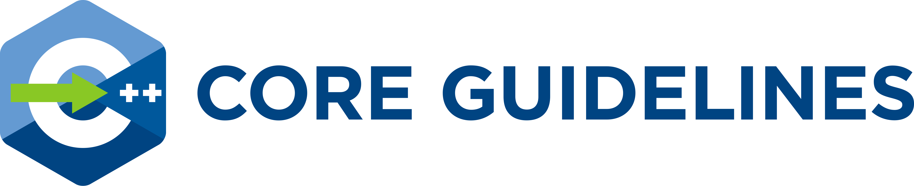

>"Within C++ is a smaller, simpler, safer language struggling to get out."
>-- <cite>Bjarne Stroustrup</cite>

The [C++ Core Guidelines](CppCoreGuidelines.md) are a collaborative effort led by Bjarne Stroustrup, much like the C++ language itself. They are the result of many
person-years of discussion and design across a number of organizations. Their design encourages general applicability and broad adoption but
they can be freely copied and modified to meet your organization's needs.

## Getting started

The guidelines themselves are found at [CppCoreGuidelines](CppCoreGuidelines.md). The document is in [GH-flavored MarkDown](https://github.github.com/gfm/). It is intentionally kept simple, mostly in ASCII, to allow automatic post-processing such as language translation and reformatting. The editors maintain one
[version formatted for browsing](http://isocpp.github.io/CppCoreGuidelines/CppCoreGuidelines). Note that it is manually integrated and can be slightly older than the version in the master branch.

The Guidelines are a constantly evolving document without a strict "release" cadence. Bjarne Stroustrup periodically reviews the document and increments the version number in the introduction. [Checkins that increment the version number](https://github.com/isocpp/CppCoreGuidelines/releases) are tagged in git. 

Many of the guidelines make use of the header-only Guidelines Support Library. One implementation is available at [GSL: Guidelines Support Library](https://github.com/Microsoft/GSL).

## Background and scope

The aim of the guidelines is to help people to use modern C++ effectively. By "modern C++" we mean C++11, C++14, and C++17. In other
words, what would you like your code to look like in 5 years' time, given that you can start now? In 10 years' time?

The guidelines are focused on relatively higher-level issues, such as interfaces, resource management, memory management, and concurrency. Such
rules affect application architecture and library design. Following the rules will lead to code that is statically type-safe, has no resource
leaks, and catches many more programming logic errors than is common in code today. And it will run fast -- you can afford to do things right.

We are less concerned with low-level issues, such as naming conventions and indentation style. However, no topic that can help a programmer is
out of bounds.

Our initial set of rules emphasizes safety (of various forms) and simplicity. They may very well be too strict. We expect to have to introduce
more exceptions to better accommodate real-world needs. We also need more rules.

You will find some of the rules contrary to your expectations or even contrary to your experience. If we haven't suggested that you change your
coding style in any way, we have failed! Please try to verify or disprove rules! In particular, we'd really like to have some of our rules
backed up with measurements or better examples.

You will find some of the rules obvious or even trivial. Please remember that one purpose of a guideline is to help someone who is less
experienced or coming from a different background or language to get up to speed.

The rules are designed to be supported by an analysis tool. Violations of rules will be flagged with references (or links) to the relevant rule.
We do not expect you to memorize all the rules before trying to write code.

The rules are meant for gradual introduction into a code base. We plan to build tools for that and hope others will too.

## Contributions and LICENSE

Comments and suggestions for improvements are most welcome. We plan to modify and extend this document as our understanding improves and the
language and the set of available libraries improve. More details are found at [CONTRIBUTING](./CONTRIBUTING.md) and [LICENSE](./LICENSE).

Thanks to [DigitalOcean](https://www.digitalocean.com/?refcode=32f291566cf7&utm_campaign=Referral_Invite&utm_medium=Referral_Program&utm_source=CopyPaste) for hosting the Standard C++ Foundation website.
